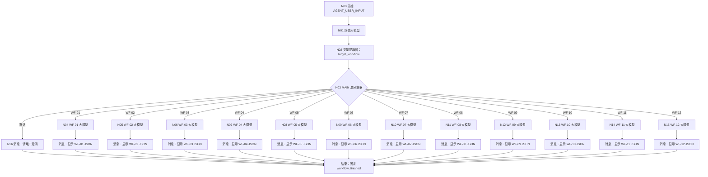

# 大学人生规划模拟器：大模型优先 MVP 设计

## 1. 目标

本方案不替换 `docs/workflows/` 中的详细正式版工作流。它新增一套用于验证产品想法的最小可运行版本：

- 用户每轮只输入自然语言。
- 暂时不使用数据库、确认 token、知识库、插件、API 或跨会话长期记忆。
- MAIN 在当前调试会话中维护一份完整 `state_json`。
- 默认按 WF-01 → WF-12 推进，但允许用户明确跳转。
- 每个 WF 暂时由一个大模型节点完成理解、生成、校验、确认判断和状态更新。
- 关键结果仍须用户用自然语言确认；确认前只作为当前会话草稿。
- 调试阶段直接展示结构化 JSON，方便检查路由与状态。

## 2. 已确认的产品决定

| 项目 | MVP 决定 |
|---|---|
| 用户输入 | 只填写开始节点自带的 `AGENT_USER_INPUT` |
| 用户身份 | MVP 不要求 `uid` |
| 时间 | MVP 不要求 `request_time` |
| 确认 | 使用“确认/继续/修改/取消”等自然语言，不使用 token |
| 状态范围 | 仅限当前调试对话 |
| 状态内容 | 保存 12 个 WF 的完整结果 |
| 默认顺序 | WF-01 → WF-12 |
| 跳转 | 允许明确跳转；缺少前置信息时先补齐 |
| 外部能力 | 暂停数据库、知识库、长期记忆、API、插件和 RPA |
| 展示格式 | 调试阶段展示完整 JSON |
| 正式版关系 | 详细正式版保留，MVP 作为并行验证方案 |

## 3. 统一状态结构

所有业务节点都必须完整返回下列对象，不允许只返回本模块的局部字段：

```json
{
  "schema_version": "mvp-1.0",
  "current_workflow": "WF-01",
  "current_status": "awaiting_confirmation",
  "completed_workflows": [],
  "last_user_intent": "",
  "profile": {
    "status": "not_started",
    "draft": {},
    "confirmed": {}
  },
  "virtual_university": {
    "status": "not_started",
    "draft": {},
    "confirmed": {}
  },
  "survival_adventure": {
    "status": "not_started",
    "draft": {},
    "confirmed": {}
  },
  "path_recommendation": {
    "status": "not_started",
    "draft": {},
    "confirmed": {}
  },
  "parallel_lives": {
    "status": "not_started",
    "draft": {},
    "confirmed": {}
  },
  "main_plan": {
    "status": "not_started",
    "draft": {},
    "confirmed": {}
  },
  "semester_tasks": {
    "status": "not_started",
    "draft": {},
    "confirmed": {}
  },
  "growth_review": {
    "status": "not_started",
    "draft": {},
    "confirmed": {}
  },
  "resume_assets": {
    "status": "not_started",
    "draft": {},
    "confirmed": {}
  },
  "decision_trial": {
    "status": "not_started",
    "draft": {},
    "confirmed": {}
  },
  "habit_log": {
    "status": "not_started",
    "draft": {},
    "confirmed": {}
  },
  "final_review": {
    "status": "not_started",
    "draft": {},
    "confirmed": {}
  },
  "reply": "",
  "next_workflow": "WF-01",
  "warnings": []
}
```

字段规则：

1. `current_workflow` 是本轮实际执行的模块。
2. `current_status` 只允许：
   - `collecting`：信息不足，正在追问；
   - `awaiting_confirmation`：已生成草稿，等待确认；
   - `completed`：用户已确认本模块结果；
   - `cancelled`：用户取消当前模块；
   - `clarification_needed`：路由或意图不明确；
   - `error`：输出无法可靠生成。
3. `completed_workflows` 只能加入用户已经确认完成的模块。
4. 12 个模块字段都使用相同外壳：
   - `status`：模块自己的状态；
   - `draft`：本轮生成、尚未确认的结果；
   - `confirmed`：最近一次由用户明确确认的结果。
5. 生成或修改时只更新 `draft`；确认时把 `draft` 复制到 `confirmed`，再清空 `draft`；取消时只清空 `draft`，不得删除已有 `confirmed`。
6. 修改某模块时，只更新该模块对应字段以及路由元数据，不得清空其他模块。
7. `reply` 面向用户，必须简洁、自然，不得只显示内部字段。
8. `warnings` 用于放置“仅供模拟”“政策需官方复核”“信息不足”等提示。

## 4. 目标画布



没有使用“一个统一结果大模型”的原因：当前平台节点引用是静态选择，上游 12 个分支无法保证都能安全映射到同一个输入框。每条分支使用自己的消息节点展示结果，最后汇入一个固定结束节点，配置最稳定、也最容易定位错误。

## 5. 对话历史与连续性门禁

本方案只有在 N01 路由节点能够从当前调试对话历史中看到上一轮业务节点输出时，才能做到“只输入自然语言且不使用数据库”。

因此不得一开始就搭完 12 条分支。必须先搭：

```text
开始 → 路由 → 提取 target_workflow → 总分支器
                                  ├→ WF-01 大模型 → 消息
                                  └→ WF-02 大模型 → 消息
两条消息 → 结束
```

连续性测试：

1. 第一轮输入“我是大一计算机专业学生，想建立画像”。
2. 确认 WF-01 输出包含非空 `profile`，状态为 `awaiting_confirmation`。
3. 第二轮只输入“确认，继续”。
4. 路由节点必须读到上一轮 `profile`，并继续路由到 WF-01；WF-01 负责把自己的草稿标记为 `completed`，同时令 `next_workflow=WF-02`。路由节点不能越权替业务节点确认结果。
5. 第三轮只输入“继续”。
6. 路由节点必须根据上一轮的 `next_workflow` 路由到 WF-02。
7. WF-02 必须收到上一轮完整状态，不能重新生成空画像。

如果第 4、第 6 或第 7 步失败，说明平台没有把不同分支节点的输出作为全局历史传回路由节点。此时停止复制另外十条分支，使用兼容画布：

```text
开始 → 单个“MAIN 总控大模型” → 消息 → 结束
```

兼容画布仍保留 12 套业务规则，只是把它们放进同一个系统提示词。由于每一轮都经过同一个大模型节点，对话历史连续性更可靠。等接回数据库后，再拆成路由器和 12 个节点。

## 6. 路由规则

路由优先级从高到低：

1. 当前存在 `awaiting_confirmation`：
   - 用户确认、修改或取消时，留在当前 WF；
   - 用户明确跳转时，先说明当前草稿未确认，再按用户选择跳转。
2. 用户明确说出模块或目标时，进入对应 WF。
3. 用户说“继续/下一步”时：
   - 当前模块已确认：进入默认下一 WF；
   - 当前模块未确认：仍留在当前 WF。
4. 用户意图不明确时，保持当前 WF；没有当前 WF 时进入 WF-01。
5. 跳转目标缺少必要前置数据时：
   - WF-04～WF-12 至少需要 `profile`；
   - 缺少时先路由到 WF-01；
   - `reply` 要解释为什么先补画像。

默认顺序：

```text
WF-01 → WF-02 → WF-03 → WF-04 → WF-05 → WF-06
→ WF-07 → WF-08 → WF-09 → WF-10 → WF-11 → WF-12
```

## 7. 每个模块的最小职责

| WF | MVP 职责 | 确认后写入的状态字段 |
|---|---|---|
| WF-01 | 建立、修改并确认用户画像 | `profile` |
| WF-02 | 运行压缩版虚拟大学事件模拟 | `virtual_university` |
| WF-03 | 运行场景题并生成能力/路径信号 | `survival_adventure` |
| WF-04 | 生成五路径分级建议 | `path_recommendation` |
| WF-05 | 创建并比较 2～3 个平行人生 | `parallel_lives` |
| WF-06 | 生成四层主规划 | `main_plan` |
| WF-07 | 生成和更新当前学期任务 | `semester_tasks` |
| WF-08 | 根据用户陈述与当前任务做成长复盘 | `growth_review` |
| WF-09 | 把真实经历转成履历素材 | `resume_assets` |
| WF-10 | 完成决策分析或七天试错设计 | `decision_trial` |
| WF-11 | 生成或记录微习惯与生活行动 | `habit_log` |
| WF-12 | 总结本次体验、决定和下一步 | `final_review` |

## 8. 非目标

本 MVP 不证明以下能力已经完成：

- 跨调试会话继续；
- 不同用户隔离；
- 正式数据保存；
- 政策、院校和考试信息时效性；
- 自动生成真实时间；
- 工作流之间通过 API 互调；
- 平台发布后的生产可靠性。

这些能力由原详细版工作流、数据库和知识库承担，不能因为 MVP 在一次对话中跑通就声称已经实现。

## 9. 成功标准

至少完成以下验收：

1. 用户只输入自然语言即可从 WF-01 开始。
2. “确认/修改/取消”不会被错误识别为新草稿。
3. 第二轮能读取第一轮完整状态。
4. 默认“继续”会进入下一模块。
5. 用户明确说“跳到路径推荐”时能进入 WF-04；无画像时先补 WF-01。
6. 任一模块修改状态时不清空其他模块。
7. 每轮输出都是合法 JSON，没有 Markdown 代码围栏。
8. `completed_workflows` 只包含确认过的模块。
9. WF-04 的政策类内容带“需官方复核”提醒。
10. WF-11 遇到疼痛、疾病、极端节食或危险动作时停止常规建议。
11. WF-12 能总结已完成模块、未确认草稿和下一步。
12. 同一输入重复运行不会把未确认草稿误标为正式完成。
