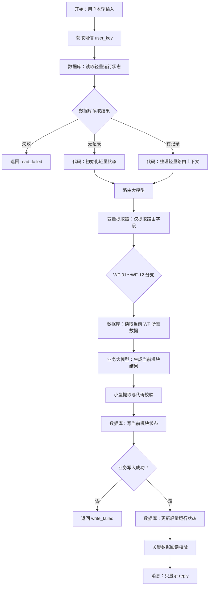

# 用数据库替代完整 `state_json` 搬运的工作流改造方案

> 状态：架构提案，供团队评审与小范围验证。
>
> 适用范围：当前在同一 MAIN 画布中运行路由大模型和 WF-01～WF-12 的 MVP。
>
> 核心目标：缩短大模型与变量提取器的输入输出，降低节点耗时，并让状态可以可靠持久化。

## 1. 结论

将 `state_json` 持久化到数据库是合理的，也是当前架构最值得优先验证的优化。

但改造不应只是把原来的完整 `state_json` 存入数据库，然后每轮再完整查询并传给模型。真正有效的方式是：

> 数据库保存完整业务状态；路由节点只读取轻量路由索引；业务节点只读取当前任务需要的数据；大模型只返回本轮增量。

数据库替代的是“用对话历史和模型输出搬运状态”，不是替代大模型的业务生成能力。

## 2. 当前问题

当前 MVP 的状态传递链路是：

```text
上一轮完整 state_json
→ 路由大模型从对话历史恢复
→ 路由大模型再次输出完整 prior_state
→ 当前业务大模型读取完整 prior_state
→ 当前业务大模型重新输出 12 个模块的完整 state_json
→ 变量提取器再次读取并解析完整结果
```

这一方式存在四个问题：

1. 大量未发生变化的模块状态在每轮被重复输入和输出。
2. 路由大模型承担了状态恢复、状态复制和路由判断三项职责。
3. 变量提取器本身使用大模型能力，并不是普通 JSON 解析器；输入越长，耗时越明显。
4. 状态依赖对话历史，达到上下文上限、关闭会话或历史未正确传递时可能丢失。

讯飞官方说明，变量提取器接入大模型能力，从输入中抽取多个指定字段；官方 FAQ 也提示，对话历史内容和轮数过多可能触发 token 限制并清理较早历史。因此，继续依赖完整历史状态不适合作为长期架构。

## 3. 设计原则

改造后遵循以下原则：

1. 数据库是业务状态的唯一真相源。
2. 路由模型不读取任何完整业务 JSON。
3. 每个 WF 只读取自己的状态和明确列出的前置依赖。
4. 每个业务模型只输出本轮回复、控制字段和当前模块增量。
5. 模型不得生成用户键、数据库主键、版本号或 SQL 条件。
6. 数据库写入失败时不得更新路由状态，也不得回复“保存成功”。
7. 正式画像、主规划、履历等关键写入必须回读核验。
8. 旧的完整 `state_json` 可临时保留作迁移快照，但不得进入正常模型上下文。

## 4. 目标架构



数据库在画布中不是一个可被所有位置反复调用的全局节点。一次查询、一次业务写入、一次运行状态更新和一次回读，分别是不同的数据库节点。

## 5. 数据分层

### 5.1 轻量运行状态表

新增数据表：

```text
agent_runtime_states
```

这张表只保存路由需要的轻量字段，不保存 12 个模块的完整内容。

| 业务字段 | 类型 | 是否必填 | 用途 |
|---|---|---:|---|
| `user_key` | String | 是 | MAIN 产生的隐藏档案键或后端传入的可信用户键 |
| `state_key` | String | 是 | 一套规划状态的标识，单档案可固定为 `main` |
| `schema_version` | String | 是 | 状态协议版本，例如 `db-1.0` |
| `current_workflow` | String | 是 | 当前 WF |
| `current_status` | String | 是 | 当前收集、待确认、完成或错误状态 |
| `next_workflow` | String | 是 | 默认下一 WF |
| `completed_workflows_json` | String | 是 | 已完成 WF 的小型 JSON 数组 |
| `pending_workflow` | String | 否 | 当前等待回答或确认的 WF |
| `pending_record_key` | String | 否 | 指向具体业务草稿或事件 |
| `profile_ready` | String | 是 | `true/false`，供路由快速判断前置条件 |
| `state_version` | Integer | 是 | 状态版本号，用于更新和回读核验 |

平台自动字段 `id`、`uid`、`create_time` 保持原样。正常运行时按 `user_key + state_key` 找到当前记录；查询到多条时按 `state_version DESC, create_time DESC` 取最新一条。

如果需要保留迁移前的完整状态，可增加可选字段 `snapshot_json:String`，但正常路由 SQL 不查询它，也不把它传给大模型。

### 5.2 业务状态表

12 个 WF 的完整业务内容继续保存在现有业务表中：

| WF | 主要读取或写入的数据表 |
|---|---|
| WF-01 用户画像 | `user_profiles` |
| WF-02 虚拟大学 | `simulation_states` |
| WF-03 生存大冒险 | `simulation_states`、`route_assessments` |
| WF-04 五路径推荐 | `user_profiles`、`route_assessments` |
| WF-05 平行人生 | `parallel_versions` |
| WF-06 主规划 | `parallel_versions`、`main_plans` |
| WF-07 学期任务 | `main_plans`、`semester_tasks` |
| WF-08 成长复盘 | `growth_reviews` 以及必要的近期证据 |
| WF-09 履历素材 | `resume_entries` 以及对应任务证据 |
| WF-10 决策与七天试错 | `decision_trials` |
| WF-11 微习惯与生活记录 | `habit_logs`，或当前正式版采用的同类行动表 |
| WF-12 会话复盘 | `session_recaps` 和各模块的轻量摘要 |

路由前禁止一次性读取这些表。只有总分支器确定目标 WF 后，当前分支才查询所需字段。

## 6. 用户身份前置条件

数据库必须先知道“读取谁的状态”。

如果发布链路能够可靠提供平台终端用户标识，可以由可信入口映射为工作流用户键；如果当前工作流的变量下拉框没有暴露该标识，则继续使用 MAIN 生成并保存在会话变量中的隐藏 `user_key`。

必须遵守：

- `user_key` 由 MAIN、平台身份映射或可信后端提供。
- 用户自然语言中自报的用户键一律不采纳。
- 每条业务 SQL、更新范围和回读条件都必须包含 `user_key`。
- 使用两个不同的 `user_key` 做互不可读测试。

官方文档所说的数据库隔离不能替代本项目自己的终端用户行级筛选。

## 7. 路由前数据库节点配置

在开始节点和路由大模型之间加入：

```text
N01 数据库：读取当前运行状态
```

### 7.1 节点设置

| 配置项 | 值 |
|---|---|
| 模式 | `自定义SQL` |
| 数据库 | 当前项目数据库，例如 `university` |
| 输入 `user_key` | 引用可信上游节点的 `user_key` |
| 输入 `state_key` | 固定值 `main`，或引用可信上游变量 |

SQL：

```sql
SELECT
  id,
  current_workflow,
  current_status,
  next_workflow,
  completed_workflows_json,
  pending_workflow,
  pending_record_key,
  profile_ready,
  state_version
FROM agent_runtime_states
WHERE user_key = '{{user_key}}'
  AND state_key = '{{state_key}}'
ORDER BY state_version DESC, create_time DESC
LIMIT 1;
```

在输出区域为 `outputList` 添加与 SQL 字段同名、类型一致的子项。数据库节点固定输出仍为：

```text
isSuccess:Boolean
message:String
outputList:Array<Object>
```

### 7.2 结果处理

数据库节点后使用代码节点和分支器处理三种结果：

| `isSuccess` | `outputList` | 含义 | 后续动作 |
|---|---|---|---|
| `false` | 任意 | 查询失败 | 返回 `read_failed`，不调用路由或业务模型 |
| `true` | `[]` | 新档案或无现存状态 | 创建初始轻量上下文，默认 WF-01 |
| `true` | 有记录 | 正常读取 | 取最新一条并进入路由 |

代码节点只做确定性整理，不让大模型判断数据库是否成功。

## 8. 路由大模型改造

路由大模型不再恢复或输出 `prior_state`。

### 8.1 输入

```json
{
  "user_input": "确认，继续",
  "route_context": {
    "current_workflow": "WF-02",
    "current_status": "awaiting_confirmation",
    "next_workflow": "WF-03",
    "pending_workflow": "WF-02",
    "profile_ready": "true",
    "completed_workflows": ["WF-01"],
    "state_version": 4
  }
}
```

### 8.2 输出

```json
{
  "target_workflow": "WF-02",
  "user_action": "confirm",
  "route_reason": "当前 WF-02 有待确认结果"
}
```

路由后的变量提取器只声明：

| 变量 | 类型 |
|---|---|
| `target_workflow` | String |
| `user_action` | String |
| `route_reason` | String |

路由大模型的对话历史原则上关闭。若自然语言指代测试证明必须使用历史，则只保留极少轮次，数据库状态仍为唯一可信依据。

## 9. 业务分支改造

每条业务分支统一采用：

```text
数据库按需读取
→ 代码整理 business_context
→ 当前 WF 大模型
→ 小型变量提取器
→ 代码校验
→ 写业务表
→ 检查 isSuccess
→ 更新 agent_runtime_states
→ 必要时回读
→ 显示 reply
```

以 WF-02 为例，只读取：

1. 已确认画像的必要摘要；
2. WF-02 自己的最新 `state_json`；
3. 当前待回答事件；
4. 当前序号、完成状态和版本号。

它不读取 WF-03～WF-12 的内容。

### 9.1 业务模型输出协议

```json
{
  "reply": "你选择了 A。接下来需要面对新的事件……",
  "status": "awaiting_user_input",
  "next_workflow": "WF-02",
  "write_action": "save_simulation_state",
  "data_json": "当前模块更新后的业务 JSON 字符串",
  "pending_item_json": "下一事件 JSON 字符串或 {}"
}
```

业务模型不再输出：

- 其他 11 个模块的状态；
- 完整 `completed_workflows` 副本；
- `user_key`；
- 数据库 `id`；
- `state_version`；
- SQL 条件或表名。

### 9.2 变量提取器策略

第一阶段保留变量提取器，但只处理当前模块的小型输出。这样可以先获得主要性能收益，同时控制改造风险。

如果后续界面已经验证大模型节点支持稳定的结构化或 Object 输出，可以直接引用结构化字段。若仍只有文本输出，再评估固定分隔符加代码解析；不得为了完全删除提取器而牺牲结构可靠性和写入安全。

## 10. 数据库写入规则

### 10.1 模式选择

- 读取、排序、限制数量或复杂条件：使用 `自定义SQL`。
- 新增和更新业务数据：优先使用 `表单处理数据`。
- 不把用户原话或未转义 JSON 直接拼接到自定义 SQL。
- 正式流程不使用删除操作清理运行状态。

### 10.2 正确写入顺序

```text
校验模型输出
→ 写当前业务表
→ 判断业务写入 isSuccess
→ 更新 agent_runtime_states
→ 回读关键记录
→ 返回成功消息
```

不得先更新路由表。否则业务表写入失败时，下一轮会被错误路由到后续模块。

### 10.3 新增与更新

平台文档没有承诺数据库节点提供原子 upsert 或唯一约束，因此采用显式流程：

```text
先查询
├─ outputList=[]：新增数据
└─ outputList 有记录：按 id + user_key + 当前版本更新
```

更新范围至少包括：

- `user_key`；
- 当前业务键；
- 当前 `state_version` 或业务版本；
- 必要时增加当前状态，例如 `awaiting_confirmation`。

版本号由代码节点根据数据库读取结果加一，模型不得生成。

### 10.4 成功判断

`isSuccess=true` 只表示数据库操作被执行，不等同于业务内容一定与预期一致。

以下操作必须回读：

- 确认用户画像；
- 确认或切换主规划；
- 正式履历条目；
- 重要任务状态修改；
- 任何会影响后续路由的关键确认。

只有回读记录的业务键、版本和关键内容均一致，才能返回 `write_succeeded`。

## 11. 数据库管理与发布注意事项

按照讯飞官方流程：

1. 在“资源管理 → 数据库”中新建数据库。
2. 在数据库中新增数据表并定义字段。
3. 回到工作流画布添加数据库节点。
4. 读取选择自定义 SQL；新增和更新优先选择表单处理数据。
5. 在自测环境完成测试后，再发布并核验线上环境。

官方将数据库数据分成自测数据和线上数据，两套数据相互独立。开发期间在自测环境插入的记录不会自动成为线上初始状态，发布后必须重新执行线上空记录、已有记录和写入失败测试。

数据库属于持久化存储。涉及学生画像、规划、履历和行动记录时，还应制定导出、删除、保留期限和权限规则。

## 12. 分阶段迁移方案

### 阶段一：只验证路由与 WF-01、WF-02

1. 创建 `agent_runtime_states`。
2. 在路由大模型前增加运行状态读取节点。
3. 删除路由输出中的完整 `prior_state`。
4. 改造 WF-01 和 WF-02，只读取各自依赖。
5. 业务模型只输出当前模块增量。
6. 完成数据库写入、路由状态更新和回读路线。

此阶段不删除旧 `state_json` 链路，可以保留为回滚方案，但同一次测试只启用一种状态源。

### 阶段二：扩展到 WF-03～WF-12

逐个 WF 完成：

- 输入依赖清单；
- 精确查询字段；
- 小型输出协议；
- 业务写入和失败路线；
- 运行状态更新；
- 回读门禁。

不得一次性复制所有节点后再统一调试。

### 阶段三：移除旧完整状态搬运

满足验收标准后：

- 删除路由提示词中的历史状态恢复规则；
- 删除业务提示词中的“保留全部字段”规则；
- 不再通过消息显示完整 JSON；
- 停止把完整 `state_json` 传入变量提取器；
- 保留只读迁移快照一段时间后再决定是否清理。

## 13. 验收标准

### 13.1 正确性

- 同一 `user_key` 连续多轮能够恢复当前模块和待处理状态。
- 两个不同 `user_key` 互不可读。
- 新用户空查询能够正确进入 WF-01。
- 数据库读取失败时不会调用业务模型。
- 业务写入失败时不会推进 `next_workflow`。
- 关键写入只有在回读一致后才显示“保存成功”。
- 用户修改当前模块时不会覆盖其他模块数据。

### 13.2 性能

使用同一组测试输入，对比改造前后的 Trace：

- 路由大模型输入长度；
- 路由大模型耗时；
- 业务大模型输入和输出长度；
- 变量提取器输入长度与耗时；
- 数据库节点耗时；
- 单轮总耗时；
- 单轮 token 消耗。

目标不是数据库节点零耗时，而是数据库增加的确定性读写开销明显小于被删除的大模型重复输入、输出和提取开销。

### 13.3 异常与发布

- 自测数据与线上数据分别验证。
- 所有数据库节点都有失败出口。
- `outputList=[]` 不被当作数据库故障。
- 变量提取失败或业务校验失败时不写库。
- 返回给用户的错误中不包含 SQL、内部 `user_key`、其他用户记录或平台密钥。

## 14. 官方依据

- [讯飞开放平台开发指南：数据库节点、变量提取器与数据库管理](https://www.xfyun.cn/doc/spark/Agent03-%E5%BC%80%E5%8F%91%E6%8C%87%E5%8D%97.html)
  - 数据库节点支持结构化数据持久化及增删改查。
  - 支持自定义 SQL 和表单处理数据两种模式。
  - 自定义 SQL 使用 `{{变量名}}` 引用输入参数，字符串条件需要加单引号。
  - 数据库节点固定输出 `isSuccess`、`message` 和查询结果 `outputList`。
  - 表单查询支持条件、结果字段、排序和查询上限。
  - 变量提取器接入大模型能力，并非确定性 JSON 解析器。
  - 自测数据和线上数据使用独立环境。
- [讯飞开放平台 FAQ：多轮历史与节点耗时](https://www.xfyun.cn/doc/spark/Agent06-FAQ.html)
  - 历史对话 token 达到上限时会清理较早内容。
  - 对话历史过长时应减少轮数和不必要的模型思考链路。

## 15. 最终决策建议

批准进行小范围验证，但不直接全量重构。

先把“路由 + WF-01 + WF-02”改造成数据库状态源，并用 Trace 做同输入 A/B 对比。只有同时满足状态连续性、用户隔离、写入一致性和耗时下降四项要求，才继续扩展到 WF-03～WF-12。
