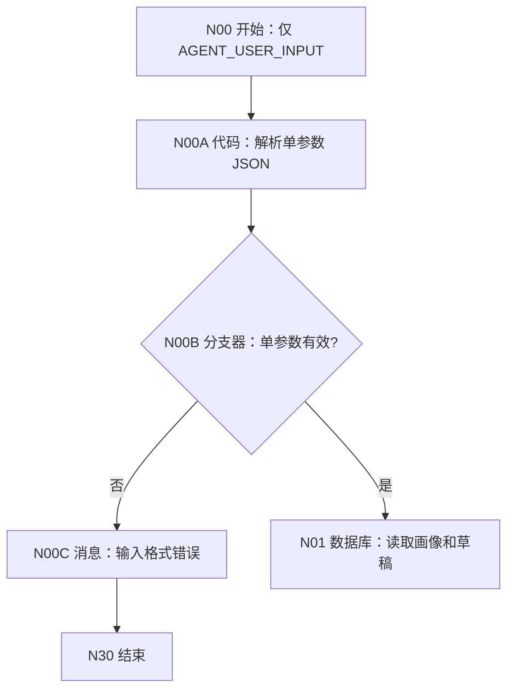

# WF-01 Single-Parameter Entry Implementation Plan

> **For agentic workers:** REQUIRED SUB-SKILL: Use superpowers:subagent-driven-development (recommended) or superpowers:executing-plans to implement this plan task-by-task. Steps use checkbox (`- [ ]`) syntax for tracking.

**Goal:** Convert WF-01 into a one-input workflow whose only start parameter is `AGENT_USER_INPUT:String`, with a dedicated parser module that safely exposes the business fields required by all existing nodes.

**Architecture:** Keep N01 through N30 unchanged in number and responsibility. Insert N00A parser, N00B validation branch, and N00C input-error message between the start node and N01; downstream nodes consume N00A outputs instead of extra start parameters. Re-render the workflow images and validate that no old multi-parameter references remain in the WF-01 guide.

**Tech Stack:** Markdown, Mermaid, Python code embedded in the Xfyun code-node tutorial, repository Python documentation validators and diagram renderer.

## Global Constraints

- N00 must expose exactly one input: `AGENT_USER_INPUT:String`.
- The inner payload must be a JSON object containing non-empty String fields `uid` and `user_input`.
- `confirmation_token` is optional and normalizes to an empty String.
- `request_time` is optional and falls back to the parser node's current local time in `YYYY-MM-DD HH:mm:ss` format.
- Parser failures must return six declared outputs and route to N00C without executing N01.
- Existing nodes N01 through N30 keep their current numbers.
- All branches, including invalid entry input, must terminate at N30.
- The guide must match the Xfyun page controls previously confirmed by the user.

---

### Task 1: Add the one-parameter entry module to the WF-01 guide

**Files:**
- Modify: `docs/workflows/WF-01-user-profile.md`

**Interfaces:**
- Consumes: `N00/AGENT_USER_INPUT:String` containing the inner JSON object as text.
- Produces: `N00A/uid:String`, `user_input:String`, `confirmation_token:String`, `request_time:String`, `input_valid:Boolean`, and `input_error:String`.

- [ ] **Step 1: Replace the current start-node contract**

Document N00 with only:

```text
AGENT_USER_INPUT | String | 包含 uid、user_input、confirmation_token、request_time 的 JSON 字符串 | 是
```

Delete the N00 output declarations for `uid`, `confirmation_token`, and `request_time`.

- [ ] **Step 2: Document N00A with exact Xfyun fields and executable code**

Use one input row:

```text
raw_input | 引用 | N00 / AGENT_USER_INPUT
```

Use this code:

```python
import json
from datetime import datetime

def main(raw_input):
    uid = ""
    user_input = ""
    confirmation_token = ""
    request_time = datetime.now().strftime("%Y-%m-%d %H:%M:%S")
    error = ""

    try:
        if not isinstance(raw_input, str) or raw_input.strip() == "":
            raise ValueError("AGENT_USER_INPUT 不能为空")
        payload = json.loads(raw_input)
        if not isinstance(payload, dict):
            raise ValueError("JSON 顶层必须是对象")

        uid_value = payload.get("uid", "")
        message_value = payload.get("user_input", "")
        token_value = payload.get("confirmation_token", "")
        time_value = payload.get("request_time", "")

        uid = uid_value.strip() if isinstance(uid_value, str) else ""
        user_input = message_value.strip() if isinstance(message_value, str) else ""
        confirmation_token = token_value.strip() if isinstance(token_value, str) else ""
        if isinstance(time_value, str) and time_value.strip() != "":
            request_time = time_value.strip()

        if uid == "":
            raise ValueError("缺少非空字符串字段 uid")
        if user_input == "":
            raise ValueError("缺少非空字符串字段 user_input")
    except Exception as exc:
        error = str(exc) if str(exc) != "" else "单参数 JSON 解析失败"

    return {
        "uid": uid,
        "user_input": user_input,
        "confirmation_token": confirmation_token,
        "request_time": request_time,
        "input_valid": error == "",
        "input_error": error,
    }
```

Declare all six outputs with the exact names and types in the global constraints.

- [ ] **Step 3: Document N00B and N00C**

Set N00B to reference `N00A/input_valid`, compare it with the fixed Boolean value `true`, route true to N01, and route the default/false branch to N00C. Configure N00C with input `input_error=N00A/input_error`, streaming disabled, and an answer that explains the required JSON fields before connecting it to N30.

- [ ] **Step 4: Update node inventory and wiring summaries**

Increase code-node count by one, branch-node count by one, and message-node count by one. Add N00A, N00B, and N00C to the drag-and-name table without changing N01 through N30.

- [ ] **Step 5: Run entry-contract checks**

Run:

```powershell
rg -n "N00A|N00B|N00C|input_valid|input_error" docs/workflows/WF-01-user-profile.md
```

Expected: all three nodes and all parser outputs appear in the start-node, flow, inventory, and testing sections.

---

### Task 2: Rewire every downstream WF-01 reference

**Files:**
- Modify: `docs/workflows/WF-01-user-profile.md`

**Interfaces:**
- Consumes: the six N00A outputs defined in Task 1.
- Produces: an internally consistent tutorial in which N01, N04, N09, N11, N13, N17, N19, and N21 no longer depend on removed N00 fields.

- [ ] **Step 1: Update identity references**

Change each database/code reference as follows:

```text
N01 uid                 = N00A / uid
N09 uid                 = N00A / uid
N11 uid comparison      = N00A / uid
N13 uid inserted value  = N00A / uid
N19 uid comparison      = N00A / uid
N21 uid                 = N00A / uid
```

N13 must explicitly document `uid | 引用 | N00A / uid`; do not leave it conditional on whether the page displays the field.

- [ ] **Step 2: Update model-message references**

Rename the N04 input parameter from `AGENT_USER_INPUT` to `user_input`, set its source to `N00A/user_input`, and change the user prompt interpolation to:

```text
用户本轮输入：{{user_input}}
```

- [ ] **Step 3: Update token and time references**

Use:

```text
N09 request_time       = N00A / request_time
N17 incoming_token     = N00A / confirmation_token
N17 request_time       = N00A / request_time
```

- [ ] **Step 4: Prove removed references are absent**

Run:

```powershell
rg -n "N00\s*/\s*(uid|confirmation_token|request_time)|N00\.(uid|confirmation_token|request_time)" docs/workflows/WF-01-user-profile.md
```

Expected: no matches.

- [ ] **Step 5: Check all N00A consumers**

Run:

```powershell
rg -n "N00A\s*/|N00A\." docs/workflows/WF-01-user-profile.md
```

Expected: references appear for N01, N04, N09, N11, N13, N17, N19, N21, N00B, and N00C.

---

### Task 3: Update diagrams, test cases, and API/MAIN examples

**Files:**
- Modify: `docs/workflows/WF-01-user-profile.md`
- Modify: `docs/workflows/images/WF-01-draft-round.png`
- Verify: `docs/workflows/images/WF-01-confirm-round.png`

**Interfaces:**
- Consumes: the entry and downstream contracts from Tasks 1 and 2.
- Produces: diagrams and copy-ready tests that expose only `AGENT_USER_INPUT` externally.

- [ ] **Step 1: Update the first Mermaid graph**

Use this entry sequence before the existing N01 node:



Retain every existing business edge after N01 and ensure all terminal messages reach the same N30.

- [ ] **Step 2: Replace multi-field debug inputs with six copy-ready JSON cases**

Each case must be pasted entirely into `AGENT_USER_INPUT`. Include first draft, modify, confirm, cancel, wrong token, and invalid input/missing uid. The confirm and wrong-token samples must tell the user to replace the sample token with the value returned by the preceding draft test.

- [ ] **Step 3: Add exact API/MAIN wrapping examples**

Show both the readable inner object and the outer one-parameter object:

```json
{
  "AGENT_USER_INPUT": "{\"uid\":\"test_user_001\",\"user_input\":\"确认保存\",\"confirmation_token\":\"profile_1_xxx\"}"
}
```

State that the outer value is a String, not a nested platform parameter object.

- [ ] **Step 4: Render diagrams**

Run:

```powershell
python scripts/render_workflow_diagrams.py
```

Expected: the script reports `WF-01-user-profile.md -> docs\workflows\images\WF-01-draft-round.png` and regenerates the PNG from the edited Mermaid source.

- [ ] **Step 5: Inspect the rendered draft image**

Open `docs/workflows/images/WF-01-draft-round.png` and verify that N00A, N00B, and N00C are visible, the true edge reaches N01, and the false edge reaches N30 through N00C.

---

### Task 4: Validate and publish the documentation change

**Files:**
- Modify: `docs/workflows/WF-01-user-profile.md`
- Modify: `docs/workflows/images/WF-01-draft-round.png`
- Create: `docs/superpowers/plans/2026-07-19-wf01-single-parameter.md`

**Interfaces:**
- Consumes: all files from Tasks 1 through 3.
- Produces: a committed and pushed WF-01 single-parameter tutorial.

- [ ] **Step 1: Run repository workflow-guide validation**

Run:

```powershell
python scripts/validate_workflow_guides.py
```

Expected: exit code `0` with no validation errors.

- [ ] **Step 2: Run Markdown and Git checks**

Run:

```powershell
git diff --check
rg -n "N00\s*/\s*(uid|confirmation_token|request_time)|N00\.(uid|confirmation_token|request_time)" docs/workflows/WF-01-user-profile.md
```

Expected: both commands exit without errors and the search returns no matches.

- [ ] **Step 3: Review the complete diff against the design**

Run:

```powershell
git diff -- docs/workflows/WF-01-user-profile.md docs/workflows/images/WF-01-draft-round.png docs/superpowers/plans/2026-07-19-wf01-single-parameter.md
```

Verify N00 has one input, N00A always returns six keys, N00B blocks invalid input, N13 writes uid, all six tests use one field, and no branch is left without N30.

- [ ] **Step 4: Commit**

Run:

```powershell
git add docs/workflows/WF-01-user-profile.md docs/workflows/images/WF-01-draft-round.png docs/workflows/images/WF-01-confirm-round.png docs/superpowers/plans/2026-07-19-wf01-single-parameter.md
git commit -m "docs: convert WF01 to single parameter input"
```

Expected: one commit containing the guide, plan, and any changed rendered image.

- [ ] **Step 5: Push**

Run:

```powershell
git push origin main
```

Expected: the remote `main` branch advances to the new documentation commit.
