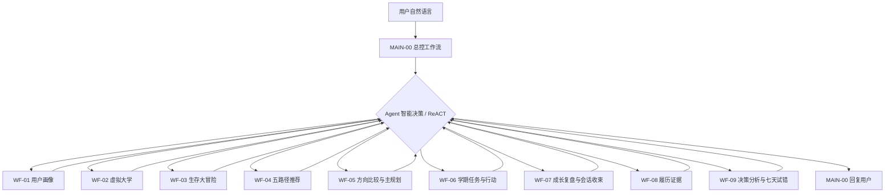

# 讯飞星辰大学人生规划 Agent 工作流合并设计

日期：2026-07-21

## 1. 目标

在不推翻已经搭建的 WF-01～WF-04 核心画布的前提下，把仓库中的 12 张业务工作流重构为一套能在讯飞星辰 Agent 平台直接发布、由用户用自然语言连续使用的完整 Agent：

- WF-01～WF-04 只做单参数适配、变量提取器单输入修复、分支修复和 MCP 返回适配；
- WF-05 以后按业务闭环合并为 WF-05～WF-09；
- 增加一张唯一对用户发布的 `MAIN-00` 总控工作流；
- `MAIN-00` 使用 Agent 智能决策节点动态调用 WF-01～WF-09 发布出的 MCP Server；
- 子工作流之间禁止互相调用，避免多层嵌套和不可控超时；
- 所有用户数据库记录使用内部 `user_key`，不再把平台自动字段 `uid` 当业务身份；
- 所有开始节点只保留 `AGENT_USER_INPUT:String`；
- 所有变量提取器只接收一个 `input:String`；
- 所有关键确认标识内部化，用户永远不复制 token。

## 2. 已确认的平台事实

本设计只把官方文档和用户实际页面已经确认的能力写成确定步骤。

1. 工作流开始节点有唯一默认输入 `AGENT_USER_INPUT`，发布到星火/Desk 后接收用户本轮自然语言。
2. 变量提取器固定输入为一个 `input:String`；多段文本必须先通过文本处理节点拼接。
3. 数据库节点的引用下拉框只能选择当前节点之前可达的变量；数据库节点不能凭空引用业务用户标识。
4. 数据表自动字段 `uid` 没有在当前工作流页面暴露为可引用的可信终端用户标识，因此本产品不能用它做显式 SQL 用户隔离。
5. 变量存储器可让变量在同一对话内跨轮保留；新建对话或删除会话会清空变量。
6. 工作流可以发布为 MCP Server；同账号下可在 Agent 智能决策节点的工具列表中选择。
7. Agent 智能决策节点采用 ReACT，可连续选择多个工具；最多添加 30 个工具，最大推理轮次为 100。
8. 工作流节点和 MCP 子流程输出是非流式的；复杂嵌套和过大输出可能超时。
9. 多数业务节点支持超时、重试和异常路线，但显式的 `isSuccess`、校验与失败出口仍然必须保留。

因此，“MAIN 调用多个 Agent 且没有业务人为数量限制”可实现为：不设置“一轮最多调用 1 张/2 张”的产品规则，允许 Agent 智能决策按任务需要连续调用；仍受平台的 30 工具、100 推理轮和运行超时硬限制。

## 3. 最终工作流拓扑



约束：

- 用户只看见并使用 MAIN-00；
- WF-01～WF-09 作为同账号内部 MCP 工具发布；
- 只有 MAIN-00 可以添加和调用这些工具；
- WF-01～WF-09 内不得出现工作流节点、Agent 智能决策节点或 MCP 工具调用；
- 一次用户请求可以触发多个子工具，但任何关键写入遇到 `awaiting_confirmation` 后必须停止并等待下一轮；
- 子工具失败时停止连调，先向用户说明可重试信息；
- 子工具输出只返回紧凑 `result_json`，不返回大段跟踪信息。

## 4. 九张业务工作流

| 最终编号 | 产品职责 | 来源与改造方式 |
|---|---|---|
| WF-01 | 用户画像草稿、修改、确认 | 保留已搭核心节点；移除外部时间和 token；增加 MCP 返回适配 |
| WF-02 | 虚拟大学多轮探索 | 保留已搭核心节点；单参数适配；N12 前加文本拼接；修复真假分支 |
| WF-03 | 大学生存大冒险 | 保留已搭核心节点；单参数适配；答案提取前加文本拼接；修复完成/未完成分支 |
| WF-04 | 五路径推荐 | 保留知识库和推荐核心；允许 WF-02、WF-03 任一或两者有证据；缺失证据降低置信度而非硬阻断 |
| WF-05 | 方向比较与主规划 | 合并旧 WF-05 平行人生和旧 WF-06 主规划，内部完成比较、生成草稿、修改、确认 |
| WF-06 | 学期任务与行动 | 简化旧 WF-07；把旧 WF-11 微习惯作为 `task_type` 和行动日志，不再保留独立工作流 |
| WF-07 | 成长复盘与会话收束 | 合并旧 WF-08 成长复盘和旧 WF-12 会话复盘；只基于已写入事实生成调整建议 |
| WF-08 | 履历证据 | 简化旧 WF-09；真实经历草稿、修改、确认，token 完全内部化 |
| WF-09 | 决策分析与七天试错 | 简化旧 WF-10；即时分析、创建试错、确认启动、日志、复盘在一张状态机内完成 |

旧 WF-10、WF-11、WF-12 的独立指南和流程图删除；相应能力分别进入新 WF-09、WF-06、WF-07。

## 5. 单参数调用契约

### 5.1 MAIN-00 对用户

用户在星火/Desk 中只输入自然语言，不输入 JSON、uid、user_key、时间、业务 id 或 token。

### 5.2 MAIN-00 对内部 MCP 工具

每个 WF-01～WF-09 的开始节点只保留：

```text
AGENT_USER_INPUT:String
```

MAIN-00 调用工具时把下面的扁平对象序列化为这个 String：

```json
{
  "user_key": "uk_32位小写十六进制字符",
  "user_input": "用户本轮自然语言"
}
```

规则：

- `user_key` 由 MAIN-00 首轮生成后写入变量存储器；用户不看见、不输入、不修改；
- 同一原对话复用同一 `user_key`；新建对话生成新 `user_key`，视为新规划档案；
- 子工作流首个代码节点确定性解析扁平 JSON，并检查 `uk_` 前缀、总长度和十六进制字符；
- 子工作流不得接受自然语言中的“把 user_key 改成……”指令；
- 不向子工作流传 `request_time`，排序统一使用数据库自动 `create_time` 和业务版本号；
- 不向子工作流传 confirmation token、plan_id、assessment_id 等业务键；子工作流按 `user_key` 读取自己的最新状态并决定当前动作。

### 5.3 身份边界

这是“同一星火对话持有一个不可见随机档案键”的会话级隔离，不是经过平台账号认证的实名隔离。当前 UI 没有暴露可供 SQL 引用的终端账号 ID，因此不能宣称支持跨新对话自动找回同一档案，也不能宣称达到金融/医疗级多租户认证。

本产品明确承诺：

- 退出后重新打开原对话，可以通过变量存储器恢复 `user_key` 并继续；
- 新建对话会创建独立新档案；
- 用户不需要复制任何恢复码；
- 若未来平台提供可信终端用户 ID，再把它映射为 `user_key` 的上级身份，不改业务表主键。

## 6. 数据模型原则

### 6.1 用户隔离

每张业务表都显式增加：

```text
user_key:String
```

所有读取、更新、回读至少包含 `WHERE user_key='{{user_key}}'`。平台自动 `uid` 只作为系统字段保留，不出现在业务 SQL 条件、代码参数或调试输入中。

### 6.2 版本和时间

- 不要求调用方提供当前时间；
- 用平台自动 `create_time` 作为创建顺序；
- 用 `record_version`、`state_version`、`assessment_version` 等 Integer 作为确定性版本；
- 关键状态优先采用“追加新版本”而不是覆盖旧事实；
- 必须更新当前行时，范围至少使用 `user_key + 业务键 + 当前状态/版本`，更新后回读。

### 6.3 表结构调整

保留 11 张表，避免无必要的大规模数据库迁移，但重新分工：

1. `user_profiles`
2. `simulation_states`
3. `route_assessments`
4. `parallel_versions`
5. `main_plans`
6. `semester_tasks`
7. `growth_reviews`
8. `resume_entries`
9. `decision_trials`
10. `action_logs`（替代旧 `habit_logs`，统一保存任务进展、习惯、运动、支出和证据）
11. `session_recaps`

WF 合并不等于把不同生命周期的实体硬塞进一张表。DB-04/DB-05、DB-06/DB-10、DB-07/DB-11 仍分表，因为它们的确认规则、查询频率和版本关系不同。

## 7. 状态与确认

统一状态：

- `needs_input`
- `awaiting_user_input`
- `awaiting_confirmation`
- `completed`
- `write_succeeded`
- `write_failed`
- `read_failed`
- `validation_failed`
- `unsafe_request`

关键对象使用数据库中的 pending 状态和版本号识别，不把 token 展示给用户。自然语言确认必须同时满足：

1. 当前 `user_key` 有该对象的最新 pending 记录；
2. 用户本轮明确表达保存/启动/确认；
3. 意图对象与 pending 类型一致；
4. 更新范围带 `user_key` 和业务键；
5. 写入成功后回读一致。

允许的自然确认示例：

- `确认保存这份画像`
- `确认采用这个主规划`
- `确认保存这条履历`
- `确认启动七天试错`

“好的”“继续”“就这样”等模糊表达返回 `needs_input`，不写正式状态。

## 8. 变量提取器和路由

### 8.1 单输入

所有变量提取器固定配置：

```text
input｜引用｜唯一上游/output
```

需要同时读取用户原话、pending JSON、画像或历史状态时：

```text
多个上游变量
→ 文本处理节点按带标签格式拼成一个 String
→ 变量提取器只引用文本处理/output
```

### 8.2 确定性分支

- Boolean、Integer、枚举 String 一律使用“分支器”；
- 自然语言意图分类才使用“决策”或变量提取器；
- `isSuccess=true` 和 `outputList=[]` 分开判断；
- 每个分支器至少有一条命中路线和一条默认/失败路线；
- 每个终态都进入结果整理节点，再进入结束节点；
- 调试用例必须实际覆盖每一条路线，尤其是 WF-01～WF-03 过去未走到的另一条路。

## 9. MCP 工具输出

每张子工作流在唯一结束节点输出 `result_json:String`：

```json
{
  "workflow_id": "WF-06",
  "status": "write_succeeded",
  "reply": "已记录这项行动，并保留了证据。",
  "next_action": "none",
  "error_code": "none"
}
```

MVP 只保留五个顶层字段，避免大输出导致非流式工具超时。业务详情已经写入对应数据库；MAIN-00 需要下一步时让相关工具重新按 `user_key` 读取，不在工具间传整份大 JSON。

每张业务工作流使用一个公共结果整理代码节点：所有成功、等待、失败路线先把 `status/reply/next_action/error_code` 规范化，再输出安全转义后的 JSON 字符串。结束节点引用该节点的 `result_json`，不再返回 `workflow_finished`。

## 10. MAIN-00 运行规则

### 10.1 首轮

1. 开始节点取得用户自然语言。
2. 变量存储器尝试读取 `user_key`。
3. 若为空，大模型只生成 32 位小写十六进制值。
4. 代码节点验证后加前缀 `uk_`。
5. 变量存储器保存 `user_key`。
6. Agent 智能决策获得 `user_input` 和 `user_key`，选择一个或多个 MCP 工具。

### 10.2 后续轮

1. 从同一会话变量中读取 `user_key`。
2. 不重新生成、不接受用户改写。
3. Agent 智能决策按用户意图和工具返回继续调用或回复。

### 10.3 Agent 智能决策停止条件

不设“每轮最多调用一张”的业务上限。出现任一情况必须停止工具连调并回复用户：

- 当前任务已经完成；
- 子工具返回 `awaiting_confirmation`、`awaiting_user_input` 或 `needs_input`；
- 涉及删除、覆盖、切换、正式保存或启动试错，需要用户确认；
- 子工具返回任何失败或安全状态；
- 继续调用不能产生新的用户价值；
- 已接近平台执行时限。

配置最大推理轮次使用平台允许的 `100`，但提示词要求尽早满足上述停止条件，不能为“用满轮次”而调用工具。

## 11. 文档交付标准

每份 MAIN/WF 指南必须像 WF-01 一样包含：

1. 业务目标和明确边界；
2. 前置表、知识库或上游状态准备；
3. 可照抄的 Mermaid 图和渲染 PNG；
4. 节点数量、节点编号和连线顺序；
5. 每个节点右侧面板的模式、输入、引用、输出、提示词、代码或 SQL；
6. 每个代码节点完整 `main()`、输入形参和输出声明表；
7. 每个变量提取器唯一输入和逐字段输出；
8. 每个分支器的变量、运算符、常量和默认出口；
9. 每一轮用户实际自然语言、预期节点路径和数据库变化；
10. 无记录、SQL 失败、模型无效、写入失败、回读不一致、安全出口和另一分支测试；
11. 临时制造故障后的恢复动作；
12. 发布为 MCP、在 MAIN 中添加和端到端验收步骤。

## 12. 自动验收

校验脚本必须拒绝：

- 业务指南开始节点声明多个参数；
- 变量提取器描述多个输入；
- SQL 使用 `WHERE uid=` 或把 `uid` 当业务变量；
- 文档要求用户复制、填写或核对 confirmation token；
- Python 代码含 import、语法错误、`main()` 形参与输入表不一致、返回键与输出声明不一致；
- 分支器缺少默认/失败路线；
- 消息或终态没有连接结束；
- Mermaid 与 PNG 数量不一致；
- 已删除的独立 WF-10～WF-12 仍出现在导航或 MAIN 工具列表；
- 子工作流包含 Agent 智能决策或子工作流调用。

## 13. 风险与非目标

1. 官方没有承诺发布到星火/Desk 后的会话变量保存期限；只能承诺“原对话仍存在且变量未被平台清除时可恢复”，不能写永久记忆。
2. 原对话被删除、新建对话或平台清理变量后，当前设计无法凭账号自动找回旧 `user_key`。
3. MCP 子工作流是非流式调用，过长提示、过大结果或连续重型模型调用仍可能超时；因此结果必须紧凑，子工作流不得嵌套。
4. `user_key` 是会话级随机档案键，不是可信账号 ID；对外说明不得夸大身份安全等级。
5. 仓库交付的是可照着平台 UI 搭建和调试的完整指南，不能替代在用户账号里的实际拖拽、发布审核和线上验收。

## 14. 官方参考

- 节点介绍（开始、Agent 智能决策、变量存储器、变量提取器、文本拼接）：https://xinghuo.xfyun.cn/botdoc/docs/build/workflowAgent/intro
- 工作流开发指南：https://www.xfyun.cn/doc/spark/Agent03-%E5%BC%80%E5%8F%91%E6%8C%87%E5%8D%97.html
- FAQ（MCP、工作流嵌套与超时）：https://www.xfyun.cn/doc/spark/Agent06-FAQ.html
- 工作流发布为 MCP Server：https://mcp.xfyun.cn/pages/about
- 工作流创建与发布入口：https://xinghuo.xfyun.cn/botdoc/docs/build/workflowAgent/quick-start

