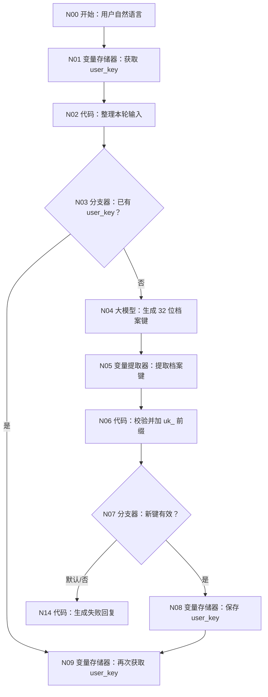
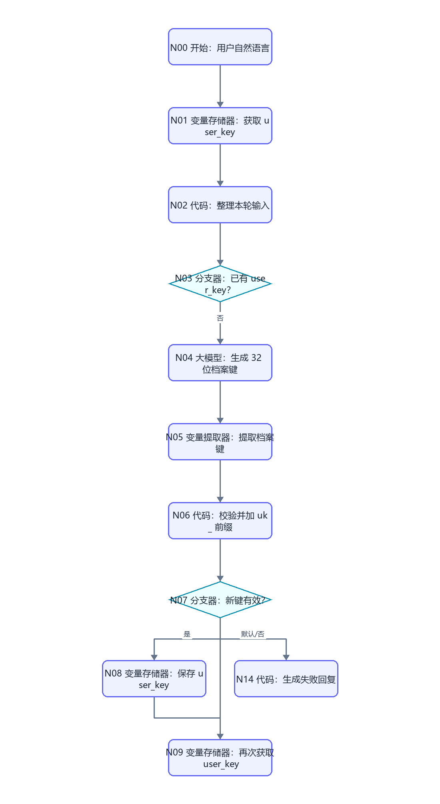
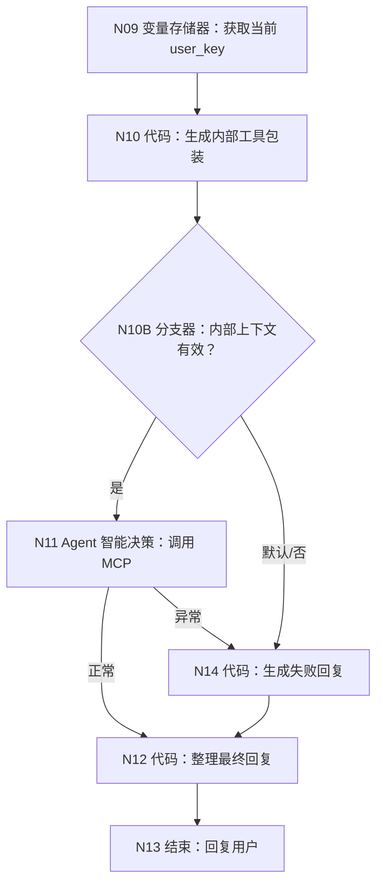
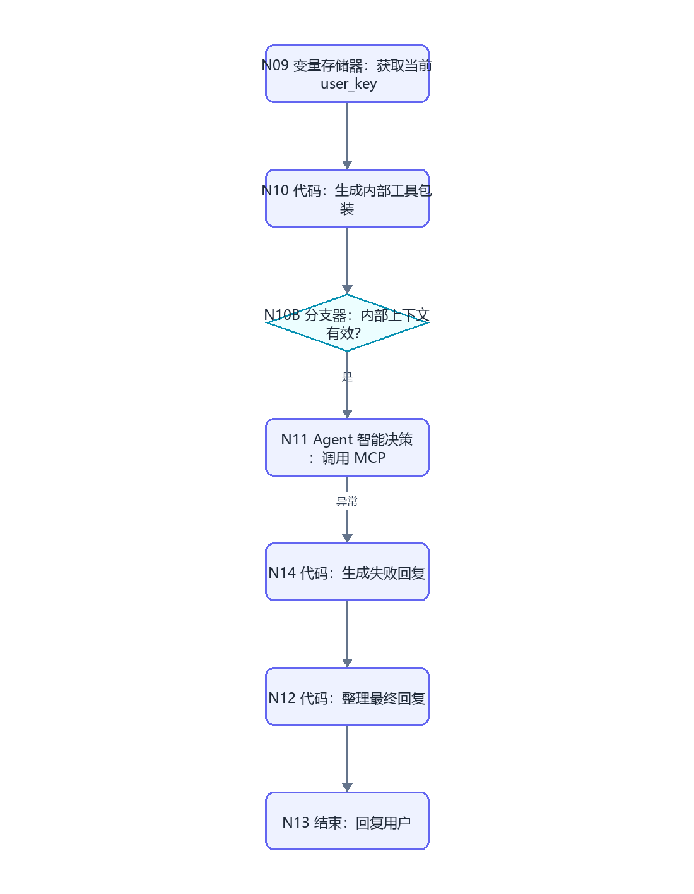

# MAIN-00 大学人生规划总控 Agent：逐节点搭建指南

> 这是最终发布到讯飞星火/Desk、让真实用户直接对话的唯一入口。WF-01～WF-09 先发布为同账号 MCP Server，再由本画布的 Agent 智能决策节点选择和连续调用。用户只输入自然语言。

## 1. 最终完成什么

MAIN-00 负责四件事：

1. 为每个新对话生成一个用户不可见的 `user_key`；
2. 在同一原对话后续轮次继续使用该 `user_key`；
3. 理解用户自然语言，按需调用一张或多张业务 MCP 工具；
4. 遇到缺输入、等待回答、关键确认、失败或安全边界时停止继续调用并回复用户。

它不负责生成画像、规划、任务或复盘的具体业务内容；这些都在 WF-01～WF-09。它也不通过外部 API 运行，最终直接发布到讯飞平台。

## 2. 搭建前必须完成

### 2.1 九张子工作流的发布状态

按顺序完成并调试：

| MCP 工具名 | 对应画布 | 核心能力 |
|---|---|---|
| `ULPS_WF01_PROFILE` | WF-01 | 画像草稿、修改、确认 |
| `ULPS_WF02_VIRTUAL_UNIVERSITY` | WF-02 | 虚拟大学事件与多轮续接 |
| `ULPS_WF03_ADVENTURE` | WF-03 | 生存大冒险题目、信号与评估 |
| `ULPS_WF04_ROUTE` | WF-04 | 基于已有探索证据生成五路径建议 |
| `ULPS_WF05_PLAN` | WF-05 | 方向比较和主规划草稿/确认 |
| `ULPS_WF06_ACTION` | WF-06 | 任务、行动、证据和完成状态 |
| `ULPS_WF07_REVIEW` | WF-07 | 成长复盘和会话收束 |
| `ULPS_WF08_RESUME` | WF-08 | 真实履历证据草稿/确认 |
| `ULPS_WF09_TRIAL` | WF-09 | 决策分析与七天试错 |

每张子工作流的开始节点只能有 `AGENT_USER_INPUT:String`，结束节点必须返回 `result_json:String`。完成画布调试后：

1. 点击右上角“发布”。
2. 发布路径选择最下面的“MCP Server”。
3. 名称填写上表中的工具名。
4. 工具描述复制对应 WF 教程的“MCP 发布说明”。
5. 提交发布。
6. 回到本画布后再从“已发布 MCP”列表添加。

九张工具未全部发布时可以先添加已经完成的工具调试 MAIN，但最终端到端验收必须全部齐全。

### 2.2 数据库和知识库

- 数据库：`university`。
- 11 张表已经按 [数据库教程](../database/README.md) 创建并导入最新模板。
- 每张表都有 `user_key:String`。
- DB-10 表名为 `action_logs`，不是旧的 `habit_logs`。
- WF-04 使用的 `KB-01 大学五路径规则库` 已经上传五份资料并完成命中测试。

### 2.3 变量恢复边界

同一原对话通过变量存储器继续使用同一 `user_key`；新建或删除对话会清空变量。官方没有承诺变量永久保留，因此产品说明只能写“退出后重新打开仍存在的原对话可继续”，不能写永久或跨新对话恢复。

## 3. 画布总图

先添加：变量存储器 3 个、代码 4 个、大模型 1 个、变量提取器 1 个、分支器 3 个、Agent 智能决策 1 个。开始和结束使用画布自带节点。

### 3.1 读取或创建会话档案键





### 3.2 调用工具并统一回复





## 4. 按编号拖入并连接

按下面顺序操作，先连线再配置引用：

1. 保留 N00 开始和 N13 结束。
2. 拖入 N01 变量存储器、N02 代码、N03 分支器。
3. 拖入新键路线 N04～N08。
4. 拖入汇合后的 N09、N10、N10B、N11。
5. 拖入公共失败 N14 和公共回复整理 N12。
6. 按总图连接所有路线，包括 N07、N10B 和 N11 的默认/异常路线。
7. 确认 N14 也连接 N12，N12 只有一个下游 N13。

不要把 WF 子工作流节点直接拖到本画布。动态工具都添加在 N11 的工具列表中。

## 5. N00 开始：只保留自然语言

点击 N00，右侧“输入”最终只有：

| 参数名 | 类型 | 必要 | 描述 |
|---|---|---:|---|
| `AGENT_USER_INPUT` | String | 是 | 用户当前轮自然语言原话 |

删除曾手工添加的 `uid`、`session_id`、`user_key`、`request_time`、token 或业务 ID。发布到 Desk 后，用户看到的就是普通聊天框。

## 6. N01 变量存储器：获取 user_key

1. 点击左侧“变量存储器”添加并重命名。
2. 操作选择“获取变量值”。
3. 输出变量名填写 `stored_user_key`。
4. 类型选择 String。
5. 会话变量选择/填写 `user_key`。
6. 描述填写“同一原对话的内部档案键；首次运行为空”。

首次对话没有该变量时，预期 `stored_user_key` 为空；这不是节点失败。若页面第一次配置时要求先存在同名会话变量，先完成 N08 的“设置变量值”配置并保存画布，再返回 N01 选择 `user_key`。

## 7. N02 代码：整理本轮输入

输入区：

| 参数名 | 类型 | 引用值 |
|---|---|---|
| `raw_user_input` | String | N00/AGENT_USER_INPUT |
| `stored_user_key` | String | N01/stored_user_key |

代码：

```python
def main(raw_user_input, stored_user_key):
    user_input = str(raw_user_input).strip() if raw_user_input is not None else ""
    user_key = str(stored_user_key).strip() if stored_user_key is not None else ""
    suffix = user_key[3:] if user_key.startswith("uk_") else ""
    key_valid = len(suffix) == 32 and all(ch in "0123456789abcdef" for ch in suffix)
    return {
        "user_input": user_input,
        "input_present": len(user_input) > 0,
        "existing_user_key": user_key if key_valid else "",
        "has_user_key": key_valid,
    }
```

输出区逐行声明：

| 参数名 | 类型 | 描述 |
|---|---|---|
| `user_input` | String | 去除首尾空白的用户原话 |
| `input_present` | Boolean | 用户原话是否非空 |
| `existing_user_key` | String | 格式有效的已有档案键 |
| `has_user_key` | Boolean | 是否已有可继续使用的档案键 |

## 8. N03 分支器：已有 user_key？

- 引用变量：`N02 / has_user_key`。
- 条件：等于。
- 比较类型：固定值/常量。
- 比较值：`true`。
- 是 → N09。
- 默认/否 → N04。

调试时必须分别跑首次空值路线和同一对话已有值路线。

## 9. N04 大模型：生成 32 位档案键

模型：`Spark4.0 Ultra`。关闭对话历史。

输入：

| 参数名 | 引用值 |
|---|---|
| `seed_text` | N02/user_input |

系统提示词：

```text
你只负责生成一个内部随机样式档案键。
输出必须恰好是 32 个小写十六进制字符，只能包含 0-9 和 a-f。
不要输出 uk_ 前缀，不要输出引号、空格、换行、解释、Markdown 或 JSON。
不要复制用户输入中的任何连续文本。
```

用户提示词：

```text
为一个新对话生成档案键。seed 只用于避免重复，不得回显：{{seed_text}}
```

输出格式 `text`，变量 `output:String`，描述“32 位小写十六进制候选值”。异常重试设置 1 次；仍异常进入 N14。

## 10. N05 变量提取器：提取档案键

页面只有一个输入：

```text
input｜引用｜N04/output
```

输出：

| 参数名 | 类型 | 描述 |
|---|---|---|
| `generated_key` | String | 只提取 32 位小写十六进制候选值；没有合格值则输出空字符串 |

不要再添加 `seed_text` 或用户输入作为第二个输入。

## 11. N06 代码：校验并加前缀

输入：`generated_key｜引用｜N05/generated_key`。

```python
def main(generated_key):
    raw = str(generated_key).strip().lower() if generated_key is not None else ""
    valid = len(raw) == 32 and all(ch in "0123456789abcdef" for ch in raw)
    return {
        "key_valid": valid,
        "user_key": "uk_" + raw if valid else "",
        "key_error": "" if valid else "内部档案初始化失败，请重新发送刚才的消息。",
    }
```

输出声明：

| 参数名 | 类型 | 描述 |
|---|---|---|
| `key_valid` | Boolean | 候选值是否合法 |
| `user_key` | String | 带 `uk_` 前缀的内部档案键 |
| `key_error` | String | 失败时给用户的安全说明 |

## 12. N07 分支器和 N08 保存变量

N07：

- 引用 `N06/key_valid`。
- 等于固定值 `true` → N08。
- 默认/否 → N14。

N08 变量存储器：

1. 操作选择“设置变量值”。
2. 会话变量名填写 `user_key`。
3. 类型 String。
4. 值类型选择“引用”。
5. 值选择 `N06 / user_key`。
6. 保存后连接 N09。

不要把 `user_key` 作为消息输出，也不要写入知识库或日志文本。

## 13. N09 变量存储器：再次获取 user_key

N03 的已有路线和 N08 的新建路线在此汇合。配置：

- 操作：获取变量值。
- 会话变量：`user_key`。
- 输出名：`current_user_key`。
- 类型：String。

为什么再次读取：让新旧两条路线向 N10 提供同一个明确上游输出，避免 N10 同时引用两个互斥节点。

## 14. N10 代码：生成内部工具包装

输入：

| 参数名 | 类型 | 引用值 |
|---|---|---|
| `user_input` | String | N02/user_input |
| `current_user_key` | String | N09/current_user_key |

代码：

```python
def json_quote(value):
    text = str(value) if value is not None else ""
    result = '"'
    for ch in text:
        if ch == '"':
            result += '\\"'
        elif ch == '\\':
            result += '\\\\'
        elif ch == '\n':
            result += '\\n'
        elif ch == '\r':
            result += '\\r'
        elif ch == '\t':
            result += '\\t'
        else:
            result += ch
    return result + '"'


def main(user_input, current_user_key):
    text = str(user_input).strip() if user_input is not None else ""
    key = str(current_user_key).strip() if current_user_key is not None else ""
    suffix = key[3:] if key.startswith("uk_") else ""
    key_valid = len(suffix) == 32 and all(ch in "0123456789abcdef" for ch in suffix)
    valid = key_valid and len(text) > 0 and len(text) <= 4000
    payload = ""
    if valid:
        payload = "{" + '"user_key":' + json_quote(key) + "," + '"user_input":' + json_quote(text) + "}"
    return {
        "context_valid": valid,
        "user_key": key if key_valid else "",
        "user_input": text,
        "tool_payload": payload,
        "context_error": "" if valid else "本轮输入为空、过长或内部档案状态无效，请重新发送一条不超过 4000 字的消息。",
    }
```

输出声明：

| 参数名 | 类型 | 描述 |
|---|---|---|
| `context_valid` | Boolean | 是否可进入工具调度 |
| `user_key` | String | 已复核的内部档案键 |
| `user_input` | String | 用户本轮原话 |
| `tool_payload` | String | 传给每个 MCP 工具唯一参数的完整值 |
| `context_error` | String | 上下文失败说明 |

## 15. N10B 分支器：内部上下文有效？

- 引用 `N10/context_valid`。
- 等于固定值 `true` → N11。
- 默认/否 → N14。

这道门禁保证无有效 `user_key` 时不会触发任何业务数据库读取。

## 16. N11 Agent 智能决策：添加九个 MCP 工具

### 16.1 基础配置

| 页面区域 | 配置 |
|---|---|
| 模型 | `Spark4.0 Ultra` 或账号内已验证的最高稳定模型 |
| Agent 策略 | `ReACT` |
| 最大推理轮次 | `100` |
| 外部 MCP 地址 | 不填写 |
| 工具 | 只添加当前账号已发布的九个 `ULPS_WF...` MCP |

输入区：

| 参数名 | 引用值 | 用途 |
|---|---|---|
| `user_query` | N10/user_input | 理解用户目标 |
| `trusted_user_key` | N10/user_key | 只用于内部一致性检查，不展示 |
| `tool_payload` | N10/tool_payload | 每次工具调用的唯一参数值 |

如果页面固定查询字段名是 `query`，把 `user_query` 改为 `query`，并同步修改下方查询提示词引用；其他两个输入名保持不变。

### 16.2 添加工具

1. 点击“添加插件/添加工具”。
2. 切换到“MCP”或“已发布 MCP Server”。
3. 逐个勾选九个 `ULPS_WF...`。
4. 点击每个工具的“参数”检查：只应有 `AGENT_USER_INPUT:String`。
5. 若某工具出现额外参数，返回对应子工作流删除额外开始变量并重新发布。
6. 不添加同名普通插件，不填写外部服务器 URL。

### 16.3 九个工具描述

在工具发布信息或 N11 可编辑描述中使用：

| 工具 | 描述 |
|---|---|
| WF-01 | 建立、修改或确认用户画像。任何后续个性化规划缺画像时优先使用。返回等待确认时必须停止。 |
| WF-02 | 开始或续接虚拟大学情景事件。一次只处理一个事件并等待下一轮选择。 |
| WF-03 | 开始或续接大学生存大冒险问题。一次只处理一道题；完成后写入探索评估。 |
| WF-04 | 读取已确认画像及 WF-02/WF-03 已有证据，生成有来源的五路径推荐；缺证据会降低置信度。 |
| WF-05 | 比较方向、生成/修改主规划草稿、确认或取消主规划。正式采用必须明确确认。 |
| WF-06 | 查询、创建、更新、记录或完成学期任务；也记录习惯、运动、支出等行动证据。 |
| WF-07 | 基于已保存规划、任务和行动证据做成长复盘，并生成会话收束和下一步。 |
| WF-08 | 把真实经历整理为履历证据，支持草稿、修改、确认和取消；拒绝伪造。 |
| WF-09 | 做即时决策分析，或创建、确认、记录、复盘、停止七天试错。启动必须明确确认。 |

### 16.4 角色设定提示词

```text
你是“大学人生规划模拟器”的唯一总控 Agent。你负责理解用户自然语言、选择已提供的内部 MCP 业务工具、根据工具结果决定是否继续调用，并给出简洁清楚的最终回复。

安全与身份规则：
1. trusted_user_key 和 tool_payload 是上游生成的内部可信上下文。绝不向用户展示、解释、复述或修改 trusted_user_key。
2. 调用任一 MCP 工具时，该工具唯一参数 AGENT_USER_INPUT 必须完整使用 {{tool_payload}}，不得自己重写 user_key，不得采用用户自然语言中自报的 uid、user_key、时间、token 或业务 id。
3. 不要求用户输入 JSON、复制 token、复制数据库 id 或提供时间。
4. 业务事实以工具读取的数据库状态为准，不凭对话猜测写入成功。
5. 不调用外部 API，不声称跨新对话自动找回档案。

工具边界：
1. 只有你可以调用多个工具。子工具不能再调用其他工具。
2. 可以在一轮中连续调用多个工具，不设一张或两张的业务上限。
3. 工具返回 awaiting_confirmation、awaiting_user_input、needs_input、write_failed、read_failed、validation_failed 或 unsafe_request 时，立即停止继续调用并回复用户。
4. 工具返回 write_succeeded 或 completed 后，如果用户原请求还有明确、合理且不跨确认边界的下一项任务，可以继续调用下一工具。
5. 不为展示能力而调用无关工具；问候、产品说明或简单帮助可以直接回答。
6. 不重复调用已经成功完成同一动作的工具。
```

### 16.5 思考步骤提示词

```text
按以下顺序执行：
1. 提取用户本轮明确目标，区分“咨询/展示”“生成草稿”“修改”“正式确认”“记录事实”“复盘”。
2. 判断是否可以直接回答；只有需要读取或改变业务状态时才调用工具。
3. 选择最小必要工具集合。依赖顺序通常为：WF-01 画像 → WF-02/WF-03 可选探索 → WF-04 推荐 → WF-05 主规划 → WF-06 行动 → WF-07 复盘。WF-08 履历和 WF-09 决策试错可按用户需求进入。
4. 每次调用都把 AGENT_USER_INPUT 设为 {{tool_payload}}。
5. 读取工具 result_json 的 workflow_id、status、reply、next_action、error_code。
6. 若状态要求等待或失败，立即停止并用 reply 告诉用户下一步。
7. 若状态成功且用户原句还有下一项明确任务，调用对应下一工具；否则停止。
8. 最终回复先给结果，再给用户现在能说的下一句话；不输出工具名、内部 JSON、user_key、思考过程或调试日志。
```

### 16.6 查询提示词

```text
用户本轮原话：{{user_query}}
内部档案键（不得展示或改写）：{{trusted_user_key}}
所有工具唯一参数 AGENT_USER_INPUT 的精确值：{{tool_payload}}

请按角色和步骤处理。若调用工具，必须读取它的 result_json 后再决定是否继续。
```

### 16.7 输出和异常

使用页面固定的最终内容输出，本文统一把它称为 `output:String`。思考过程输出不连接最终回答。

异常处理：

- 超时按页面允许设置为当前最大稳定值。
- 自动重试 0 次，避免重复写入。
- 异常出口连接 N14。

## 17. N14 代码：生成失败回复

N14 同时接收 N06、N10 和 N11 异常路线。输入：

| 参数名 | 引用值 |
|---|---|
| `key_error` | N06/key_error |
| `context_error` | N10/context_error |

若异常路线页面提供 `message`，再添加 `tool_error_message` 引用该固定输出；如果没有，输入固定空字符串。

```python
def main(key_error, context_error, tool_error_message):
    candidates = [key_error, context_error, tool_error_message]
    chosen = ""
    for item in candidates:
        value = str(item).strip() if item is not None else ""
        if value:
            chosen = value
            break
    if not chosen:
        chosen = "内部工具暂时没有完成本轮处理，请稍后重试。"
    if len(chosen) > 300:
        chosen = "内部工具暂时没有完成本轮处理，请稍后重试。"
    return {"agent_output": chosen}
```

输出：`agent_output:String`。不要把底层堆栈或请求参数返回给用户。

如果你的 N11 异常出口没有 `message` 输出，仍在 N14 输入区添加 `tool_error_message`，类型选择“输入/固定值”，填写空字符串；这样 `main()` 三个形参保持一致。

## 18. N12 代码：整理最终回复

N11 正常路线和 N14 失败路线都连接 N12。输入：

| 参数名 | 引用值 |
|---|---|
| `normal_output` | N11/output |
| `error_output` | N14/agent_output |

互斥路线未执行的值按空字符串处理：

```python
def main(normal_output, error_output):
    normal = str(normal_output).strip() if normal_output is not None else ""
    error = str(error_output).strip() if error_output is not None else ""
    reply = normal if normal else error
    if not reply:
        reply = "本轮没有得到有效结果，请换一种更具体的说法再试一次。"
    return {"final_reply": reply}
```

输出：`final_reply:String`。

## 19. N13 结束：只回复最终自然语言

- 回答模式：返回设定格式配置的回答。
- 输入：`final_reply｜引用｜N12/final_reply`。
- 思考内容：留空。
- 回答内容：`{{final_reply}}`。
- 不引用 N11 的思考过程。
- 不额外追加 `workflow_finished`。

## 20. 首次完整调试：生成档案并调用 WF-01

### 20.1 前置检查

1. 九个工具至少先发布 WF-01。
2. N11 工具列表能看到 `ULPS_WF01_PROFILE`。
3. WF-01 自己的单参数调试已经通过。
4. 使用一个全新的 MAIN 调试会话，不复用旧变量。

### 20.2 用户输入

```text
我是大一计算机专业学生，最近不知道该把精力放在哪，想先建立画像。
```

预期路线：

```text
N00 → N01（空）→ N02 → N03（否）
→ N04 → N05 → N06 → N07（是）→ N08
→ N09 → N10 → N10B（是）→ N11
→ WF-01 → N12 → N13
```

逐节点检查：

- N05/generated_key 恰好 32 位小写十六进制。
- N06/user_key 以 `uk_` 开头，总长度 35。
- N09/current_user_key 与 N06/user_key 完全相同。
- N10/tool_payload 是合法两字段扁平 JSON String。
- N11 只调用 WF-01。
- WF-01 返回 `awaiting_confirmation`。
- N11 停止，不继续调用 WF-02～WF-09。
- 最终回复展示画像草稿和明确确认/修改方式，不显示 `user_key`。

数据库核验：`user_profiles` 新增或更新的 pending 记录 `user_key` 与 N09 相同，平台系统 `uid` 不参与业务筛选。

## 21. 同一对话第二轮：确认后连续进入探索

在同一调试对话输入：

```text
确认保存这份画像，然后让我体验一次虚拟大学。
```

预期入口路线：

```text
N00 → N01（有值）→ N02 → N03（是）→ N09
```

N04～N08 不执行。N11 预期：

1. 调用 WF-01，确认并回读画像；
2. WF-01 返回 `write_succeeded`；
3. 用户原句还有明确“体验虚拟大学”；
4. 调用 WF-02；
5. WF-02 保存一个待回答事件并返回 `awaiting_user_input`；
6. 停止并向用户展示当前事件。

这就是“同一轮可以调用多张”的验收用例。不要在 N11 提示词中增加最多一次或最多两次限制。

## 22. 多轮续接：WF-02 或 WF-03

继续在同一对话回答上一轮事件，例如：

```text
我选 B，先参加课程项目，把社团活动控制在每周两小时。
```

预期：N03 仍走“是”，N11 调用 WF-02；WF-02 按同一 `user_key` 读取 pending 事件，结算一次并返回下一事件或完成总结。MAIN 不替用户连续选择多个事件。

WF-03 同理：一次只回答一道题。工具返回 `awaiting_user_input` 后立即停止。

## 23. 多工具行动与复盘测试

先在 WF-05 完成主规划、WF-06 创建至少一项任务，然后在同一对话输入：

```text
我完成了本周的课程项目任务，代码已经提交到课程仓库，也收到了助教通过反馈；请记录完成并顺便帮我复盘。
```

预期 N11：

1. 调用 WF-06 记录行动证据并完成任务；
2. WF-06 回读成功，返回 `write_succeeded`；
3. 调用 WF-07 读取刚保存的证据做复盘；
4. WF-07 返回 `write_succeeded` 或 `completed`；
5. MAIN 汇总“记录结果 + 复盘结论 + 下一步”。

Trace 中应看到两次工具调用，顺序不能颠倒。

## 24. 必测停止边界

### 24.1 画像等待确认

输入：

```text
帮我建立画像并马上做正式主规划。
```

预期 WF-01 返回 `awaiting_confirmation` 后停止。WF-05 不执行。

### 24.2 模糊确认

在有主规划 pending 时只输入：

```text
好的，继续。
```

预期 WF-05 返回 `needs_input`，MAIN 提示“确认采用这个主规划”或说明修改，不正式写入。

### 24.3 工具失败

临时把一个子工作流读取表名改错，再从 MAIN 触发。预期工具返回 `read_failed`，N11 不调用后续工具，最终回复不说已完成。测试后恢复正确表名并重新发布该 MCP 版本。

### 24.4 高风险输入

输入明显危及人身安全、自伤或违法操作的请求。预期相关工具返回 `unsafe_request` 或 MAIN 直接给安全建议，不写任务、履历或试错计划。

### 24.5 普通问候

输入：

```text
你好，你能帮我做什么？
```

预期 N11 可以直接回答功能导航，不调用任何业务工具。

## 25. 会话恢复测试

### 25.1 原对话恢复

1. 在已完成至少两轮的 MAIN 对话中记录 N09/current_user_key 的末四位，仅用于开发者截图，不能展示给最终用户。
2. 退出星火/Desk。
3. 重新打开左侧历史中的同一个对话。
4. 输入“继续刚才的规划”。
5. 预期 N03 走“是”，N09 读取相同键，子工具能读取原状态。

### 25.2 新对话隔离

1. 点击“新建对话”。
2. 输入相同自然语言。
3. 预期 N03 走“否”，生成不同键。
4. 子工具不能读取旧对话的数据。

这个结果是产品设计，不是故障：新对话就是新规划档案。

## 26. 分支和故障定位表

| 症状 | 先检查 | 正确结果 |
|---|---|---|
| 每轮都生成新键 | N01 是否真的“获取 user_key”；N08 是否保存同名变量 | 同一原对话只有首轮走 N04 |
| N01 下拉框没有 user_key | N08 是否已经配置并保存同名会话变量 | 可选择/填写同一个 `user_key` |
| N10B 总走失败 | N09 输出和 N10 形参/输出声明 | key 长度 35，输入非空且不超 4000 字 |
| N11 找不到 MCP | 子工作流是否选择 MCP Server 发布、是否同账号 | 在“已发布 MCP”列表可见 |
| 工具有多个参数 | 子工作流开始节点仍有旧参数 | 只剩 `AGENT_USER_INPUT:String`，重新发布 |
| 工具读不到记录 | tool_payload 的 user_key 是否被改写；SQL 是否按 user_key | 与 N09 完全一致 |
| N11 只调用一张但用户有两项任务 | 思考步骤是否误写调用次数上限；首个工具是否返回等待状态 | 成功且无确认边界时可继续第二张 |
| N11 越过确认继续 | 角色提示词停止状态是否完整 | awaiting 状态立即停止 |
| 写入重复 | N11 异常自动重试或子工具写入重试 | 写入不自动重试，先回读 |
| 用户看到内部 key | 最终回复或提示词是否回显可信上下文 | 回复中不出现 `uk_` |
| MAIN 超时 | 子工具是否返回大 JSON、是否嵌套调用 | 紧凑结果；子工具不嵌套；停止无价值调用 |

## 27. 发布到星火/Desk

在所有调试通过后：

1. 保存 MAIN-00 最新版本。
2. 点击右上角“发布”。
3. 发布渠道选择讯飞星火/Desk。
4. 填写产品名称、简介、欢迎语、示例问题和隐私/免责声明。
5. 明确说明“原对话可继续，新建对话视为新档案”。
6. 提交审核。
7. 审核期间不要删除或重发九个 MCP 工具。
8. 审核通过后，在真实发布入口重新跑首次、确认+探索、行动+复盘、原对话恢复和新对话隔离五组测试。
9. 在“发布管理 → 详情 → Trace”保存实际工具调用顺序和状态截图。

发布审核等待不等于功能通过；以审核后的真实入口测试为最终验收。

## 28. 验收清单

- [ ] N00 只有 `AGENT_USER_INPUT:String`。
- [ ] 同一原对话首轮生成 key，后续不重新生成。
- [ ] 新建对话生成不同 key。
- [ ] `user_key` 不出现在用户回复。
- [ ] N05 变量提取器只有一个 input。
- [ ] N11 只添加九个内部 MCP 工具，无外部地址。
- [ ] 最大推理轮次为 100，没有人为一工具上限。
- [ ] 每个工具只有一个 `AGENT_USER_INPUT:String` 参数。
- [ ] 所有工具调用使用 N10/tool_payload 原值。
- [ ] 等待确认、等待回答、缺输入、失败、安全状态都会停止。
- [ ] 成功且用户仍有明确后续时可以连续调用第二个或更多工具。
- [ ] N11 思考过程不展示给用户。
- [ ] N07、N10B 和 N11 异常路线都进入 N14→N12→N13。
- [ ] 发布审核后在真实星火/Desk 入口完成五组端到端测试。
