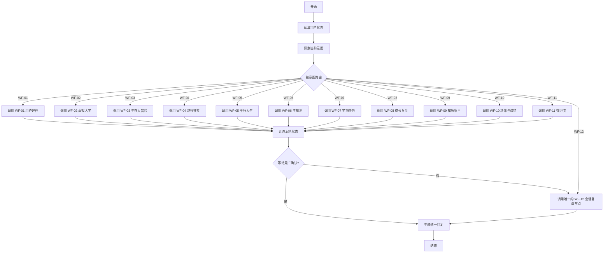

# 讯飞星辰工作流搭建总指南

本目录把《大学人生规划模拟器》拆成 12 个可独立搭建和调试的讯飞星辰工作流。本文件先说明推荐搭建顺序，最后给出把 12 个工作流整合成一个完整产品流程的具体方法。

在搭工作流前，先完成[数据库从零建表与导入教程](../database/README.md)。平台每张表自动带有 `id`、`uid`、`create_time`；11 份导入模板只添加业务字段。总 Agent 调用子工作流时必须把系统 `uid` 和本轮 `AGENT_USER_INPUT` 原样传入。

## 1. 开始前先确认平台能力

根据当前讯飞星辰工作流编辑器截图，左侧节点列表已经确认包含：

- 基础节点：`大模型`、`代码`、`问答节点`。
- 工具：`工作流`、`插件`、`MCP`、`RPA`。
- 知识与数据：`知识库`、`知识库 Pro`、`长期记忆写入`、`长期记忆检索`、`数据库`。
- 逻辑：`决策`、`分支器`、`迭代`、`Agent 智能决策`。
- 转换：`变量存储器`、`变量提取器`、`文本处理节点`。
- 其他：`消息`。
- 画布自带：`开始`、`结束`。

不同账号或平台版本的节点配置字段可能略有区别。本文只使用这些已确认节点；当按钮或字段名称无法从当前截图确认时，会写“以当前编辑器显示为准”，不会虚构配置项。

## 2. 文件导航

| 文件 | 用途 |
|---|---|
| [共享协议](SHARED-CONTRACTS.md) | 统一变量、状态、确认与写入规则 |
| [工作流模板](WORKFLOW-TEMPLATE.md) | 新增工作流时直接复制 |
| [WF-01 用户建档](WF-01-user-profile.md) | 提取、确认并保存用户画像 |
| [WF-02 虚拟大学](WF-02-virtual-university.md) | 运行压缩版大学生涯试玩 |
| [WF-03 生存大冒险](WF-03-survival-adventure.md) | 采集场景选择并生成能力信号 |
| [WF-04 路径推荐](WF-04-path-recommendation.md) | 生成五路径分级建议 |
| [WF-05 平行人生](WF-05-parallel-lives.md) | 创建并比较 2～3 个版本 |
| [WF-06 主规划](WF-06-main-plan.md) | 确认并保存主规划 |
| [WF-07 学期任务](WF-07-semester-tasks.md) | 管理学期、月度和每周任务 |
| [WF-08 成长复盘](WF-08-growth-review.md) | 根据行为证据动态修正规划 |
| [WF-09 履历条目](WF-09-resume-entry.md) | 把经历转成可用简历素材 |
| [WF-10 决策与试错](WF-10-decision-and-trial.md) | 决策分析及七天试错 |
| [WF-11 微习惯](WF-11-micro-habits.md) | 记录习惯、记账和基础健身 |
| [WF-12 会话复盘](WF-12-session-recap.md) | 保存变化并生成下次入口 |

## 3. 推荐搭建顺序

不要一开始就搭总画布。按下面顺序逐个完成，并在每个工作流通过独立调试后再接入总流程：

```text
SHARED-CONTRACTS
→ WF-01 → WF-02 → WF-03 → WF-04
→ WF-05 → WF-06 → WF-07
→ WF-09 → WF-08
→ WF-10 → WF-11 → WF-12
→ 总编排工作流
```

顺序这样安排的原因：

1. WF-01 先建立所有后续流程依赖的画像。
2. WF-02～WF-04 让用户体验、暴露偏好并获得路径建议。
3. WF-05～WF-07 把建议转成可保存、可执行的计划。
4. WF-09 把完成事项沉淀为履历，WF-08 再用真实证据修正路线。
5. WF-10 和 WF-11 是随时可进入的辅助入口。
6. WF-12 在每一轮结束时压缩状态，保证下次能接着聊。

## 4. 三条业务闭环

### 4.1 首次体验闭环

```text
WF-01 建档并确认画像
→ WF-02 虚拟大学试玩
→ WF-03 生存大冒险
→ WF-04 五路径推荐
→ WF-05 平行人生比较
→ WF-06 保存主规划
→ WF-07 生成第一批任务
→ WF-12 会话复盘
```

### 4.2 长期执行闭环

```text
WF-07 查看或更新任务
→ 用户执行并记录结果
→ WF-09 生成履历条目
→ WF-08 根据证据复盘
→ 必要时返回 WF-06/WF-07 调整规划
→ WF-12 会话复盘
```

### 4.3 辅助入口

```text
重大选择 → WF-10 → WF-08 或 WF-06
微习惯/记账/健身 → WF-11 → WF-08
任意流程结束 → WF-12
```

## 5. 把 12 个工作流整合为一个大工作流

先在平台中分别创建、调试并发布 `WF-01` 至 `WF-12`。确认左侧的 `工作流` 节点能否选择一个已发布工作流作为被调用对象。如果可以，使用方案 A；如果不能，直接使用方案 B。不要为了做一张巨大画布而复制 12 个子流程的内部节点。

## 6. 方案 A：用“工作流”节点搭建总编排画布

### 6.1 新建总工作流

1. 回到工作流列表，新建一个工作流。
2. 名称填写：`WF-00 大学人生规划模拟器总编排`。
3. 进入编辑画布，保留系统自带的 `开始` 和 `结束`。
4. 从左侧依次拖入：
   - 1 个 `长期记忆检索` 或 `数据库` 节点；
   - 1 个 `Agent 智能决策` 节点；
   - 1 个 `分支器` 节点；
   - 12 个 `工作流` 节点；
   - 1 个 `变量存储器` 节点；
   - 1 个 `文本处理节点` 或 `大模型` 节点用于统一回复。

这里共使用 12 个 `工作流` 节点，分别对应 WF-01～WF-12。WF-12 节点既接收用户主动结束/总结的路由，也接收 WF-01～WF-11 正常完成后的统一收尾；不要为收尾再放第二个 WF-12 节点，否则会重复复盘和重复写入。

### 6.2 重命名节点

按下面名称重命名，避免调试时只看到“工作流_1”：

```text
读取用户状态
识别当前意图
按意图路由
调用_WF01_用户建档
调用_WF02_虚拟大学
调用_WF03_生存大冒险
调用_WF04_路径推荐
调用_WF05_平行人生
调用_WF06_主规划
调用_WF07_学期任务
调用_WF08_成长复盘
调用_WF09_履历条目
调用_WF10_决策与试错
调用_WF11_微习惯
调用_WF12_会话复盘
汇总本轮状态
生成统一回复
```

### 6.3 第一段连线

按顺序连接：

```text
开始
→ 读取用户状态
→ 识别当前意图
→ 按意图路由
```

开始节点至少传入：

| 总流程变量 | 来源 |
|---|---|
| `user_message` | 开始节点的 `AGENT_USER_INPUT` |
| `uid` | 主 Agent 或平台提供的用户标识；取不到时使用平台允许的会话隔离键 |
| `session_id` | 平台会话标识；取不到时由当前会话上下文代替 |

`读取用户状态` 返回 `profile_json`、`main_plan_json`、`semester_tasks_json` 和最近一次 `session_recap_json`。数据库节点具体查询字段以当前编辑器显示为准；尚未建数据库时，可先换成 `长期记忆检索`。

### 6.4 配置意图识别

在 `识别当前意图` 中输入 `user_message` 和已读取状态，要求输出：

```json
{
  "intent": "WF-01",
  "reason": "用户首次进入且没有已确认画像",
  "required_context": [],
  "should_recap_after": true
}
```

可复制提示词：

```text
你是“大学人生规划模拟器”的总流程路由器。你的任务只是在 WF-01 至 WF-12 中选择本轮最合适的一个入口，不直接完成业务。

意图表：
- WF-01：首次建档、查看或修改用户画像。
- WF-02：开始或继续虚拟大学试玩。
- WF-03：开始或继续大学生存大冒险测试。
- WF-04：查看或更新五路径推荐。
- WF-05：创建、比较平行人生版本。
- WF-06：生成、保存、切换或调整主规划。
- WF-07：创建、查看、完成、延期或调整任务。
- WF-08：成长复盘、动态修正路线。
- WF-09：把项目、比赛、实习或活动转成履历条目。
- WF-10：重大选择分析或七天试错。
- WF-11：微习惯、记账、散步、阅读或入门健身记录。
- WF-12：用户准备结束、请求总结，或业务流程已经完成。

规则：
1. 没有已确认画像时，除非用户明确只想了解产品，否则优先 WF-01。
2. 保存画像、主规划、重要履历前仍须由对应子工作流取得确认。
3. 用户表达多个意图时，选择最先需要完成且能为后续提供数据的工作流。
4. 不确定时选择最安全的澄清入口，不得假装已保存数据。
5. 只输出 JSON，不要输出解释文字。

输入：
用户消息：{{user_message}}
已有画像：{{profile_json}}
主规划：{{main_plan_json}}
近期任务：{{semester_tasks_json}}
最近复盘：{{session_recap_json}}

输出字段：intent、reason、required_context、should_recap_after。
```

如果 `Agent 智能决策` 节点本身能直接配置候选分支，可把以上规则放入该节点；如果只能输出文本，就在其后增加 `变量提取器`，提取 `intent` 后再进入 `分支器`。

### 6.5 配置 12 条路由

在 `按意图路由` 中创建以下条件。条件配置语法以当前编辑器显示为准，判断逻辑保持一致：

| 条件 | 连接目标 |
|---|---|
| `intent == "WF-01"` | `调用_WF01_用户建档` |
| `intent == "WF-02"` | `调用_WF02_虚拟大学` |
| `intent == "WF-03"` | `调用_WF03_生存大冒险` |
| `intent == "WF-04"` | `调用_WF04_路径推荐` |
| `intent == "WF-05"` | `调用_WF05_平行人生` |
| `intent == "WF-06"` | `调用_WF06_主规划` |
| `intent == "WF-07"` | `调用_WF07_学期任务` |
| `intent == "WF-08"` | `调用_WF08_成长复盘` |
| `intent == "WF-09"` | `调用_WF09_履历条目` |
| `intent == "WF-10"` | `调用_WF10_决策与试错` |
| `intent == "WF-11"` | `调用_WF11_微习惯` |
| `intent == "WF-12"` | `调用_WF12_会话复盘` |

默认分支不要随便调用某个业务工作流。默认分支连接一个 `消息` 或 `大模型` 节点，请用户在“建档、试玩、测试、路径、平行人生、规划、任务、复盘、履历、决策、习惯、结束总结”中选择。

### 6.6 配置 12 个工作流节点

逐个打开 `工作流` 节点，在可选择的已发布工作流中绑定对应的 WF。每个节点至少映射以下公共输入：

| 子工作流输入 | 总流程来源 |
|---|---|
| `uid` | 开始节点或平台用户标识 |
| `session_id` | 开始节点或当前会话 |
| `AGENT_USER_INPUT` | 开始节点的 `AGENT_USER_INPUT` 原样传递 |
| `profile_json` | `读取用户状态.profile_json` |
| `main_plan_json` | `读取用户状态.main_plan_json` |
| `semester_tasks_json` | `读取用户状态.semester_tasks_json` |

子工作流不需要的字段可以不映射。各自专属输入以对应指南为准。

统一接收以下输出：

```text
status
reply
data
suggested_writes
next_action
error
```

如果平台的 `工作流` 节点只能接收一个字符串，可将公共输入组装成一个 JSON 字符串传入；子工作流开始后使用 `变量提取器` 拆出字段。

### 6.7 汇合与收尾

1. 将 WF-01～WF-11 的输出全部连接到 `汇总本轮状态`。
2. `汇总本轮状态` 保存本轮的 `status`、`reply`、`data`、`next_action`，但不得绕过子工作流内部的确认直接写关键数据。
3. 若子流程返回 `awaiting_confirmation`，直接连接 `生成统一回复`，不要调用 WF-12 后覆盖待确认上下文。
4. 若 WF-01～WF-11 返回成功、失败或普通完成状态，再连接唯一的 `调用_WF12_会话复盘`。
5. 如果本轮路由本身就是 WF-12，则其输出直接连接 `生成统一回复`，不得再次调用 WF-12。
6. 将 `生成统一回复` 连接 `结束`，结束节点输出选择该节点的文本结果。

推荐画布主干：


下面的 Mermaid 源图与 PNG 内容一致；平台流程调整后可修改源图并重新导出图片。



```text
开始
→ 读取用户状态
→ 识别当前意图
→ 按意图路由
├→ WF-01 ─┐
├→ WF-02 ─┤
├→ WF-03 ─┤
├→ WF-04 ─┤
├→ WF-05 ─┤
├→ WF-06 ─┤
├→ WF-07 ─┤
├→ WF-08 ─┤
├→ WF-09 ─┤
├→ WF-10 ─┤
├→ WF-11 ─┤
└→ WF-12 → 生成统一回复 → 结束
           ↓
      汇总本轮状态
           ↓
  需要等待确认？
   ├─ 是 → 生成统一回复 → 结束
   └─ 否 → 唯一的 WF-12 节点 → 生成统一回复 → 结束
```

## 7. 方案 B：平台不能嵌套工作流时

如果 `工作流` 节点无法选择已发布工作流，或平台限制单个画布节点数，不要把 12 个流程的内部节点复制到一张画布。采用主 Agent 调度：

1. 分别发布 WF-01～WF-12。
2. 创建一个主 Agent，名称为“大学人生规划模拟器”。
3. 将 12 个已发布工作流分别添加为主 Agent 可调用能力；具体入口名称以平台当前 Agent 配置页为准。
4. 把第 6.4 节的意图表和路由规则放入主 Agent 系统提示词。
5. 所有工作流通过同一个 `uid` 查询数据库或长期记忆，共享画像、规划、任务和复盘状态。
6. 要求主 Agent 每轮最多调用一个主要业务工作流；完成后根据 `next_action` 决定回复用户还是调用 WF-12。

主 Agent 路由提示词补充：

```text
你必须先读取当前用户状态，再决定调用哪个工作流。不要在主对话中伪造某个工作流已经执行。

调用成功后，以工作流返回的 reply 为主要回复。status 为 awaiting_confirmation 时等待用户确认；status 为 write_failed 时明确说明未保存；不得把 suggested_writes 当成已经写入的数据。

当一个业务流程完成且用户没有待确认内容时，调用 WF-12 生成会话复盘。用户在同一条消息里提出多个目标时，先执行依赖最靠前的一个，并把其余目标放入 next_action。
```

方案 B 在界面上不是“一张大画布”，但业务逻辑仍是一个完整的大工作流，而且更容易维护。数据库或长期记忆就是 12 个模块之间的共享状态总线。

## 8. 总流程调试顺序

不要直接从新用户跑到最后。按以下顺序排错：

1. 用一句“我是大一学生，想先做画像”检查是否路由到 WF-01。
2. 在未确认画像时说“保存吧”，检查 WF-01 是否仍要求明确确认或能识别该确认。
3. 人为让数据库写入失败，确认返回 `write_failed` 而不是“保存成功”。
4. 准备一个已有画像用户，输入“我想体验剩余大学生活”，检查路由到 WF-02。
5. 分别测试“做测试”“看路径建议”“比较保研和就业”“保存就业版”“生成本周任务”。
6. 输入一段项目经历，检查路由到 WF-09，而不是 WF-07。
7. 输入“我在纠结考研还是直接就业”，检查路由到 WF-10；输入“最近两周任务都没完成，帮我复盘”，检查路由到 WF-08。
8. 输入“今天散步 20 分钟”，检查路由到 WF-11。
9. 输入“先到这里，总结一下”，检查路由到 WF-12。
10. 重新开始下一次会话，检查能否从上次 `next_action` 继续，而不是要求重新建档。

## 9. 总流程验收清单

- [ ] WF-01～WF-12 均已单独发布并通过各自测试。
- [ ] 总流程能读取同一用户的画像、规划、任务和最近复盘。
- [ ] 12 类典型输入均路由到正确工作流。
- [ ] 默认分支会澄清意图，不会误写数据。
- [ ] 所有关键保存操作仍由子工作流确认。
- [ ] `awaiting_confirmation` 不会被自动当作完成。
- [ ] `write_failed` 会明确告诉用户没有保存成功。
- [ ] 子流程输出能被统一回复节点正确展示。
- [ ] 正常完成后会进入 WF-12，会话中断后仍能续接。
- [ ] 平台不支持嵌套时，主 Agent 路由方案能实现同样的业务顺序。

### 9.1 修改流程后重新生成 PNG

每份指南中的 Mermaid 是可编辑图源。修改图源后，在仓库根目录运行：

```powershell
python scripts/render_workflow_diagrams.py
```

脚本需要 Python、Pillow 和 Windows 微软雅黑字体，会覆盖 `docs/workflows/images/` 下对应的 PNG。提交前应同时提交 Markdown 图源和重新生成的图片，避免图文不一致。

## 10. 整体逻辑说明

这 12 个工作流并不是 12 个互不相关的功能，而是围绕一份持续更新的用户状态运行：

```text
用户输入
→ 识别意图和当前阶段
→ 读取画像、计划与近期状态
→ 调用一个职责明确的业务工作流
→ 返回结构化结果和下一步
→ 关键变化由用户确认
→ 成功后写入共享状态
→ WF-12 压缩本轮变化
→ 下次对话读取状态并继续
```

首次使用阶段解决“我是谁、有哪些可能、应该选什么”；执行阶段解决“现在做什么、做得怎么样、留下了什么证据”；修正阶段解决“事实变化后是否继续、微调或切换”。WF-12 把每次会话新增的事实和未决事项保存下来，使整个系统从一次性问答变成可持续的规划循环。

真正的“大工作流”不是把所有节点堆在一张画布里，而是统一入口、统一状态、明确路由、模块化执行和统一收尾。这样任何一个子工作流都能独立修改和测试，同时用户仍然只感知到一个连续的“大学人生规划模拟器”。
