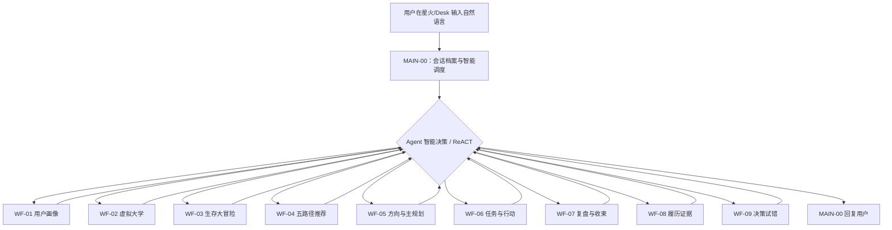
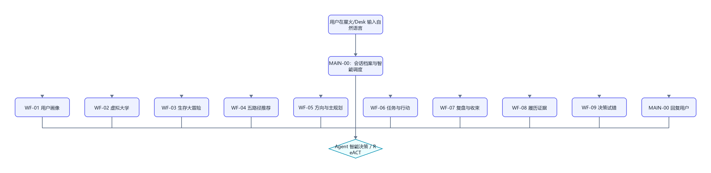

# 讯飞星辰大学人生规划 Agent 搭建总指南

本目录交付一张用户入口工作流 `MAIN-00` 和九张内部 MCP 业务工作流。所有内容都按讯飞星辰 Agent 工作流页面编写，最终发布到讯飞星火/Desk，不使用外部 API。

## 1. 先理解最终结构





设计重点：

- 用户只看见 MAIN-00。
- MAIN-00 是唯一可以调用多个 MCP 工具的画布。
- 一轮可以调用一张或多张工具，不设置人为次数上限。
- 子工作流不能调用其他工作流，避免嵌套和非流式超时。
- 任何关键确认、缺输入、等待多轮回答、失败或安全状态都会停止连续调用。

## 2. 文件导航

### 2.1 总控和公共契约

- [MAIN-00 总控逐节点指南](MAIN-00-agent-orchestrator.md)
- [工作流共享协议](SHARED-CONTRACTS.md)
- [平台 UI 配置契约](PLATFORM-UI-CONTRACT.md)
- [可复用教程模板](WORKFLOW-TEMPLATE.md)

### 2.2 九张业务工作流

- [WF-01 用户建档与画像确认](WF-01-user-profile.md)
- [WF-02 虚拟大学试玩](WF-02-virtual-university.md)
- [WF-03 大学生存大冒险](WF-03-survival-adventure.md)
- [WF-04 五路径推荐](WF-04-path-recommendation.md)
- [WF-05 方向比较与主规划](WF-05-direction-and-main-plan.md)
- [WF-06 学期任务与行动](WF-06-semester-actions.md)
- [WF-07 成长复盘与会话收束](WF-07-review-and-recap.md)
- [WF-08 履历证据](WF-08-resume-evidence.md)
- [WF-09 决策分析与七天试错](WF-09-decision-trial.md)

### 2.3 数据与知识

- [数据库创建和导入](../database/README.md)
- [11 张表字段字典](../database/DATABASE-SCHEMA.md)
- [SQL 复制手册](../database/SQL-EXAMPLES.md)
- [工作流数据库映射](../database/WF-DATABASE-MATRIX.md)
- [KB-01 五路径资料](../knowledge-base/KB-01-five-paths/README.md)

## 3. 为什么不继续保留 12 张业务画布

旧结构从 WF-05 开始把一个连续业务循环拆得过细：平行人生与主规划分别重复读取同一份推荐；微习惯和任务共享大量状态；成长复盘与会话复盘重复汇总同一批事实；七天试错单张画布又接近 60 节点。

最终合并不是把所有逻辑塞进一个超大画布，而是按“同一用户目标和同一状态生命周期”合并：

| 旧能力 | 最终位置 | 理由 |
|---|---|---|
| 平行人生 + 主规划 | WF-05 | 用户比较方向后通常立即形成规划草稿；共享画像和推荐读取 |
| 学期任务 + 微习惯 | WF-06 | 微习惯本质是 task_type 和 action_log，不需要独立入口 |
| 成长复盘 + 会话复盘 | WF-07 | 都读取规划、任务和行动证据；一次生成用户复盘与续接摘要 |
| 履历条目 | WF-08 | 保留独立确认和反伪造边界 |
| 决策分析 + 七天试错 | WF-09 | 同一 trial 状态机，压缩重复确认/错误路线 |

这样既避免 WF-01～WF-04 已搭画布大改，也把后半段从八张缩到五张。

## 4. WFB 探索阶段

WF-02、WF-03、WF-04 合称 WFB（探索）。

- WF-02 和 WF-03 均为可选，用户可以只做一个，也可以都做。
- WF-04 必须有已确认画像。
- WF-04 至少读取到 WF-02 或 WF-03 的一种探索证据时才能形成个性化推荐。
- 只有一种证据时继续生成，但 `confidence` 降低并列出 `evidence_gaps`。
- 两种都没有时，返回 `needs_input`，推荐用户先选择一个体验。

不能再把 WF-03 的 `assessment_id` 要求用户复制给 WF-04；WF-04 按同一 `user_key` 自己读取最新结果。

## 5. 用户身份和会话

### 5.1 业务身份不是平台 uid

数据库节点的引用下拉框只显示上游变量。当前发布链路没有把平台终端用户账号 ID 暴露为可供 SQL 引用的变量，因此业务表显式使用 `user_key:String`。

平台自动 `uid` 继续存在，但本项目不写：

```text
WHERE uid='{{uid}}'
```

正确写法：

```text
WHERE user_key='{{user_key}}'
```

### 5.2 user_key 从哪里来

MAIN-00 首轮生成 `uk_` 加 32 位小写十六进制值，存入变量存储器。调用子工具时，内部唯一参数值是：

```json
{"user_key":"uk_0123456789abcdef0123456789abcdef","user_input":"用户本轮原话"}
```

用户不看见这个值。同一原对话继续使用；新对话生成新值。

### 5.3 能恢复多久

官方只明确：变量在同一会话可持续引用，新建或删除会话会清空。官方没有给出发布后固定 TTL。因此验收用语是：

```text
退出后重新打开仍存在的原对话，可以继续原规划档案。
```

不要写“永久保存”“15 天”或“新建对话也自动恢复”。

## 6. 所有子工作流的固定外壳

每张 WF 都遵守：

```text
N00 开始：AGENT_USER_INPUT:String
→ N00A 代码：解析 user_key/user_input
→ N00B 分支器：input_valid == true？
   ├─ 否：整理 validation_failed
   └─ 是：进入业务节点
→ 所有业务终态整理 status/reply/next_action/error_code
→ 公共结果代码：生成 result_json:String
→ 结束：返回 result_json
```

这层外壳解决四个问题：

1. 发布到 MCP 后只有一个稳定参数。
2. 数据库前先验证业务身份。
3. MAIN 能读懂子工具结果。
4. 所有失败路线都有终点。

## 7. 变量提取器的固定用法

变量提取器只有一个输入：

```text
input｜引用｜上游/output
```

WF-02 和 WF-03 的旧文档错误地给变量提取器配置用户输入和 pending JSON 两行；最终版必须增加文本处理节点：

```text
用户原话 + pending JSON
→ 文本处理：字符串拼接
→ output:String
→ 变量提取器唯一 input
```

所有其他工作流也按同样规则处理，不能因为输出字段有多个就误以为输入也能有多行。

## 8. 推荐搭建顺序

### 阶段 A：公共资源

1. 阅读共享协议和 UI 契约。
2. 创建数据库 `university`。
3. 导入 DB-01～DB-11 最新模板。
4. 创建 KB-01 并完成五类命中测试。

### 阶段 B：保留画布的四张工作流

5. 修改 WF-01 单参数外壳、时间/版本和 MCP 结果。
6. 修改 WF-02 单参数外壳、画像内读、文本拼接和分支。
7. 修改 WF-03 单参数外壳、画像内读、文本拼接和分支。
8. 修改 WF-04 内读证据和容错推荐。
9. 每张分别调试并发布 MCP。

### 阶段 C：合并后的五张工作流

10. 搭建 WF-05 方向与主规划。
11. 搭建 WF-06 任务与行动。
12. 搭建 WF-07 复盘与收束。
13. 搭建 WF-08 履历证据。
14. 搭建 WF-09 决策试错。
15. 每张分别调试并发布 MCP。

### 阶段 D：MAIN

16. 搭建 MAIN-00 的会话档案外壳。
17. 在 Agent 智能决策节点添加九个 MCP。
18. 调试一轮单工具、一轮双工具、确认停止和故障停止。
19. 发布 MAIN 到星火/Desk 并等待审核。
20. 审核后在真实入口重跑端到端测试。

## 9. 三条核心产品闭环

### 9.1 首次探索与方向

```text
WF-01 画像草稿
→ 用户明确确认
→ WF-02 或 WF-03（可选其一/两者）
→ WF-04 五路径建议
→ WF-05 方向比较与主规划草稿
→ 用户明确确认
```

### 9.2 长期执行与修正

```text
WF-05 active 主规划
→ WF-06 创建任务
→ WF-06 记录行动/证据/完成
→ WF-07 基于事实复盘
→ 建议继续、调整任务或回到 WF-05 生成新规划草稿
```

WF-07 不直接覆盖主规划；需要调整时返回下一步，由用户确认后再进入 WF-05。

### 9.3 事实资产与低成本试错

```text
真实经历 → WF-08 履历证据草稿 → 确认保存
困难选择 → WF-09 即时分析 → 可选七天试错 → 日志 → 复盘
```

WF-08 拒绝虚构经历。WF-09 的即时分析可以不写数据库；正式启动七天试错必须确认。

## 10. MAIN 何时连续调用多个工具

允许：

```text
“确认保存画像，然后开始虚拟大学。”
→ WF-01 确认成功
→ WF-02 生成事件
→ 停止等待用户回答
```

允许：

```text
“记录我完成任务的证据，并帮我复盘。”
→ WF-06 写入并回读
→ WF-07 读取新证据复盘
```

不允许越过确认：

```text
“第一次来，帮我建档并直接正式规划。”
→ WF-01 只生成草稿
→ awaiting_confirmation
→ 停止
```

不允许失败后换工具掩盖：

```text
WF-06 write_failed
→ 停止并说明重试
→ 不调用 WF-07 假装复盘成功
```

## 11. 发布顺序为什么不能反过来

Agent 智能决策的工具列表只能找到已经发布的 MCP Server。因此顺序是：

```text
完成子工作流画布
→ 子工作流调试
→ 发布为 MCP Server
→ MAIN 添加工具
→ MAIN 调试
→ MAIN 发布到星火/Desk
```

修改子工作流后需要重新发布。发布后在 MAIN 工具详情检查参数仍只有一个 String；若工具版本没有自动更新，从 N11 删除旧工具后重新添加最新已发布版本。

## 12. 端到端调试顺序

1. 新对话生成档案键并调用 WF-01。
2. 同一对话修改画像草稿。
3. 同一对话确认画像并连续进入 WF-02。
4. WF-02 无效回答不推进。
5. WF-02 有效回答进入另一条路线。
6. WF-03 新题、无效答案、有效答案、完成路线。
7. WF-04 只有 WF-02 证据、只有 WF-03 证据、两者都有、两者都无。
8. WF-05 草稿、修改、模糊确认、明确确认、回读失败。
9. WF-06 空列表、创建、记录、完成、缺证据、写入失败。
10. WF-07 有证据、证据不足、无 active 规划、数据库失败。
11. WF-08 真实经历、缺事实、伪造、修改、确认、取消。
12. WF-09 即时分析、创建 pending、确认启动、日志、复盘、停止、安全出口。
13. MAIN 单工具调用。
14. MAIN 两工具连续调用。
15. MAIN 等待确认时停止。
16. 退出后打开原对话继续。
17. 新建对话无法读取旧档案。

每个用例都在对应 WF 文档中给出用户输入、节点路线、数据库预期、故障制造和恢复方式。

## 13. Trace 排错

发布后的真实链路从：

```text
发布管理 → 对应应用 → 详情 → Trace
```

按顺序核对：

1. MAIN 本轮输入。
2. user_key 是否复用。
3. N11 选择的工具和顺序。
4. 工具唯一参数是否是两字段包装 String。
5. 子工作流 N00A 解析结果。
6. 数据库 SQL 的 user_key。
7. 子工作流最终 status。
8. MAIN 是否继续或停止。
9. 最终回复是否与数据库一致。

## 14. 自动检查

仓库根目录运行：

```powershell
python scripts/render_workflow_diagrams.py
python scripts/validate_workflow_guides.py
python scripts/validate_database_templates_exact.py
python scripts/validate_agent_architecture.py
```

检查通过不等于平台已经搭好；它只证明仓库指南内部一致。平台验收仍需按每份逐节点教程实际配置和调试。

## 15. 总验收清单

- [ ] 最终只有 MAIN-00 对用户发布。
- [ ] 只有 WF-01～WF-09 九张业务工作流。
- [ ] 九张工作流都发布为同账号 MCP Server。
- [ ] 每张子工作流只有一个开始参数。
- [ ] 每个变量提取器只有一个 input。
- [ ] 所有业务表和 SQL 使用 user_key。
- [ ] 用户不输入 token、时间或业务 ID。
- [ ] MAIN 工具列表九项完整，无外部 MCP 地址。
- [ ] MAIN 没有一轮最多一张/两张的人为限制。
- [ ] 子工作流没有嵌套调用。
- [ ] 每条分支都有默认/失败出口。
- [ ] 每个终态返回紧凑 result_json。
- [ ] 写入失败和回读不一致时不声称成功。
- [ ] 原对话恢复与新对话隔离均在真实发布入口验证。
