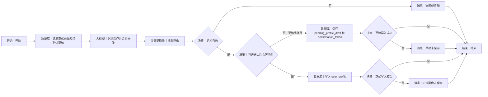

# WF-01 用户建档与画像更新

## 1. 目标与准备

主 Agent 在首次建档、查看/修改画像时调用。输入 `AGENT_USER_INPUT`、`uid`、`session_id`；读取/写入 `user_profile`。输出 `data.profile_json`。能力标签分别保存 `self_reported`、`agent_inferred`、`behavior_verified`；成绩、预算、家庭支持允许跳过并只保存粗粒度区间。

## 2. 最小可运行版（当前画布）

```text
开始 → 大模型（生成待确认画像）→ 结束
```

1. 保留系统“开始”“结束”。从左侧“基础节点”拖入一个“大模型”，放在两者之间，重命名“生成待确认画像”。
2. 将“开始”右侧连接点连到大模型左侧，再把大模型右侧连到“结束”。
3. 开始节点输入选择平台内置 `AGENT_USER_INPUT`；大模型输入映射它。结束节点输出选择大模型的文本结果（字段名以当前编辑器显示为准）。
4. 填入下方“画像生成提示词”。测试后应只得到待确认画像。

**边界：这个 `开始 → 大模型 → 结束` 只是最小版，只证明能生成并展示画像；它没有读取旧画像、明确确认、数据库写入和写入校验，绝不能声称已完成建档或保存。**

## 3. 完整业务版画布与节点

完整画布、节点数量、连线和跨轮确认规则统一见第 7 节。

## 4. 配置与变量映射

| 节点 | 输入 | 配置/分支 | 输出 |
|---|---|---|---|
| 读取已有画像 | `uid` | 条件 `uid=当前 uid, record_key=user_profile` | `old_profile_json`，无记录=`null` |
| 提取合并画像 | 用户原话、旧画像 | 使用下方提示词 | `model_text` |
| 提取画像 JSON | `model_text` | 提取 `action,missing_fields,profile_json,confirmation_text` | 同名变量；解析失败置错误 |
| 校验身份与字段 | `uid`、提取结果 | 身份缺失或 JSON 无效走错误；可跳过字段不算错误 | `valid` |
| 判断用户动作 | `action` | `confirm` 仅限明确确认；`modify/draft` 走展示 | 分支 |
| 写入画像 | `uid`,`profile_json` | 逻辑键 `user_profile`，版本递增 | `write_result` |
| 检查写入结果 | `write_result` | 明确成功标志才成功；否则失败 | `write_succeeded/write_failed` |

如果“消息”不能作为流程输出，降级为“大模型”生成固定回复，或直接在结束节点映射 `reply`。

## 5. 可复制的完整提示词

### 画像生成提示词

```text
你是大学规划教练，只负责生成可编辑画像草稿，不替用户做决定。
用户输入：{{AGENT_USER_INPUT}}
已有画像：{{old_profile_json}}
任务：识别用户是新建、修改还是明确确认；合并年级、学校、专业、成绩/排名区间、预算区间、家庭支持类型、地域流动意愿、科研/项目/竞赛/实习/学生工作，以及学习研究、执行、表达、创造、协作、抗压、风险偏好和价值偏好。
规则：允许跳过敏感项；未知填 null，不猜学校、成绩、预算或经历。能力放入 self_reported、agent_inferred、behavior_verified 三组；没有行为证据不得放入 behavior_verified。只有用户明确表达“确认保存这份画像”等对象和动作都清楚的语句，action 才是 confirm；“好的/继续”不是确认。输出年轻、尊重、无焦虑措辞。
只输出合法 JSON，不要 Markdown：
{"action":"draft|modify|confirm","missing_fields":[],"profile_json":{"basic":{"grade":null,"school":null,"major":null,"academic_range":null,"budget_range":null,"family_support":[],"mobility_preference":null},"experiences":[],"abilities":{"self_reported":[],"agent_inferred":[],"behavior_verified":[]},"preferences":{}},"confirmation_text":"展示给用户的画像、局限和确认/修改方法"}
```

追问节点输入 `missing_fields`，要求一次只问 1～3 个影响最大的非敏感问题，并明确可跳过。保存成功回复必须由成功分支固定生成：“画像已保存，你可以随时查看、更正或删除。”失败固定为：“画像未保存成功，我保留了本轮草稿，请稍后重试。”

## 6. 调试、错误处理与验收清单

- 成功草稿：输入“我是大二计算机专业，排名前 30%，想就业，预算想跳过”。观察 `budget_range=null`、`action=draft`，不写数据库。
- 成功确认：先有草稿，再输入“确认保存这份画像”。观察确认分支、写入成功标志、结束 `status=write_succeeded`。
- 失败：去掉 `uid` 或模拟数据库报错，应为 `missing_user_id/write_failed`，回复不得含“已保存”。非 JSON 只重试一次。
- [ ] 最小版结束输出确实来自大模型文本，且明确未保存。
- [ ] 完整版含旧画像读取、确认/修改、写入和写入结果检查。
- [ ] 输出遵循共享包装，`data.profile_json` 可被 WF-02/WF-04 使用。

主 Agent 默认调用独立发布的 WF-01；平台确认支持嵌套后才用“工作流”节点。下一步通常是 WF-02。

## 7. 完整业务版跨轮确认画布

完整画布包含数据库 3、大模型 1、变量提取器 1、决策 4、消息 3，另加开始和结束各 1。把读取、识别、提取和校验放在开始右侧主线；草稿保存分支放下方，正式写入分支继续向右，失败消息放对应决策下方。按 Mermaid 名称逐个拖入、重命名并连接。

正式版必须同时读取 `user_profile` 和 `pending_profile_draft`。草稿分支用“数据库”保存 `{uid,profile_json,confirmation_token,record_version}` 后，经“决策”检查写入再结束；下一轮确认先读取该草稿，校验令牌对应当前版本，再把**已保存的草稿**写入 `user_profile`，不能从“确认保存”四个字重新生成画像。令牌生成能力以当前编辑器为准；无唯一值能力时降级为 `session_id + record_version`。数据库不可用时用长期记忆键 `uid:pending_profile_draft`。




逐边映射：开始→读取传 `uid`；读取→识别传 `old_profile_json,pending_profile_json,confirmation_token,AGENT_USER_INPUT`；提取→结构决策传 `profile_json,action,token_match`；草稿边传 `profile_json,uid,session_id,record_version`；确认边传 `pending_profile_json,uid`；每个写入→检查传对应 `write_result`。

结束 `result_json`：草稿写入成功为 `{"workflow_id":"WF-01","version":"1.0","status":"awaiting_confirmation","reply":"请核对画像并回复‘确认保存这份画像’或指出修改项。","data":{"profile_json":{{profile_json}},"confirmation_token":"{{confirmation_token}}"},"suggested_writes":[{"record_key":"user_profile","data":{{profile_json}}}],"next_action":"confirm_profile","error":null}`；正式写入成功改为 `status=write_succeeded,next_action=start_simulation,suggested_writes=[]`；失败为 `status=write_failed,error={"code":"write_failed","message":"画像未保存成功","retryable":true}`。

## 数据库与输入输出配置教程

本节的通用点击位置、建表入口、导入按钮和数据库节点输出解释见[数据库从零教程](../database/README.md)；请先完成该教程，再按本节配置当前 WF。

### A. 建表和开始输入

先按[数据库建表教程](../database/README.md)创建 `user_profiles`，上传 [DB-01-user-profiles.xlsx](../database/import-templates/DB-01-user-profiles.xlsx)。系统自带 `id/uid/create_time`，不要重复添加。

| 参数 | 来源 | 独立调试值 |
|---|---|---|
| `AGENT_USER_INPUT` | 点击“开始”节点可见的系统输入 | `我是大一学生，计算机专业，想建立画像。` |
| `uid` | 主 Agent/平台用户标识 | `test_user_001` |

若开始节点不能新增 `uid`，在数据库节点输入区把 `uid` 暂时设为固定字符串；接入主 Agent 后改为引用真实 uid。

### B. 配置“读取正式画像及待确认草稿”

1. 左侧“知识&数据”拖入“数据库”，放在开始右侧并连接。
2. 重命名节点，模式选“自定义SQL”，数据库选 `user_profiles`。
3. 把空的 `input` 参数改名为 `uid`；类型选引用并选择上游 uid，或调试时填固定值。
4. 粘贴：

```sql
SELECT * FROM user_profiles
WHERE uid='{{uid}}'
ORDER BY updated_at DESC LIMIT 1;
```

5. `isSuccess` 交给读取成功决策；`message` 交给失败消息；`outputList` 交给大模型。
6. `isSuccess=true + outputList=[]` 是新用户，旧画像使用 `{}`。

### C. 其余数据库节点

| 节点 | 操作 | 参数 | 成功条件 |
|---|---|---|---|
| 保存 pending 草稿 | `user_profiles` 表单新增/更新 | `uid,pending_profile_json,confirmation_token,pending_status,record_version,updated_at` | `isSuccess=true` |
| 读取 pending | 自定义查询 | `uid,confirmation_token` | 返回同 uid、未过期草稿 |
| 写正式画像 | 表单更新 | `id,profile_json,pending_status=confirmed,record_version,updated_at` | `isSuccess=true` |
| 回读正式画像 | 自定义查询 | `uid,record_version` | 回读 JSON 与写入内容一致 |

读取 pending SQL：

```sql
SELECT * FROM user_profiles
WHERE uid='{{uid}}'
  AND confirmation_token='{{confirmation_token}}'
  AND pending_status='awaiting_confirmation'
ORDER BY updated_at DESC LIMIT 1;
```

### D. 节点输入输出与调试

| 当前节点 | 输入 | 输出/下游 |
|---|---|---|
| 读取画像 | `uid` | `isSuccess,message,outputList` |
| 大模型 | `AGENT_USER_INPUT,outputList` | `output` → 变量提取器 |
| 变量提取器 | 大模型 output | `profile_json,action,confirmation_token` |
| 写入节点 | 校验 JSON、uid、token | `isSuccess,message` → 决策 |
| 结束 | 最后消息/变量存储器的 `result_json` | `output` → 主 Agent |

点击右上“调试”，使用同一 `test_user_001`：首轮生成草稿并确认草稿写入成功；第二轮输入“确认保存这份画像”并使用返回 token；最后到数据库管理页筛选该 uid，检查 `profile_json` 有值且 `pending_status=confirmed`。查询失败与空查询的区别见[通用教程](../database/README.md#8-数据库节点三个输出怎么看)。
