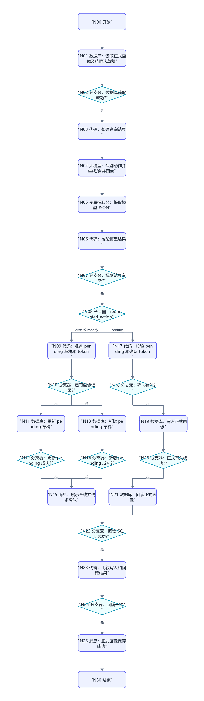
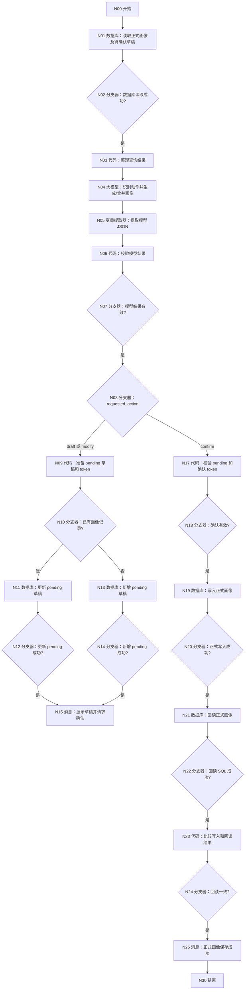

# WF-01 用户建档与画像确认：逐节点搭建教程

这份文件是 WF-01 的唯一配置依据。节点编号、流程图、节点名称和后文配置完全对应，不再使用旧版抽象节点表。

## 1. 本工作流最终完成什么

WF-01 分两轮运行：

```text
第一轮：读取旧画像 → 生成或修改画像草稿 → 保存 pending 草稿 → 请用户确认
第二轮：重新读取 pending 草稿 → 校验用户确认和 token → 写正式画像 → 回读验证
```

只有第二轮回读一致后，才可以返回“画像已保存”。

## 2. 搭建前准备

### 2.1 数据表

在数据库 `university` 中创建数据表 `user_profiles`。字段导入文件：

[DB-01-user-profiles.xlsx](../database/import-templates/DB-01-user-profiles.xlsx)

平台自动字段：

```text
id
uid
create_time
```

业务字段：

```text
profile_json
pending_profile_json
confirmation_token
pending_status
record_version
updated_at
```

### 2.2 重要纠错

错误配置：

```text
数据库参数 uid → 引用 → 开始/AGENT_USER_INPUT
```

`AGENT_USER_INPUT` 是用户说的话，不是用户 ID。必须在开始节点单独增加 `uid`。

### 2.3 “决策”和“分支器”不要混用

本平台的“决策”是大模型意图分类节点。它的右侧配置页包含：

```text
模型
输入 / Query
意图名称
意图描述
默认意图
输出 / class_name
```

它适合判断一句自然语言属于哪个意图，例如把“确认保存”分类为 `confirm`，但不适合判断数据库返回的 Boolean。

WF-01 已经通过变量提取器和代码节点得到明确字段，例如 `isSuccess`、`valid`、`has_record`，所以全部使用“分支器”进行确定性条件判断，不使用“决策”。

如果画布上的 N02 已经拖成“决策”，请删除它，然后从左侧“逻辑”分类重新拖入“分支器”，重命名为 `N02 分支器：数据库读取成功?`。

## 3. 主流程画布和节点编号





为防止大量结束回线在图片中交叉，主图只画 `draft/modify` 与 `confirm` 两条正常路径。N15 和 N25 显示消息后都连接 N30。其他出口严格按下表连接：

| 来源 | 失败条件 | 去向 |
|---|---|---|
| N02 | `isSuccess=false` | N28 → N30 |
| N07 | `valid=false` | N29 → N30 |
| N12、N14 | `isSuccess=false` | N16 → N30 |
| N18 | `confirmation_valid=false` | N27 → N30 |
| N20、N22、N24 | 判断为失败 | N26 → N30 |
| N08 | `requested_action=cancel` | N27 → N30 |

## 4. 先按编号拖入节点

从左侧节点栏拖入：

| 类型 | 数量 | 对应编号 |
|---|---:|---|
| 开始 | 系统自带 | N00 |
| 数据库 | 5 | N01、N11、N13、N19、N21 |
| 大模型 | 1 | N04 |
| 变量提取器 | 1 | N05 |
| 代码 | 5 | N03、N06、N09、N17、N23 |
| 决策 | 0 | WF-01 不使用大模型意图分类节点 |
| 分支器 | 10 | N02、N07、N08、N10、N12、N14、N18、N20、N22、N24 |
| 消息 | 7 | N15、N16、N25、N26、N27、N28、N29 |
| 结束 | 系统自带 | N30 |

先重命名所有节点，再按第 3 节流程图连线。不要一边配置一边临时改变节点名称。

## 5. N00 开始：输入必须这样设置

点击画布中的“开始”，在右侧“输入”区域保留系统变量并点击“+ 添加”。

| 变量名 | 变量类型 | 描述 | 是否必要 |
|---|---|---|---|
| `AGENT_USER_INPUT` | String | 用户本轮对话输入；系统自带 | 是 |
| `uid` | String | 平台当前用户唯一标识 | 是 |
| `confirmation_token` | String | 上一轮 WF-01 返回的确认令牌；第一轮为空 | 否 |

独立调试时填写：

```text
uid = test_user_001
```

正式由主 Agent 调用时，主 Agent 必须把真实 uid 传入，不能继续使用测试值。

N00 输出：

```text
AGENT_USER_INPUT
uid
confirmation_token
```

## 6. N01 数据库：读取正式画像及待确认草稿

### 6.1 画布位置

```text
N00 开始 → N01 数据库 → N02 分支器
```

### 6.2 右侧配置

| 配置项 | 填写内容 |
|---|---|
| 模式 | 自定义SQL |
| 选择数据库 | `university` |
| 节点名称 | `N01 读取正式画像及待确认草稿` |

输入区添加：

| 参数名 | 类型 | 值 |
|---|---|---|
| `uid` | 引用 | `N00 开始 / uid` |

不要选择 `N00 / AGENT_USER_INPUT`。

SQL：

```sql
SELECT
  id,
  uid,
  profile_json,
  pending_profile_json,
  confirmation_token,
  pending_status,
  record_version,
  updated_at
FROM user_profiles
WHERE uid = '{{uid}}'
ORDER BY updated_at DESC, create_time DESC
LIMIT 1;
```

平台输出：

```text
N01.isSuccess
N01.message
N01.outputList
```

## 7. N02 分支器：数据库读取成功？

点击 N02，在条件左值选择：

```text
N01 / isSuccess
```

| 分支 | 条件 | 连接 |
|---|---|---|
| 是 | 等于 `true` | N03 |
| 否 | 等于 `false` | N28 |

`isSuccess=true` 且 `outputList=[]` 不是失败，而是新用户。

## 8. N03 代码：整理查询结果

输入：

| 参数 | 引用 |
|---|---|
| `outputList` | `N01 / outputList` |

代码：

```javascript
const rows = Array.isArray(outputList) ? outputList : [];
const row = rows.length > 0 ? rows[0] : null;

return {
  has_record: !!row,
  record_id: row ? row.id : null,
  old_profile_json: row?.profile_json || "{}",
  pending_profile_json: row?.pending_profile_json || "{}",
  stored_confirmation_token: row?.confirmation_token || "",
  pending_status: row?.pending_status || "none",
  record_version: Number(row?.record_version || 0)
};
```

输出必须添加：

```text
has_record Boolean
record_id Integer
old_profile_json String
pending_profile_json String
stored_confirmation_token String
pending_status String
record_version Integer
```

## 9. N04 大模型：识别动作并生成/合并画像

模型输入引用：

```text
N00.AGENT_USER_INPUT
N00.confirmation_token
N03.old_profile_json
N03.pending_profile_json
N03.pending_status
```

提示词：

```text
你是“大学人生规划模拟器”的用户建档助手。

用户本轮输入：{{AGENT_USER_INPUT}}
已确认画像：{{old_profile_json}}
待确认画像：{{pending_profile_json}}
待确认状态：{{pending_status}}

判断 requested_action：
- 用户首次提供资料或要求重新生成：draft
- 用户指出画像修改内容：modify
- 用户明确表示确认保存：confirm
- 用户表示取消：cancel

规则：
1. confirm 时不得重新生成画像，只返回待确认画像。
2. draft/modify 时合并用户明确提供的信息；不得虚构。
3. 缺失内容使用“待补充”。
4. 区分明确陈述和推断。
5. 家庭、经济和成绩只使用区间或标签。
6. 只输出 JSON。

输出：
{
  "requested_action": "draft|modify|confirm|cancel",
  "profile_json": {
    "nickname": "",
    "grade": "",
    "school": "",
    "major": "",
    "gpa_level": "",
    "budget_level": "",
    "family_support": [],
    "location_preference": [],
    "experiences": [],
    "abilities": {
      "research": "",
      "execution": "",
      "communication": "",
      "creativity": "",
      "collaboration": "",
      "resilience": ""
    },
    "risk_preference": "",
    "value_preferences": [],
    "missing_fields": [],
    "inferred_fields": [],
    "profile_card": ""
  },
  "reply": ""
}
```

N04 输出：`output`，连接 N05。

## 10. N05 变量提取器：提取模型 JSON

输入选择：

```text
N04 / output
```

提取变量：

| 变量 | 类型 |
|---|---|
| `requested_action` | String |
| `profile_json` | String；如果支持 Object 可用 Object |
| `reply` | String |

解析失败时，N05 的失败信息要传给 N06，不得进入数据库写入。

## 11. N06 代码和 N07 分支器：校验模型结果

N06 输入：

```text
requested_action = N05.requested_action
profile_json = N05.profile_json
```

代码：

```javascript
const allowed = ["draft", "modify", "confirm", "cancel"];
let profile = profile_json;
try {
  if (typeof profile === "string") profile = JSON.parse(profile);
} catch (error) {
  return { valid: false, error: "profile_json_invalid", profile_json_string: "" };
}

const valid = allowed.includes(requested_action) && profile && typeof profile === "object";
return {
  valid,
  error: valid ? "" : "required_field_missing",
  profile_json_string: valid ? JSON.stringify(profile) : ""
};
```

N07 条件：

```text
N06.valid == true → N08
N06.valid == false → N29
```

## 12. N08 分支器：根据 requested_action 分流

`draft`、`modify`、`confirm`、`cancel` 不是平台预置的“选择条件”，而是变量 `requested_action` 可能得到的四个字符串值。每一条都要由你点击“+ 添加分支”后手动配置。

### 12.1 第一条分支：draft

| 页面字段 | 填写或选择 |
|---|---|
| 引用变量 | `N05 / requested_action` |
| 选择条件 | 等于 |
| 比较类型 | 常量/固定值，不要选择“引用” |
| 比较值 | `draft` |
| 连线去向 | N09 |

### 12.2 第二条分支：modify

| 页面字段 | 填写或选择 |
|---|---|
| 引用变量 | `N05 / requested_action` |
| 选择条件 | 等于 |
| 比较类型 | 常量/固定值 |
| 比较值 | `modify` |
| 连线去向 | N09 |

### 12.3 第三条分支：confirm

| 页面字段 | 填写或选择 |
|---|---|
| 引用变量 | `N05 / requested_action` |
| 选择条件 | 等于 |
| 比较类型 | 常量/固定值 |
| 比较值 | `confirm` |
| 连线去向 | N17 |

### 12.4 第四条分支：cancel

| 页面字段 | 填写或选择 |
|---|---|
| 引用变量 | `N05 / requested_action` |
| 选择条件 | 等于 |
| 比较类型 | 常量/固定值 |
| 比较值 | `cancel` |
| 连线去向 | N27 |

默认分支连接 N29，用来拦截模型输出了四个允许值以外的内容。

正确逻辑必须读成：

```text
N08 requested_action=draft  ──→ N09
N08 requested_action=modify ──→ N09
N08 requested_action=confirm ──→ N17
N08 requested_action=cancel  ──→ N27

N09 之后只能进入 N10，不存在 N09 → cancel。
N10 has_record=true  ──→ N11 更新已有记录
N10 has_record=false ──→ N13 新增记录
```

## 13. N09 代码：准备 pending 草稿和 token

输入：

```text
profile_json_string = N06.profile_json_string
```

代码：

```javascript
const token = `profile_${Date.now()}_${Math.random().toString(36).slice(2, 10)}`;
return {
  pending_profile_json: profile_json_string,
  new_confirmation_token: token,
  pending_status: "awaiting_confirmation",
  updated_at: new Date().toISOString()
};
```

输出：四个同名变量。

## 14. N10 分支器：已有画像记录？

条件左值：

```text
N03 / has_record
```

```text
true → N11 更新 pending
false → N13 新增 pending
```

## 15. N11 数据库：更新 pending 草稿

```text
模式：表单处理数据
数据库：university
数据表：user_profiles
操作：修改/更新数据
```

筛选条件：

```text
id = N03.record_id
uid = N00.uid
```

字段映射：

| 表字段 | 引用 |
|---|---|
| `pending_profile_json` | N09.pending_profile_json |
| `confirmation_token` | N09.new_confirmation_token |
| `pending_status` | N09.pending_status |
| `record_version` | N03.record_version；不在草稿阶段增加 |
| `updated_at` | N09.updated_at |

N12 判断 `N11.isSuccess`：true → N15；false → N16。

## 16. N13 数据库：新增 pending 草稿

```text
模式：表单处理数据
数据库：university
数据表：user_profiles
操作：新增数据
```

平台自动写入 `uid` 时，不要在字段映射里重复写 uid；如果表单明确要求 uid，则引用 `N00.uid`。

| 表字段 | 引用/固定值 |
|---|---|
| `pending_profile_json` | N09.pending_profile_json |
| `confirmation_token` | N09.new_confirmation_token |
| `pending_status` | N09.pending_status |
| `profile_json` | 固定 `{}` |
| `record_version` | 固定 `0` |
| `updated_at` | N09.updated_at |

N14 判断 `N13.isSuccess`：true → N15；false → N16。

## 17. N15/N16：草稿结果消息

N15 输入：

```text
profile_json = N09.pending_profile_json
confirmation_token = N09.new_confirmation_token
```

N15 固定输出：

```json
{
  "workflow_id": "WF-01",
  "status": "awaiting_confirmation",
  "reply": "画像草稿已保存，请确认或指出修改内容。",
  "data": {
    "profile_json": "{{pending_profile_json}}",
    "confirmation_token": "{{new_confirmation_token}}"
  },
  "next_action": "confirm_profile",
  "error": null
}
```

N16 固定输出 `status=write_failed`，明确“草稿未保存，请重试”，然后连接 N30。

## 18. N17/N18：确认轮安全校验

N17 输入：

```text
incoming_token = N00.confirmation_token
stored_token = N03.stored_confirmation_token
pending_status = N03.pending_status
pending_profile_json = N03.pending_profile_json
has_record = N03.has_record
record_version = N03.record_version
```

代码：

```javascript
const valid = Boolean(has_record)
  && pending_status === "awaiting_confirmation"
  && Boolean(incoming_token)
  && incoming_token === stored_token
  && pending_profile_json
  && pending_profile_json !== "{}";

return {
  confirmation_valid: valid,
  next_record_version: Number(record_version || 0) + 1
};
```

N17 输出：`confirmation_valid`（Boolean）和 `next_record_version`（Integer）。

N18：

```text
N17.confirmation_valid == true → N19
false → N27
```

## 19. N19 数据库：写入正式画像

```text
模式：表单处理数据
数据库：university
数据表：user_profiles
操作：修改/更新数据
```

条件：

```text
id = N03.record_id
uid = N00.uid
confirmation_token = N03.stored_confirmation_token
```

字段：

| 表字段 | 值 |
|---|---|
| `profile_json` | N03.pending_profile_json |
| `pending_profile_json` | `{}` |
| `confirmation_token` | 空字符串 |
| `pending_status` | `confirmed` |
| `record_version` | N17.next_record_version |
| `updated_at` | 当前时间 |

N20 判断 `N19.isSuccess`：true → N21；false → N26。

## 20. N21 数据库：回读正式画像

模式：自定义SQL；数据库：`university`。

输入：

```text
uid = N00.uid
record_id = N03.record_id
```

SQL：

```sql
SELECT id, uid, profile_json, pending_status, record_version
FROM user_profiles
WHERE uid='{{uid}}' AND id={{record_id}}
LIMIT 1;
```

N22：`N21.isSuccess=true` → N23；false → N26。

## 21. N23/N24：比较回读结果

N23 输入：

```text
expected_profile_json = N03.pending_profile_json
outputList = N21.outputList
```

代码：

```javascript
const row = Array.isArray(outputList) && outputList.length ? outputList[0] : null;
const normalize = value => {
  try { return JSON.stringify(typeof value === "string" ? JSON.parse(value) : value); }
  catch { return ""; }
};
return {
  readback_consistent: Boolean(row)
    && row.pending_status === "confirmed"
    && normalize(row.profile_json) === normalize(expected_profile_json)
};
```

N24：true → N25；false → N26。

## 22. N25～N30：消息和结束

| 编号 | 内容 | status |
|---|---|---|
| N25 | 正式画像保存并回读成功 | `write_succeeded` |
| N26 | 正式写入或回读失败，不能声称保存 | `write_failed` |
| N27 | token 不匹配、草稿过期或用户取消 | `validation_failed` 或 `cancelled` |
| N28 | 数据库读取失败，附 N01.message | `read_failed` |
| N29 | 模型 JSON 无效 | `validation_failed` |

所有消息连接 N30。N30 的 `output` 引用对应消息节点输出的完整 `result_json`。

## 23. 按顺序调试

### 测试 1：新用户首轮

```text
AGENT_USER_INPUT = 我是大一学生，计算机专业，想建立画像
uid = test_user_001
confirmation_token = 空
```

预期：N01 成功空数组 → N10 无记录 → N13 新增 → N15 → `awaiting_confirmation`。

### 测试 2：确认轮

复制测试 1 返回的 token：

```text
AGENT_USER_INPUT = 确认保存这份画像
uid = test_user_001
confirmation_token = 上一轮 token
```

预期：N01 读到 pending → N17 校验成功 → N19 写入 → N21 回读 → N25。

### 测试 3：错误 token

```text
confirmation_token = wrong-token
```

预期：N18 → N27，不写正式画像。

### 测试 4：数据库读取失败

临时把 N01 表名改错。预期 N02 → N28。测试后恢复 `user_profiles`。

## 24. 验收清单

- [ ] N00 有 `AGENT_USER_INPUT`、`uid`、可选 `confirmation_token`。
- [ ] N01 的 uid 引用 N00.uid，而不是 AGENT_USER_INPUT。
- [ ] 5 个数据库节点都能在流程图和本教程找到同编号配置。
- [ ] 每个分支器明确写了判断变量、条件和去向。
- [ ] 草稿只有写入成功后才展示 token。
- [ ] confirm 不重新生成画像，只读取已保存 pending。
- [ ] 正式写入后必须回读一致。
- [ ] 任一数据库失败都不会声称保存成功。
