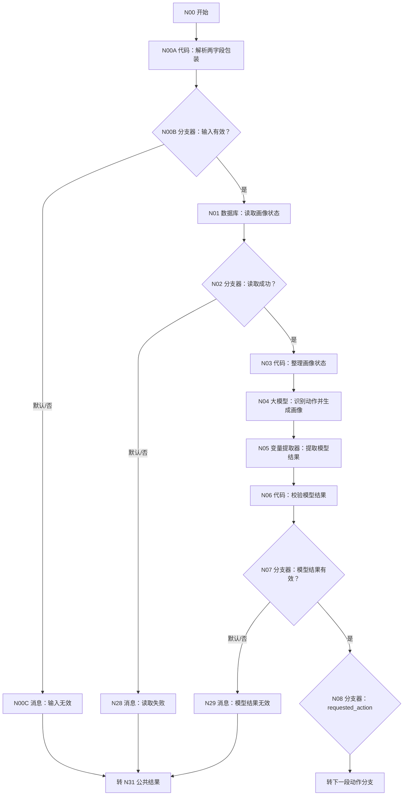
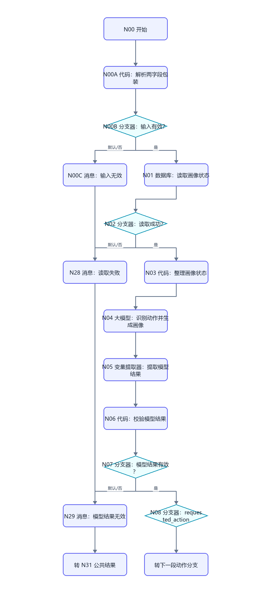
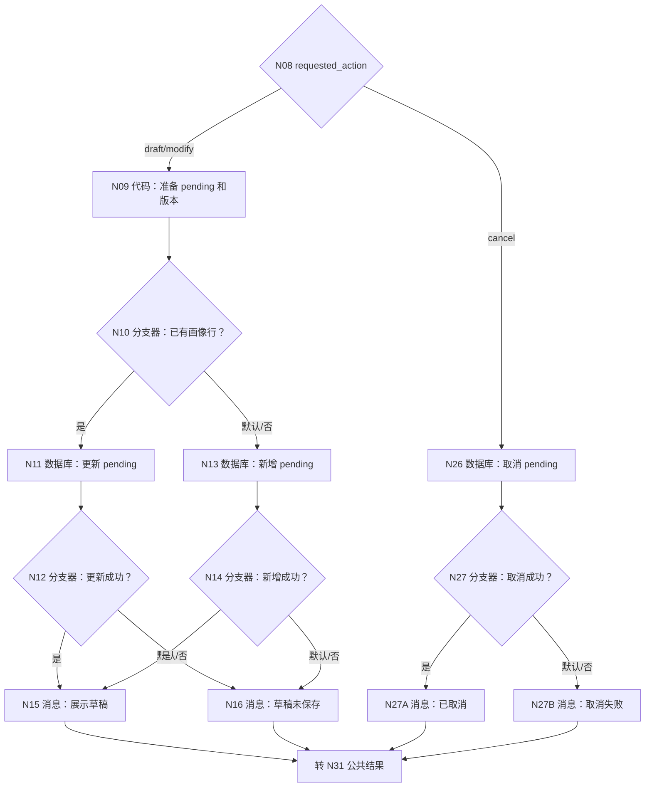
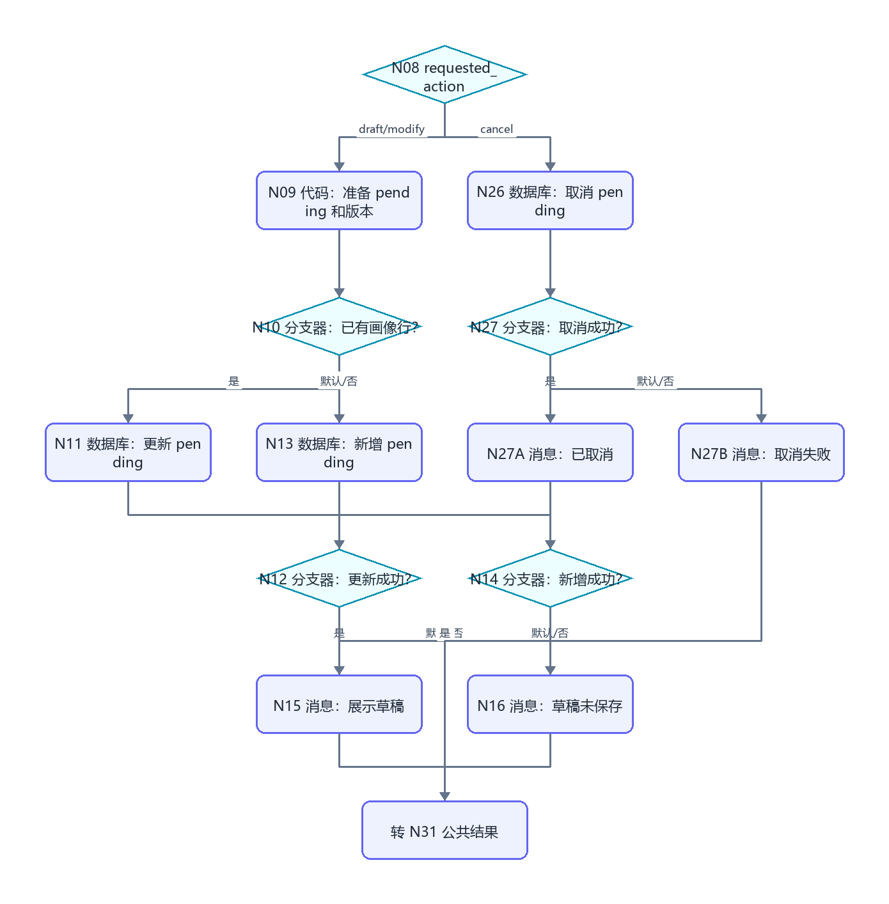
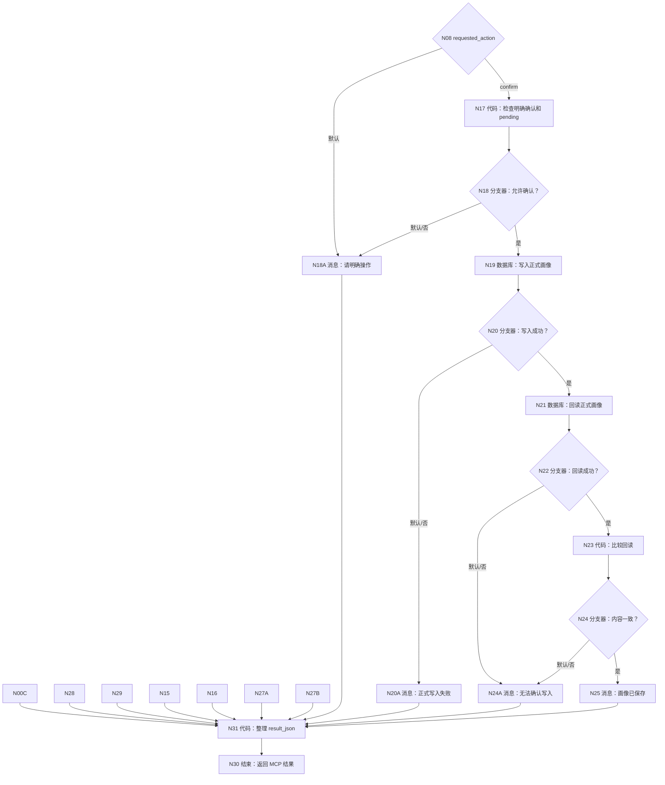
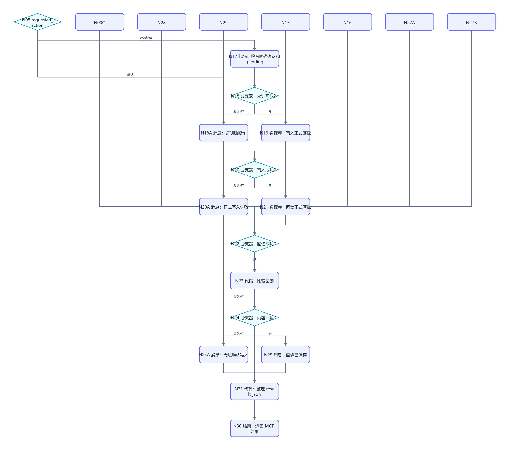

# WF-01 用户建档与画像确认：逐节点搭建指南

<!-- AGENT-CONTRACT
start_inputs: AGENT_USER_INPUT:String
extractor_input_count: 1
result_output: result_json:String
-->

> 本版保留已搭建的 `draft → modify → confirm/cancel` 核心状态机。只修改发布为内部 MCP 所必需的入口、数据库身份/版本、确认方式、终态结果和失败出口。用户不再输入 JSON、时间或确认令牌。

## 1. 业务目标和边界

WF-01 负责：

- 从自然语言生成结构化画像草稿；
- 基于已有 pending 草稿继续修改；
- 明确确认后写入正式画像并回读；
- 明确取消后把 pending 状态改为 cancelled；
- 区分用户自述、Agent 推断和缺失信息。

WF-01 不负责路径推荐、主规划或任务。返回 `awaiting_confirmation` 时 MAIN 必须停止其他工具调用，等用户下一轮确认或修改。

## 2. 已搭旧画布只改这些地方

| 位置 | 保留 | 修改 |
|---|---|---|
| N00 | 开始节点 | 删除额外输入，只留 `AGENT_USER_INPUT:String` |
| N00A～N00C | 单参数门禁 | 包装字段改成 `user_key/user_input`，删除时间和外部 token |
| N01/N03 | 读取/整理画像 | SQL 和代码使用 `user_key`、`record_version/create_time` |
| N04～N08 | 模型、提取、校验、动作分流 | 核心提示和路由保留；模糊确认输出 `needs_input` |
| N09～N16 | pending 草稿 | 删除时间/令牌；版本号由当前记录 +1 |
| N17～N25 | 正式确认和回读 | 只按最新 pending + 明确确认；更新范围含 user_key/id/status |
| N26～N29 | 取消和错误 | 每条默认/失败路线仍保留 |
| N30 | 结束 | 不再返回 `workflow_finished`，改为引用 N31/result_json |
| N31 | 无 | 新增公共 MCP 结果代码节点，所有终态先连 N31 |

核心 N01～N25 不需要推倒重搭；按本表逐项修改即可。

## 3. 数据表准备

数据库：`university`。数据表：`user_profiles`。使用 [DB-01 模板](../database/import-templates/DB-01-user-profiles.xlsx)。

业务字段必须正好为：

| 字段 | 类型 | 说明 |
|---|---|---|
| `user_key` | String | MAIN 生成的会话级业务用户键 |
| `profile_json` | String | 正式画像 |
| `pending_profile_json` | String | 待确认草稿 |
| `pending_status` | String | none/awaiting_confirmation/confirmed/cancelled |
| `record_version` | Integer | 当前版本 |
| `source_workflow` | String | 固定 WF-01 |

平台自动 `id/uid/create_time` 保留；业务 SQL 不使用自动 `uid`。

## 4. 三段画布

### 4.1 入口、读取和动作识别





### 4.2 草稿、修改和取消





### 4.3 确认、回读和公共结束





## 5. N00～N00C：单参数入口

### 5.1 N00 开始

右侧输入只有：

| 参数名 | 类型 | 必要 | 描述 |
|---|---|---:|---|
| `AGENT_USER_INPUT` | String | 是 | MAIN 传入的两字段扁平 JSON String |

不要新增其他变量。MAIN 内部传值形态：

```json
{"user_key":"uk_0123456789abcdef0123456789abcdef","user_input":"我是大一计算机学生，想建立画像"}
```

### 5.2 N00A 代码：解析两字段包装

输入：`raw_input｜引用｜N00/AGENT_USER_INPUT`。

```python
def skip_spaces(text, index):
    while index < len(text) and text[index] in " \t\r\n":
        index += 1
    return index


def parse_json_string(text, index):
    if index >= len(text) or text[index] != '"':
        raise ValueError("JSON 的键和值必须使用双引号")
    index += 1
    chars = []
    escapes = {'"': '"', '\\': '\\', '/': '/', 'b': '\b', 'f': '\f', 'n': '\n', 'r': '\r', 't': '\t'}
    while index < len(text):
        char = text[index]
        if char == '"':
            return "".join(chars), index + 1
        if char == '\\':
            index += 1
            if index >= len(text):
                raise ValueError("JSON 转义不完整")
            escaped = text[index]
            if escaped == 'u':
                code = text[index + 1:index + 5]
                if len(code) != 4:
                    raise ValueError("Unicode 转义不完整")
                try:
                    chars.append(chr(int(code, 16)))
                except:
                    raise ValueError("Unicode 转义无效")
                index += 5
                continue
            if escaped not in escapes:
                raise ValueError("JSON 包含不支持的转义")
            chars.append(escapes[escaped])
            index += 1
            continue
        if ord(char) < 32:
            raise ValueError("JSON 字符串包含控制字符")
        chars.append(char)
        index += 1
    raise ValueError("JSON 字符串缺少结束双引号")


def parse_flat_object(raw_input):
    if not isinstance(raw_input, str) or not raw_input.strip():
        raise ValueError("AGENT_USER_INPUT 不能为空")
    text = raw_input
    index = skip_spaces(text, 0)
    if index >= len(text) or text[index] != '{':
        raise ValueError("顶层必须是 JSON 对象")
    index = skip_spaces(text, index + 1)
    result = {}
    while index < len(text) and text[index] != '}':
        key, index = parse_json_string(text, index)
        index = skip_spaces(text, index)
        if index >= len(text) or text[index] != ':':
            raise ValueError("JSON 键后缺少冒号")
        index = skip_spaces(text, index + 1)
        value, index = parse_json_string(text, index)
        result[key] = value
        index = skip_spaces(text, index)
        if index < len(text) and text[index] == ',':
            index = skip_spaces(text, index + 1)
        elif index < len(text) and text[index] != '}':
            raise ValueError("JSON 字段之间缺少逗号")
    if index >= len(text) or text[index] != '}':
        raise ValueError("JSON 对象缺少结束花括号")
    index = skip_spaces(text, index + 1)
    if index != len(text):
        raise ValueError("JSON 对象结束后还有内容")
    return result


def main(raw_input):
    user_key = ""
    user_input = ""
    error = ""
    try:
        payload = parse_flat_object(raw_input)
        if set(payload.keys()) != {"user_key", "user_input"}:
            raise ValueError("包装只能包含 user_key 和 user_input")
        user_key = str(payload.get("user_key", "")).strip()
        user_input = str(payload.get("user_input", "")).strip()
        suffix = user_key[3:] if user_key.startswith("uk_") else ""
        if len(suffix) != 32 or not all(ch in "0123456789abcdef" for ch in suffix):
            raise ValueError("user_key 格式无效")
        if not user_input:
            raise ValueError("user_input 不能为空")
        if len(user_input) > 4000:
            raise ValueError("user_input 不能超过 4000 字")
    except Exception as exc:
        error = str(exc) if str(exc) else "单参数解析失败"
    return {
        "user_key": user_key if not error else "",
        "user_input": user_input if not error else "",
        "input_valid": error == "",
        "input_error": error,
    }
```

输出区：

| 参数名 | 类型 | 描述 |
|---|---|---|
| `user_key` | String | 已验证业务用户键 |
| `user_input` | String | 用户本轮自然语言 |
| `input_valid` | Boolean | 包装是否有效 |
| `input_error` | String | 无效原因 |

### 5.3 N00B/N00C

N00B 引用 `N00A/input_valid`，等于固定值 `true`：是 → N01，默认/否 → N00C。

N00C 消息输入 `error=N00A/input_error`，内容：

```text
内部调用参数无效，本轮没有读取或写入画像。{{error}}
```

N00C 连接 N31。

## 6. N01～N03：读取并整理画像状态

### 6.1 N01 数据库

- 模式：自定义SQL。
- 数据库：`university`。
- 输入：`user_key｜引用｜N00A/user_key`。

```sql
SELECT id, user_key, profile_json, pending_profile_json,
       pending_status, record_version, create_time
FROM user_profiles
WHERE user_key='{{user_key}}'
ORDER BY record_version DESC, create_time DESC
LIMIT 1;
```

N02：`N01/isSuccess == true` → N03；默认/否 → N28。

### 6.2 N03 代码

输入：`outputList=N01/outputList`。

```python
def main(outputList):
    rows = outputList if isinstance(outputList, list) else []
    row = rows[0] if rows and isinstance(rows[0], dict) else {}
    try:
        version = int(row.get("record_version", 0))
    except:
        version = 0
    pending = str(row.get("pending_profile_json", "")).strip()
    formal = str(row.get("profile_json", "")).strip()
    status = str(row.get("pending_status", "none")).strip()
    return {
        "has_record": bool(row),
        "record_id": int(row.get("id", 0)) if str(row.get("id", "0")).isdigit() else 0,
        "formal_profile_json": formal if formal else "{}",
        "pending_profile_json": pending if pending else "{}",
        "pending_status": status,
        "has_pending": status == "awaiting_confirmation" and len(pending) > 2,
        "current_version": version,
        "next_version": version + 1,
    }
```

输出逐行声明 `has_record:Boolean`、`record_id:Integer`、`formal_profile_json:String`、`pending_profile_json:String`、`pending_status:String`、`has_pending:Boolean`、`current_version:Integer`、`next_version:Integer`。

## 7. N04 大模型：识别动作并生成/合并画像

模型 `Spark4.0 Ultra`，关闭对话历史。输入：

| 参数名 | 引用值 |
|---|---|
| `user_input` | N00A/user_input |
| `formal_profile_json` | N03/formal_profile_json |
| `pending_profile_json` | N03/pending_profile_json |
| `has_pending` | N03/has_pending |

系统提示词：

```text
你是大学人生规划画像教练。识别用户本轮动作：draft、modify、confirm、cancel 或 unclear。
draft：没有 pending，用户提供建档事实。
modify：有 pending，用户明确补充或修改字段。
confirm：用户明确说“确认保存这份画像”或同义且对象清楚。
cancel：用户明确取消当前画像草稿。
unclear：只说“好/继续/可以”等，或缺少建档事实。

画像只使用用户原话中的事实；推断放 agent_inferred，不能混入 self_reported。保留 nickname、grade、school、major、gpa_level、budget_level、experiences、abilities、risk_preference、value_preferences、missing_fields、self_reported、agent_inferred、profile_card。
modify 必须在已有 pending 基础上合并，不丢失未被用户修改的字段。
confirm/cancel 不改写 pending 内容。
只输出 JSON：
{"requested_action":"draft|modify|confirm|cancel|unclear","profile_json":{},"structure_complete":true,"reply":"","reason":""}
```

用户提示词：

```text
用户本轮原话：{{user_input}}
正式画像：{{formal_profile_json}}
待确认草稿：{{pending_profile_json}}
当前是否有 pending：{{has_pending}}
```

输出 `output:String`。

## 8. N05/N06/N07：单输入提取和校验

N05 只有：

```text
input｜引用｜N04/output
```

输出：

| 参数名 | 类型 | 描述 |
|---|---|---|
| `requested_action` | String | draft/modify/confirm/cancel/unclear |
| `profile_json` | String | 完整画像 JSON；确认/取消可为 `{}` |
| `structure_complete` | Boolean | 模型结构是否完整 |
| `reply` | String | 给用户的草稿/说明 |
| `reason` | String | unclear 或失败原因 |

N06 输入上述五项：

```python
def main(requested_action, profile_json, structure_complete, reply, reason):
    action = str(requested_action).strip().lower()
    allowed = ["draft", "modify", "confirm", "cancel", "unclear"]
    profile = str(profile_json).strip() if profile_json is not None else "{}"
    needs_profile = action in ["draft", "modify"]
    profile_valid = profile.startswith("{") and profile.endswith("}") and len(profile) > 2
    errors = []
    if action not in allowed:
        errors.append("requested_action 无效")
    if structure_complete is not True:
        errors.append("模型结构不完整")
    if needs_profile and not profile_valid:
        errors.append("画像 JSON 无效")
    return {
        "model_valid": len(errors) == 0,
        "validation_error": ";".join(errors),
        "requested_action": action if action in allowed else "unclear",
        "profile_json": profile if profile_valid else "{}",
        "reply": str(reply).strip(),
        "reason": str(reason).strip(),
    }
```

输出 `model_valid:Boolean`、`validation_error:String`、`requested_action:String`、`profile_json:String`、`reply:String`、`reason:String`。

N07：`model_valid == true` → N08；默认/否 → N29。

## 9. N08 动作分支器

按 `N06/requested_action` 配置五条：

| 常量 | 下游 |
|---|---|
| `draft` | N09 |
| `modify` | N09 |
| `confirm` | N17 |
| `cancel` | N26 |
| 默认 | N18A |

这是枚举判断，必须使用分支器，不用模型决策节点。

## 10. N09～N16：保存画像草稿

### 10.1 N09 代码

输入 `user_key=N00A/user_key`、`profile_json=N06/profile_json`、`has_record=N03/has_record`、`record_id=N03/record_id`、`next_version=N03/next_version`、`reply=N06/reply`。

```python
def main(user_key, profile_json, has_record, record_id, next_version, reply):
    version = int(next_version) if str(next_version).isdigit() else 1
    profile = str(profile_json).strip()
    valid = bool(user_key) and profile.startswith("{") and profile.endswith("}") and len(profile) > 2
    return {
        "row_valid": valid,
        "user_key": str(user_key),
        "record_id": int(record_id) if str(record_id).isdigit() else 0,
        "has_record": has_record is True,
        "pending_profile_json": profile if valid else "{}",
        "pending_status": "awaiting_confirmation",
        "record_version": version,
        "source_workflow": "WF-01",
        "display_reply": str(reply).strip(),
    }
```

输出区声明全部九个返回键，类型依次 Boolean/String/Integer/Boolean/String/String/Integer/String/String。

N10：`N09/has_record == true` → N11；默认/否 → N13。

### 10.2 N11 更新现有行

模式“表单处理数据”→ `university/user_profiles`→更新数据。

范围（AND）：

| 字段 | 条件 | 值 |
|---|---|---|
| `user_key` | 等于引用 | N09/user_key |
| `id` | 等于引用 | N09/record_id |

更新：`pending_profile_json=N09/pending_profile_json`、`pending_status=N09/pending_status`、`record_version=N09/record_version`、`source_workflow=N09/source_workflow`。

N12：`N11/isSuccess == true` → N15；默认/否 → N16。

### 10.3 N13 新增首行

新增字段：`user_key`、`profile_json` 固定 `{}`、`pending_profile_json`、`pending_status`、`record_version`、`source_workflow`，其他值引用 N09。

N14：`N13/isSuccess == true` → N15；默认/否 → N16。

N15 消息引用 `reply=N09/display_reply`：

```text
{{reply}}

这只是待确认草稿。你可以直接说明要修改什么，或回复：确认保存这份画像。
```

N16 内容：`画像草稿已经生成，但数据库没有保存，因此本轮不进入确认。请稍后重试。`

## 11. N17～N25：明确确认和回读

### 11.1 N17 代码

输入 `requested_action=N06/requested_action`、`has_pending=N03/has_pending`、`pending_profile_json=N03/pending_profile_json`。

```python
def main(requested_action, has_pending, pending_profile_json):
    pending = str(pending_profile_json).strip()
    allowed = str(requested_action).strip() == "confirm" and has_pending is True and len(pending) > 2
    return {
        "confirm_allowed": allowed,
        "formal_profile_json": pending if allowed else "{}",
        "confirm_reason": "" if allowed else "当前没有可确认的画像草稿，或确认表达不够明确。",
    }
```

输出 `confirm_allowed:Boolean`、`formal_profile_json:String`、`confirm_reason:String`。

N18：`confirm_allowed == true` → N19；默认/否 → N18A。

### 11.2 N19 更新正式画像

范围（AND）：

- `user_key` 等于引用 N00A/user_key。
- `id` 等于引用 N03/record_id。
- `pending_status` 等于固定 `awaiting_confirmation`。

更新：

- `profile_json=N17/formal_profile_json`。
- `pending_profile_json` 固定 `{}`。
- `pending_status` 固定 `confirmed`。
- `record_version=N03/next_version`。

N20：`N19/isSuccess == true` → N21；默认/否 → N20A。

### 11.3 N21 回读

输入 `user_key=N00A/user_key`：

```sql
SELECT id, user_key, profile_json, pending_status,
       record_version, create_time
FROM user_profiles
WHERE user_key='{{user_key}}'
  AND pending_status='confirmed'
ORDER BY record_version DESC, create_time DESC
LIMIT 1;
```

N22：`N21/isSuccess == true` → N23；默认/否 → N24A。

N23 输入 `expected=N17/formal_profile_json`、`expected_version=N03/next_version`、`outputList=N21/outputList`：

```python
def main(expected, expected_version, outputList):
    rows = outputList if isinstance(outputList, list) else []
    row = rows[0] if rows and isinstance(rows[0], dict) else {}
    stored = str(row.get("profile_json", "")).strip()
    version = int(row.get("record_version", 0)) if str(row.get("record_version", "0")).isdigit() else 0
    target_version = int(expected_version) if str(expected_version).isdigit() else 0
    matches = bool(row) and stored == str(expected).strip() and version == target_version
    return {"readback_matches": matches, "stored_profile_json": stored, "stored_version": version}
```

N24：`readback_matches == true` → N25；默认/否 → N24A。

消息：

- N18A：`当前没有可确认草稿，或你的表达不够明确。请先生成草稿，或明确回复：确认保存这份画像。`
- N20A：`收到了明确确认，但正式画像没有写入，本轮不能声称保存成功。`
- N24A：`数据库写入后未能证明回读一致，请稍后重试；不要重复建立新画像。`
- N25：`画像已经正式保存并完成回读。接下来可以体验虚拟大学或大学生存大冒险。`

## 12. N26/N27：取消 pending

N26 更新 `user_profiles`：范围 `user_key=N00A/user_key AND id=N03/record_id AND pending_status='awaiting_confirmation'`；更新 `pending_profile_json={}`、`pending_status=cancelled`、`record_version=N03/next_version`。

N27：`N26/isSuccess == true` → N27A；默认/否 → N27B。

- N27A：`当前画像草稿已取消，没有改动正式画像。`
- N27B：`取消操作没有成功，正式画像未改动；请稍后重试。`

## 13. N28/N29：读取和模型失败

- N28 输入 `message=N01/message`，内容：`暂时无法读取画像状态，本轮没有生成或写入新内容。`
- N29 输入 `error=N06/validation_error`，内容：`画像结构校验失败，本轮没有保存。{{error}}`

两者都连接 N31。

## 14. N31 公共 MCP 结果和 N30 结束

所有终态消息连接 N31。N31 输入：

| 参数名 | 引用 |
|---|---|
| `input_valid` | N00A/input_valid |
| `input_error` | N00A/input_error |
| `read_success` | N01/isSuccess |
| `model_valid` | N06/model_valid |
| `requested_action` | N06/requested_action |
| `model_reply` | N06/reply |
| `pending_update_success` | N11/isSuccess |
| `pending_insert_success` | N13/isSuccess |
| `confirm_allowed` | N17/confirm_allowed |
| `formal_write_success` | N19/isSuccess |
| `readback_success` | N21/isSuccess |
| `readback_matches` | N23/readback_matches |
| `cancel_success` | N26/isSuccess |

互斥路线未执行的输入按空值处理。代码：

```python
def quote(value):
    text = str(value) if value is not None else ""
    return '"' + text.replace('\\', '\\\\').replace('"', '\\"').replace('\n', '\\n').replace('\r', '\\r') + '"'


def main(input_valid, input_error, read_success, model_valid, requested_action, model_reply,
         pending_update_success, pending_insert_success, confirm_allowed,
         formal_write_success, readback_success, readback_matches, cancel_success):
    action = str(requested_action).strip()
    status = "needs_input"
    reply = "请说明你要建立、修改、确认还是取消画像草稿。"
    next_action = "describe_profile_or_choose_action"
    error_code = "none"
    if input_valid is not True:
        status = "validation_failed"
        reply = str(input_error) if input_error else "内部输入格式无效，本轮未处理。"
        next_action = "retry_same_message"
        error_code = "invalid_envelope"
    elif read_success is not True:
        status = "read_failed"
        reply = "暂时无法读取画像状态，本轮没有写入。请稍后重试。"
        next_action = "retry_later"
        error_code = "read_failed"
    elif model_valid is not True:
        status = "validation_failed"
        reply = "画像结果结构不完整，本轮没有保存。请补充信息后重试。"
        next_action = "retry_with_profile_facts"
        error_code = "invalid_model_output"
    elif action in ["draft", "modify"]:
        if pending_update_success is True or pending_insert_success is True:
            status = "awaiting_confirmation"
            reply = str(model_reply).strip() + "\n\n请检查后回复：确认保存这份画像，或直接说明要修改什么。"
            next_action = "confirm_or_modify_profile"
        else:
            status = "write_failed"
            reply = "画像草稿已经生成，但没有保存。请稍后重试。"
            next_action = "retry_later"
            error_code = "write_failed"
    elif action == "confirm":
        if confirm_allowed is not True:
            status = "needs_input"
            reply = "当前没有可确认草稿，或确认表达不够明确。请明确回复：确认保存这份画像。"
            next_action = "confirm_profile_explicitly"
            error_code = "ambiguous_confirmation"
        elif formal_write_success is True and readback_success is True and readback_matches is True:
            status = "write_succeeded"
            reply = "画像已经正式保存并完成回读。接下来可以体验虚拟大学或大学生存大冒险。"
            next_action = "choose_wfb_exploration"
        else:
            status = "write_failed"
            reply = "收到了确认，但没有证明正式画像写入并回读一致。请稍后重试。"
            next_action = "retry_profile_confirmation"
            error_code = "readback_mismatch"
    elif action == "cancel":
        if cancel_success is True:
            status = "completed"
            reply = "当前画像草稿已取消，正式画像没有改动。"
            next_action = "none"
        else:
            status = "write_failed"
            reply = "取消没有成功，正式画像未改动。请稍后重试。"
            next_action = "retry_later"
            error_code = "write_failed"
    result = "{" + '"workflow_id":"WF-01",' + '"status":' + quote(status) + "," + '"reply":' + quote(reply) + "," + '"next_action":' + quote(next_action) + "," + '"error_code":' + quote(error_code) + "}"
    return {"result_json": result}
```

输出只声明：`result_json:String`。

N30：回答模式选“返回参数，由工作流生成”，参数名 `result_json`，类型 String，引用 `N31/result_json`。不要保留固定 `workflow_finished`。

## 15. 调试指南：三轮正常路径

测试档案统一使用：

```text
uk_11111111111111111111111111111111
```

### 15.1 第一轮：生成草稿

MAIN 中说：

```text
我是大一计算机专业学生，GPA 大约前 30%，更重视成长和兴趣，但还没有科研经历，想建立画像。
```

单独调试 WF-01 时唯一参数填：

```json
{"user_key":"uk_11111111111111111111111111111111","user_input":"我是大一计算机专业学生，GPA 大约前 30%，更重视成长和兴趣，但还没有科研经历，想建立画像。"}
```

预期路线：N00→N00A→N00B 是→N01→N02 是→N03→N04→N05→N06→N07 是→N08 draft→N09→N10 否→N13→N14 是→N15→N31→N30。

预期：DB-01 有一行 `pending_status=awaiting_confirmation`、`record_version=1`；result status 为 `awaiting_confirmation`。

### 15.2 第二轮：修改同一草稿

```text
把我的预算补充为每月 1500 元左右，沟通能力是自评一般，不要写成已验证事实。
```

预期 N03/has_pending=true，N08=modify，N10=是，走 N11 更新，版本变为 2；不新增第二个用户档案行。

### 15.3 第三轮：明确确认

```text
确认保存这份画像。
```

预期：N17/confirm_allowed=true→N19→N20 是→N21→N22 是→N23/readback_matches=true→N24 是→N25→N31。DB-01 `pending_status=confirmed`、pending `{}`、profile 非空、版本 3。result status=`write_succeeded`。

## 16. 另一条路和故障测试

1. **格式错误**：唯一参数填普通文字，N00B 默认→N00C；N01 不执行。
2. **另一个 user_key**：用 `uk_222...` 查询，不能看到 `uk_111...` 的画像。
3. **读取成功空数组**：新 key 的 N01/isSuccess=true，N03/has_record=false，不走 N28。
4. **SQL 失败**：临时把 N01 表名改为 `user_profiles_wrong`，N02 默认→N28；恢复表名。
5. **模型漏字段**：临时让 N05/structure_complete=false，N07 默认→N29；N11/N13 不执行。
6. **模糊确认**：有 pending 时输入“好的继续”，N08 默认→N18A，正式画像不变。
7. **草稿更新失败**：临时把 N11 表名改错，N12 默认→N16；恢复。
8. **正式写入失败**：临时改错 N19 范围，N20 默认→N20A；不得称保存成功；恢复三条范围。
9. **回读 SQL 失败**：临时改错 N21 表名，N22 默认→N24A；恢复。
10. **回读不一致**：临时让 N23/expected 引用 `{}`，N24 默认→N24A；恢复 `N17/formal_profile_json`。
11. **取消成功**：新建 pending 后输入“取消这份画像草稿”，N26/N27 是，正式画像不变。
12. **另一分支留证**：分别截图 N10 有/无记录、N18 是/否、N24 是/否，证明过去可能不走的另一条路已经实际执行。

## 17. MCP 发布和 MAIN 接入

- 发布名称：`ULPS_WF01_PROFILE`。
- 描述：`建立、修改、确认或取消用户画像；返回等待确认时总控必须停止后续工具调用。`
- 参数检查：只有 `AGENT_USER_INPUT:String`。
- 输出检查：只有 `result_json:String`。
- 在 MAIN N11 添加后，用“建立画像”和“确认保存这份画像，然后开始虚拟大学”分别验证单工具和连续双工具。

## 18. 验收清单

- [ ] 开始只有 `AGENT_USER_INPUT:String`。
- [ ] N00A 只解析 user_key/user_input，数据库前失败即结束。
- [ ] N01/N21 SQL 按 user_key 过滤。
- [ ] 不要求用户输入时间、业务 ID 或确认令牌。
- [ ] N05 变量提取器只有一个 input。
- [ ] draft/modify/confirm/cancel/默认五类都实测。
- [ ] 模糊确认不写正式画像。
- [ ] 写入后回读一致才返回 write_succeeded。
- [ ] 所有代码无 import，页面输入/输出与 main 一致。
- [ ] 所有消息终态连接 N31，N31 连接 N30。
- [ ] N30 返回 `result_json:String`，不返回 workflow_finished。
