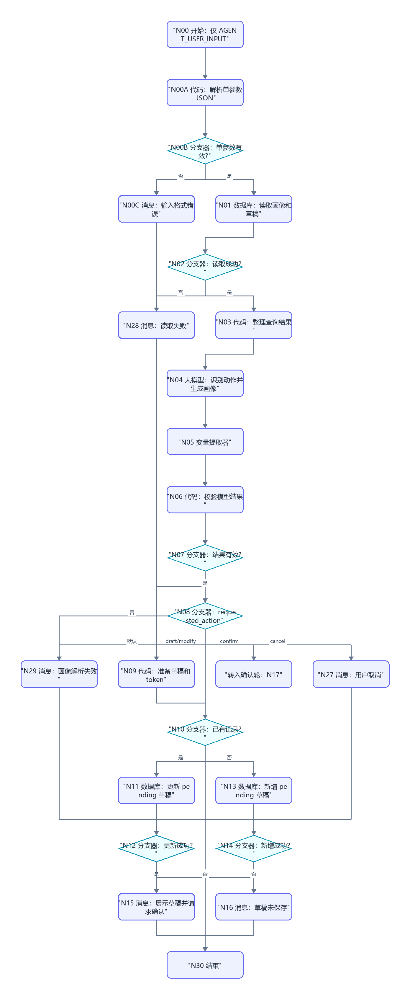
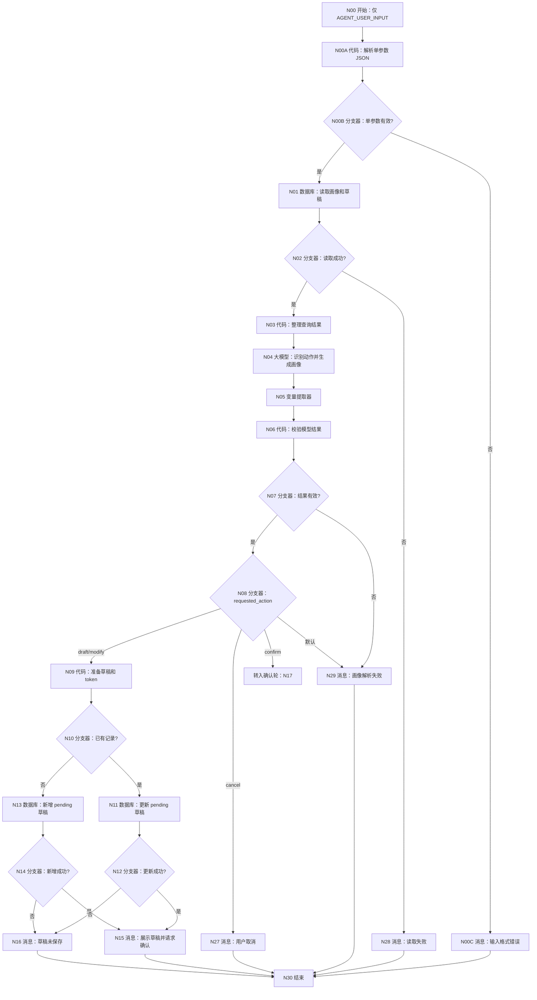
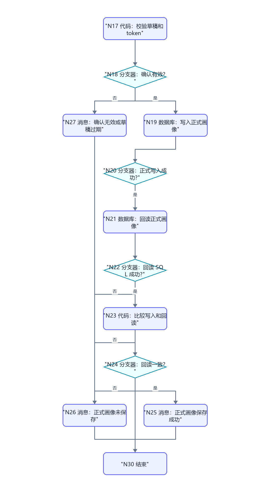
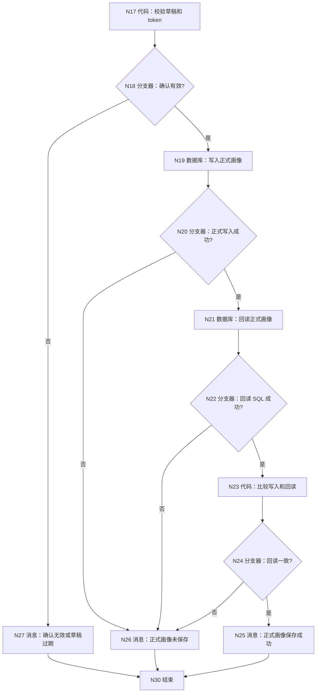

# WF-01 用户建档与画像确认：逐节点搭建教程

这份文件是 WF-01 的唯一配置依据。节点编号、流程图、节点名称和后文配置完全对应，不再使用旧版抽象节点表。

## 1. 本工作流最终完成什么

WF-01 分两轮运行：

```text
第一轮：解析单参数 JSON → 读取旧画像 → 生成或修改画像草稿 → 保存 pending 草稿 → 请用户确认
第二轮：解析单参数 JSON → 重新读取 pending 草稿 → 校验用户确认和 token → 写正式画像 → 回读验证
```

只有第二轮回读一致后，才可以返回“画像已保存”。

## 2. 搭建前准备

### 2.1 数据表

在数据库 `university` 中创建数据表 `user_profiles`。字段导入文件：

[DB-01-user-profiles.xlsx](../database/import-templates/DB-01-user-profiles.xlsx)

平台自动字段：

```text
id
uid
create_time
```

业务字段：

```text
profile_json
pending_profile_json
confirmation_token
pending_status
record_version
updated_at
```

### 2.2 重要纠错

错误配置：

```text
数据库参数 uid → 引用 → 开始/AGENT_USER_INPUT
```

`AGENT_USER_INPUT` 现在是 WF-01 唯一的外部输入，它本身是一段 JSON 字符串。不能把整段 JSON 直接当作 `uid` 使用，也不能再在开始节点增加第二、第三个参数。必须先经过 `N00A 代码：解析单参数 JSON`，再将解析后的 `uid` 交给数据库。

### 2.3 “决策”和“分支器”不要混用

本平台的“决策”是大模型意图分类节点。它的右侧配置页包含：

```text
模型
输入 / Query
意图名称
意图描述
默认意图
输出 / class_name
```

它适合判断一句自然语言属于哪个意图，例如把“确认保存”分类为 `confirm`，但不适合判断数据库返回的 Boolean。

WF-01 已经通过变量提取器和代码节点得到明确字段，例如 `isSuccess`、`valid`、`has_record`，所以全部使用“分支器”进行确定性条件判断，不使用“决策”。

如果画布上的 N02 已经拖成“决策”，请删除它，然后从左侧“逻辑”分类重新拖入“分支器”，重命名为 `N02 分支器：数据库读取成功?`。

## 3. 两轮完整画布和节点编号

以下两张图共同组成 WF-01，都是搭建依据。第一张从 N00 开始；当 N08=`confirm` 时进入第二张的 N17。图中每个“否”分支和每个消息节点都明确画出终点。

### 3.1 草稿生成/修改轮完整图





### 3.2 正式确认轮完整图





两张图中的 N27 和 N30 是同一批画布节点，不需要重复拖入。第二张只是把确认路径单独放大展示。

## 4. 先按编号拖入节点

从左侧节点栏拖入：

| 类型 | 数量 | 对应编号 |
|---|---:|---|
| 开始 | 系统自带 | N00 |
| 数据库 | 5 | N01、N11、N13、N19、N21 |
| 大模型 | 1 | N04 |
| 变量提取器 | 1 | N05 |
| 代码 | 6 | N00A、N03、N06、N09、N17、N23 |
| 决策 | 0 | WF-01 不使用大模型意图分类节点 |
| 分支器 | 11 | N00B、N02、N07、N08、N10、N12、N14、N18、N20、N22、N24 |
| 消息 | 8 | N00C、N15、N16、N25、N26、N27、N28、N29 |
| 结束 | 系统自带 | N30 |

先重命名所有节点，再按第 3 节流程图连线。不要一边配置一边临时改变节点名称。

## 5. N00～N00C：单参数入口必须这样设置

### 5.1 N00 开始：只保留一个输入

点击画布中的“开始”，在右侧“输入”区域只保留平台系统变量。不要点击“+ 添加”创建其他业务参数。

| 变量名 | 变量类型 | 描述 | 是否必要 |
|---|---|---|---|
| `AGENT_USER_INPUT` | String | 包含 `uid`、`user_input`、`confirmation_token`、`request_time` 的 JSON 字符串；系统自带 | 是 |

N00 输出只有：

```text
AGENT_USER_INPUT
```

第一轮独立调试时，整个复制到 `AGENT_USER_INPUT` 输入框：

```json
{
  "uid": "test_user_001",
  "user_input": "我是大一学生，计算机专业，想建立画像",
  "confirmation_token": "",
  "request_time": "2026-07-19 16:30:00"
}
```

正式由 MAIN 或 API 调用时，也必须把这四个业务字段序列化成一条字符串传入，不能重新给 WF-01 增加开始参数。生产环境中的 `uid` 必须由可信的 MAIN、后端或平台身份映射生成，不能直接相信终端用户自己在对话文字里填写的 uid；否则用户可能尝试读取别人的数据。下面的 `test_user_001` 只用于独立调试。

### 5.2 N00A 代码：解析单参数 JSON

从左侧拖一个“代码”节点到 N00 与 N01 之间，重命名为：

```text
N00A 代码：解析单参数 JSON
```

右侧“输入”只配置一行：

| 参数名 | 参数值方式 | 参数值 |
|---|---|---|
| `raw_input` | 引用 | `N00 开始 / AGENT_USER_INPUT` |

点击“编辑代码”，完整替换为：

```python
def skip_spaces(text, index):
    while index < len(text) and text[index] in " \t\r\n":
        index += 1
    return index

def parse_json_string(text, index):
    if index >= len(text) or text[index] != '"':
        raise ValueError("JSON 的键和值都必须使用双引号")
    index += 1
    chars = []
    escapes = {
        '"': '"',
        '\\': '\\',
        '/': '/',
        'b': '\b',
        'f': '\f',
        'n': '\n',
        'r': '\r',
        't': '\t',
    }
    while index < len(text):
        char = text[index]
        if char == '"':
            return "".join(chars), index + 1
        if char == '\\':
            index += 1
            if index >= len(text):
                raise ValueError("JSON 转义字符不完整")
            escaped = text[index]
            if escaped == 'u':
                code = text[index + 1:index + 5]
                if len(code) != 4:
                    raise ValueError("JSON Unicode 转义不完整")
                try:
                    chars.append(chr(int(code, 16)))
                except:
                    raise ValueError("JSON Unicode 转义无效")
                index += 5
                continue
            if escaped not in escapes:
                raise ValueError("JSON 包含不支持的转义字符")
            chars.append(escapes[escaped])
            index += 1
            continue
        if ord(char) < 32:
            raise ValueError("JSON 字符串包含控制字符")
        chars.append(char)
        index += 1
    raise ValueError("JSON 字符串缺少结束双引号")

def parse_flat_string_object(raw_input):
    if not isinstance(raw_input, str) or raw_input.strip() == "":
        raise ValueError("AGENT_USER_INPUT 不能为空")
    text = raw_input
    index = skip_spaces(text, 0)
    if index >= len(text) or text[index] != '{':
        raise ValueError("JSON 顶层必须是对象")
    index = skip_spaces(text, index + 1)
    result = {}
    if index < len(text) and text[index] == '}':
        index = skip_spaces(text, index + 1)
        if index != len(text):
            raise ValueError("JSON 对象结束后不能有其他内容")
        return result
    while index < len(text):
        key, index = parse_json_string(text, index)
        index = skip_spaces(text, index)
        if index >= len(text) or text[index] != ':':
            raise ValueError("JSON 键后缺少冒号")
        index = skip_spaces(text, index + 1)
        value, index = parse_json_string(text, index)
        result[key] = value
        index = skip_spaces(text, index)
        if index < len(text) and text[index] == ',':
            index = skip_spaces(text, index + 1)
            continue
        if index < len(text) and text[index] == '}':
            index = skip_spaces(text, index + 1)
            if index != len(text):
                raise ValueError("JSON 对象结束后不能有其他内容")
            return result
        raise ValueError("JSON 字段之间缺少逗号或对象缺少结束花括号")
    raise ValueError("JSON 对象缺少结束花括号")

def main(raw_input):
    uid = ""
    user_input = ""
    confirmation_token = ""
    request_time = ""
    error = ""

    try:
        payload = parse_flat_string_object(raw_input)
        uid_value = payload.get("uid", "")
        message_value = payload.get("user_input", "")
        token_value = payload.get("confirmation_token", "")
        time_value = payload.get("request_time", "")

        uid = uid_value.strip() if isinstance(uid_value, str) else ""
        user_input = message_value.strip() if isinstance(message_value, str) else ""
        confirmation_token = token_value.strip() if isinstance(token_value, str) else ""
        request_time = time_value.strip() if isinstance(time_value, str) else ""

        if uid == "":
            raise ValueError("缺少非空字符串字段 uid")
        if user_input == "":
            raise ValueError("缺少非空字符串字段 user_input")
        valid_time = (
            len(request_time) == 19
            and request_time[4] == '-'
            and request_time[7] == '-'
            and request_time[10] == ' '
            and request_time[13] == ':'
            and request_time[16] == ':'
            and (
                request_time[0:4]
                + request_time[5:7]
                + request_time[8:10]
                + request_time[11:13]
                + request_time[14:16]
                + request_time[17:19]
            ).isdigit()
        )
        if not valid_time:
            raise ValueError("缺少 request_time，或格式不是 YYYY-MM-DD HH:mm:ss")
    except Exception as exc:
        error = str(exc) if str(exc) != "" else "单参数 JSON 解析失败"

    return {
        "uid": uid,
        "user_input": user_input,
        "confirmation_token": confirmation_token,
        "request_time": request_time,
        "input_valid": error == "",
        "input_error": error,
    }
```

在“输出”区域逐行添加，名称和大小写必须与代码 `return` 完全相同：

| 变量名 | 变量类型 | 描述 |
|---|---|---|
| `uid` | String | 数据库使用的用户唯一标识。 |
| `user_input` | String | 解包后的用户本轮自然语言消息。 |
| `confirmation_token` | String | 确认轮使用的 token；首次建档为空字符串。 |
| `request_time` | String | 数据库更新时间；必须由调用方按 `YYYY-MM-DD HH:mm:ss` 提供。 |
| `input_valid` | Boolean | JSON、uid 和 user_input 是否有效。 |
| `input_error` | String | 输入无效原因；有效时为空字符串。 |

不要把所有字段合并成一个 `output:Object`。后面的数据库和代码节点需要逐个引用这六个顶层输出。

N00A 接受的是“顶层对象 + String 值”的固定契约。不要把 `uid`、`user_input`、token 或时间写成 Number、Boolean、Array、Object；用户原话里如果包含双引号，由 MAIN/API 在序列化时自动写成 `\"`。这种限制让代码节点无需 `import` 也能确定性解析身份和 token。

### 5.3 N00B 分支器：单参数有效？

从左侧“逻辑”拖入“分支器”，不要拖“决策”。重命名为：

```text
N00B 分支器：单参数有效?
```

第一条分支配置：

| 页面字段 | 填写内容 |
|---|---|
| 引用变量 | `N00A / input_valid` |
| 选择条件 | 等于 |
| 比较类型 | 固定值/常量 |
| 比较值 | Boolean `true` |
| 连线去向 | N01 |

默认分支连接 N00C。不要再添加 `false` 引用变量；只要没有命中 `true` 就进入错误消息。

### 5.4 N00C 消息：输入格式错误

拖入“消息”节点并重命名为：

```text
N00C 消息：输入格式错误
```

输入区添加：

| 参数名 | 参数值方式 | 参数值 |
|---|---|---|
| `input_error` | 引用 | `N00A / input_error` |

关闭“流式输出”，在“回答内容”填写：

```text
WF-01 输入格式无效，本轮没有读取或写入数据库。
原因：{{input_error}}

请把 AGENT_USER_INPUT 填成一个 JSON 对象字符串，其中 uid、user_input、request_time 必须是非空字符串；confirmation_token 可以省略。request_time 格式必须是 YYYY-MM-DD HH:mm:ss。
```

把 N00C 连接到 N30。这样输入错误会明确结束，不会进入 N01，也不会产生匿名用户记录。

### 5.5 旧画布逐项修改总表

如果你已经按旧教程搭好了 WF-01，不需要删除 N01～N30。只新增 N00A、N00B、N00C，然后按这张表逐项改引用：

| 旧画布位置 | 删除或替换的旧值 | 修改后的值 |
|---|---|---|
| N00 开始 | 删除 `uid` 输入 | 只保留 `AGENT_USER_INPUT` |
| N00 开始 | 删除 `confirmation_token` 输入 | token 放入 AGENT_USER_INPUT 内层 JSON |
| N00 开始 | 删除 `request_time` 输入 | 时间放入 AGENT_USER_INPUT 内层 JSON |
| N01 数据库输入 | `N00 / uid` | `N00A / uid` |
| N04 大模型输入 | `AGENT_USER_INPUT = N00 / AGENT_USER_INPUT` | `user_input = N00A / user_input` |
| N04 用户提示词 | `{{AGENT_USER_INPUT}}` | `{{user_input}}` |
| N09 代码输入 uid | `N00 / uid` | `N00A / uid` |
| N09 代码输入 request_time | `N00 / request_time` | `N00A / request_time` |
| N11 更新范围 uid | `N00 / uid` | `N00A / uid` |
| N13 新增字段 uid | 旧教程未固定或引用 N00 | 明确选择 `N00A / uid` |
| N17 输入 incoming_token | `N00 / confirmation_token` | `N00A / confirmation_token` |
| N17 输入 request_time | `N00 / request_time` | `N00A / request_time` |
| N19 更新范围 uid | `N00 / uid` | `N00A / uid` |
| N21 SQL 输入 uid | `N00 / uid` | `N00A / uid` |

改完一行就在自己的搭建记录中打勾。只要其中任意一个节点仍引用已经删除的 N00 业务变量，下拉框就会没有数据，或者调试时出现空值。

## 6. N01 数据库：读取正式画像及待确认草稿

### 6.1 画布位置

```text
N00 开始 → N00A 解析 → N00B 输入有效 → N01 数据库 → N02 分支器
```

### 6.2 右侧配置

| 配置项 | 填写内容 |
|---|---|
| 模式 | 自定义SQL |
| 选择数据库 | `university` |
| 节点名称 | `N01 读取正式画像及待确认草稿` |

输入区添加：

| 参数名 | 类型 | 值 |
|---|---|---|
| `uid` | 引用 | `N00A 代码：解析单参数 JSON / uid` |

不要选择 `N00 / AGENT_USER_INPUT`。N00 中保存的是整段包装 JSON，不是数据库需要的纯 uid。

SQL：

```sql
SELECT
  id,
  uid,
  profile_json,
  pending_profile_json,
  confirmation_token,
  pending_status,
  record_version,
  updated_at
FROM user_profiles
WHERE uid = '{{uid}}'
ORDER BY updated_at DESC, create_time DESC
LIMIT 1;
```

平台输出：

```text
N01.isSuccess
N01.message
N01.outputList
```

## 7. N02 分支器：数据库读取成功？

点击 N02，在条件左值选择：

```text
N01 / isSuccess
```

| 分支 | 条件 | 连接 |
|---|---|---|
| 是 | 等于 `true` | N03 |
| 否 | 等于 `false` | N28 |

`isSuccess=true` 且 `outputList=[]` 不是失败，而是新用户。

## 8. N03 代码：整理查询结果

输入：

| 参数 | 引用 |
|---|---|
| `outputList` | `N01 / outputList` |

代码：

```python
def main(outputList):
    rows = outputList if isinstance(outputList, list) else []
    row = rows[0] if len(rows) > 0 and isinstance(rows[0], dict) else {}

    try:
        record_id_value = int(row.get("id", 0))
    except:
        record_id_value = 0

    try:
        record_version_value = int(row.get("record_version", 0))
    except:
        record_version_value = 0

    old_profile = row.get("profile_json", "")
    pending_profile = row.get("pending_profile_json", "")
    token = row.get("confirmation_token", "")
    status = row.get("pending_status", "")

    return {
        "has_record": len(row) > 0,
        "record_id": record_id_value,
        "old_profile_json": old_profile if isinstance(old_profile, str) and old_profile != "" else "{}",
        "pending_profile_json": pending_profile if isinstance(pending_profile, str) and pending_profile != "" else "{}",
        "stored_confirmation_token": token if isinstance(token, str) else "",
        "pending_status": status if isinstance(status, str) and status != "" else "none",
        "record_version": record_version_value,
    }
```

输出区域必须添加：

| 变量名 | 类型 | 描述 |
|---|---|---|
| `has_record` | Boolean | 是否读取到该用户的画像记录。 |
| `record_id` | Integer | 已有记录的 id；新用户没有记录时固定为 `0`，禁止返回 `None`。 |
| `old_profile_json` | String | 已正式确认的画像 JSON 字符串。 |
| `pending_profile_json` | String | 等待确认的画像 JSON 字符串。 |
| `stored_confirmation_token` | String | 数据库中保存的确认 token。 |
| `pending_status` | String | 当前草稿状态。 |
| `record_version` | Integer | 当前正式画像版本号。 |

## 9. N04 大模型：识别动作并生成/合并画像

### 9.1 输入区域

关闭“对话历史”。这个节点需要的旧画像和待确认画像已经由 N03 明确传入，开启历史会让模型混入更早的对话内容。

不要保留 `input、input2、input3` 这类名称。输入参数必须改成：

| 参数名 | 类型 | 参数值 |
|---|---|---|
| `user_input` | 引用 | N00A / user_input |
| `old_profile_json` | 引用 | N03 / old_profile_json |
| `pending_profile_json` | 引用 | N03 / pending_profile_json |
| `pending_status` | 引用 | N03 / pending_status |

N04 不需要输入 `confirmation_token`。token 由 N17 代码节点校验，不应交给大模型决定是否合法。

### 9.2 系统提示词

把下面整段放入“系统提示词”：

```text
你是“大学人生规划模拟器”的用户建档助手。

判断 requested_action：
- 用户首次提供资料或要求重新生成：draft
- 用户指出画像修改内容：modify
- 用户明确表示确认保存：confirm
- 用户表示取消：cancel

规则：
1. confirm 时不得重新生成画像，只返回待确认画像。
2. draft/modify 时合并用户明确提供的信息；不得虚构。
3. 缺失内容使用“待补充”。
4. 区分明确陈述和推断。
5. 家庭、经济和成绩只使用区间或标签。
6. 只输出 JSON。

输出：
{
  "requested_action": "draft",
  "profile_json": {
    "nickname": "",
    "grade": "",
    "school": "",
    "major": "",
    "gpa_level": "",
    "budget_level": "",
    "family_support": [],
    "location_preference": [],
    "experiences": [],
    "abilities": {
      "research": "",
      "execution": "",
      "communication": "",
      "creativity": "",
      "collaboration": "",
      "resilience": ""
    },
    "risk_preference": "",
    "value_preferences": [],
    "missing_fields": [],
    "inferred_fields": [],
    "profile_card": ""
  },
  "reply": ""
}
```

其中 `requested_action` 的示例值是 `draft`；实际只能填写 `draft`、`modify`、`confirm`、`cancel` 四者之一，不能原样输出 `draft|modify|confirm|cancel`。

### 9.3 用户提示词

把下面整段放入“用户提示词”：

```text
用户本轮输入：{{user_input}}
已确认画像：{{old_profile_json}}
待确认画像：{{pending_profile_json}}
待确认状态：{{pending_status}}

请根据以上内容判断 requested_action，并按照系统提示词规定的 JSON 结构输出结果。
```

变量名必须和“输入”区域左侧参数名完全一致，包括大小写。不要在提示词里写 `{{input}}`、`{{input2}}`。

### 9.4 输出区域

```text
输出格式：text
变量名：output
变量类型：String
描述：大模型返回的用户动作与画像 JSON 文本
```

N04 输出：`output`，连接 N05。

## 10. N05 变量提取器：提取模型 JSON

这个节点不是固定 JSON 解析器，而是使用模型根据“输出变量描述”从 N04 文本中提取字段。请按右侧页面从上到下配置。

### 10.1 模型

```text
Spark4.0 Ultra
```

### 10.2 输入

输入区域只保留一行：

| 参数名 | 参数类型 | 参数值 |
|---|---|---|
| `input` | 引用 | N04 / output |

这里的 `input` 是变量提取器自己的输入参数名，可以保留；右侧参数值必须选择上游 `N04 / output`。如果下拉框显示“暂无数据”，先确认 N04 已经连线到 N05，并且 N04 的输出变量名是 `output`。

### 10.3 输出

把默认的 `output` 行改名为第一条变量，再点击“+ 添加”补齐另外两条。三行都必须填写描述，否则页面会显示“值不能为空”。

| 变量名 | 变量类型 | 描述（原样填写） |
|---|---|---|
| `requested_action` | String | 从输入 JSON 中提取 requested_action。只能输出 draft、modify、confirm、cancel 之一，不要输出解释。 |
| `profile_json` | String | 从输入 JSON 中提取完整 profile_json 对象，并序列化为合法 JSON 字符串；必须包含对象的全部字段，不要只提取 profile_card。 |
| `reply` | String | 从输入 JSON 中提取 reply 字段；没有内容时输出空字符串。 |

N05 当前页面可稳定输出 String，因此这里保留 String；N06 只做动作白名单、非空和首尾花括号校验，不调用平台不可用的 JSON 库。其他工作流若变量提取器页面允许选择 Object，则优先直接输出 Object 供代码校验。

### 10.4 异常处理

初次搭建时保持关闭。N05 正常输出后连接 N06；如果提取失败或字段为空，N06 会令 `valid=false`，再由 N07 转到 N29，不进入数据库写入。

## 11. N06 代码和 N07 分支器：校验模型结果

N06 输入：

```text
requested_action = N05.requested_action
profile_json = N05.profile_json
```

代码：

```python
def main(requested_action, profile_json):
    action = requested_action if isinstance(requested_action, str) else ""
    profile_text = profile_json if isinstance(profile_json, str) else ""
    action = action.strip().lower()
    profile_text = profile_text.strip()
    valid_action = action in ["draft", "modify", "confirm", "cancel"]
    valid_profile = len(profile_text) > 2 and profile_text.startswith("{") and profile_text.endswith("}")
    valid = valid_action and valid_profile
    return {
        "valid": valid,
        "error": "" if valid else "action_or_profile_invalid",
        "profile_json_string": profile_text if valid else "",
    }
```

N06 的“输出”区域必须显式添加以下三行，变量名需要与代码 `return` 中的键完全一致：

| 变量名 | 变量类型 | 描述 |
|---|---|---|
| `valid` | Boolean | N05 的动作和画像 JSON 是否通过校验；通过为 true，失败为 false。 |
| `error` | String | 校验失败原因；成功时为空字符串。 |
| `profile_json_string` | String | 经过 JSON 解析并重新序列化的完整画像 JSON 字符串；失败时为空字符串。 |

对应关系：

```text
代码 return.valid               → 输出 valid
代码 return.error               → 输出 error
代码 return.profile_json_string → 输出 profile_json_string
```

如果代码节点的输出区已有默认 `output`，请删除或改名，不要保留一个无人使用的 `output`。配置完成后，下游引用关系是：

```text
N07 引用 N06 / valid
N09 引用 N06 / profile_json_string
N29 可以引用 N06 / error 显示失败原因
```

N07 条件：

```text
N06.valid == true → N08
N06.valid == false → N29
```

## 12. N08 分支器：根据 requested_action 分流

`draft`、`modify`、`confirm`、`cancel` 不是平台预置的“选择条件”，而是变量 `requested_action` 可能得到的四个字符串值。每一条都要由你点击“+ 添加分支”后手动配置。

### 12.1 第一条分支：draft

| 页面字段 | 填写或选择 |
|---|---|
| 引用变量 | `N05 / requested_action` |
| 选择条件 | 等于 |
| 比较类型 | 常量/固定值，不要选择“引用” |
| 比较值 | `draft` |
| 连线去向 | N09 |

### 12.2 第二条分支：modify

| 页面字段 | 填写或选择 |
|---|---|
| 引用变量 | `N05 / requested_action` |
| 选择条件 | 等于 |
| 比较类型 | 常量/固定值 |
| 比较值 | `modify` |
| 连线去向 | N09 |

### 12.3 第三条分支：confirm

| 页面字段 | 填写或选择 |
|---|---|
| 引用变量 | `N05 / requested_action` |
| 选择条件 | 等于 |
| 比较类型 | 常量/固定值 |
| 比较值 | `confirm` |
| 连线去向 | N17 |

### 12.4 第四条分支：cancel

| 页面字段 | 填写或选择 |
|---|---|
| 引用变量 | `N05 / requested_action` |
| 选择条件 | 等于 |
| 比较类型 | 常量/固定值 |
| 比较值 | `cancel` |
| 连线去向 | N27 |

默认分支连接 N29，用来拦截模型输出了四个允许值以外的内容。

正确逻辑必须读成：

```text
N08 requested_action=draft  ──→ N09
N08 requested_action=modify ──→ N09
N08 requested_action=confirm ──→ N17
N08 requested_action=cancel  ──→ N27

N09 之后只能进入 N10，不存在 N09 → cancel。
N10 has_record=true  ──→ N11 更新已有记录
N10 has_record=false ──→ N13 新增记录
```

## 13. N09 代码：准备 pending 草稿和 token

输入：

```text
profile_json_string = N06.profile_json_string
uid = N00A.uid
record_version = N03.record_version
request_time = N00A.request_time
```

代码：

```python
def main(profile_json_string, uid, record_version, request_time):
    profile_text = profile_json_string if isinstance(profile_json_string, str) else "{}"
    user_text = uid if isinstance(uid, str) else "anonymous"
    time_text = request_time if isinstance(request_time, str) else ""
    try:
        version = int(record_version)
    except:
        version = 0
    seed = user_text + "|" + str(version + 1) + "|" + profile_text
    checksum = 2166136261
    for char in seed:
        checksum = ((checksum ^ ord(char)) * 16777619) % 4294967296
    return {
        "pending_profile_json": profile_text,
        "new_confirmation_token": "profile_" + str(version + 1) + "_" + str(checksum),
        "pending_status": "awaiting_confirmation",
        "updated_at": time_text,
    }
```

N09 的“输出”区域必须显式添加以下四行，名称与代码 `return` 完全一致：

| 变量名 | 变量类型 | 描述 |
|---|---|---|
| `pending_profile_json` | String | 准备写入数据库的待确认画像 JSON 字符串。 |
| `new_confirmation_token` | String | 本次草稿生成的唯一确认 token，返回给用户并写入数据库。 |
| `pending_status` | String | 待确认状态，固定为 awaiting_confirmation。 |
| `updated_at` | String | 本次草稿更新时间，ISO 8601 字符串。 |

对应关系和下游用途：

```text
return.pending_profile_json  → N11/N13 的 pending_profile_json
return.new_confirmation_token → N11/N13 的 confirmation_token，也由 N15 返回给用户
return.pending_status         → N11/N13 的 pending_status
return.updated_at             → N11/N13 的 updated_at
```

如果输出区有默认 `output`，请删除或改名。

## 14. N10 分支器：已有画像记录？

条件左值：

```text
N03 / has_record
```

```text
true → N11 更新 pending
false → N13 新增 pending
```

## 15. N11 数据库：更新 pending 草稿

### 15.1 模式

| 页面字段 | 选择内容 |
|---|---|
| 模式页签 | 表单处理数据 |
| 选择数据表 | `university / user_profiles` |
| 处理模式 | 更新数据 |

### 15.2 设置数据范围

这里决定“更新哪一行”。点击“+ 添加”配置两条；两条同时满足，即 AND：

| 表字段 | 选择条件 | 比较类型 | 比较值 |
|---|---|---|---|
| `id` | 等于 | 引用 | N03 / record_id |
| `uid` | 等于 | 引用 | N00A / uid |

不要把“比较类型”设置成固定值，因为右侧值来自上游节点。

### 15.3 设置更新数据

在“设置更新数据”中点击“+ 添加”，逐行配置：

| 参数名 | 类型 | 值 |
|---|---|---|
| `pending_profile_json` | 引用 | N09 / pending_profile_json |
| `confirmation_token` | 引用 | N09 / new_confirmation_token |
| `pending_status` | 引用 | N09 / pending_status |
| `updated_at` | 引用 | N09 / updated_at |

草稿阶段不修改 `profile_json` 和 `record_version`，所以不要把它们加入“设置更新数据”。

### 15.4 输出

平台固定输出 `isSuccess`、`message`、`outputList`，无需手工新增。

N12 判断 `N11.isSuccess`：true → N15；false → N16。

## 16. N13 数据库：新增 pending 草稿

### 16.1 模式

| 页面字段 | 选择内容 |
|---|---|
| 模式页签 | 表单处理数据 |
| 选择数据表 | `university / user_profiles` |
| 处理模式 | 新增数据 |

新增数据不需要“设置数据范围”。在页面的“设置新增数据”中逐行添加：

| 参数名 | 类型 | 值 |
|---|---|---|
| `pending_profile_json` | 引用 | N09 / pending_profile_json |
| `confirmation_token` | 引用 | N09 / new_confirmation_token |
| `pending_status` | 引用 | N09 / pending_status |
| `profile_json` | 固定值/常量 | `{}` |
| `record_version` | 固定值/常量 | `0` |
| `updated_at` | 引用 | N09 / updated_at |
| `uid` | 引用 | N00A / uid |

N13 页面会自动列出并锁定数据表中标为必填的字段；这些行不能删除，必须逐一赋值。当前实际页面中前三个锁定业务字段为 `pending_status`、`record_version`、`updated_at`，按上表填写即可。`uid` 必须明确引用 `N00A / uid` 写入本条新记录；它不会出现在 N13 的输出区，因为数据库节点固定输出只有 `isSuccess`、`message`、`outputList`。平台自动显示且无法删除的 `id`、`uid`、`create_time` 行以真实页面为准，其中可填写的 `uid` 必须选择 N00A 的解析结果，不能填写固定测试值。

平台固定输出 `isSuccess`、`message`、`outputList`。

N14 判断 `N13.isSuccess`：true → N15；false → N16。

## 17. N15/N16：草稿结果消息

N15 输入：

```text
profile_json = N09.pending_profile_json
confirmation_token = N09.new_confirmation_token
```

N15 固定输出：

```json
{
  "workflow_id": "WF-01",
  "status": "awaiting_confirmation",
  "reply": "画像草稿已保存，请确认或指出修改内容。",
  "data": {
    "profile_json": "{{pending_profile_json}}",
    "confirmation_token": "{{new_confirmation_token}}"
  },
  "next_action": "confirm_profile",
  "error": null
}
```

N16 固定输出 `status=write_failed`，明确“草稿未保存，请重试”，然后连接 N30。

## 18. N17/N18：确认轮安全校验

N17 输入：

```text
incoming_token = N00A.confirmation_token
stored_token = N03.stored_confirmation_token
pending_status = N03.pending_status
pending_profile_json = N03.pending_profile_json
has_record = N03.has_record
record_version = N03.record_version
request_time = N00A.request_time
```

代码：

```python
def main(
    incoming_token,
    stored_token,
    pending_status,
    pending_profile_json,
    has_record,
    record_version,
    request_time,
):
    incoming = incoming_token.strip() if isinstance(incoming_token, str) else ""
    stored = stored_token.strip() if isinstance(stored_token, str) else ""
    pending = pending_profile_json.strip() if isinstance(pending_profile_json, str) else ""
    valid = (
        bool(has_record)
        and pending_status == "awaiting_confirmation"
        and incoming != ""
        and incoming == stored
        and pending != ""
        and pending != "{}"
    )
    try:
        version = int(record_version)
    except:
        version = 0
    return {
        "confirmation_valid": valid,
        "next_record_version": version + 1,
        "confirmed_at": request_time if isinstance(request_time, str) else "",
    }
```

N17 输出区域：

| 变量名 | 类型 | 描述 |
|---|---|---|
| `confirmation_valid` | Boolean | 待确认草稿与传入 token 是否通过校验。 |
| `next_record_version` | Integer | 正式写入时使用的新版本号。 |
| `confirmed_at` | String | 正式确认时间，供 N19 更新 updated_at。 |

N18：

```text
N17.confirmation_valid == true → N19
false → N27
```

## 19. N19 数据库：写入正式画像

### 19.1 模式

| 页面字段 | 选择内容 |
|---|---|
| 模式页签 | 表单处理数据 |
| 选择数据表 | `university / user_profiles` |
| 处理模式 | 更新数据 |

### 19.2 设置数据范围

点击“+ 添加”配置三条 AND 条件：

| 表字段 | 选择条件 | 比较类型 | 比较值 |
|---|---|---|---|
| `id` | 等于 | 引用 | N03 / record_id |
| `uid` | 等于 | 引用 | N00A / uid |
| `confirmation_token` | 等于 | 引用 | N03 / stored_confirmation_token |

### 19.3 设置更新数据

| 参数名 | 类型 | 值 |
|---|---|---|
| `profile_json` | 引用 | N03 / pending_profile_json |
| `pending_profile_json` | 固定值/常量 | `{}` |
| `confirmation_token` | 固定值/常量 | 空字符串 |
| `pending_status` | 固定值/常量 | `confirmed` |
| `record_version` | 引用 | N17 / next_record_version |
| `updated_at` | 引用 | N17 / confirmed_at |

平台固定输出 `isSuccess`、`message`、`outputList`。

N20 判断 `N19.isSuccess`：true → N21；false → N26。

## 20. N21 数据库：回读正式画像

模式：自定义SQL；数据库：`university`。

输入：

```text
uid = N00A.uid
record_id = N03.record_id
```

SQL：

```sql
SELECT id, uid, profile_json, pending_status, record_version
FROM user_profiles
WHERE uid='{{uid}}' AND id={{record_id}}
LIMIT 1;
```

N22：`N21.isSuccess=true` → N23；false → N26。

## 21. N23/N24：比较回读结果

N23 输入：

```text
expected_profile_json = N03.pending_profile_json
outputList = N21.outputList
```

代码：

```python
def main(expected_profile_json, outputList):
    rows = outputList if isinstance(outputList, list) else []
    row = rows[0] if len(rows) > 0 and isinstance(rows[0], dict) else {}
    expected = expected_profile_json.strip() if isinstance(expected_profile_json, str) else ""
    actual_value = row.get("profile_json", "") if len(row) > 0 else ""
    actual = actual_value.strip() if isinstance(actual_value, str) else ""
    return {
        "readback_consistent": len(row) > 0
        and row.get("pending_status", "") == "confirmed"
        and expected != ""
        and actual == expected
    }
```

N23 输出区域：

| 变量名 | 类型 | 描述 |
|---|---|---|
| `readback_consistent` | Boolean | 数据库回读的正式画像是否与本次确认写入的画像一致。 |

N24：true → N25；false → N26。

## 22. N25～N30：消息和结束

| 编号 | 内容 | status |
|---|---|---|
| N25 | 正式画像保存并回读成功 | `write_succeeded` |
| N26 | 正式写入或回读失败，不能声称保存 | `write_failed` |
| N27 | token 不匹配、草稿过期或用户取消 | `validation_failed` 或 `cancelled` |
| N28 | 数据库读取失败，附 N01.message | `read_failed` |
| N29 | 模型 JSON 无效 | `validation_failed` |

N00C 和 N25～N29 全部连接 N30，不能有任何悬空分支。消息节点本身没有可供结束节点引用的 `result_json` 输出，所以不要再配置“引用对应消息节点/result_json”。

N30 按当前真实页面配置：

快捷抄写：`output｜输入｜workflow_finished`。

| 页面区域 | 填写内容 |
|---|---|
| 回答模式 | `返回设定格式配置的回答` |
| 输出参数名 | `output` |
| 参数值方式 | `输入` |
| 参数值 | `workflow_finished` |
| 思考内容 | 留空 |
| 回答内容 | `本轮处理已结束，请以上方消息节点的提示为准。` |
| 流式输出 | 关闭 |

N00C 和每个 N25～N29 消息节点必须在自己的“回答内容”中写完整的用户提示或完整结果 JSON；N30 只负责统一闭合流程。这正是调试时出现“本轮处理已结束，请以上方消息节点的提示为准”的原因，不代表上方消息节点执行失败。

## 23. 按顺序调试

调试面板中现在只能看到一个必填字段：

```text
AGENT_USER_INPUT（String）
```

下面每个代码块都要完整复制到这一个输入框。不要把 `uid`、`user_input` 或 token 拆成新的开始参数。

### 测试 1：新用户首轮建档

```json
{
  "uid": "test_user_001",
  "user_input": "我是大一学生，计算机专业，想建立画像",
  "confirmation_token": "",
  "request_time": "2026-07-19 16:30:00"
}
```

预期路径：

```text
N00 → N00A(input_valid=true) → N00B 是 → N01
→ N02 是 → N03 → N04 → N05 → N06 → N07 是
→ N08 draft → N09 → N10 false → N13 → N14 是 → N15 → N30
```

预期状态为 `awaiting_confirmation`，并返回一条 `confirmation_token`。复制这条真实 token，测试 2、测试 3 都要使用它。

### 测试 2：修改上一轮草稿

先保持数据库中测试 1 生成的 pending 草稿，再把下面整段填入唯一输入框：

```json
{
  "uid": "test_user_001",
  "user_input": "请把我的城市偏好修改为上海和杭州，预算改为每月 1500 到 2500 元",
  "confirmation_token": "",
  "request_time": "2026-07-19 16:35:00"
}
```

预期：N08 识别为 `modify`，N10 为 true，进入 N11 更新已有 pending 草稿，成功后再次由 N15 返回新的画像和新的 token。后续确认应当使用这一次返回的新 token，而不是测试 1 的旧 token。

### 测试 3：使用正确 token 确认

把 `替换为测试2真实返回的token` 替换成测试 2 的真实值：

```json
{
  "uid": "test_user_001",
  "user_input": "确认保存这份画像",
  "confirmation_token": "替换为测试2真实返回的token",
  "request_time": "2026-07-19 16:40:00"
}
```

预期：N01 读到 pending → N08 confirm → N17 校验成功 → N18 是 → N19 写入 → N21 回读 → N25。只有到 N25 才能声称正式画像已经保存。

### 测试 4：用户取消

先重新运行测试 1 或测试 2 产生一份待确认草稿，然后输入：

```json
{
  "uid": "test_user_001",
  "user_input": "取消这次画像修改，不保存了",
  "confirmation_token": "",
  "request_time": "2026-07-19 16:45:00"
}
```

预期：N08 cancel → N27 → N30，不进入 N09、N17 或任何写正式画像的数据库节点。

### 测试 5：错误 token

```json
{
  "uid": "test_user_001",
  "user_input": "确认保存这份画像",
  "confirmation_token": "wrong-token",
  "request_time": "2026-07-19 16:50:00"
}
```

预期：N18 → N27，不写正式画像。

### 测试 6：单参数输入非法

先测试无法解析的文本：

```text
我不是 JSON
```

再测试缺少 uid 的 JSON：

```json
{
  "user_input": "我是大一学生，想建立画像"
}
```

两次都必须走：

```text
N00 → N00A(input_valid=false) → N00B 默认分支 → N00C → N30
```

N01 不应运行，数据库不应出现 `anonymous` 或空 uid 记录。

### 测试 7：数据库读取失败

临时把 N01 表名改错。预期 N02 → N28。测试后恢复 `user_profiles`。

### 23.1 MAIN 或 API 怎样传这一条参数

MAIN 内部先准备下面这个业务对象：

```json
{
  "uid": "test_user_001",
  "user_input": "确认保存",
  "confirmation_token": "profile_1_xxx",
  "request_time": "2026-07-19 16:55:00"
}
```

然后把它序列化成字符串，放进 WF-01 唯一的 `AGENT_USER_INPUT`。最终外层参数结构是：

```json
{
  "AGENT_USER_INPUT": "{\"uid\":\"test_user_001\",\"user_input\":\"确认保存\",\"confirmation_token\":\"profile_1_xxx\",\"request_time\":\"2026-07-19 16:55:00\"}"
}
```

注意外层 `AGENT_USER_INPUT` 的值是一条 String。下面这种写法是错误的，因为它把内层对象当成了平台的第二层结构化参数：

```json
{
  "AGENT_USER_INPUT": {
    "uid": "test_user_001",
    "user_input": "确认保存"
  }
}
```

## 24. 验收清单

- [ ] N00 只有一个 `AGENT_USER_INPUT:String`，没有 `uid`、`confirmation_token`、`request_time`。
- [ ] N00A 输入只引用 N00/AGENT_USER_INPUT，并显式声明六个同名输出。
- [ ] N00B 的 true 分支进入 N01，默认分支经 N00C 进入 N30。
- [ ] N01 的 uid 引用 N00A.uid，而不是整段 AGENT_USER_INPUT。
- [ ] N04 只接收 N00A.user_input，不把包装 JSON 交给大模型。
- [ ] N09、N11、N13、N17、N19、N21 的身份、token 和时间引用全部来自 N00A。
- [ ] N13 新增数据明确写入 `uid=N00A.uid`。
- [ ] 5 个数据库节点都能在流程图和本教程找到同编号配置。
- [ ] 每个分支器明确写了判断变量、条件和去向。
- [ ] 调试面板只填写一个参数，六种业务/错误场景都使用完整 JSON 字符串。
- [ ] 草稿只有写入成功后才展示 token。
- [ ] confirm 不重新生成画像，只读取已保存 pending。
- [ ] 正式写入后必须回读一致。
- [ ] 任一数据库失败都不会声称保存成功。
