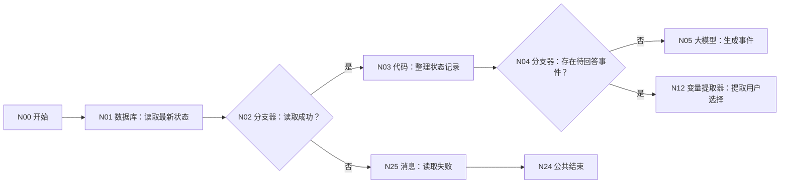
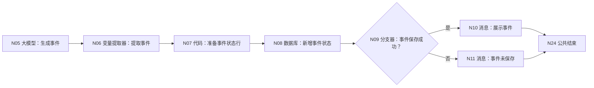
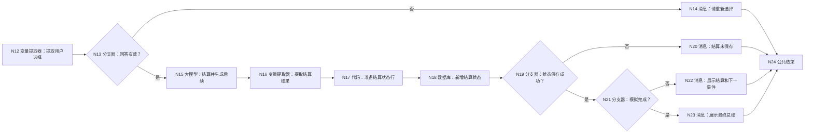

# WF-02 虚拟大学试玩：逐节点搭建指南

> 本文件按已经跑通的 WF-01 写法重做。请从 N00 开始按编号拖节点、连线、再配置右侧面板；不要沿用旧版 WF-02 的节点编号。本流程使用你已经选定的“第一种结束方式”：业务内容由“消息”节点展示，结束节点只返回固定闭合标识 `workflow_finished`。

## 1. 本工作流最终完成什么

WF-02 是一个跨多轮对话运行的情景模拟：首轮生成并保存一个待回答事件；下一轮先读取上次事件，再结算用户选择，并生成下一事件或最终总结。

- 输入：用户本轮原话、`uid`、已确认画像、当前时间。
- 续接表：`university / simulation_states`。
- 输出给用户：当前事件、结算结果或最终试玩总结。
- 不允许写入：`user_profiles`、`main_plans`。
- 每轮只能处理一个待回答事件，不能在同一轮替用户自动选择。

## 2. 搭建前先准备数据表

在讯飞平台左侧进入“数据库”，选择数据库 `university`，新建数据表 `simulation_states`，使用 [DB-02 导入模板](../database/import-templates/DB-02-simulation-states.xlsx)。平台自动生成且删不掉的 `id`、`uid`、`create_time` 保留，不要重复创建。

必须存在以下业务字段：

| 字段 | 类型 | 必填 | 本工作流填写内容 |
|---|---|---:|---|
| `state_id` | String | 是 | 本次状态版本标识 |
| `workflow_id` | String | 是 | 固定 `WF-02` |
| `state_type` | String | 是 | 固定 `simulation` |
| `state_json` | String | 是 | 已结算状态 JSON 字符串 |
| `pending_item_json` | String | 否 | 等待用户回答的事件 JSON 字符串 |
| `current_index` | Integer | 是 | 已推进到的事件序号 |
| `completed` | String | 是 | 字符串 `true` 或 `false` |
| `updated_at` | Time | 是 | 开始节点传入的 `request_time` |

## 3. 画布总结构

先在左侧拖入：数据库 3 个、代码 3 个、变量提取器 3 个、大模型 2 个、分支器 5 个、消息 6 个。开始和结束使用画布自带节点。

### 3.1 读取和入口分流




### 3.2 没有待回答事件：生成并保存事件




### 3.3 有待回答事件：校验、结算和保存




所有消息节点 N10、N11、N14、N20、N22、N23、N25 都连接 N24 结束。图中没有任何悬空出口。

## 4. N00 开始：逐行添加输入

点击开始节点，在右侧“输入”区域保留系统自带 `AGENT_USER_INPUT`，再点击“+ 添加”补齐：

| 变量名 | 类型 | 必填 | 描述 | 调试值 |
|---|---|---:|---|---|
| `AGENT_USER_INPUT` | String | 是 | 用户本轮原话 | `开始虚拟大学` |
| `uid` | String | 是 | 平台用户唯一标识 | `test_user_001` |
| `profile_json` | String | 是 | WF-01 已确认画像 JSON | 一条完整画像 JSON |
| `request_time` | String | 是 | 当前时间，供状态标识和数据库时间字段使用 | `2026-07-19 12:00:00` |

## 5. N01 数据库：读取最新状态

右侧按下面填写：

- 模式：`自定义SQL`。
- 选择数据库：`university`。
- 输入：参数名 `uid`，类型选“引用”，值选 `N00 / uid`。
- SQL：

```sql
SELECT id, uid, state_id, state_json, pending_item_json,
       current_index, completed, updated_at
FROM simulation_states
WHERE uid='{{uid}}' AND workflow_id='WF-02'
ORDER BY updated_at DESC, create_time DESC
LIMIT 1;
```

输出不能自定义，平台固定为 `isSuccess:Boolean`、`message:String`、`outputList:Array<Object>`。

## 6. N02 分支器：数据库读取成功？

先连好 N01→N02，否则“引用变量”会显示暂无数据。

- 引用变量：`N01 / isSuccess`。
- 选择条件：等于。
- 比较类型：固定值/常量，不选“引用”。
- 比较值：`true`。
- 是 → N03；默认/否 → N25。

查询成功但 `outputList=[]` 是首次运行，仍走“是”。

## 7. N03 代码：整理状态记录

输入区只加一行：`outputList｜引用｜N01 / outputList`。点击“编辑代码”，删除示例代码，粘贴：

```python
def main(outputList):
    rows = outputList if isinstance(outputList, list) else []
    row = rows[0] if len(rows) > 0 and isinstance(rows[0], dict) else {}
    try:
        current_index = int(row.get("current_index", 0))
    except:
        current_index = 0
    state_json = row.get("state_json", "{}")
    pending_json = row.get("pending_item_json", "")
    completed_text = str(row.get("completed", "false")).strip().lower()
    return {
        "has_record": len(row) > 0,
        "record_id": int(row.get("id", 0)) if str(row.get("id", "0")).isdigit() else 0,
        "state_json": state_json if isinstance(state_json, str) and state_json else "{}",
        "pending_item_json": pending_json if isinstance(pending_json, str) else "",
        "current_index": current_index,
        "has_pending": isinstance(pending_json, str) and len(pending_json.strip()) > 2,
        "already_completed": completed_text == "true",
    }
```

输出区必须逐行声明：

| 变量名 | 类型 | 描述 |
|---|---|---|
| `has_record` | Boolean | 是否查到历史状态 |
| `record_id` | Integer | 最新状态记录 id；没有时为 0 |
| `state_json` | String | 已结算状态 JSON 字符串 |
| `pending_item_json` | String | 待回答事件 JSON 字符串 |
| `current_index` | Integer | 当前事件序号 |
| `has_pending` | Boolean | 是否有待回答事件 |
| `already_completed` | Boolean | 是否已经完成 |

代码节点禁止写 `import`，也不要返回 `None`。

## 8. N04 分支器：存在待回答事件？

- 引用变量：`N03 / has_pending`。
- 条件：等于；比较类型：固定值；比较值：`true`。
- 是 → N12；默认/否 → N05。

## 9. N05 大模型：生成首个或下一事件

模型选 `Spark4.0 Ultra`，关闭“对话历史”。输入区：

| 参数名 | 参数值 |
|---|---|
| `profile_json` | `N00 / profile_json` |
| `state_json` | `N03 / state_json` |
| `current_index` | `N03 / current_index` |

系统提示词：

```text
你是“虚拟大学”情景模拟主持人。只生成一个当前事件，不替用户选择。
规则：事件必须来自课程、社团、科研、竞赛、实习、考试、转向或资源冲突；给 2～3 个都合理的选项；说明时间、精力、预算和机会取舍；不得承诺录取或就业；不得修改正式画像或主规划；未知信息只写 assumptions。
只输出 JSON：
{"state_json":{},"event":{"year":"","index":1,"title":"","situation":"","options":[{"id":"A","text":"","tradeoffs":[]}]},"reply":""}
```

用户提示词：

```text
已确认画像：{{profile_json}}
已结算状态：{{state_json}}
当前事件序号：{{current_index}}
请生成下一个事件；若没有历史状态，从画像对应年级初始化。只输出系统规定的 JSON。
```

输出格式 `text`，输出变量 `output:String`，描述填写“一个待回答事件及初始化/续接状态 JSON”。

## 10. N06 变量提取器：提取事件

- 模型：`Spark4.0 Ultra`。
- 输入：`input｜引用｜N05 / output`。
- 输出逐行添加：

| 变量名 | 类型 | 描述 |
|---|---|---|
| `state_json` | String | 提取完整 state_json 并序列化为 JSON 字符串 |
| `event_json` | String | 提取完整 event 对象并序列化为 JSON 字符串 |
| `event_index` | Integer | 提取 event.index；缺失时输出 1 |
| `reply` | String | 提取给用户看的事件说明和选择提示 |

异常处理保持关闭。

## 11. N07 代码：准备事件状态行

输入：`uid=N00/uid`、`request_time=N00/request_time`、`state_json=N06/state_json`、`event_json=N06/event_json`、`event_index=N06/event_index`、`reply=N06/reply`。

```python
def main(uid, request_time, state_json, event_json, event_index, reply):
    try:
        index_value = int(event_index)
    except:
        index_value = 1
    valid = bool(str(uid).strip()) and len(str(event_json).strip()) > 2
    return {
        "row_valid": valid,
        "state_id": str(uid) + "-WF02-" + str(request_time) + "-" + str(index_value),
        "workflow_id": "WF-02",
        "state_type": "simulation",
        "state_json": str(state_json) if state_json else "{}",
        "pending_item_json": str(event_json) if event_json else "{}",
        "current_index": index_value,
        "completed": "false",
        "updated_at": str(request_time),
        "reply": str(reply),
    }
```

输出区声明 `row_valid:Boolean`、`state_id:String`、`workflow_id:String`、`state_type:String`、`state_json:String`、`pending_item_json:String`、`current_index:Integer`、`completed:String`、`updated_at:String`、`reply:String`。

## 12. N08 数据库和 N09 分支器：新增事件状态

N08：模式选“表单处理数据”，数据表选 `university / simulation_states`，处理模式选“新增数据”。在“设置新增数据”逐行添加：

| 表字段 | 值 |
|---|---|
| `uid` | 若页面强制显示，引用 `N00 / uid`；未显示则不添加 |
| `state_id` | `N07 / state_id` |
| `workflow_id` | `N07 / workflow_id` |
| `state_type` | `N07 / state_type` |
| `state_json` | `N07 / state_json` |
| `pending_item_json` | `N07 / pending_item_json` |
| `current_index` | `N07 / current_index` |
| `completed` | `N07 / completed` |
| `updated_at` | `N07 / updated_at` |

N09 引用 `N08 / isSuccess`，等于固定值 `true`：是 → N10，否 → N11。

N10 消息输入 `reply｜引用｜N07/reply`，回答内容 `{{reply}}`；N11 输入 `message｜引用｜N08/message`，回答内容 `事件已生成，但状态没有保存。本轮不要作答，请稍后重试。错误：{{message}}`。两者关闭流式输出并连接 N24。

## 13. N12 变量提取器和 N13 分支器：提取用户选择

N12 模型选 `Spark4.0 Ultra`。输入两行：`user_input=N00/AGENT_USER_INPUT`、`pending_item_json=N03/pending_item_json`。输出：

| 变量名 | 类型 | 描述 |
|---|---|---|
| `selected_option` | String | 用户明确选择的当前事件选项 id 或自定义方案 |
| `answer_valid` | Boolean | 只在确实回答当前事件时为 true |
| `reason` | String | 无效原因；有效时为空 |

N13 引用 `N12 / answer_valid`，等于固定值 `true`：是 → N15，否 → N14。

N14 消息输入 `reason=N12/reason` 和 `pending_item_json=N03/pending_item_json`，回答内容：

```text
我还不能确定你选择了当前事件的哪个方案。{{reason}}
请根据下面的事件回复选项编号，或明确写出你的自定义方案：
{{pending_item_json}}
```

关闭流式输出，连接 N24。

## 14. N15 大模型：结算并生成后续

模型 `Spark4.0 Ultra`，关闭对话历史。输入：`profile_json=N00/profile_json`、`state_json=N03/state_json`、`pending_item_json=N03/pending_item_json`、`selected_option=N12/selected_option`、`current_index=N03/current_index`。

系统提示词：

```text
你是“虚拟大学”结算主持人。依据已展示事件和用户明确选择结算一次，不得改写用户选择，不给成功概率。
更新 state_json 中的时间、精力、预算、能力方向、choices、opportunities_gained、opportunities_forgone。若剩余模拟尚未完成，同时生成一个新的 pending_item；若完成，pending_item 为空并生成 summary。
只输出 JSON：
{"state_json":{},"pending_item":{},"current_index":1,"completed":false,"reply":"","summary":{}}
```

用户提示词：

```text
画像：{{profile_json}}
结算前状态：{{state_json}}
待回答事件：{{pending_item_json}}
用户选择：{{selected_option}}
当前序号：{{current_index}}
完成标准：根据画像年级覆盖剩余学年，每学年 2～3 个关键事件；达到标准后 completed=true。
```

输出 `output:String`。

## 15. N16 变量提取器：提取结算结果

输入 `input｜引用｜N15/output`，输出：

| 变量名 | 类型 | 描述 |
|---|---|---|
| `state_json` | String | 完整结算后状态 JSON 字符串 |
| `pending_item_json` | String | 下一事件 JSON；完成时输出 `{}` |
| `current_index` | Integer | 结算后的事件序号 |
| `completed` | Boolean | 是否完成全部模拟 |
| `reply` | String | 本轮结算和下一步提示 |
| `summary_json` | String | 完成时的完整总结 JSON；未完成输出 `{}` |

## 16. N17 代码：准备结算状态行

输入：`uid=N00/uid`、`request_time=N00/request_time`、N16 的六个输出。

```python
def main(uid, request_time, state_json, pending_item_json, current_index, completed, reply, summary_json):
    try:
        index_value = int(current_index)
    except:
        index_value = 0
    done = completed is True
    final_reply = str(reply)
    if done and len(str(summary_json).strip()) > 2:
        final_reply = final_reply + "\n\n" + str(summary_json)
    return {
        "state_id": str(uid) + "-WF02-" + str(request_time) + "-" + str(index_value),
        "workflow_id": "WF-02",
        "state_type": "simulation",
        "state_json": str(state_json) if state_json else "{}",
        "pending_item_json": "{}" if done else (str(pending_item_json) if pending_item_json else "{}"),
        "current_index": index_value,
        "completed_text": "true" if done else "false",
        "completed_bool": done,
        "updated_at": str(request_time),
        "display_reply": final_reply,
    }
```

输出区逐行声明 `state_id:String`、`workflow_id:String`、`state_type:String`、`state_json:String`、`pending_item_json:String`、`current_index:Integer`、`completed_text:String`、`completed_bool:Boolean`、`updated_at:String`、`display_reply:String`。

## 17. N18～N23：保存并输出结算结果

N18 与 N08 一样选 `university / simulation_states`、处理模式“新增数据”，但字段值全部引用 N17：`state_id/workflow_id/state_type/state_json/pending_item_json/current_index/completed_text/updated_at`；`completed` 表字段引用 `N17/completed_text`。

N19 引用 `N18/isSuccess`，等于固定值 `true`：否 → N20，是 → N21。

- N20 输入 `message=N18/message`，回答内容：`本轮结算已生成，但状态没有保存，因此不会继续推进。错误：{{message}}`；连接 N24。
- N21 引用 `N17/completed_bool`，等于固定值 `true`：是 → N23，否 → N22。
- N22 输入 `reply=N17/display_reply`，回答内容 `{{reply}}`；连接 N24。
- N23 输入 `reply=N17/display_reply`，回答内容 `{{reply}}`；连接 N24。N23 的名称写“展示最终总结”，方便调试时辨认路径。

## 18. N25 读取失败消息

输入 `message｜引用｜N01/message`；回答内容：

```text
暂时无法读取你的虚拟大学进度，本轮没有生成或保存新事件。请稍后重试。
错误：{{message}}
```

连接 N24。

## 19. N24 结束：按当前选定的第一种方式填写

- 回答模式：`返回设定格式配置的回答`。
- 输出：参数名 `output`；参数值类型选“输入”；值填写 `workflow_finished`。
- 思考内容：留空。
- 回答内容：`本轮处理已结束，请以上方消息节点的提示为准。`
- 流式输出：关闭。

该配置用于当前手工调试。以后把 WF-02 发布为 API 并嵌入总工作流时，再把上游业务结果统一整理为 `result_json` 并改为引用；当前不要提前改。

## 20. 调试指南：从 WF-01 前置数据开始逐步测试

### 20.1 调试前必须准备什么

WF-02 不会自己查询 WF-01。开始节点的 `profile_json` 必须由调用方传入，因此手工调试前先完成下面的准备：

1. 在 WF-01 使用测试 uid（建议 `debug_wf02_001`）完成“生成画像”和“确认保存”两轮。
2. 确认 WF-01 最终走到 N25，而不是只走到展示草稿的 N15。
3. 进入“数据库”→`university`→`user_profiles`，筛选 `uid=debug_wf02_001`。
4. 找到 `pending_status=confirmed` 的最新一行，复制其 `profile_json` 完整字符串。
5. 进入 `simulation_states`，确认该 uid 没有 `workflow_id=WF-02` 的旧记录。若不方便删除旧测试数据，直接换一个从未使用的新测试 uid，并在 WF-01 重新确认画像。

调试时可以使用下面这种画像结构，但最稳妥的方式仍是复制 WF-01 实际保存的完整值：

```json
{"nickname":"小测","grade":"大一","school":"测试大学","major":"计算机科学","gpa_level":"前30%","budget_level":"1000-2000元","family_support":["情绪支持"],"location_preference":["省会城市"],"experiences":[],"abilities":{"research":"待补充","execution":"中","communication":"待补充","creativity":"待补充","collaboration":"中","resilience":"待补充"},"risk_preference":"中等","value_preferences":["兴趣","成长"],"missing_fields":[],"inferred_fields":[],"profile_card":"测试画像"}
```

### 20.2 每一轮都要遵守的输入规则

- 所有轮次使用同一个 `uid`，否则 N01 无法续接上一轮。
- `profile_json` 每轮都传入同一份已确认画像。
- `request_time` 每轮改成更晚的时间，例如第一轮 `2026-07-19 12:00:00`、第二轮 `2026-07-19 12:05:00`。
- 首轮 `AGENT_USER_INPUT` 填开始请求；后续轮必须填写上一轮 N10 或 N22 已展示事件的真实选项。
- N24 出现 `workflow_finished` 只说明本轮闭合，业务是否成功要以上方消息和数据库记录为准。

### 测试 1：新用户首次进入，生成并保存第一个事件

开始节点填写：

```text
AGENT_USER_INPUT = 开始虚拟大学试玩
uid = debug_wf02_001
profile_json = 从 WF-01 confirmed 行复制的完整 profile_json
request_time = 2026-07-19 12:00:00
```

预期节点路径：

```text
N00 → N01 → N02（是）→ N03 → N04（否）
→ N05 → N06 → N07 → N08 → N09（是）→ N10 → N24
```

关键判断：N01 的 `isSuccess=true` 且 `outputList=[]` 表示 SQL 执行成功但没有旧状态，不是读取失败。N03 应输出 `has_pending=false`，所以 N04 走“否”。

数据库核验：进入 `simulation_states`，筛选 uid 和 `workflow_id=WF-02`，应新增一行；`pending_item_json` 非空、`current_index` 为首个序号、`completed=false`。只有看到这行后，N10 展示的事件才算已保存。

### 测试 2：无效回答不能推进状态

保持相同 uid 和 profile_json，把时间改为 `2026-07-19 12:05:00`：

```text
AGENT_USER_INPUT = 随便吧
```

预期路径：N01 读到上一轮 pending → N04（是）→ N12 → N13（否）→ N14 → N24。记录测试前的 DB-02 行数和最新 `current_index`；测试后两者都不应变化。若新增了状态行，说明 N13 的有效性条件或连线错误。

### 测试 3：回答已展示选项并生成下一事件

重新打开上一轮 N10 的消息，复制一个确实存在的选项编号或选项文本：

```text
AGENT_USER_INPUT = A
uid = debug_wf02_001
profile_json = 与第一轮相同
request_time = 2026-07-19 12:10:00
```

预期路径：

```text
N00 → N01 → N02（是）→ N03 → N04（是）
→ N12 → N13（是）→ N15 → N16 → N17 → N18
→ N19（是）→ N21（否）→ N22 → N24
```

数据库核验：应新增一行而不是覆盖第一行；最新行 `current_index` 增加，`state_json` 保留已结算内容，`pending_item_json` 保存下一事件。旧行必须仍存在，才能追溯模拟过程。

### 测试 4：中断后续接

关闭调试面板或退出工作流编辑页，再重新打开调试。仍使用 `debug_wf02_001`，输入最新事件的有效选项，并给 `request_time` 新时间。预期 N03 能从 N01/outputList 恢复最新 pending，不应重新从第一个事件开始。

### 测试 5：数据库读取失败出口

1. 记录 N01 正确表名 `simulation_states`。
2. 临时把 N01 SQL 中的表名改为 `simulation_states_wrong`。
3. 运行任意输入。
4. 预期 N01/isSuccess=false → N02（否）→ N25 → N24；N05、N12 和所有写入节点都不执行，消息不得包含“已保存”。
5. 测试后立即把 N01 表名恢复为 `simulation_states`，再运行一次正常读取确认恢复成功。

### 测试 6：首个事件写入失败出口

使用一个全新 uid 进入首轮，临时把 N08 的必填 `state_id` 值改成空输入。预期 N09（否）→ N11 → N24；虽然 N05 已生成事件，但消息必须说明未保存，DB-02 不得出现有效状态。测试后恢复 `state_id=N07/state_id`。

### 测试 7：结算状态写入失败出口

对已有 pending 的测试 uid，临时把 N18 的 `state_id` 改为空输入。输入有效选项后，预期 N19（否）→ N20 → N24；不得进入 N21，不得告诉用户已推进。测试后恢复 `state_id=N17/state_id`。

### 测试 8：模拟完成

持续使用同一 uid，每轮回答最新消息中的有效选项，并递增 request_time，直到模型输出完成条件。最后一轮预期 N21（是）→ N23 → N24。最新 DB-02 行必须满足：`completed=true`、`pending_item_json={}`，且 `state_json` 中有完整总结；N23 还应说明情景推演不是现实结果预测。

### 20.3 调试结束后的检查和留证

- 截图保存首轮 N10、一次无效回答 N14、一次正常结算 N22 和最终 N23。
- 截图或导出该 uid 在 DB-02 的全部行，确认版本按时间递增且旧行未被覆盖。
- 确认 N01、N08、N18 所有临时改动都已恢复。
- 后续测试建议换新 uid，不要删除或覆盖已经验收通过的记录。

## 21. 验收清单

- [ ] N01 后先判断 `isSuccess`，再由 N03 整理 `outputList`，没有直接让分支器读取数组字段。
- [ ] 首轮只生成并保存事件，不替用户结算。
- [ ] 下一轮只结算上次已展示事件。
- [ ] 每个数据库新增节点都填写全部必填业务字段；平台默认 `id/uid/create_time` 未重复创建。
- [ ] 所有代码无 `import`，所有返回键都在输出区声明。
- [ ] 所有“否”分支都连接消息和 N24，没有悬空线。
- [ ] 模拟状态只写 `simulation_states`，不写画像或主规划表。
