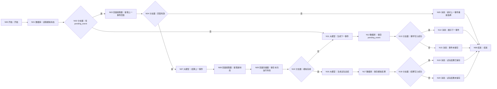
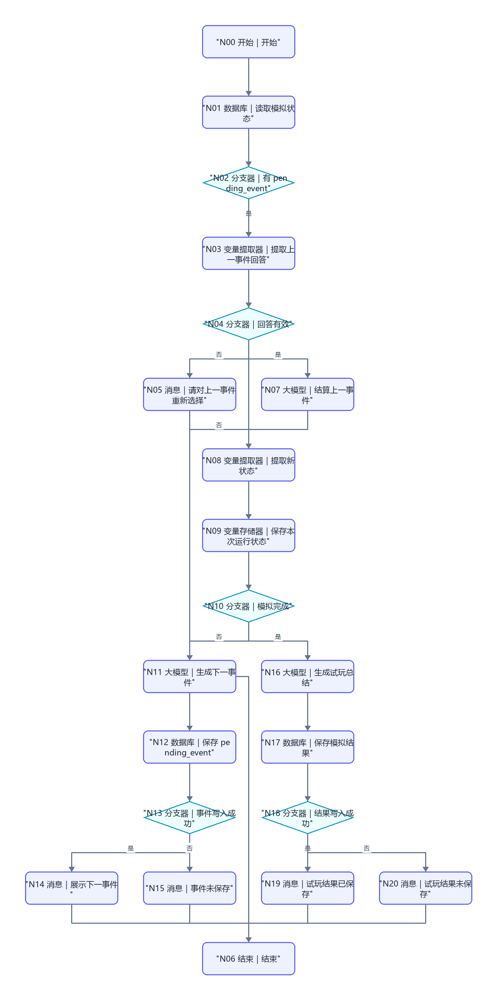

# WF-02 虚拟大学试玩

## 1. 目标与准备

用户确认画像后调用，在约 10～15 分钟按剩余学年进行情景推演，输出 `data.simulation_summary_json`。准备已确认 `profile_json`，逻辑存储键 `simulation_state`；模拟状态与 `main_plan` 严格分离，**不得覆盖正式画像或主规划**。

## 2. 最小可运行版

```text
开始 → 大模型（生成一轮试玩）→ 变量提取器（提取试玩结果）→ 结束
```

从左侧拖 1 个“大模型”和 1 个“变量提取器”到开始与结束之间，按图命名连线。开始映射 `AGENT_USER_INPUT`、`profile_json`；提取器输出 `simulation_summary_json`。本版一次生成完整试玩摘要，不支持逐轮选择和续接。

## 3. 完整业务版画布与搭建

完整跨轮画布、节点数量、拖拽连线和逐边映射统一见第 7 节。数据库动作按本文件逐栏配置，不支持时改用“长期记忆检索/长期记忆写入”。

## 4. 配置与映射

`读取模拟状态` 用 `uid + simulation_state`；先按 `pending_event` 是否存在进入“结算上一事件”或“生成下一事件”，无状态时依据年级初始化：大一最多 4 学年，大二最多 3，大三最多 2。`变量存储器` 保存 `current_year,event_index,resources,choices,opportunities_gained,opportunities_forgone,completed`，仅用于本次执行；跨会话仍写数据库/长期记忆。

提取用户选择时输入 `AGENT_USER_INPUT + current_event.options`，只接受当前选项编号或明确同义表达。保存节点写 `simulation_state` 或 `simulation_result`，不得写 `user_profile/main_plan`。写入检查规则同共享协议；失败返回 `write_failed` 但仍可把当前草稿交给用户复制保存。

## 5. 可复制的完整提示词

```text
你是“虚拟大学”主持人。这是情景推演，不是未来预测。
已确认画像：{{profile_json}}
当前状态：{{simulation_state}}
任务：仅生成当前一个关键事件，覆盖课程、社团、科研、比赛、实习、考试、转向或资源冲突之一；给 2～3 个真实可选方案。选择影响时间、精力、资金、能力、履历和机会，但不要显示可机械刷取的精确分数，不承诺录取或就业结果。若资料不足，用中性假设并标记 assumptions。
只输出 JSON：
{"event":{"year":"","index":1,"title":"","situation":"","options":[{"id":"A","text":"","tradeoffs":[""]}]},"assumptions":[],"reply":"请用户选择并说明可自定义"}
```

结算提示词：

```text
根据 {{simulation_state}}、{{current_event}} 和 {{selected_option}} 结算本轮。保持同一初始条件；描述变化方向，不给伪精确概率。记录得到和放弃的机会，不修改正式画像或主规划。只输出 JSON：
{"new_state":{"current_year":"","event_index":0,"resources":{"time":"充足|紧张|透支","energy":"充足|紧张|透支","money":"宽裕|可控|吃紧"},"choices":[],"opportunities_gained":[],"opportunities_forgone":[],"completed":false},"reply":"本轮后果和下一步"}
```

总结节点输出成长画像、关键选择、所得/放弃机会、可能毕业状态、主要风险、重来建议、免责声明，包装为 `simulation_summary_json`。

## 6. 调试、常见错误与验收清单

- 成功：大二画像、新状态，选择 A；观察事件索引增加、选择入栈、未写主规划。
- 缺失：无已确认画像时立即返回 `missing_required_field`，`next_action=confirm_profile`。
- 中断：完成一个事件后重新调用，应从同一 `event_index` 续接而非重开。
- 选项不匹配：走重新选择分支，不让模型自行替用户选。
- [ ] 剩余学年与年级一致，每学年 2～3 个事件的目标由状态控制。
- [ ] 成功和写入失败均产生共享包装；失败不声称已保存。
- [ ] 输出 `data.simulation_summary_json`，下一步可进 WF-03。

## 7. 完整业务版跨轮状态机、节点数量与逐边映射

完整画布包含数据库 3、大模型 3、变量提取器 2、变量存储器 1、分支器 5、消息 5，另加开始和结束各 1。

摆放时把主线节点从开始右侧横向排列；把“回答无效”“事件未保存”消息放对应分支器下方，把“生成试玩总结”支路放“模拟完成”下方；逐条从上游右侧连接点拖到下游左侧连接点，分支边分别选择图中的“是/否”。

清空画布到仅余开始/结束后，依次从左侧拖入并重命名“读取模拟状态、判断是否有 pending_event、提取上一事件回答、判断回答有效、结算上一事件、提取新状态、保存本次运行状态、判断模拟完成、生成下一事件、保存 pending_event、展示下一事件、生成试玩总结、保存模拟结果、检查写入结果、错误提示”，按下图连线。核心时序是：**有 `pending_event` 才把本轮输入当答案并结算；没有 `pending_event` 才生成事件，先保存后结束等待。**





逐边变量：A→B `uid`；B→C `simulation_state,pending_event`；C是→D `AGENT_USER_INPUT,pending_event`；D→E `selected_option,is_valid`；E是→G `simulation_state,pending_event,selected_option`；G→H `model_text`；H→I `new_state`（必须清空已结算的 `pending_event`）；I→J `current_year,event_index,choices,completed`；C否/J否→K `profile_json,simulation_state`；K→L `event,uid`；L→M `write_result`；J是→O `simulation_state`；O→P `simulation_summary_json,uid`；P→Q `write_result`。

总结完整提示词：

```text
你是虚拟大学总结主持人。输入完整模拟状态 {{simulation_state}}。仅依据已结算 choices 生成成长画像、关键选择、获得机会、放弃机会、可能毕业状态、主要风险、重来建议和局限。使用“情景推演/可能”措辞，不给成功概率，不把模拟写成事实，不修改正式画像或主规划。必须包含统一免责声明原文：“每个人的大学都是独一无二的。模拟器给的是“地图”，但“走路”的人是你自己。勇敢去闯，错了也没关系——毕竟，大学本身就是试错成本最低的地方呀！”只输出 JSON：{"growth_profile":[],"key_choices":[],"opportunities_gained":[],"opportunities_forgone":[],"possible_graduation_state":"","risks":[],"replay_advice":[],"limitations":[],"disclaimer":""}
```

结束 `result_json`：事件保存成功为 `{"workflow_id":"WF-02","version":"1.0","status":"awaiting_user_input","reply":"{{event.reply}}","data":{"simulation_state":{{state}},"pending_event":{{event}}},"suggested_writes":[],"next_action":"answer_simulation_event","error":null}`；完成且结果写入成功为 `{"workflow_id":"WF-02","version":"1.0","status":"completed","reply":"试玩已完成，以下是情景推演总结。","data":{"simulation_summary_json":{{summary}}},"suggested_writes":[],"next_action":"start_adventure","error":null}`；回答无效为 `validation_failed`；任一读/写失败分别为 `read_failed/write_failed` 并填统一 `error`。

## 节点逐项配置

<!-- GENERATED-NODE-LEDGER:START -->
### 画布节点连线与页面输入输出总表

本表由流程图生成，用于防止漏连。‘直接上游’决定页面引用下拉框中可选的数据来源；具体变量名以本文件后续业务映射表为准。
开始节点类型规则：`uid/session_id/AGENT_USER_INPUT` 及所有 `*_json/*_token/*_id` 均选 String；计数、天数选 Integer；真伪开关选 Boolean。表中未特别标注的输入一律选 String，JSON 作为字符串传递。

| 节点 | 类型 | 直接上游（输入来源） | 固定/声明输出 | 直接下游 |
|---|---|---|---|---|
| `A` N00 开始｜开始 | 开始 | 无（起点） | 开始节点中声明的同名变量 | B |
| `B` N01 数据库｜读取模拟状态 | 数据库 | A | `isSuccess:Boolean`、`message:String`、`outputList:Array<Object>` | C |
| `C` N02 分支器｜有 pending_event | 分支器 | B | 不产生业务变量；按条件输出连线 | D（是）、K（否） |
| `D` N03 变量提取器｜提取上一事件回答 | 变量提取器 | C | `selected_option:String`（匹配当前事件选项）、`is_valid:Boolean`（能否结算） | E |
| `E` N04 分支器｜回答有效 | 分支器 | D | 不产生业务变量；按条件输出连线 | F（否）、G（是） |
| `F` N05 消息｜请对上一事件重新选择 | 消息 | E | 不新增业务变量；回答内容引用上游变量 | Z |
| `Z` N06 结束｜结束 | 结束 | F、N、X、QS、QF | `output` 引用上游最终结果 | 无；必须在正文说明为何终止或转入下一张图 |
| `G` N07 大模型｜结算上一事件 | 大模型 | E | `output:String` | H |
| `H` N08 变量提取器｜提取新状态 | 变量提取器 | G | `new_state:String`（结算后的完整状态 JSON） | I |
| `I` N09 变量存储器｜保存本次运行状态 | 变量存储器 | H | 设置或获取的同名变量 | J |
| `J` N10 分支器｜模拟完成 | 分支器 | I | 不产生业务变量；按条件输出连线 | K（否）、O（是） |
| `K` N11 大模型｜生成下一事件 | 大模型 | C、J | `output:String` | L |
| `L` N12 数据库｜保存 pending_event | 数据库 | K | `isSuccess:Boolean`、`message:String`、`outputList:Array<Object>` | M |
| `M` N13 分支器｜事件写入成功 | 分支器 | L | 不产生业务变量；按条件输出连线 | N（是）、X（否） |
| `N` N14 消息｜展示下一事件 | 消息 | M | 不新增业务变量；回答内容引用上游变量 | Z |
| `X` N15 消息｜事件未保存 | 消息 | M | 不新增业务变量；回答内容引用上游变量 | Z |
| `O` N16 大模型｜生成试玩总结 | 大模型 | J | `output:String` | P |
| `P` N17 数据库｜保存模拟结果 | 数据库 | O | `isSuccess:Boolean`、`message:String`、`outputList:Array<Object>` | Q |
| `Q` N18 分支器｜结果写入成功 | 分支器 | P | 不产生业务变量；按条件输出连线 | QS（是）、QF（否） |
| `QS` N19 消息｜试玩结果已保存 | 消息 | Q | 不新增业务变量；回答内容引用上游变量 | Z |
| `QF` N20 消息｜试玩结果未保存 | 消息 | Q | 不新增业务变量；回答内容引用上游变量 | Z |
<!-- GENERATED-NODE-LEDGER:END -->

> 本节必须与[平台 UI 配置契约](PLATFORM-UI-CONTRACT.md)一起使用。先按流程图编号拖入节点并连线，再配置节点；未连线时下游“引用”下拉框会显示暂无数据。

### 本工作流所有节点的页面填写顺序

1. **开始**：按下方开始输入表逐行“+ 添加”，变量名、类型和必填状态照表填写。
2. **自定义 SQL 数据库**：输入参数选择引用；读取结果只使用固定输出 `isSuccess:Boolean`、`message:String`、`outputList:Array<Object>`。
3. **表单新增/更新数据库**：选择 `university / 目标表`；新增在“设置新增数据”逐字段添加，更新先在“设置数据范围”配置 AND 条件，再在“设置更新数据”逐字段添加；固定输出仍为 `isSuccess/message/outputList`。
4. **大模型**：输入参数名与 `{{变量名}}` 完全一致；系统提示词放角色、规则和 JSON 结构，用户提示词只放本轮变量；输出 `output:String`。
5. **变量提取器**：输入固定为 `input｜引用｜上游大模型/output`；每个输出必须填写变量名、类型和提取描述，复杂 JSON 先用 String。
6. **代码**：仅使用 Python `def main(...): return {...}`；输入名与形参一致，输出区声明每个返回键及类型。
7. **分支器**：左侧选上游变量，条件选“等于”等操作；与字面量比较时比较类型选常量/固定值；每条分支和默认分支都必须连接。
8. **消息**：输入区引用需要展示的变量，在“回答内容”用 `{{变量名}}`；流式输出关闭；消息后连接共享结束。
9. **结束**：回答模式选“返回设定格式配置的回答”，输出设置 `output｜引用｜上游最终结果`。所有成功、失败、待补充消息都进入同一个结束节点。

本节的通用点击位置、建表入口、导入按钮和数据库节点输出解释见[数据库从零教程](../database/README.md)；请先完成该教程，再按本节配置当前 WF。

创建 `simulation_states` 并上传 [DB-02](../database/import-templates/DB-02-simulation-states.xlsx)；同时确保 DB-01 已创建。

| 开始输入 | 来源 | 调试值 |
|---|---|---|
| `AGENT_USER_INPUT` | 开始节点 | 首轮“开始虚拟大学”；下一轮输入选择 |
| `uid` | 主 Agent | `test_user_001` |
| `profile_json` | `user_profiles` 查询 | 已确认画像 |

数据库节点配置：

| 节点 | 表/操作 | 输入 | 输出用途 |
|---|---|---|---|
| 读取画像 | `user_profiles` 查询 | `uid` | 模拟基线 |
| 读取模拟状态 | `simulation_states` 自定义查询 | `uid` | pending 事件和状态 |
| 保存待回答事件 | 表单新增/更新 | `uid,state_id,workflow_id=WF-02,state_json,pending_item_json,current_index,updated_at` | 结束本轮 |
| 更新状态 | 表单更新 | `id,state_json,pending_item_json,current_index,completed,updated_at` | 保存结算 |

读取状态 SQL：

```sql
SELECT * FROM simulation_states
WHERE uid='{{uid}}' AND workflow_id='WF-02'
ORDER BY updated_at DESC LIMIT 1;
```

输入输出链：`数据库.outputList → 状态判断 → 结算/事件大模型 → 校验 JSON → 数据库写入 → isSuccess 分支器 → result_json → 结束.output`。空数组表示首次模拟；有 pending 时必须先用本轮 `AGENT_USER_INPUT` 结算上一事件。

调试：首轮确认保存一个 pending 事件并返回 `awaiting_user_input`；第二轮确认 `current_index` 增加且旧事件已结算；完成时输出 `completed`。临时错误表名应走 `read_failed`，测试后恢复。
