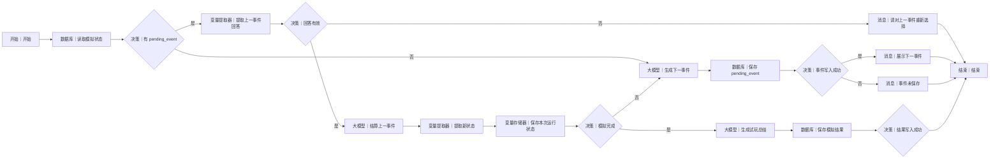

# WF-02 虚拟大学试玩

## 1. 目标与准备

用户确认画像后调用，在约 10～15 分钟按剩余学年进行情景推演，输出 `data.simulation_summary_json`。准备已确认 `profile_json`，逻辑存储键 `simulation_state`；模拟状态与 `main_plan` 严格分离，**不得覆盖正式画像或主规划**。

## 2. 最小可运行版

```text
开始 → 大模型（生成一轮试玩）→ 变量提取器（提取试玩结果）→ 结束
```

从左侧拖 1 个“大模型”和 1 个“变量提取器”到开始与结束之间，按图命名连线。开始映射 `AGENT_USER_INPUT`、`profile_json`；提取器输出 `simulation_summary_json`。本版一次生成完整试玩摘要，不支持逐轮选择和续接。

## 3. 完整业务版画布与搭建

完整跨轮画布、节点数量、拖拽连线和逐边映射统一见第 7 节。数据库动作**以当前编辑器显示为准**，不支持时改用“长期记忆检索/长期记忆写入”。

## 4. 配置与映射

`读取模拟状态` 用 `user_id + simulation_state`；先按 `pending_event` 是否存在进入“结算上一事件”或“生成下一事件”，无状态时依据年级初始化：大一最多 4 学年，大二最多 3，大三最多 2。`变量存储器` 保存 `current_year,event_index,resources,choices,opportunities_gained,opportunities_forgone,completed`，仅用于本次执行；跨会话仍写数据库/长期记忆。

提取用户选择时输入 `AGENT_USER_INPUT + current_event.options`，只接受当前选项编号或明确同义表达。保存节点写 `simulation_state` 或 `simulation_result`，不得写 `user_profile/main_plan`。写入检查规则同共享协议；失败返回 `write_failed` 但仍可把当前草稿交给用户复制保存。

## 5. 可复制的完整提示词

```text
你是“虚拟大学”主持人。这是情景推演，不是未来预测。
已确认画像：{{profile_json}}
当前状态：{{simulation_state}}
任务：仅生成当前一个关键事件，覆盖课程、社团、科研、比赛、实习、考试、转向或资源冲突之一；给 2～3 个真实可选方案。选择影响时间、精力、资金、能力、履历和机会，但不要显示可机械刷取的精确分数，不承诺录取或就业结果。若资料不足，用中性假设并标记 assumptions。
只输出 JSON：
{"event":{"year":"","index":1,"title":"","situation":"","options":[{"id":"A","text":"","tradeoffs":[""]}]},"assumptions":[],"reply":"请用户选择并说明可自定义"}
```

结算提示词：

```text
根据 {{simulation_state}}、{{current_event}} 和 {{selected_option}} 结算本轮。保持同一初始条件；描述变化方向，不给伪精确概率。记录得到和放弃的机会，不修改正式画像或主规划。只输出 JSON：
{"new_state":{"current_year":"","event_index":0,"resources":{"time":"充足|紧张|透支","energy":"充足|紧张|透支","money":"宽裕|可控|吃紧"},"choices":[],"opportunities_gained":[],"opportunities_forgone":[],"completed":false},"reply":"本轮后果和下一步"}
```

总结节点输出成长画像、关键选择、所得/放弃机会、可能毕业状态、主要风险、重来建议、免责声明，包装为 `simulation_summary_json`。

## 6. 调试、常见错误与验收清单

- 成功：大二画像、新状态，选择 A；观察事件索引增加、选择入栈、未写主规划。
- 缺失：无已确认画像时立即返回 `missing_required_field`，`next_action=confirm_profile`。
- 中断：完成一个事件后重新调用，应从同一 `event_index` 续接而非重开。
- 选项不匹配：走重新选择分支，不让模型自行替用户选。
- [ ] 剩余学年与年级一致，每学年 2～3 个事件的目标由状态控制。
- [ ] 成功和写入失败均产生共享包装；失败不声称已保存。
- [ ] 输出 `data.simulation_summary_json`，下一步可进 WF-03。

## 7. 完整业务版跨轮状态机、节点数量与逐边映射

完整画布包含数据库 3、大模型 3、变量提取器 2、变量存储器 1、决策 5、消息 3，另加开始和结束各 1。

摆放时把主线节点从开始右侧横向排列；把“回答无效”“事件未保存”消息放对应决策下方，把“生成试玩总结”支路放“模拟完成”下方；逐条从上游右侧连接点拖到下游左侧连接点，分支边分别选择图中的“是/否”。

清空画布到仅余开始/结束后，依次从左侧拖入并重命名“读取模拟状态、判断是否有 pending_event、提取上一事件回答、判断回答有效、结算上一事件、提取新状态、保存本次运行状态、判断模拟完成、生成下一事件、保存 pending_event、展示下一事件、生成试玩总结、保存模拟结果、检查写入结果、错误提示”，按下图连线。核心时序是：**有 `pending_event` 才把本轮输入当答案并结算；没有 `pending_event` 才生成事件，先保存后结束等待。**




逐边变量：A→B `user_id`；B→C `simulation_state,pending_event`；C是→D `AGENT_USER_INPUT,pending_event`；D→E `selected_option,is_valid`；E是→G `simulation_state,pending_event,selected_option`；G→H `model_text`；H→I `new_state`（必须清空已结算的 `pending_event`）；I→J `current_year,event_index,choices,completed`；C否/J否→K `profile_json,simulation_state`；K→L `event,user_id`；L→M `write_result`；J是→O `simulation_state`；O→P `simulation_summary_json,user_id`；P→Q `write_result`。

总结完整提示词：

```text
你是虚拟大学总结主持人。输入完整模拟状态 {{simulation_state}}。仅依据已结算 choices 生成成长画像、关键选择、获得机会、放弃机会、可能毕业状态、主要风险、重来建议和局限。使用“情景推演/可能”措辞，不给成功概率，不把模拟写成事实，不修改正式画像或主规划。必须包含统一免责声明原文：“每个人的大学都是独一无二的。模拟器给的是“地图”，但“走路”的人是你自己。勇敢去闯，错了也没关系——毕竟，大学本身就是试错成本最低的地方呀！”只输出 JSON：{"growth_profile":[],"key_choices":[],"opportunities_gained":[],"opportunities_forgone":[],"possible_graduation_state":"","risks":[],"replay_advice":[],"limitations":[],"disclaimer":""}
```

结束 `result_json`：事件保存成功为 `{"workflow_id":"WF-02","version":"1.0","status":"awaiting_user_input","reply":"{{event.reply}}","data":{"simulation_state":{{state}},"pending_event":{{event}}},"suggested_writes":[],"next_action":"answer_simulation_event","error":null}`；完成且结果写入成功为 `{"workflow_id":"WF-02","version":"1.0","status":"completed","reply":"试玩已完成，以下是情景推演总结。","data":{"simulation_summary_json":{{summary}}},"suggested_writes":[],"next_action":"start_adventure","error":null}`；回答无效为 `validation_failed`；任一读/写失败分别为 `read_failed/write_failed` 并填统一 `error`。
