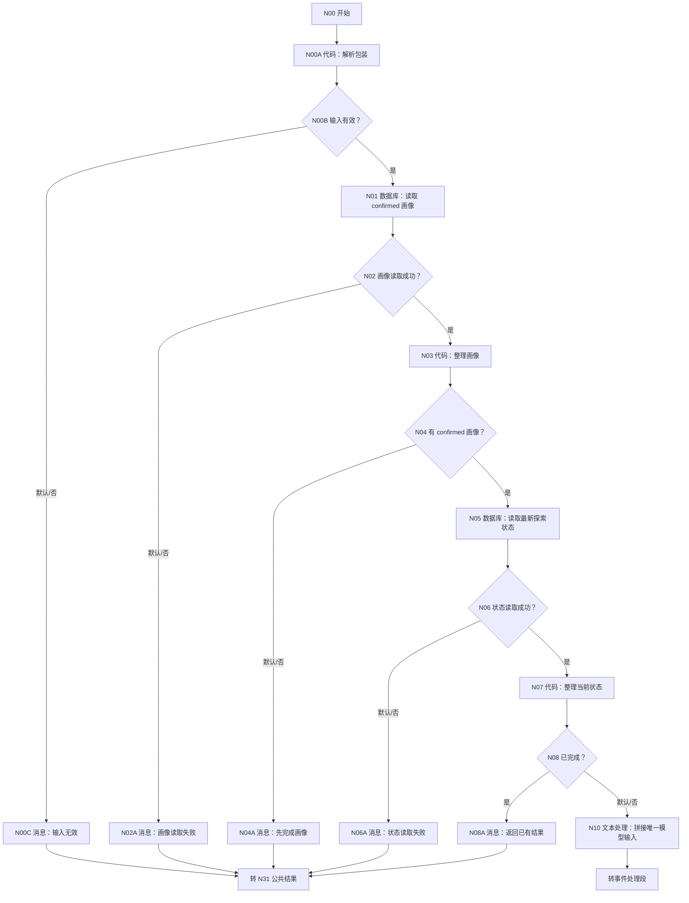
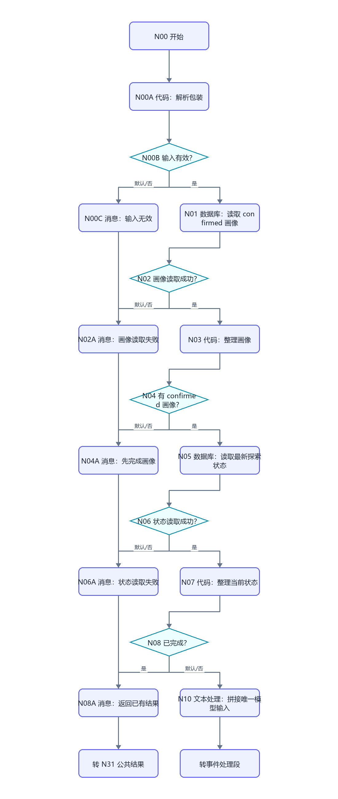
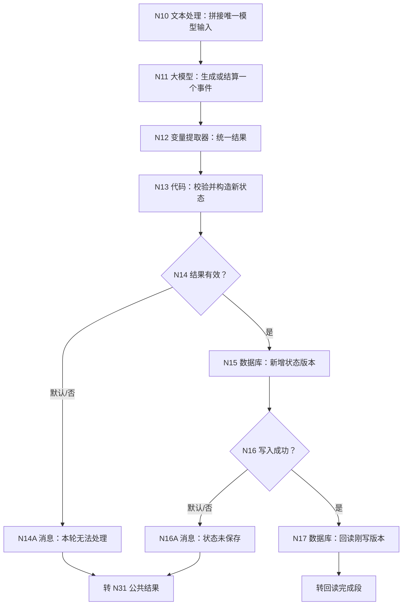
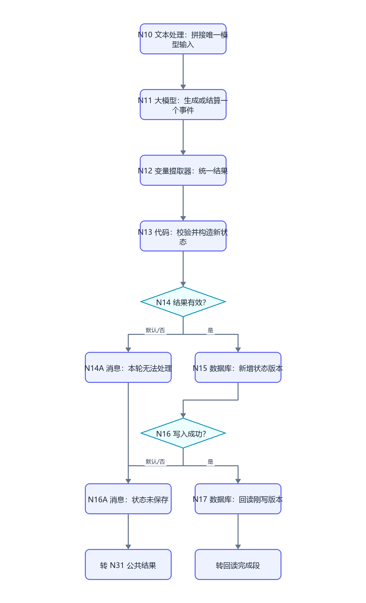
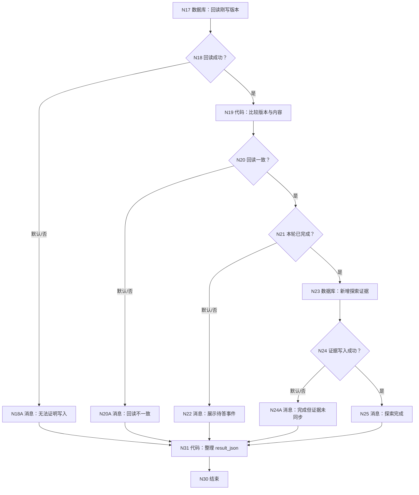
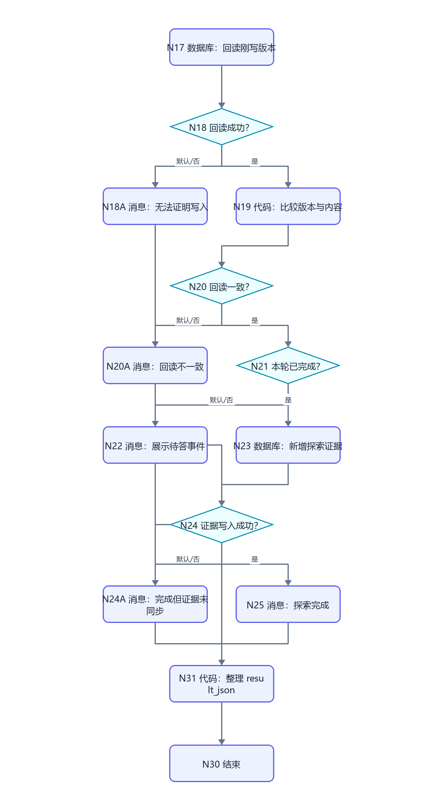

# WF-02 虚拟大学：逐节点搭建指南

<!-- AGENT-CONTRACT
start_inputs: AGENT_USER_INPUT:String
extractor_input_count: 1
result_output: result_json:String
-->

> 本工作流是已搭 WF-02 的最小迁移版：保留“一轮只处理一个事件”和 DB-02 续接状态，只替换入口、用户隔离、变量提取器接线、失败出口与 MCP 返回。它不能调用其他工作流；前置画像由自己读取。

## 1. 业务目标与调用边界

WF-02 根据已确认画像生成 3～5 个虚拟大学事件。每次调用只做一件事：首次展示一个事件，或结算当前事件并展示下一事件，或完成探索并沉淀结果。用户只说自然语言，例如“我想体验一下大学生活”“我选先参加社团招新”。

返回 `awaiting_user` 时，MAIN 必须结束本轮，不能替用户回答事件。完成后才允许 MAIN 在同一轮继续调用 WF-04。

## 2. 旧画布的最小修改

| 已搭区域 | 保留 | 必改 |
|---|---|---|
| 开始节点 | 原位置和连线 | 只留 `AGENT_USER_INPUT:String` |
| 画像读取 | 读取 DB-01 | 改为内部按 `user_key` 读取 confirmed 画像 |
| 状态读取 | DB-02 最新状态 | 使用 `user_key + workflow_id='WF-02'` |
| 事件生成/结算 | 一轮一个事件 | 上下文先经文本处理拼接；变量提取器只引用一个 output |
| 状态保存 | 多轮续接 | 每轮新增 `state_version`，不用入口时间 |
| 完成结果 | 原结论 | 同步到 DB-03，再返回紧凑 `result_json` |
| 所有错误路线 | 保留 | 补默认出口并汇入 N31，不能悬空 |

## 3. 数据表与字段

- DB-01 `user_profiles`：只接受 `pending_status='confirmed'` 且 `profile_json` 非空。
- DB-02 `simulation_states`：保存每一版已结算状态和唯一 pending 事件。
- DB-03 `route_assessments`：完成时新增 WF-02 探索证据。

DB-02 的 `state_json` 建议结构：

```json
{"choices":[],"scores":{"exploration":0,"execution":0,"collaboration":0,"resilience":0},"summary":"","result":{"strengths":[],"risks":[],"route_clues":[]}}
```

`pending_item_json` 只保存尚未回答的事件；已经回答的内容必须进入 `state_json`，避免下一轮重复结算。

## 4. 完整画布













## 5. N00～N00C：单参数入口

### 5.1 N00 开始

删除旧 `uid/request_time/session_id/state_id` 等输入，只添加：

| 参数名 | 类型 | 必填 |
|---|---|---|
| `AGENT_USER_INPUT` | String | 是 |

调试台中的值是 MAIN 会传入的内部包装，不是终端用户输入格式：

```json
{"user_key":"uk_0123456789abcdef0123456789abcdef","user_input":"我想体验一下虚拟大学"}
```

### 5.2 N00A 代码：解析包装

输入 `raw_input` 引用 `开始/AGENT_USER_INPUT`。代码节点不添加 import：

```python
def unescape_json_string(text):
    result = ""
    i = 0
    while i < len(text):
        ch = text[i]
        if ch != "\\":
            result += ch
            i += 1
            continue
        i += 1
        if i >= len(text):
            return "", False
        esc = text[i]
        mapping = {'"': '"', "\\": "\\", "/": "/", "b": "\b", "f": "\f", "n": "\n", "r": "\r", "t": "\t"}
        if esc in mapping:
            result += mapping[esc]
        else:
            return "", False
        i += 1
    return result, True


def parse_flat_object(raw):
    text = str(raw).strip()
    if len(text) < 2 or text[0] != "{" or text[-1] != "}":
        return {}, False
    body = text[1:-1]
    pairs = []
    current = ""
    quoted = False
    escaped = False
    for ch in body:
        if escaped:
            current += ch
            escaped = False
        elif ch == "\\":
            current += ch
            escaped = True
        elif ch == '"':
            current += ch
            quoted = not quoted
        elif ch == "," and not quoted:
            pairs.append(current)
            current = ""
        else:
            current += ch
    pairs.append(current)
    output = {}
    for pair in pairs:
        quoted = False
        escaped = False
        split_at = -1
        for index, ch in enumerate(pair):
            if escaped:
                escaped = False
            elif ch == "\\":
                escaped = True
            elif ch == '"':
                quoted = not quoted
            elif ch == ":" and not quoted:
                split_at = index
                break
        if split_at < 0:
            return {}, False
        key = pair[:split_at].strip()
        value = pair[split_at + 1:].strip()
        if len(key) < 2 or key[0] != '"' or key[-1] != '"' or len(value) < 2 or value[0] != '"' or value[-1] != '"':
            return {}, False
        key_value, key_ok = unescape_json_string(key[1:-1])
        text_value, value_ok = unescape_json_string(value[1:-1])
        if not key_ok or not value_ok or key_value in output:
            return {}, False
        output[key_value] = text_value
    return output, True


def main(raw_input):
    payload, parsed = parse_flat_object(raw_input)
    user_key = str(payload.get("user_key", "")).strip()
    user_input = str(payload.get("user_input", "")).strip()
    key_ok = len(user_key) == 35 and user_key.startswith("uk_")
    if key_ok:
        for ch in user_key[3:]:
            if ch not in "0123456789abcdef":
                key_ok = False
                break
    valid = parsed and set(payload.keys()) == {"user_key", "user_input"} and key_ok and 0 < len(user_input) <= 4000
    error = "" if valid else "内部调用包装无效：必须只含 user_key 和非空 user_input。"
    return {"user_key": user_key, "user_input": user_input, "input_valid": valid, "input_error": error}
```

输出逐项声明：`user_key:String`、`user_input:String`、`input_valid:Boolean`、`input_error:String`。

N00B 配置 `N00A/input_valid == true`；“是”到 N01，“否则”到 N00C。N00C 显示“内部输入格式无效，本轮没有读取或写入数据”，随后连接 N31。

## 6. N01～N09：前置画像和当前状态

### 6.1 N01 数据库：读取 confirmed 画像

模式选“自定义 SQL”，数据库 `university`。输入参数 `user_key:String` 引用 N00A/user_key：

```sql
SELECT id, user_key, profile_json, pending_status, record_version, create_time
FROM user_profiles
WHERE user_key='{{user_key}}' AND pending_status='confirmed'
ORDER BY record_version DESC, create_time DESC
LIMIT 1;
```

输出保持平台默认 `isSuccess:Boolean`、`message:String`、`outputList:Array<Object>`。N02 的“是”条件是 N01/isSuccess 等于 true；默认到 N02A。

### 6.2 N03 代码：整理画像

输入 `rows` 引用 N01/outputList：

```python
def main(rows):
    items = rows if isinstance(rows, list) else []
    row = items[0] if items and isinstance(items[0], dict) else {}
    profile_json = str(row.get("profile_json", "")).strip()
    has_profile = bool(profile_json and profile_json != "{}")
    return {"has_profile": has_profile, "profile_json": profile_json}
```

输出 `has_profile:Boolean`、`profile_json:String`。N04 判断 has_profile=true；默认到 N04A，回复“请先完成并确认用户画像，再开始虚拟大学探索”。

### 6.3 N05 数据库：读取 WF-02 最新状态

输入 `user_key` 引用 N00A/user_key：

```sql
SELECT id, user_key, state_id, workflow_id, state_type, state_json,
       pending_item_json, state_version, current_index, completed, create_time
FROM simulation_states
WHERE user_key='{{user_key}}' AND workflow_id='WF-02'
ORDER BY state_version DESC, create_time DESC
LIMIT 1;
```

N06 按 isSuccess 分支；默认到 N06A。

### 6.4 N07 代码：整理状态

输入：`rows=N05/outputList`、`user_key=N00A/user_key`。

```python
def main(rows, user_key):
    items = rows if isinstance(rows, list) else []
    row = items[0] if items and isinstance(items[0], dict) else {}
    has_state = bool(row)
    state_id = str(row.get("state_id", "")).strip()
    if not state_id:
        state_id = "sim_" + str(user_key)[3:15]
    state_json = str(row.get("state_json", "{}")).strip() or "{}"
    pending = str(row.get("pending_item_json", "{}")).strip() or "{}"
    completed = str(row.get("completed", "false")).lower() == "true"
    has_pending = pending not in ["", "{}", "[]", "null"]
    try:
        version = int(row.get("state_version", 0))
    except Exception:
        version = 0
    try:
        current_index = int(row.get("current_index", 0))
    except Exception:
        current_index = 0
    return {
        "has_state": has_state, "state_id": state_id, "state_json": state_json,
        "pending_item_json": pending, "completed": completed,
        "has_pending": has_pending, "next_version": version + 1,
        "current_index": current_index
    }
```

输出分别声明 `has_state:Boolean`、`state_id:String`、`state_json:String`、`pending_item_json:String`、`completed:Boolean`、`has_pending:Boolean`、`next_version:Integer`、`current_index:Integer`。

N08：completed=true → N08A；默认 → N10。N08A 返回已有完成结果，不再新增状态。这里不再让 N09 把画布拆成两套几乎相同的模型链；是否有 pending 作为 N10 拼接文本中的一个事实交给同一套节点处理，因此后面的数据库节点永远只引用一条确定的上游路线。

## 7. N10～N16：统一模型链和状态写入

### 7.1 N10 文本处理

选择“拼接文本”，按下面顺序添加固定标签和上游引用，输出一个 String：

```text
confirmed_profile={{N03/profile_json}}
settled_state={{N07/state_json}}
pending_event={{N07/pending_item_json}}
has_pending={{N07/has_pending}}
current_index={{N07/current_index}}
latest_user_input={{N00A/user_input}}
```

这一步专门解决平台变量提取器只能有一个输入的问题。不要把任何其他变量直接接到 N12。

### 7.2 N11 大模型：生成或结算一个事件

用户提示只引用 N10/output。系统提示词：

```text
你是虚拟大学单事件引擎。输入包含 confirmed_profile、settled_state、pending_event、has_pending、current_index 和 latest_user_input。
若 has_pending=false：结合画像与已结算状态生成一个现实、安全、尚未回答的新事件；不要把“想体验”当成事件答案。
若 has_pending=true：只结算 pending_event 一次。回答明显无关时 accepted=false，原状态不得改变。
每个事件给 2～4 个参考选项，同时允许自由回答。总事件数 3～5；证据足够时 completed=true，否则必须给出一个 next_event_json。
模拟选择不能写成真实经历或真实履历。只输出一个 JSON 对象，不输出 Markdown：
{"accepted":true,"new_state_json":"完整已结算状态 JSON 字符串","next_event_json":"一个待答事件 JSON 字符串或 {}","next_index":1,"completed":false,"display_reply":"面向用户的反馈和当前事件","result_summary":"完成时结果 JSON，否则 {}","structure_complete":true}
```

### 7.3 N12 变量提取器：唯一 input

固定 `input:String` 只引用 N11/output。输出逐项声明：

| 变量 | 类型 |
|---|---|
| `accepted` | Boolean |
| `new_state_json` | String |
| `next_event_json` | String |
| `next_index` | Integer |
| `completed` | Boolean |
| `display_reply` | String |
| `result_summary` | String |
| `structure_complete` | Boolean |

### 7.4 N13 代码：确定性校验和写入对象

输入为 N12 的八项输出，以及 N07/state_id、N07/state_json、N07/pending_item_json、N07/has_pending、N07/next_version、N07/current_index：

```python
def main(accepted, new_state_json, next_event_json, next_index, completed,
         display_reply, result_summary, structure_complete, state_id,
         old_state_json, old_pending_json, has_pending, next_version, old_index):
    state = str(new_state_json).strip()
    pending = str(next_event_json).strip() or "{}"
    reply = str(display_reply).strip()
    is_complete = completed is True
    valid = accepted is True and structure_complete is True and state not in ["", "null"] and bool(reply)
    if has_pending is True and accepted is not True:
        valid = False
    if is_complete and pending not in ["{}", "[]", "null"]:
        valid = False
    if not is_complete and pending in ["{}", "[]", "null"]:
        valid = False
    try:
        index_value = int(next_index)
        version_value = int(next_version)
    except Exception:
        valid = False
        index_value = int(old_index)
        version_value = 0
    return {
        "result_valid": valid,
        "state_id_out": str(state_id),
        "state_json_out": state if valid else str(old_state_json),
        "pending_out": "{}" if valid and is_complete else (pending if valid else str(old_pending_json)),
        "state_version_out": version_value,
        "current_index_out": index_value if valid else int(old_index),
        "completed_out": "true" if valid and is_complete else "false",
        "display_reply": reply,
        "result_summary": str(result_summary).strip() or "{}"
    }
```

输出声明：`result_valid:Boolean`、`state_id_out:String`、`state_json_out:String`、`pending_out:String`、`state_version_out:Integer`、`current_index_out:Integer`、`completed_out:String`、`display_reply:String`、`result_summary:String`。

N14 配置 result_valid=true → N15，默认 → N14A。N14A 回复“当前回答无法可靠结算，本轮没有改变探索状态；请直接回答当前事件”。

### 7.5 N15 新增 DB-02 版本

所有动态值都来自唯一上游 N13，因此数据库的“完整变量列表”不会要求跨分支引用：

| 字段 | 值 |
|---|---|
| user_key | N00A/user_key |
| state_id | N13/state_id_out |
| workflow_id | 固定 WF-02 |
| state_type | 固定 simulation |
| state_json | N13/state_json_out |
| pending_item_json | N13/pending_out |
| state_version | N13/state_version_out |
| current_index | N13/current_index_out |
| completed | N13/completed_out |

N16：N15/isSuccess=true → N17；默认 → N16A。N16A 回复“本轮事件已生成或结算，但状态没有保存，请稍后重试”。

## 8. N17～N25：回读和完成证据

### 8.1 N17 回读刚写版本

输入 `user_key=N00A/user_key`、`state_id=N13/state_id_out`、`state_version=N13/state_version_out`：

```sql
SELECT id, user_key, state_id, state_json, pending_item_json, state_version,
       current_index, completed, create_time
FROM simulation_states
WHERE user_key='{{user_key}}' AND workflow_id='WF-02'
  AND state_id='{{state_id}}' AND state_version={{state_version}}
ORDER BY create_time DESC
LIMIT 1;
```

N18：N17/isSuccess=true → N19；默认 → N18A。

### 8.2 N19 比较回读

输入 `rows=N17/outputList`、`expected_state_id=N13/state_id_out`、`expected_version=N13/state_version_out`、`expected_completed=N13/completed_out`：

```python
def main(rows, expected_state_id, expected_version, expected_completed):
    items = rows if isinstance(rows, list) else []
    row = items[0] if items and isinstance(items[0], dict) else {}
    try:
        version_ok = int(row.get("state_version", -1)) == int(expected_version)
    except Exception:
        version_ok = False
    completed_value = str(row.get("completed", "false")).lower()
    matches = bool(row) and str(row.get("state_id", "")) == str(expected_state_id) and version_ok and completed_value == str(expected_completed).lower()
    return {"readback_matches": matches, "completed_readback": completed_value == "true"}
```

输出 `readback_matches:Boolean`、`completed_readback:Boolean`。N20 默认到 N20A；一致到 N21。N21 completed_readback=true → N23，默认 → N22。N22 引用 N13/display_reply 展示当前待答事件。

### 8.3 N23 写入 DB-03 探索证据

先在 N13 同一路线后增加一个简单代码输出 `assessment_id="ev_" + state_id_out`，或直接把前缀和 N13/state_id_out 用文本处理拼成一个 String；N23 的“完整变量列表”只能选择这个上游结果。新增字段：

| 字段 | 值 |
|---|---|
| user_key | N00A/user_key |
| assessment_id | 上游拼好的 `ev_<state_id>` |
| simulation_result_json | N13/result_summary |
| adventure_result_json | `{}` |
| route_recommendation_json | `{}` |
| evidence_sources | WF-02 |
| evidence_gaps_json | `["WF-03"]` |
| confidence_level | medium |
| trigger_reason | virtual_university_completed |
| knowledge_version | 空 String |
| assessment_version | N13/state_version_out |

N24：N23/isSuccess=true → N25；默认 → N24A。N25 引用 N13/display_reply，补充“可继续生存大冒险或进行路径推荐”。N24A 明确说明“探索状态已完成，但证据同步失败”，避免 MAIN 继续调用 WF-04。

## 9. N31 公共结果和 N30 结束

所有终态消息连接 N31。输入：`input_valid=N00A/input_valid`、`profile_read_success=N01/isSuccess`、`has_profile=N03/has_profile`、`state_read_success=N05/isSuccess`、`completed_before=N07/completed`、`result_valid=N13/result_valid`、`display_reply=N13/display_reply`、`completed_after=N19/completed_readback`、`state_write_success=N15/isSuccess`、`readback_success=N17/isSuccess`、`readback_matches=N19/readback_matches`、`evidence_write_success=N23/isSuccess`。所有引用节点在 N31 前，未执行的下游写入值按空值处理。

```python
def quote(value):
    text = str(value) if value is not None else ""
    return '"' + text.replace("\\", "\\\\").replace('"', '\\"').replace("\n", "\\n").replace("\r", "\\r") + '"'


def main(input_valid, profile_read_success, has_profile, state_read_success, completed_before,
         result_valid, display_reply, completed_after, state_write_success,
         readback_success, readback_matches, evidence_write_success):
    status, reply, next_action, error_code = "needs_input", "请先完成前置信息。", "complete_profile", "none"
    if input_valid is not True:
        status, reply, next_action, error_code = "validation_failed", "内部输入格式无效，本轮未处理。", "retry_same_message", "invalid_envelope"
    elif profile_read_success is not True or state_read_success is not True:
        status, reply, next_action, error_code = "read_failed", "暂时无法读取画像或探索状态，本轮没有写入。", "retry_later", "read_failed"
    elif has_profile is not True:
        status, reply, next_action = "needs_input", "请先完成并确认用户画像，再开始虚拟大学。", "complete_profile"
    elif completed_before is True:
        status, reply, next_action = "completed", "虚拟大学探索已经完成，不会重复生成状态。", "choose_wf03_or_wf04"
    elif result_valid is not True:
        status, reply, next_action, error_code = "needs_input", "当前回答无法可靠结算，本轮没有改变状态。请直接回答当前事件。", "answer_current_event", "unhandled_answer"
    elif state_write_success is not True or readback_success is not True or readback_matches is not True:
        status, reply, next_action, error_code = "write_failed", "本轮结果没有通过写入回读校验，请稍后重试。", "retry_later", "state_readback_failed"
    elif completed_after is True:
        if evidence_write_success is True:
            status, reply, next_action = "completed", str(display_reply), "choose_wf03_or_wf04"
        else:
            status, reply, next_action, error_code = "write_failed", "探索状态已完成，但证据没有同步到推荐库。", "retry_evidence_sync", "evidence_write_failed"
    else:
        status, reply, next_action = "awaiting_user", str(display_reply), "answer_current_event"
    result = "{" + '"workflow_id":"WF-02",' + '"status":' + quote(status) + "," + '"reply":' + quote(reply) + "," + '"next_action":' + quote(next_action) + "," + '"error_code":' + quote(error_code) + "}"
    return {"result_json": result}
```

输出只声明 `result_json:String`。N30 选择“返回参数，由工作流生成”，参数 `result_json` 引用 N31/result_json。

## 10. 调试指南

### 10.1 前置准备

1. 用 WF-01 在同一个 `user_key` 下生成并确认画像。
2. 确认 DB-01 有 confirmed 行；DB-02 暂无该 key 的 WF-02 行。
3. 调试时每一轮都把自然语言放入包装里的 `user_input`，`user_key` 保持相同。

### 10.2 正常多轮路线

| 轮次 | user_input 示例 | 必经路线 | 预期数据库/结果 |
|---|---|---|---|
| 1 | 我想体验虚拟大学 | N00→N01→N03→N05→N07→N10→N11→N12→N13→N15→N17→N19→N22 | DB-02 version=1、pending 非空；status=awaiting_user |
| 2 | 我会先去社团摊位问清楚时间投入 | N10→N11 结算→N12→N13→N15→N17→N19→N22 | version=2；旧事件只结算一次；出现下一事件 |
| 3～5 | 对当前事件的自然回答 | 同上 | version 递增，不覆盖历史 |
| 完成轮 | 对最后事件的回答 | N21 是→N23→N24 是→N25 | DB-02 completed=true；DB-03 有 WF-02 证据；status=completed |

逐节点检查：变量提取器右侧“完整变量列表”中 N12 只选 N11/output；N10 才负责把画像、状态、pending、用户回答拼成一个 String。N15 数据库只选择 N13 这个确定上游节点里的动态写入值。

### 10.3 另一条路与故障定位

1. 包装错误：N00B 默认，任何数据库节点不执行。
2. DB-01 SQL 成功空数组：N03/has_profile=false，走 N04A，不走读取失败。
3. DB-01 SQL 失败：临时改错表名，N02 默认；恢复后再测。
4. 另一 user_key 已有画像：当前 key 仍应走 N04A，证明隔离有效。
5. DB-02 空数组：N07/has_state=false、next_version=1，仍走统一 N10。
6. DB-02 读取失败：N06 默认，模型不执行。
7. 已有 pending：N11 必须进入结算语义，不能再次生成第二个 pending。
8. 无关回答：让 N12/accepted=false，N14 默认；DB-02 不新增版本。
9. 模型漏字段：structure_complete=false，N14 默认。
10. 写入失败：临时改错 N15 字段名，N16 默认；恢复配置。
11. 写入成功但回读 SQL 失败：N18 默认，不能向用户宣称保存成功。
12. 回读版本不一致：临时把 N19/expected_version 改错，N20 默认。
13. 完成证据写失败：N24 默认，返回 retry_evidence_sync，不重复结算事件。
14. 已完成后重入：N08 是，DB-02 不增加新行。

## 11. 发布为 MAIN 内部工具

发布名称：`ULPS_WF02_VIRTUAL_UNIVERSITY`。工具描述：`在 confirmed 用户画像基础上开始或续接虚拟大学单事件探索；输入内部两字段包装；返回当前事件、完成结果或可处理错误。`

发布后到 MAIN 的“智能决策”节点添加“个人发布的 MCP Server”中的该工具。不要在 WF-02 内增加同类节点。平台审核未通过前，先完成画布调试；审核通过后在“发布管理→详情→Trace”核对 MAIN 传入的仍只有一个字符串参数。

## 12. 验收清单

- [ ] 开始节点只有 `AGENT_USER_INPUT:String`。
- [ ] 用户无需看到包装、user_key、SQL 或平台 uid。
- [ ] DB-01、DB-02、DB-03 都按 user_key 隔离。
- [ ] N12 变量提取器只有唯一 input 引用 N11/output。
- [ ] 每轮至多结算一个 pending 事件。
- [ ] 无关回答不改变状态。
- [ ] 每个数据库写入都检查 isSuccess，状态写入还有回读比较。
- [ ] 所有分支器有默认出口，所有消息进入 N31。
- [ ] N30 只返回 `result_json:String`。
- [ ] 正常、空数组、隔离、失败、回读不一致、已完成重入均已实测。
