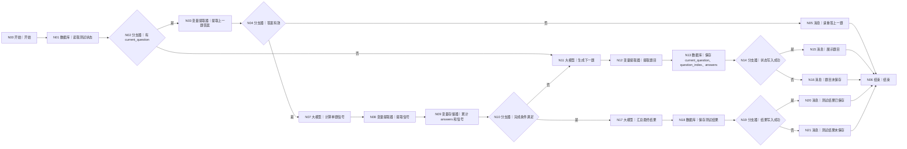
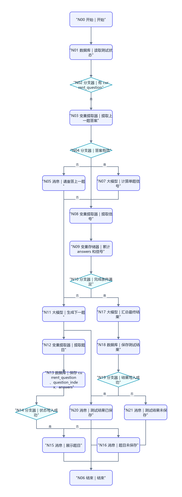

# WF-03 大学生存大冒险

## 1. 目标与准备

主 Agent 在用户开始场景测试或继续未完成测试时调用。输入 `uid`、`AGENT_USER_INPUT`、可选 `profile_json`/`adventure_state`；输出 `data.adventure_result_json`，同时包含五条路径信号与八项竞争力信号，不直接给最终推荐。

## 2. 最小可运行版

```text
开始 → 问答节点（场景题）→ 大模型（汇总信号）→ 变量提取器（提取结果）→ 结束
```

从左侧拖入“问答节点”“大模型”“变量提取器”，依次放在开始右侧并连到结束。问答节点填 3～5 道场景题（期末安排、社团换届、多任务冲突等）；具体题目/答案配置字段按本文件逐栏配置。若问答节点不能多轮收集，改由大模型每次出一题并按完整版分段调用。

## 3. 完整业务版画布与搭建

完整跨轮画布、节点数量、拖拽连线和逐边映射统一见第 6 节。

## 4. 映射和完整提示词

状态字段：`question_index,answers,signal_evidence,completed`。答案提取器输入 `AGENT_USER_INPUT,current_question`，输出 `answer_id,custom_answer,is_valid`。禁止仅凭选项字母固定贴标签；每个信号必须保留场景和行为依据。

```text
你是大学生存大冒险主持人。根据当前题号 {{question_index}}、已有答案 {{answers}} 和可选画像 {{profile_json}}，生成一道人生场景题。题目应涉及真实资源冲突，每题给 3 个都可辩护的选项，并允许用户自定义；不要设计“明显正确答案”，不要制造焦虑。
只输出 JSON：{"question":{"id":"Q1","scene":"","options":[{"id":"A","text":"","tradeoff":""}]},"reply":"请作答"}
```

```text
你是测评解释器。依据全部答案 {{answers}} 和逐题证据 {{signal_evidence}} 汇总，不得虚构未发生的行为，不输出伪精确成功率。路径维度必须完整包含 保研、考研、就业、考公、留学；竞争力维度必须完整包含 执行、研究、创造、表达、协作、稳定、适应、风险承受。结果需包含优势、潜在短板、依据、待验证假设；分值只作内部相对信号，面向用户用高/中/待验证描述。
只输出 JSON：
{"path_signals":{"保研":"","考研":"","就业":"","考公":"","留学":""},"competency_signals":{"执行":"","研究":"","创造":"","表达":"","协作":"","稳定":"","适应":"","风险承受":""},"strengths":[],"gaps":[],"evidence":[],"assumptions_to_validate":[],"reply":""}
```

数据库键分别为 `adventure_state` 和 `adventure_result`；具体更新操作以当前编辑器为准，不支持则使用长期记忆节点。写入失败返回草稿和 `write_failed`。

## 5. 调试、错误处理与验收清单

- 成功：依次回答期末安排和导师项目/实习冲突；观察 `answers` 追加而非覆盖，八项和五路径字段齐全。
- 缺失：输入不对应任何选项，`is_valid=false`，不得推进题号。
- 中断续接：新会话读取保存状态，下一题号正确。
- JSON 缺维度：变量提取器/分支器拦截，重试一次；仍缺失返回 `missing_required_field`。
- [ ] 有多轮控制（迭代或分段调用）和答案累计。
- [ ] 结果包含依据、短板和待验证假设，而非单标签。
- [ ] 输出 `data.adventure_result_json` 供 WF-04 使用。

## 6. 完整业务版跨轮状态机、节点数量与逐边映射

完整画布包含数据库 3、大模型 3、变量提取器 3、变量存储器 1、分支器 5、消息 5，另加开始和结束各 1。

把正常路径从开始右侧横向摆放；无效答案、状态写入失败放各自分支器下方，最终汇总支路放“完成条件满足”下方。按 Mermaid 顺序逐个重命名，再从每个节点右侧连接点拖到目标左侧，给所有分支器边填写图示条件。

拖拽后依次重命名为“读取测试状态、判断有 current_question、提取上一题答案、判断答案有效、计算单题信号、提取信号、累计答案、判断题目完成、生成下一题、提取题目、保存测试状态、展示题目、汇总最终结果、保存测试结果、检查写入、错误提示”，按图连接。





完成条件固定为：`answers.length >= configured_question_count`（建议 5，实际上限以当前编辑器为准）且每题均含 `question_id,answer,evidence,route_delta,competency_delta`。未满足时不得调用“汇总最终结果”。每次保存 `current_question,question_index,answers,signal_evidence,configured_question_count`；结算后清空旧 `current_question` 再生成下一题。

答案提取提示词：`仅判断用户输入是否回答 current_question；输出 {"answer_id":null,"custom_answer":null,"is_valid":false,"reason":""}。编号匹配或语义明确的自定义方案才有效，不得用新输入回答尚未展示的题。` 单题信号规则：五路径和八竞争力均输出 `-1/0/1` 的内部方向值及文字 evidence；禁止直接把单题信号当最终标签，矛盾答案并存并在最终结果中列为待验证假设。

逐边变量：A→B `uid`；B→C 全部测试状态；C是→D `AGENT_USER_INPUT,current_question`；E是→G `current_question,answer`；G→H `signal_json`；H→I `answer,evidence,route_delta,competency_delta,answers`；I→J `answers.length,configured_question_count`；C否/J否→K `question_index,answers,profile_json`；K→L `model_text`；L→M `current_question,question_index+1,answers,uid`；J是→P `answers,signal_evidence`；P→Q `adventure_result_json,uid`。

结束 `result_json`：题目已保存为 `{"workflow_id":"WF-03","version":"1.0","status":"awaiting_user_input","reply":"{{question.reply}}","data":{"adventure_state":{"current_question":{{question}},"question_index":{{index}},"answers":{{answers}}}},"suggested_writes":[],"next_action":"answer_adventure_question","error":null}`；完成写入成功为 `{"workflow_id":"WF-03","version":"1.0","status":"completed","reply":"场景测试已完成。","data":{"adventure_result_json":{{result}}},"suggested_writes":[],"next_action":"recommend_routes","error":null}`；答案无效为 `validation_failed`；读写错误分别为 `read_failed/write_failed`。

## 节点逐项配置

<!-- GENERATED-NODE-LEDGER:START -->
### 画布节点连线与页面输入输出总表

本表由流程图生成，用于防止漏连。‘直接上游’决定页面引用下拉框中可选的数据来源；具体变量名以本文件后续业务映射表为准。
开始节点类型规则：`uid/session_id/AGENT_USER_INPUT` 及所有 `*_json/*_token/*_id` 均选 String；计数、天数选 Integer；真伪开关选 Boolean。表中未特别标注的输入一律选 String，JSON 作为字符串传递。

| 节点 | 类型 | 直接上游（输入来源） | 固定/声明输出 | 直接下游 |
|---|---|---|---|---|
| `A` N00 开始｜开始 | 开始 | 无（起点） | 开始节点中声明的同名变量 | B |
| `B` N01 数据库｜读取测试状态 | 数据库 | A | `isSuccess:Boolean`、`message:String`、`outputList:Array<Object>` | C |
| `C` N02 分支器｜有 current_question | 分支器 | B | 不产生业务变量；按条件输出连线 | D（是）、K（否） |
| `D` N03 变量提取器｜提取上一题答案 | 变量提取器 | C | `selected_option:String`（当前题答案）、`answer_valid:Boolean`（是否匹配选项） | E |
| `E` N04 分支器｜答案有效 | 分支器 | D | 不产生业务变量；按条件输出连线 | F（否）、G（是） |
| `F` N05 消息｜请重答上一题 | 消息 | E | 不新增业务变量；回答内容引用上游变量 | Z |
| `Z` N06 结束｜结束 | 结束 | F、O、X、RS、RF | `output` 引用上游最终结果 | 无；必须在正文说明为何终止或转入下一张图 |
| `G` N07 大模型｜计算单题信号 | 大模型 | E | `output:String` | H |
| `H` N08 变量提取器｜提取信号 | 变量提取器 | G | `signal_json:String`（本题五路径与八项能力信号 JSON） | I |
| `I` N09 变量存储器｜累计 answers 和信号 | 变量存储器 | H | 设置或获取的同名变量 | J |
| `J` N10 分支器｜完成条件满足 | 分支器 | I | 不产生业务变量；按条件输出连线 | K（否）、P（是） |
| `K` N11 大模型｜生成下一题 | 大模型 | C、J | `output:String` | L |
| `L` N12 变量提取器｜提取题目 | 变量提取器 | K | `question_json:String`（下一题及选项 JSON） | M |
| `M` N13 数据库｜保存 current_question、question_index、answers | 数据库 | L | `isSuccess:Boolean`、`message:String`、`outputList:Array<Object>` | N |
| `N` N14 分支器｜状态写入成功 | 分支器 | M | 不产生业务变量；按条件输出连线 | O（是）、X（否） |
| `O` N15 消息｜展示题目 | 消息 | N | 不新增业务变量；回答内容引用上游变量 | Z |
| `X` N16 消息｜题目未保存 | 消息 | N | 不新增业务变量；回答内容引用上游变量 | Z |
| `P` N17 大模型｜汇总最终结果 | 大模型 | J | `output:String` | Q |
| `Q` N18 数据库｜保存测试结果 | 数据库 | P | `isSuccess:Boolean`、`message:String`、`outputList:Array<Object>` | R |
| `R` N19 分支器｜结果写入成功 | 分支器 | Q | 不产生业务变量；按条件输出连线 | RS（是）、RF（否） |
| `RS` N20 消息｜测试结果已保存 | 消息 | R | 不新增业务变量；回答内容引用上游变量 | Z |
| `RF` N21 消息｜测试结果未保存 | 消息 | R | 不新增业务变量；回答内容引用上游变量 | Z |
<!-- GENERATED-NODE-LEDGER:END -->

> 本节必须与[平台 UI 配置契约](PLATFORM-UI-CONTRACT.md)一起使用。先按流程图编号拖入节点并连线，再配置节点；未连线时下游“引用”下拉框会显示暂无数据。

### 本工作流所有节点的页面填写顺序

1. **开始**：按下方开始输入表逐行“+ 添加”，变量名、类型和必填状态照表填写。
2. **自定义 SQL 数据库**：输入参数选择引用；读取结果只使用固定输出 `isSuccess:Boolean`、`message:String`、`outputList:Array<Object>`。
3. **表单新增/更新数据库**：选择 `university / 目标表`；新增在“设置新增数据”逐字段添加，更新先在“设置数据范围”配置 AND 条件，再在“设置更新数据”逐字段添加；固定输出仍为 `isSuccess/message/outputList`。
4. **大模型**：输入参数名与 `{{变量名}}` 完全一致；系统提示词放角色、规则和 JSON 结构，用户提示词只放本轮变量；输出 `output:String`。
5. **变量提取器**：输入固定为 `input｜引用｜上游大模型/output`；每个输出必须填写变量名、类型和提取描述，复杂 JSON 先用 String。
6. **代码**：仅使用 Python `def main(...): return {...}`；输入名与形参一致，输出区声明每个返回键及类型。
7. **分支器**：左侧选上游变量，条件选“等于”等操作；与字面量比较时比较类型选常量/固定值；每条分支和默认分支都必须连接。
8. **消息**：输入区引用需要展示的变量，在“回答内容”用 `{{变量名}}`；流式输出关闭；消息后连接共享结束。
9. **结束**：回答模式选“返回设定格式配置的回答”，输出设置 `output｜引用｜上游最终结果`。所有成功、失败、待补充消息都进入同一个结束节点。

本节的通用点击位置、建表入口、导入按钮和数据库节点输出解释见[数据库从零教程](../database/README.md)；请先完成该教程，再按本节配置当前 WF。

创建 `simulation_states` 和 `route_assessments`，上传 [DB-02](../database/import-templates/DB-02-simulation-states.xlsx) 与 [DB-03](../database/import-templates/DB-03-route-assessments.xlsx)。

| 开始输入 | 来源 | 调试值 |
|---|---|---|
| `AGENT_USER_INPUT` | 开始节点 | 首轮“开始测试”，下一轮输入选项 |
| `uid` | 主 Agent | `test_user_001` |
| `profile_json` | DB-01 | 已确认画像 |

“读取测试状态”选择 `simulation_states`：

```sql
SELECT * FROM simulation_states
WHERE uid='{{uid}}' AND workflow_id='WF-03'
ORDER BY updated_at DESC LIMIT 1;
```

“保存当前题目/答案”用表单新增/更新 `state_id,workflow_id,state_type,state_json,pending_item_json,current_index,completed,updated_at`。“保存测试结果”选择 `route_assessments`，新增 `assessment_id,adventure_result_json,trigger_reason,assessment_version,updated_at`。

| 节点 | 输入 | 输出 |
|---|---|---|
| 读取状态 | `uid` | `isSuccess,message,outputList` |
| 答案提取 | `current_question,AGENT_USER_INPUT` | `answer_json` |
| 状态写入 | 题目、答案、序号 | `isSuccess` |
| 最终汇总 | 完整 answers | `adventure_result_json` |
| 评估写入 | `uid,assessment_id,result` | `isSuccess` |
| 结束 | `result_json` | `output` |

调试时第一轮只展示并保存第一题；下一轮才处理答案。未完成题数不得写 DB-03；完成后检查同 uid 的 `assessment_id` 记录，并把该 ID 传给 WF-04。
