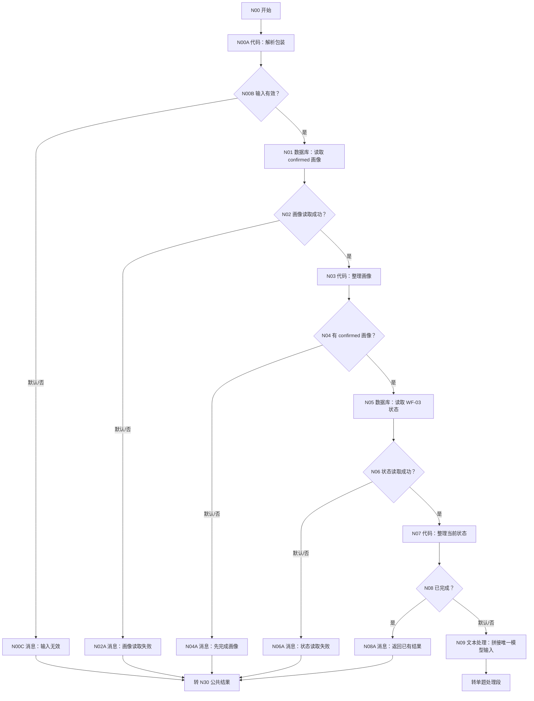
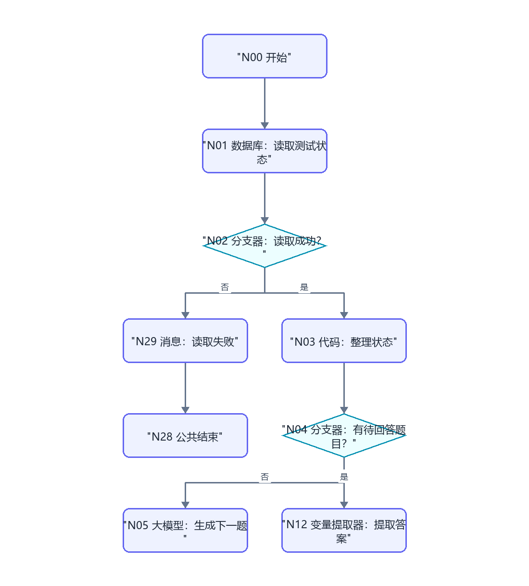
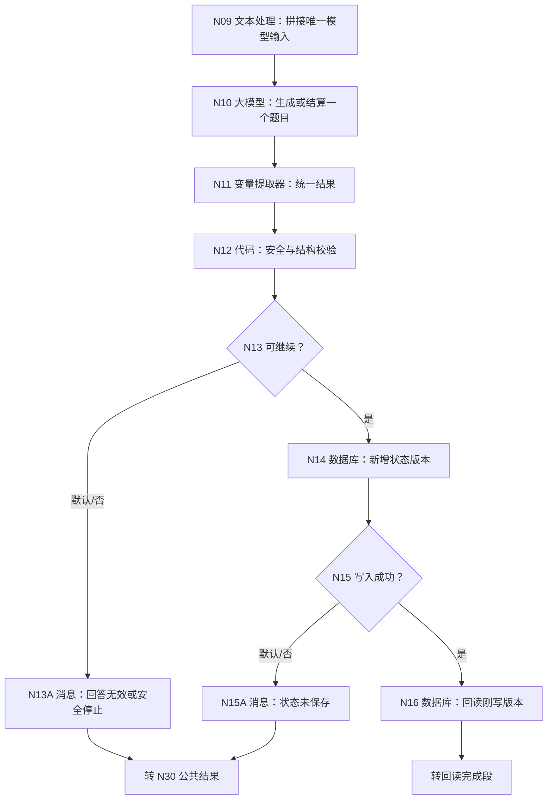
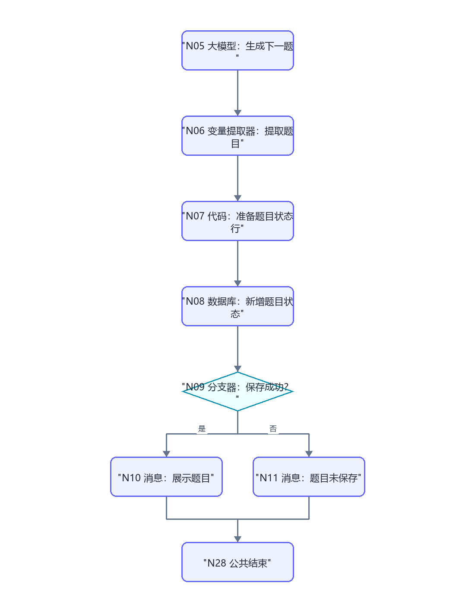
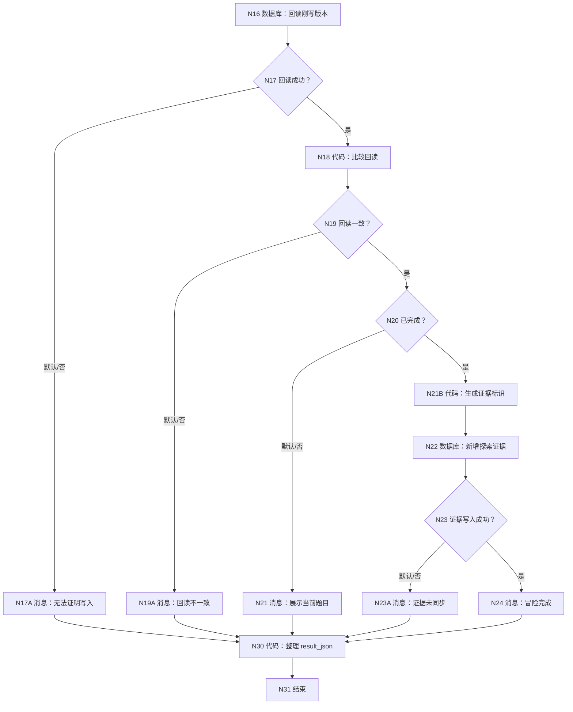
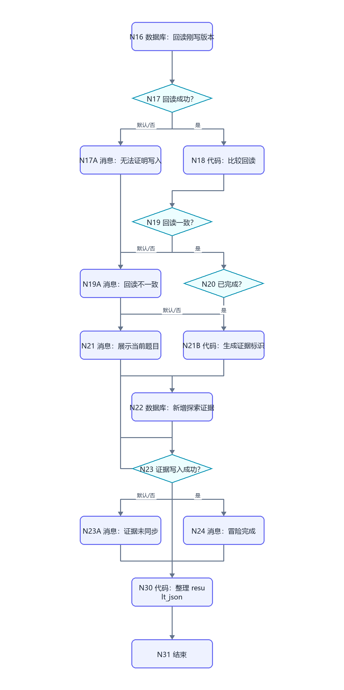

# WF-03 大学生存大冒险：逐节点搭建指南

<!-- AGENT-CONTRACT
start_inputs: AGENT_USER_INPUT:String
extractor_input_count: 1
result_output: result_json:String
-->

> 这是已搭 WF-03 的最小迁移版。保留多轮题目、自然语言回答、每轮结算和最终能力画像；把入口改成单字符串，把两套问答链收敛成一条确定上游链，并用 `user_key + workflow_id='WF-03'` 与 WF-02 完全隔离。

## 1. 业务目标和硬边界

WF-03 用 4～6 个校园生存情境观察资源分配、协作、抗压、求助和风险判断。它是娱乐化探索，不是临床测评、纪律裁决或现实安全建议。用户每次只回答当前题目；工作流每轮只结算一次。

- 没有 confirmed 画像：返回 `needs_input`，不生成题目。
- 还有题目：返回 `awaiting_user_input`，MAIN 结束本轮。
- 探索完成且 DB-03 证据写入成功：返回 `completed`，MAIN 才可继续调用 WF-04。
- 用户表达现实危险、自伤或违法风险：不继续游戏情节，返回安全提示和线下求助建议。

## 2. 已搭画布只改这些地方

| 区域 | 保留 | 必改 |
|---|---|---|
| 开始 | 原节点位置 | 删除所有额外参数，只留 `AGENT_USER_INPUT:String` |
| 前置 | 画像门禁 | 工作流内部按 user_key 读取 confirmed 画像 |
| 状态 | DB-02 多轮续接 | workflow_id 固定 WF-03，版本追加，不覆盖 WF-02 |
| 问答 | 一轮一题 | 文本处理先拼一个 String；变量提取器只引用模型 output |
| 分支 | 未答/已答/完成 | 改成一个模型通过 has_pending 决定动作，避免数据库跨分支引用 |
| 结束 | 原用户消息 | 全部汇入 result builder，结束只返回 `result_json:String` |

## 3. 完整画布













## 4. N00～N00C：单参数入口

N00 只添加：

| 参数名 | 类型 | 必填 |
|---|---|---|
| `AGENT_USER_INPUT` | String | 是 |

N00A 的输入 `raw_input` 引用开始/AGENT_USER_INPUT。直接复制 [WF-02 第 5.2 节](WF-02-virtual-university.md#52-n00a-代码解析包装) 的完整 Python，不增加 import，不改字段名。输出必须逐项声明：

| 输出 | 类型 |
|---|---|
| `user_key` | String |
| `user_input` | String |
| `input_valid` | Boolean |
| `input_error` | String |

调试值：

```json
{"user_key":"uk_0123456789abcdef0123456789abcdef","user_input":"我想开始大学生存大冒险"}
```

N00B：N00A/input_valid=true → N01；默认 → N00C。N00C 回复“内部输入包装无效，本轮没有读取或写入数据”，连接 N30。

## 5. N01～N08：画像和 WF-03 状态

### 5.1 N01 confirmed 画像

数据库 `university`，自定义 SQL，输入 `user_key=N00A/user_key`：

```sql
SELECT id, user_key, profile_json, pending_status, record_version, create_time
FROM user_profiles
WHERE user_key='{{user_key}}' AND pending_status='confirmed'
ORDER BY record_version DESC, create_time DESC
LIMIT 1;
```

N02：isSuccess=true → N03；默认 → N02A。

N03 输入 `rows=N01/outputList`：

```python
def main(rows):
    items = rows if isinstance(rows, list) else []
    row = items[0] if items and isinstance(items[0], dict) else {}
    profile_json = str(row.get("profile_json", "")).strip()
    return {"has_profile": bool(profile_json and profile_json != "{}"), "profile_json": profile_json}
```

输出 `has_profile:Boolean`、`profile_json:String`。N04 默认路线到 N04A，提示先完成画像。

### 5.2 N05 最新 WF-03 状态

输入 `user_key=N00A/user_key`：

```sql
SELECT id, user_key, state_id, workflow_id, state_type, state_json,
       pending_item_json, state_version, current_index, completed, create_time
FROM simulation_states
WHERE user_key='{{user_key}}' AND workflow_id='WF-03'
ORDER BY state_version DESC, create_time DESC
LIMIT 1;
```

N06：isSuccess=true → N07；默认 → N06A。

N07 输入 `rows=N05/outputList`、`user_key=N00A/user_key`：

```python
def main(rows, user_key):
    items = rows if isinstance(rows, list) else []
    row = items[0] if items and isinstance(items[0], dict) else {}
    state_id = str(row.get("state_id", "")).strip() or ("adv_" + str(user_key)[3:15])
    state_json = str(row.get("state_json", "{}")).strip() or "{}"
    pending = str(row.get("pending_item_json", "{}")).strip() or "{}"
    try:
        version = int(row.get("state_version", 0))
        index_value = int(row.get("current_index", 0))
    except Exception:
        version, index_value = 0, 0
    return {
        "state_id": state_id, "state_json": state_json, "pending_item_json": pending,
        "has_pending": pending not in ["", "{}", "[]", "null"],
        "completed": str(row.get("completed", "false")).lower() == "true",
        "next_version": version + 1, "current_index": index_value
    }
```

输出 `state_id:String`、`state_json:String`、`pending_item_json:String`、`has_pending:Boolean`、`completed:Boolean`、`next_version:Integer`、`current_index:Integer`。N08 completed=true → N08A；默认 → N09。

## 6. N09～N13：唯一模型输入、提取和安全门禁

### 6.1 N09 文本处理

选择“拼接文本”，输出顺序固定为：

```text
confirmed_profile={{N03/profile_json}}
settled_state={{N07/state_json}}
pending_question={{N07/pending_item_json}}
has_pending={{N07/has_pending}}
current_index={{N07/current_index}}
latest_user_input={{N00A/user_input}}
```

### 6.2 N10 大模型

用户提示只引用 N09/output。系统提示词：

```text
你是安全的大学生存大冒险单题引擎。
has_pending=false 时只生成一个新校园情境；has_pending=true 时只结算 pending_question 一次。
观察维度限于 resource_allocation、collaboration、resilience、help_seeking、risk_judgement。题目提供 2～4 个参考选项，但允许自由回答。
回答无关时 accepted=false；不得改变 settled_state。现实危险、自伤、违法或医疗紧急情况时 safety_stop=true，只给停止游戏和联系可信人员/当地紧急资源的简短建议。
总题数 4～6。未完成时 next_question_json 必须非空；完成时必须为 {}。模拟选择不能作为真实履历证据。
只输出 JSON：
{"accepted":true,"safety_stop":false,"new_state_json":"完整状态 JSON 字符串","next_question_json":"待答题目 JSON 字符串或 {}","next_index":1,"completed":false,"display_reply":"反馈和当前题目","result_summary":"完成结果 JSON 或 {}","structure_complete":true}
```

### 6.3 N11 变量提取器

固定 `input:String` 只引用 N10/output：

| 输出 | 类型 |
|---|---|
| `accepted` | Boolean |
| `safety_stop` | Boolean |
| `new_state_json` | String |
| `next_question_json` | String |
| `next_index` | Integer |
| `completed` | Boolean |
| `display_reply` | String |
| `result_summary` | String |
| `structure_complete` | Boolean |

### 6.4 N12 代码校验

输入 N11 全部输出及 N07 的 state_id、state_json、pending_item_json、next_version、current_index：

```python
def main(accepted, safety_stop, new_state_json, next_question_json, next_index,
         completed, display_reply, result_summary, structure_complete, state_id,
         old_state_json, old_pending_json, next_version, old_index):
    state = str(new_state_json).strip()
    pending = str(next_question_json).strip() or "{}"
    reply = str(display_reply).strip()
    is_complete = completed is True
    safe = safety_stop is not True
    valid = accepted is True and safe and structure_complete is True and state not in ["", "null"] and bool(reply)
    if is_complete and pending not in ["{}", "[]", "null"]:
        valid = False
    if not is_complete and pending in ["{}", "[]", "null"]:
        valid = False
    try:
        index_value = int(next_index)
        version_value = int(next_version)
    except Exception:
        valid, index_value, version_value = False, int(old_index), 0
    return {
        "result_valid": valid, "safety_stop": safety_stop is True,
        "state_id_out": str(state_id), "state_json_out": state if valid else str(old_state_json),
        "pending_out": "{}" if valid and is_complete else (pending if valid else str(old_pending_json)),
        "state_version_out": version_value, "current_index_out": index_value if valid else int(old_index),
        "completed_out": "true" if valid and is_complete else "false",
        "display_reply": reply, "result_summary": str(result_summary).strip() or "{}"
    }
```

逐项声明 `result_valid:Boolean`、`safety_stop:Boolean`、`state_id_out:String`、`state_json_out:String`、`pending_out:String`、`state_version_out:Integer`、`current_index_out:Integer`、`completed_out:String`、`display_reply:String`、`result_summary:String`。

N13 先配安全停止条件：safety_stop=true → N13A；再配 result_valid=true → N14；默认也到 N13A。N13A 根据 safety_stop 显示安全提示或“请直接回答当前题目”，不写数据库。

## 7. N14～N24：写入、回读和证据同步

### 7.1 N14 新增 DB-02 状态版本

数据库字段全部引用确定上游 N12：

| 字段 | 值 |
|---|---|
| user_key | N00A/user_key |
| state_id | N12/state_id_out |
| workflow_id | WF-03 |
| state_type | adventure |
| state_json | N12/state_json_out |
| pending_item_json | N12/pending_out |
| state_version | N12/state_version_out |
| current_index | N12/current_index_out |
| completed | N12/completed_out |

N15：isSuccess=true → N16；默认 → N15A。

### 7.2 N16 回读

输入 `user_key=N00A/user_key`、`state_id=N12/state_id_out`、`state_version=N12/state_version_out`：

```sql
SELECT id, user_key, state_id, state_json, pending_item_json,
       state_version, current_index, completed, create_time
FROM simulation_states
WHERE user_key='{{user_key}}' AND workflow_id='WF-03'
  AND state_id='{{state_id}}' AND state_version={{state_version}}
ORDER BY create_time DESC
LIMIT 1;
```

N17：isSuccess=true → N18；默认 → N17A。

N18 输入 `rows=N16/outputList`、N12/state_id_out、state_version_out、completed_out：

```python
def main(rows, expected_state_id, expected_version, expected_completed):
    items = rows if isinstance(rows, list) else []
    row = items[0] if items and isinstance(items[0], dict) else {}
    try:
        version_ok = int(row.get("state_version", -1)) == int(expected_version)
    except Exception:
        version_ok = False
    completed_value = str(row.get("completed", "false")).lower()
    matches = bool(row) and str(row.get("state_id", "")) == str(expected_state_id) and version_ok and completed_value == str(expected_completed).lower()
    return {"readback_matches": matches, "completed_readback": completed_value == "true"}
```

输出 `readback_matches:Boolean`、`completed_readback:Boolean`。N19 默认到 N19A，一致到 N20。N20 完成=false → N21，完成=true → N22。

### 7.3 N22 写 DB-03

N21B 输入 `state_id=N12/state_id_out`：

```python
def main(state_id):
    return {"assessment_id": "ev_" + str(state_id)}
```

输出 `assessment_id:String`。然后 N22 新增：

| 字段 | 值 |
|---|---|
| user_key | N00A/user_key |
| assessment_id | N21B/assessment_id |
| simulation_result_json | `{}` |
| adventure_result_json | N12/result_summary |
| route_recommendation_json | `{}` |
| evidence_sources | WF-03 |
| evidence_gaps_json | `["WF-02"]` |
| confidence_level | medium |
| trigger_reason | survival_adventure_completed |
| knowledge_version | 空 String |
| assessment_version | N12/state_version_out |

N23：isSuccess=true → N24；默认 → N23A。N21 引用 N12/display_reply 展示当前题目；N24 展示完成摘要并建议进入路径推荐或补做 WF-02。

## 8. N30 公共结果和 N31 结束

N30 输入：N00A/input_valid、N01/isSuccess、N03/has_profile、N05/isSuccess、N07/completed、N12/result_valid、N12/safety_stop、N12/display_reply、N14/isSuccess、N16/isSuccess、N18/readback_matches、N18/completed_readback、N22/isSuccess。

```python
def quote(value):
    text = str(value) if value is not None else ""
    return '"' + text.replace("\\", "\\\\").replace('"', '\\"').replace("\n", "\\n").replace("\r", "\\r") + '"'


def main(input_valid, profile_read_success, has_profile, state_read_success, completed_before,
         result_valid, safety_stop, display_reply, state_write_success, readback_success,
         readback_matches, completed_after, evidence_write_success):
    status, reply, next_action, error_code = "needs_input", "请先完成用户画像。", "complete_profile", "none"
    if input_valid is not True:
        status, reply, next_action, error_code = "validation_failed", "内部输入格式无效，本轮未处理。", "retry_same_message", "invalid_envelope"
    elif profile_read_success is not True or state_read_success is not True:
        status, reply, next_action, error_code = "read_failed", "暂时无法读取画像或冒险状态。", "retry_later", "read_failed"
    elif has_profile is not True:
        status, reply, next_action = "needs_input", "请先完成并确认用户画像。", "complete_profile"
    elif completed_before is True:
        status, reply, next_action = "completed", "大学生存大冒险已完成，不重复新增状态。", "choose_wf02_or_wf04"
    elif safety_stop is True:
        status, reply, next_action, error_code = "unsafe_request", str(display_reply), "seek_real_world_help", "safety_stop"
    elif result_valid is not True:
        status, reply, next_action, error_code = "needs_input", "当前回答无法可靠结算，请直接回答当前题目。", "answer_current_question", "unhandled_answer"
    elif state_write_success is not True or readback_success is not True or readback_matches is not True:
        status, reply, next_action, error_code = "write_failed", "本轮结果没有通过写入回读校验，请稍后重试。", "retry_later", "state_readback_failed"
    elif completed_after is True:
        if evidence_write_success is True:
            status, reply, next_action = "completed", str(display_reply), "choose_wf02_or_wf04"
        else:
            status, reply, next_action, error_code = "write_failed", "冒险状态已完成，但推荐证据未同步。", "retry_evidence_sync", "evidence_write_failed"
    else:
        status, reply, next_action = "awaiting_user_input", str(display_reply), "answer_current_question"
    result = "{" + '"workflow_id":"WF-03",' + '"status":' + quote(status) + "," + '"reply":' + quote(reply) + "," + '"next_action":' + quote(next_action) + "," + '"error_code":' + quote(error_code) + "}"
    return {"result_json": result}
```

N30 输出 `result_json:String`。N31 回答模式选择“返回参数，由工作流生成”，只引用 N30/result_json。

## 9. 调试指南

### 9.1 正常路线

前置：同一 user_key 在 DB-01 有 confirmed 画像，DB-02 没有 WF-03 行。

| 轮次 | user_input 示例 | 关键预期 |
|---|---|---|
| 1 | 开始大学生存大冒险 | N09 拼接 has_pending=false；DB-02 新增 version=1；返回一个题目 |
| 2 | 我先联系舍友分工，同时向辅导员确认规则 | 同一 pending 只结算一次；version=2；返回下一题 |
| 3～6 | 回答当前题目 | 每轮版本 +1，旧状态保留 |
| 完成 | 回答最后一题 | completed=true；DB-03 新增 adventure_result_json；status=completed |

在 N11 配置页确认只有 `input` 一项，值只引用 N10/output。N14 数据库的动态状态字段只从 N12 下拉选择；如果下拉没有 N12，先检查 N12→N13→N14 连线。

### 9.2 必测另一条路

1. 单参数不是两字段包装：N00C，数据库不执行。
2. DB-01 成功空数组：N04A；与 N02A 读取失败严格区分。
3. 另一个 user_key 有画像：当前 key 不可见。
4. DB-02 仅有 WF-02 行：WF-03 必须按空状态开始，不能续接 WF-02。
5. DB-02 读取失败：N06A，模型不执行。
6. 已有 pending 时说“随便”：accepted=false，N13A，版本不增加。
7. 模型漏 next_question：N12/result_valid=false，N14 不执行。
8. 现实危险表达：safety_stop=true，N13A；不写游戏状态。
9. N14 新增失败：N15A；不宣称保存。
10. N16 回读失败：N17A。
11. 回读版本不一致：N19A。
12. DB-03 写失败：N23A，MAIN 不继续 WF-04。
13. 已完成后再次调用：N08A，DB-02 行数不增加。

## 10. 发布配置

发布名称：`ULPS_WF03_SURVIVAL_ADVENTURE`。描述：`基于 confirmed 画像开始或续接安全的大学生存大冒险单题探索，返回当前题目、完成证据或错误状态。`

发布为当前账号的 MCP Server 后即可在 MAIN 的智能决策节点添加它；内部 MCP Server 发布不等待公开上架审核。WF-03 内不添加工具调用节点。子工具发布成功后用 Trace 核对每次只处理一个题目，并检查输出是紧凑 JSON 字符串；MAIN 公开发布到星火/Desk 的审核另行进行。

## 11. 验收清单

- [ ] N00 只有 `AGENT_USER_INPUT:String`。
- [ ] N11 变量提取器只有一个 input，并只引用 N10/output。
- [ ] 数据库变量都来自当前节点之前的确定上游。
- [ ] WF-02/WF-03 用 workflow_id 隔离。
- [ ] 无关回答和安全停止都不新增状态。
- [ ] 状态新增后回读版本、state_id、completed。
- [ ] 只有 DB-03 证据同步成功才返回 completed。
- [ ] 每个分支有默认出口，每个消息节点连接 N30。
- [ ] N31 只返回 `result_json:String`。
- [ ] 正常、空数组、失败、隔离、安全、完成重入均已调试。
