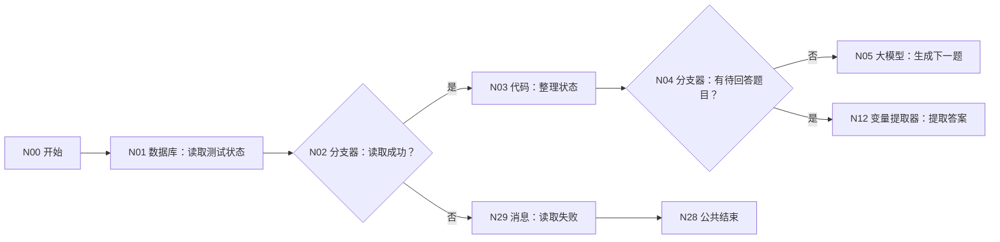
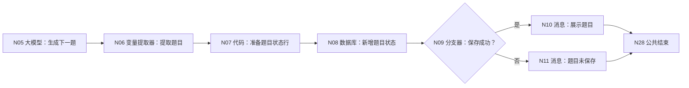
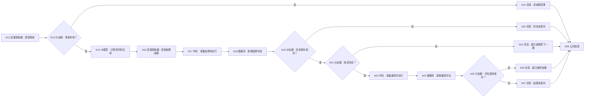

# WF-03 大学生存大冒险：逐节点搭建指南

> 本文件以 WF-01 的实际页面为标准。请按本文件编号重新摆放 WF-03，不沿用旧版编号。当前结束节点按你选择的“第一种方式”返回 `workflow_finished`，完整题目和结果由消息节点展示。

## 1. 本工作流最终完成什么

WF-03 每次只展示或结算一道场景题。未完成时把题目、答案和信号保存到 `simulation_states`；完成全部题目后，再把五路径与八项能力的汇总结果写入 `route_assessments`，供 WF-04 使用。

## 2. 数据表准备

在数据库 `university` 中准备：

- `simulation_states`：上传 [DB-02](../database/import-templates/DB-02-simulation-states.xlsx)，用于跨轮保存题目和答案。
- `route_assessments`：上传 [DB-03](../database/import-templates/DB-03-route-assessments.xlsx)，只在全部题目完成后新增一条评估结果。

两表自动字段 `id/uid/create_time` 保留。WF-03 状态行固定 `workflow_id=WF-03`、`state_type=adventure`。

## 3. 分段流程图

### 3.1 读取状态



### 3.2 生成题目



### 3.3 结算答案并完成测试



所有消息节点连接 N28 结束，没有悬空出口。

## 4. N00 开始

保留 `AGENT_USER_INPUT:String`，点击“+ 添加”：

| 变量 | 类型 | 必填 | 调试值 |
|---|---|---:|---|
| `uid` | String | 是 | `test_user_001` |
| `profile_json` | String | 是 | WF-01 已确认画像 |
| `request_time` | String | 是 | `2026-07-19 13:00:00` |
| `configured_question_count` | Integer | 是 | `5` |

`AGENT_USER_INPUT` 首轮可填“开始大学生存大冒险”，后续填当前题答案。

## 5. N01 数据库：读取测试状态

- 模式：自定义 SQL；数据库：`university`。
- 输入：`uid｜引用｜N00/uid`。

```sql
SELECT id, uid, state_id, state_json, pending_item_json,
       current_index, completed, updated_at
FROM simulation_states
WHERE uid='{{uid}}' AND workflow_id='WF-03'
ORDER BY updated_at DESC, create_time DESC
LIMIT 1;
```

固定输出：`isSuccess:Boolean`、`message:String`、`outputList:Array<Object>`。

## 6. N02 分支器：读取成功？

引用 `N01/isSuccess`，条件“等于”，比较类型固定值，比较值 `true`。是 → N03；默认/否 → N29。成功空数组仍走 N03。

## 7. N03 代码：整理状态

输入 `outputList｜引用｜N01/outputList`。

```python
def main(outputList):
    rows = outputList if isinstance(outputList, list) else []
    row = rows[0] if len(rows) > 0 and isinstance(rows[0], dict) else {}
    try:
        index_value = int(row.get("current_index", 0))
    except:
        index_value = 0
    state_text = row.get("state_json", "{}")
    pending_text = row.get("pending_item_json", "")
    return {
        "has_record": len(row) > 0,
        "state_json": state_text if isinstance(state_text, str) and state_text else "{}",
        "pending_item_json": pending_text if isinstance(pending_text, str) else "",
        "current_index": index_value,
        "has_pending": isinstance(pending_text, str) and len(pending_text.strip()) > 2,
        "already_completed": str(row.get("completed", "false")).lower() == "true",
    }
```

输出区声明 `has_record:Boolean`、`state_json:String`、`pending_item_json:String`、`current_index:Integer`、`has_pending:Boolean`、`already_completed:Boolean`。禁止 `import`，禁止返回 `None`。

## 8. N04 分支器：有待回答题目？

引用 `N03/has_pending`，等于固定值 `true`。是 → N12；否 → N05。

## 9. N05 大模型：生成下一题

模型 `Spark4.0 Ultra`，关闭对话历史。输入：

| 参数名 | 引用 |
|---|---|
| `profile_json` | N00/profile_json |
| `state_json` | N03/state_json |
| `current_index` | N03/current_index |
| `configured_question_count` | N00/configured_question_count |

系统提示词：

```text
你是“大学生存大冒险”主持人。每次只生成一道真实资源冲突题，覆盖课程、项目、社团、实习、比赛、健康或预算之一。给 3 个都可辩护的选项并允许自定义，禁止设置明显正确答案，禁止制造焦虑。
只输出 JSON：
{"state_json":{},"question":{"id":"Q1","scene":"","options":[{"id":"A","text":"","tradeoff":""}]},"question_index":1,"reply":""}
```

用户提示词：

```text
画像：{{profile_json}}
已有测试状态：{{state_json}}
当前题号：{{current_index}}
总题数：{{configured_question_count}}
生成下一题。不得重复已有场景，只输出规定 JSON。
```

输出格式 `text`，变量 `output:String`。

## 10. N06 变量提取器：提取题目

输入 `input｜引用｜N05/output`。输出：

| 变量名 | 类型 | 描述 |
|---|---|---|
| `state_json` | String | 完整累计状态 JSON 字符串 |
| `question_json` | String | 完整 question 对象 JSON 字符串 |
| `question_index` | Integer | 当前题号 |
| `reply` | String | 给用户的题目和作答提示 |

## 11. N07～N11：保存并展示题目

N07 输入 `uid/request_time` 引用 N00，其他四项引用 N06。代码：

```python
def main(uid, request_time, state_json, question_json, question_index, reply):
    try:
        index_value = int(question_index)
    except:
        index_value = 1
    return {
        "state_id": str(uid) + "-WF03-" + str(request_time) + "-" + str(index_value),
        "workflow_id": "WF-03",
        "state_type": "adventure",
        "state_json": str(state_json) if state_json else "{}",
        "pending_item_json": str(question_json) if question_json else "{}",
        "current_index": index_value,
        "completed": "false",
        "updated_at": str(request_time),
        "reply": str(reply),
    }
```

输出区逐行声明上述 9 个同名键，`current_index` 为 Integer，其余为 String。

N08：表单处理数据 → `university / simulation_states` → 新增数据。逐字段引用 N07 的 `state_id/workflow_id/state_type/state_json/pending_item_json/current_index/completed/updated_at`；若页面强制出现 `uid`，引用 N00/uid。

N09：引用 N08/isSuccess，等于固定值 `true`。是 → N10；否 → N11。

- N10 输入 `reply=N07/reply`，回答内容 `{{reply}}`。
- N11 输入 `message=N08/message`，回答内容 `题目已经生成，但没有成功保存。本轮请不要作答，稍后重试。错误：{{message}}`。

两者关闭流式输出，连接 N28。

## 12. N12～N14：提取并校验答案

N12 变量提取器输入 `user_input=N00/AGENT_USER_INPUT`、`question_json=N03/pending_item_json`，输出：

| 变量名 | 类型 | 描述 |
|---|---|---|
| `answer_text` | String | 用户对当前题的明确答案 |
| `answer_valid` | Boolean | 编号匹配或自定义方案语义明确时为 true |
| `reason` | String | 无效原因，有效时为空 |

N13 引用 `N12/answer_valid` 等于固定值 `true`：是 → N15，否 → N14。

N14 输入 `reason=N12/reason`、`question=N03/pending_item_json`，回答内容：

```text
这个回答还不能对应当前题目。{{reason}}
请回复选项编号，或完整写出你的自定义方案：
{{question}}
```

连接 N28。

## 13. N15 大模型：计算单题信号并生成后续

模型 `Spark4.0 Ultra`，关闭对话历史。输入：`profile_json=N00/profile_json`、`state_json=N03/state_json`、`question_json=N03/pending_item_json`、`answer_text=N12/answer_text`、`current_index=N03/current_index`、`configured_question_count=N00/configured_question_count`。

系统提示词：

```text
你是大学场景测评解释器。只依据当前题和用户答案记录证据，不把单题答案直接定性为人格。内部为五路径（保研、考研、就业、考公、留学）和八项能力（执行、研究、创造、表达、协作、稳定、适应、风险承受）记录 -1/0/1 方向与文字 evidence。
把本题答案追加到 state_json，禁止覆盖旧答案。若题数未满，同时生成下一题；若题数已满，生成完整 adventure_result，五路径和八项能力必须全部出现，面向用户只用高/中/待验证，不输出成功概率。
只输出 JSON：
{"state_json":{},"pending_item":{},"current_index":1,"completed":false,"reply":"","adventure_result":{}}
```

用户提示词只放变量：

```text
画像：{{profile_json}}
结算前状态：{{state_json}}
当前题：{{question_json}}
用户答案：{{answer_text}}
当前题号：{{current_index}}
总题数：{{configured_question_count}}
```

输出 `output:String`。

## 14. N16 变量提取器：提取结算结果

输入 `input=N15/output`，输出：

| 变量名 | 类型 | 描述 |
|---|---|---|
| `state_json` | String | 包含全部历史答案和信号的状态 JSON |
| `pending_item_json` | String | 下一题 JSON；完成时 `{}` |
| `current_index` | Integer | 已处理题数/下一题序号 |
| `completed` | Boolean | 是否达到配置题数 |
| `reply` | String | 本轮结算及下一题提示 |
| `adventure_result_json` | String | 完成时的五路径与八项能力结果；未完成 `{}` |

## 15. N17～N22：保存测试状态

N17 输入 `uid/request_time` 与 N16 六项输出：

```python
def main(uid, request_time, state_json, pending_item_json, current_index, completed, reply, adventure_result_json):
    try:
        index_value = int(current_index)
    except:
        index_value = 0
    done = completed is True
    return {
        "state_id": str(uid) + "-WF03-" + str(request_time) + "-" + str(index_value),
        "workflow_id": "WF-03",
        "state_type": "adventure",
        "state_json": str(state_json) if state_json else "{}",
        "pending_item_json": "{}" if done else (str(pending_item_json) if pending_item_json else "{}"),
        "current_index": index_value,
        "completed_text": "true" if done else "false",
        "completed_bool": done,
        "updated_at": str(request_time),
        "display_reply": str(reply),
        "adventure_result_json": str(adventure_result_json) if adventure_result_json else "{}",
    }
```

输出区声明全部 11 个返回键：`state_id:String`、`workflow_id:String`、`state_type:String`、`state_json:String`、`pending_item_json:String`、`current_index:Integer`、`completed_text:String`、`completed_bool:Boolean`、`updated_at:String`、`display_reply:String`、`adventure_result_json:String`。

N18：`simulation_states` 表单新增，字段与 N08 相同，但 `completed` 引用 `N17/completed_text`，其余引用 N17。

N19：`N18/isSuccess == true`。否 → N20；是 → N21。

- N20 输入 N18/message，回答 `本题已经结算，但进度没有保存，因此不会继续推进。错误：{{message}}`，接 N28。
- N21 引用 `N17/completed_bool == true`。否 → N22；是 → N23。
- N22 输入 `reply=N17/display_reply`，回答 `{{reply}}`，接 N28。

## 16. N23～N27：保存最终评估

N23 输入 `uid=N00/uid`、`request_time=N00/request_time`、`adventure_result_json=N17/adventure_result_json`：

```python
def main(uid, request_time, adventure_result_json):
    return {
        "assessment_id": str(uid) + "-ASSESS-" + str(request_time),
        "adventure_result_json": str(adventure_result_json) if adventure_result_json else "{}",
        "route_recommendation_json": "{}",
        "trigger_reason": "WF-03 场景测试完成",
        "assessment_version": 1,
        "updated_at": str(request_time),
    }
```

输出：`assessment_id:String`、`adventure_result_json:String`、`route_recommendation_json:String`、`trigger_reason:String`、`assessment_version:Integer`、`updated_at:String`。

N24：表单处理数据 → `university / route_assessments` → 新增数据。设置 `assessment_id/adventure_result_json/route_recommendation_json/trigger_reason/assessment_version/updated_at`；页面要求 uid 时引用 N00/uid。`knowledge_updated_at` 非必填，本节点不要添加。

N25：`N24/isSuccess == true`。是 → N26；否 → N27。

- N26 输入 `result=N23/adventure_result_json`，回答 `场景测试已完成并保存。以下结果是用于后续路径推荐的行为信号，不是能力定论：\n{{result}}`。
- N27 输入 `result=N23/adventure_result_json`、`message=N24/message`，回答 `测试已完成，但最终评估没有保存。下面是本轮草稿，请先自行保留；不要把它当作已保存记录。\n{{result}}\n错误：{{message}}`。

两者连接 N28。

## 17. N29 读取失败消息

输入 `message=N01/message`，回答：`无法读取测试进度，本轮没有生成、结算或保存任何题目。请稍后重试。错误：{{message}}`，连接 N28。

## 18. N28 结束

- 回答模式：返回设定格式配置的回答。
- 输出：`output｜输入｜workflow_finished`。
- 思考内容：留空。
- 回答内容：`本轮处理已结束，请以上方消息节点的提示为准。`
- 流式输出：关闭。

## 19. 调试指南：按顺序测试

1. **首轮**：`AGENT_USER_INPUT=开始测试`。应走 N04 否，新增一条 DB-02 状态，展示 Q1。
2. **有效答案**：同 uid 输入 `A`。应走 N13 是；最新状态的 `current_index` 增加、旧答案保留。
3. **无效答案**：输入“都行”。应到 N14，数据库不新增。
4. **中断续接**：关闭调试后重新打开，用同 uid 继续。N03 必须读到上一题。
5. **完成前门禁**：未达到 `configured_question_count` 时，绝不能执行 N24。
6. **完成**：最后一题后 N21 是，DB-03 新增一条 `assessment_id`，`adventure_result_json` 五路径和八项能力齐全。
7. **读取失败**：临时改错 N01 表名，应到 N29。
8. **最终写入失败**：临时清空 N24 的 `assessment_id`，应到 N27，回复不得说“已保存”。

## 20. 验收清单

- [ ] 每轮只处理一道已展示题目，答案无效不推进。
- [ ] DB-02 只保存过程状态；DB-03 只在全部完成后新增最终评估。
- [ ] N01 后先检查 isSuccess，再由代码整理 outputList。
- [ ] 五路径与八项能力都保留 evidence，不把单题贴成永久标签。
- [ ] 三个代码节点均无 import，输入形参与输出声明完全一致。
- [ ] 所有消息连接 N28，没有悬空分支。
