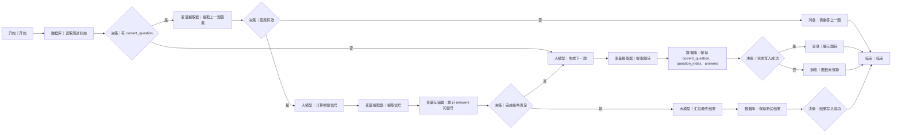

# WF-03 大学生存大冒险

## 1. 目标与准备

主 Agent 在用户开始场景测试或继续未完成测试时调用。输入 `user_id`、`AGENT_USER_INPUT`、可选 `profile_json`/`adventure_state`；输出 `data.adventure_result_json`，同时包含五条路径信号与八项竞争力信号，不直接给最终推荐。

## 2. 最小可运行版

```text
开始 → 问答节点（场景题）→ 大模型（汇总信号）→ 变量提取器（提取结果）→ 结束
```

从左侧拖入“问答节点”“大模型”“变量提取器”，依次放在开始右侧并连到结束。问答节点填 3～5 道场景题（期末安排、社团换届、多任务冲突等）；具体题目/答案配置字段**以当前编辑器显示为准**。若问答节点不能多轮收集，改由大模型每次出一题并按完整版分段调用。

## 3. 完整业务版画布与搭建

完整跨轮画布、节点数量、拖拽连线和逐边映射统一见第 6 节。

## 4. 映射和完整提示词

状态字段：`question_index,answers,signal_evidence,completed`。答案提取器输入 `AGENT_USER_INPUT,current_question`，输出 `answer_id,custom_answer,is_valid`。禁止仅凭选项字母固定贴标签；每个信号必须保留场景和行为依据。

```text
你是大学生存大冒险主持人。根据当前题号 {{question_index}}、已有答案 {{answers}} 和可选画像 {{profile_json}}，生成一道人生场景题。题目应涉及真实资源冲突，每题给 3 个都可辩护的选项，并允许用户自定义；不要设计“明显正确答案”，不要制造焦虑。
只输出 JSON：{"question":{"id":"Q1","scene":"","options":[{"id":"A","text":"","tradeoff":""}]},"reply":"请作答"}
```

```text
你是测评解释器。依据全部答案 {{answers}} 和逐题证据 {{signal_evidence}} 汇总，不得虚构未发生的行为，不输出伪精确成功率。路径维度必须完整包含 保研、考研、就业、考公、留学；竞争力维度必须完整包含 执行、研究、创造、表达、协作、稳定、适应、风险承受。结果需包含优势、潜在短板、依据、待验证假设；分值只作内部相对信号，面向用户用高/中/待验证描述。
只输出 JSON：
{"path_signals":{"保研":"","考研":"","就业":"","考公":"","留学":""},"competency_signals":{"执行":"","研究":"","创造":"","表达":"","协作":"","稳定":"","适应":"","风险承受":""},"strengths":[],"gaps":[],"evidence":[],"assumptions_to_validate":[],"reply":""}
```

数据库键分别为 `adventure_state` 和 `adventure_result`；具体更新操作以当前编辑器为准，不支持则使用长期记忆节点。写入失败返回草稿和 `write_failed`。

## 5. 调试、错误处理与验收清单

- 成功：依次回答期末安排和导师项目/实习冲突；观察 `answers` 追加而非覆盖，八项和五路径字段齐全。
- 缺失：输入不对应任何选项，`is_valid=false`，不得推进题号。
- 中断续接：新会话读取保存状态，下一题号正确。
- JSON 缺维度：变量提取器/决策拦截，重试一次；仍缺失返回 `missing_required_field`。
- [ ] 有多轮控制（迭代或分段调用）和答案累计。
- [ ] 结果包含依据、短板和待验证假设，而非单标签。
- [ ] 输出 `data.adventure_result_json` 供 WF-04 使用。

## 6. 完整业务版跨轮状态机、节点数量与逐边映射

完整画布包含数据库 3、大模型 3、变量提取器 3、变量存储器 1、决策 5、消息 3，另加开始和结束各 1。

把正常路径从开始右侧横向摆放；无效答案、状态写入失败放各自决策下方，最终汇总支路放“完成条件满足”下方。按 Mermaid 顺序逐个重命名，再从每个节点右侧连接点拖到目标左侧，给所有决策边填写图示条件。

拖拽后依次重命名为“读取测试状态、判断有 current_question、提取上一题答案、判断答案有效、计算单题信号、提取信号、累计答案、判断题目完成、生成下一题、提取题目、保存测试状态、展示题目、汇总最终结果、保存测试结果、检查写入、错误提示”，按图连接。




完成条件固定为：`answers.length >= configured_question_count`（建议 5，实际上限以当前编辑器为准）且每题均含 `question_id,answer,evidence,route_delta,competency_delta`。未满足时不得调用“汇总最终结果”。每次保存 `current_question,question_index,answers,signal_evidence,configured_question_count`；结算后清空旧 `current_question` 再生成下一题。

答案提取提示词：`仅判断用户输入是否回答 current_question；输出 {"answer_id":null,"custom_answer":null,"is_valid":false,"reason":""}。编号匹配或语义明确的自定义方案才有效，不得用新输入回答尚未展示的题。` 单题信号规则：五路径和八竞争力均输出 `-1/0/1` 的内部方向值及文字 evidence；禁止直接把单题信号当最终标签，矛盾答案并存并在最终结果中列为待验证假设。

逐边变量：A→B `user_id`；B→C 全部测试状态；C是→D `AGENT_USER_INPUT,current_question`；E是→G `current_question,answer`；G→H `signal_json`；H→I `answer,evidence,route_delta,competency_delta,answers`；I→J `answers.length,configured_question_count`；C否/J否→K `question_index,answers,profile_json`；K→L `model_text`；L→M `current_question,question_index+1,answers,user_id`；J是→P `answers,signal_evidence`；P→Q `adventure_result_json,user_id`。

结束 `result_json`：题目已保存为 `{"workflow_id":"WF-03","version":"1.0","status":"awaiting_user_input","reply":"{{question.reply}}","data":{"adventure_state":{"current_question":{{question}},"question_index":{{index}},"answers":{{answers}}}},"suggested_writes":[],"next_action":"answer_adventure_question","error":null}`；完成写入成功为 `{"workflow_id":"WF-03","version":"1.0","status":"completed","reply":"场景测试已完成。","data":{"adventure_result_json":{{result}}},"suggested_writes":[],"next_action":"recommend_routes","error":null}`；答案无效为 `validation_failed`；读写错误分别为 `read_failed/write_failed`。
