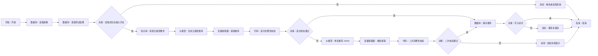

# WF-04 五路径推荐

## 1. 目标与准备

主 Agent 在 WF-03 完成或用户要求重新评估路径时调用。输入已确认 `profile_json`、`adventure_result_json`，可选行为证据；检索包含来源和更新时间的五路径知识；输出 `data.route_recommendation_json`。推荐是可修正方案，不是预测。

## 2. 最小可运行版

```text
开始 → 知识库（检索五路径要求）→ 大模型（生成五路径推荐）→ 变量提取器（提取推荐）→ 结束
```

从左侧“知识与数据”拖“知识库”，再拖“大模型”“变量提取器”，放在开始与结束之间并依次连线。知识库查询映射 `profile_json` 中年级/专业和五路径；检索字段、TopK 等**以当前编辑器显示为准**。无法稳定返回来源时，结果必须标记 `source_unavailable` 并提醒官方复核，不能编造引用。

## 3. 完整业务版画布与搭建

完整画布、节点数量、拖拽连线和二次校验分支统一见第 7 节。

## 4. 配置、校验与变量映射

知识检索输入由 `grade,major,route_names=[保研,考研,就业,考公,留学]` 组成，输出 `knowledge_hits`。大模型输入再加入画像、测试结果。保存键为 `route_recommendation`，但推荐更新不得覆盖画像或主规划。

代码节点逻辑（平台函数签名以当前编辑器为准；不支持 JavaScript 时按相同规则配置变量提取器+决策）：

```javascript
function main(input) {
  const x = typeof input === "string" ? JSON.parse(input) : input;
  const names = ["保研", "考研", "就业", "考公", "留学"];
  const levels = ["高匹配", "中匹配", "待验证", "当前不建议投入"];
  const errors = [];
  if (!x || !Array.isArray(x.routes)) errors.push("routes 必须是数组");
  else {
    for (const n of names) {
      const r = x.routes.find(v => v.name === n);
      if (!r) errors.push(`缺少路径:${n}`);
      else {
        if (!levels.includes(r.level)) errors.push(`${n}等级无效`);
        for (const k of ["requirements","gaps","priorities","evidence","limitations"]) if (!Array.isArray(r[k])) errors.push(`${n}缺少${k}`);
      }
    }
  }
  if (!x?.primary_route) errors.push("缺少主路径");
  if (!Array.isArray(x?.alternative_routes) || x.alternative_routes.length < 1) errors.push("缺少备选路径");
  if (!Array.isArray(x?.assumptions_to_validate)) errors.push("缺少待验证假设");
  return { valid: errors.length === 0, errors, value: x };
}
```

## 5. 可复制的完整提示词

```text
你是可解释的大学路径规划教练。
已确认画像：{{profile_json}}
场景测试结果：{{adventure_result_json}}
行为证据：{{behavior_evidence}}
知识检索结果：{{knowledge_hits}}
对保研、考研、就业、考公、留学逐一评估。依据“偏好匹配、能力匹配、已有履历匹配、资源条件匹配、实际行为证据，减去时间缺口、经济压力、路径风险”做定性判断，只能使用 高匹配/中匹配/待验证/当前不建议投入，不给成功概率或伪精确分数。每条路径都写典型要求、当前差距、优先补齐项、证据、局限和备选方案。选一个主路径和至少一个备选，但明确最终决定权属于用户。未知信息放 assumptions_to_validate，不得补造。政策信息带来源与更新时间；缺失则标注并提示通过学校或主管部门官方渠道复核。
只输出合法 JSON：
{"routes":[{"name":"保研","level":"待验证","requirements":[],"gaps":[],"priorities":[],"evidence":[],"limitations":[],"fallback":""}],"primary_route":"","alternative_routes":[],"reasoning_summary":"","assumptions_to_validate":[],"source_notes":[],"disclaimer":"每个人的大学都是独一无二的。模拟器给的是地图，最终决定和行动由你完成。"}
注意 routes 必须恰好包含五条指定路径。
```

## 6. 调试、错误处理与验收清单

- 成功：提供完整画像和 WF-03 结果；观察知识来源、五条路径、主/备选、依据和假设齐全，校验为真。
- 缺失：移除 `adventure_result_json`，应在检索前走缺失分支，`next_action=complete_adventure`。
- 模型漏掉“考公”：首次校验失败、修复一次；再次失败返回 `invalid_json`，不得保存。
- 知识库不可用：可基于画像给“待验证”的一般建议，但 `error=knowledge_unavailable`，政策全部提示官方复核。
- [ ] 只使用四级制，无概率；五路径完整。
- [ ] 数据库写入后检查结果，失败状态为 `write_failed`。
- [ ] 输出共享包装中的 `route_recommendation_json`，供 WF-05/WF-06 使用。

## 7. 完整业务版画布、节点数量与逐边映射

完整画布包含数据库 3、决策 4、消息 3、知识库 1、大模型 2、变量提取器 2、代码 2，另加开始和结束各 1。所有生成、修复和输出统一使用 PRD 免责声明原文。

从开始右侧横向摆读取、检索、生成、首次校验主线；将修复与二次校验放“首次校验”下方，将缺失、二次失败、写入失败消息放各自决策下方。依节点清单逐个重命名后，从右侧连接点拖到图示下游左侧，并在四个决策上逐边填写图中的条件。

从空画布依次拖入并重命名“读取画像、读取测试结果、检查读取与输入、缺失提示、检索五路径要求、生成五路径推荐、提取推荐、首次完整性校验、判断首次校验、修复推荐 JSON、重新提取、二次完整性校验、判断二次校验、保存推荐、检查写入、校验失败提示”，按图连线。




逐边变量：A→B/C `uid`；B/C→D `profile_json,adventure_result_json,read_result`；D是→F `grade,major,五路径名`；F→G `profile_json,adventure_result_json,knowledge_hits`；G→H `model_text`；H→I `route_recommendation_json`；I→J `valid,errors,value`；J否→K `value,errors`；K→L `repaired_text`；L→M `route_recommendation_json`；M→P `valid,errors,value`；J是/P是→N `uid,value`；N→O `write_result`。

修复完整提示词：

```text
你只修复 JSON 结构，不新增事实、不改变已有等级和依据。原 JSON：{{value}}；校验错误：{{errors}}。补齐且仅补齐五条路径（保研、考研、就业、考公、留学）、合法等级、requirements/gaps/priorities/evidence/limitations 数组、primary_route、至少一个 alternative_routes、assumptions_to_validate、source_notes、disclaimer。缺少事实时填空数组或“待验证”，不得编造来源。disclaimer 必须逐字为：每个人的大学都是独一无二的。模拟器给的是“地图”，但“走路”的人是你自己。勇敢去闯，错了也没关系——毕竟，大学本身就是试错成本最低的地方呀！只输出合法 JSON。
```

生成提示词中的免责声明也必须替换为上述 PRD 原文。二次校验通过才允许保存；失败固定返回 `validation_failed`，不保存。保存成功结束：`{"workflow_id":"WF-04","version":"1.0","status":"completed","reply":"已生成并保存可解释的五路径建议，最终决定由你作出。","data":{"route_recommendation_json":{{value}}},"suggested_writes":[],"next_action":"create_parallel_versions","error":null}`。写入失败：`status=write_failed,reply=推荐已生成但未保存成功,next_action=retry_save,error={"code":"write_failed","message":"推荐未保存成功","retryable":true}`；读取失败用 `read_failed`，两次校验失败用 `validation_failed`。

## 数据库与输入输出配置教程

本节的通用点击位置、建表入口、导入按钮和数据库节点输出解释见[数据库从零教程](../database/README.md)；请先完成该教程，再按本节配置当前 WF。

需要 `user_profiles` 和 `route_assessments`，上传 [DB-01](../database/import-templates/DB-01-user-profiles.xlsx) 与 [DB-03](../database/import-templates/DB-03-route-assessments.xlsx)。

| 开始输入 | 来源 | 调试值 |
|---|---|---|
| `AGENT_USER_INPUT` | 开始节点 | `根据测试结果给我路径建议` |
| `uid` | 主 Agent | `test_user_001` |
| `assessment_id` | WF-03 结束输出 | DB-03 中测试记录的 ID |

读取画像 SQL：

```sql
SELECT profile_json FROM user_profiles
WHERE uid='{{uid}}' AND pending_status='confirmed'
ORDER BY updated_at DESC LIMIT 1;
```

读取测试结果 SQL：

```sql
SELECT * FROM route_assessments
WHERE uid='{{uid}}' AND assessment_id='{{assessment_id}}'
ORDER BY assessment_version DESC LIMIT 1;
```

任一 `isSuccess=false` 都进入读取失败；成功空数组进入“缺少前置数据”。推荐生成并校验后，在 `route_assessments` 更新当前 `id` 的 `route_recommendation_json,knowledge_updated_at,updated_at`，再按 `uid + assessment_id` 回读。

节点映射：两个查询的 `outputList` → 推荐大模型；大模型 `output` → 变量提取器/代码校验；校验后的 JSON → 数据库；数据库 `isSuccess` → 写入决策；最终 `result_json` → 结束 `output`。

调试正常记录、错误 assessment_id 空查询、临时错误表名三种情况。只有回读 JSON 一致才能输出 `completed/write_succeeded`。
