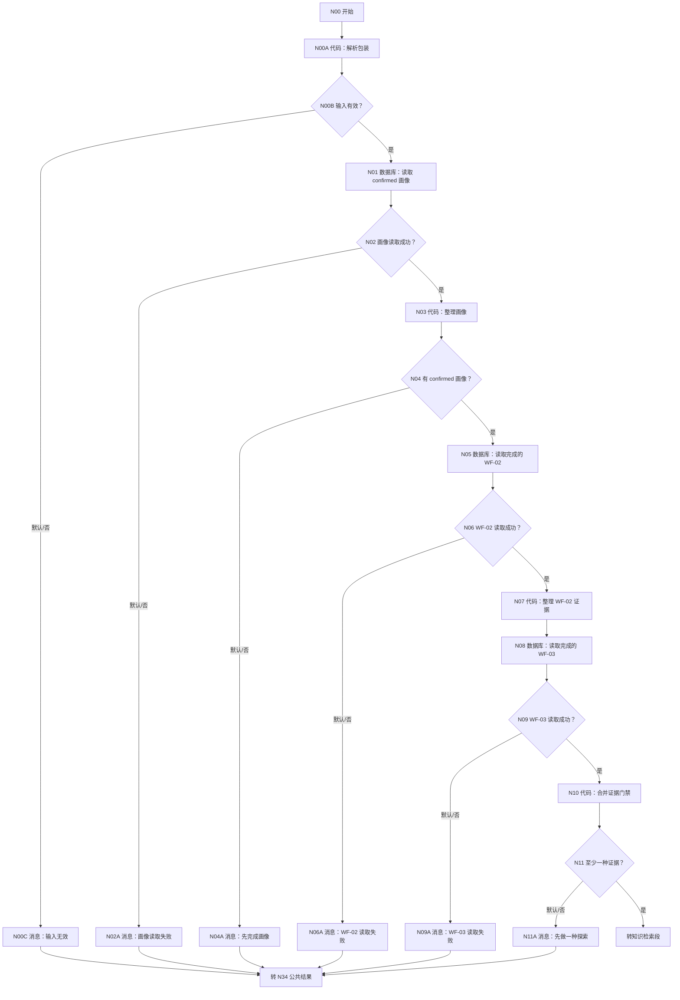
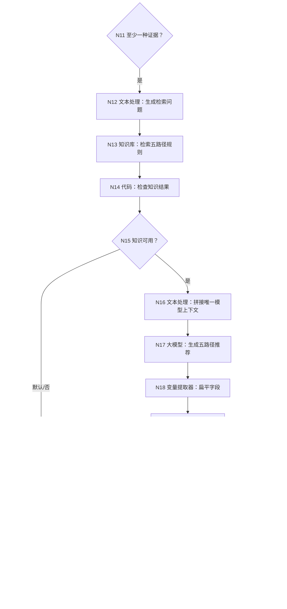
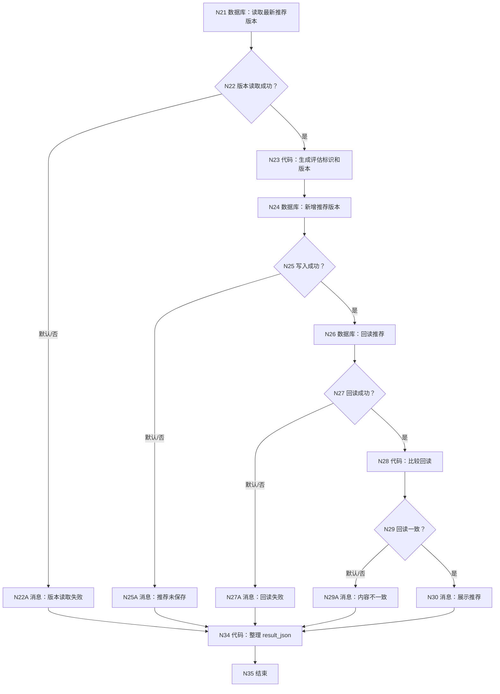

# WF-04 五路径推荐：逐节点搭建指南

<!-- AGENT-CONTRACT
start_inputs: AGENT_USER_INPUT:String
extractor_input_count: 1
result_output: result_json:String
-->

> WF-02 与 WF-03 是两种独立可选的 WFB 探索证据，不再把 WF-03 写成 WF-04 的硬前置。WF-04 至少读取到一种已完成证据才运行；一种证据给 medium confidence，两种给 high confidence。所有前置数据由 WF-04 自己按 user_key 读取，MAIN 不拼大对象。

## 1. 输出规则

固定评估保研、考研、就业、考公、留学五条路径，只允许 `高匹配/中匹配/待验证/当前不建议投入`，不输出成功概率。结果必须说明使用了哪些探索证据、缺了哪些证据、知识来源边界和下一步验证动作。

- 两种探索都没有完成：`needs_input`，建议任选 WF-02 或 WF-03。
- 只有一种：可以推荐，`confidence_level=medium`，明确另一证据缺口。
- 两种都有：`confidence_level=high`。
- 推荐写入并回读一致：`completed`；否则不宣称保存成功。

## 2. 完整画布










## 3. N00～N00C：单参数入口

N00 删除旧 uid、assessment_id、request_time，只添加：

| 参数名 | 类型 | 必填 |
|---|---|---|
| `AGENT_USER_INPUT` | String | 是 |

N00A 输入 `raw_input=开始/AGENT_USER_INPUT`，复制 [WF-02 第 5.2 节](WF-02-virtual-university.md#52-n00a-代码解析包装) 的完整代码。输出 `user_key:String`、`user_input:String`、`input_valid:Boolean`、`input_error:String`。测试值：

```json
{"user_key":"uk_0123456789abcdef0123456789abcdef","user_input":"结合我的探索结果给我五条路径建议"}
```

N00B：input_valid=true → N01；默认 → N00C。N00C 连接 N34。

## 4. N01～N11：读取画像和两种可选证据

### 4.1 N01 confirmed 画像

数据库 `university`；输入 `user_key=N00A/user_key`：

```sql
SELECT id, user_key, profile_json, pending_status, record_version, create_time
FROM user_profiles
WHERE user_key='{{user_key}}' AND pending_status='confirmed'
ORDER BY record_version DESC, create_time DESC
LIMIT 1;
```

N02：isSuccess=true → N03；默认 → N02A。

N03 输入 `rows=N01/outputList`：

```python
def main(rows):
    items = rows if isinstance(rows, list) else []
    row = items[0] if items and isinstance(items[0], dict) else {}
    profile = str(row.get("profile_json", "")).strip()
    return {"has_profile": bool(profile and profile != "{}"), "profile_json": profile}
```

输出 `has_profile:Boolean`、`profile_json:String`。N04 默认到 N04A。

### 4.2 N05/N07 读取 WF-02

N05 输入 `user_key=N00A/user_key`：

```sql
SELECT id, user_key, state_id, state_json, state_version, completed, create_time
FROM simulation_states
WHERE user_key='{{user_key}}' AND workflow_id='WF-02' AND completed='true'
ORDER BY state_version DESC, create_time DESC
LIMIT 1;
```

N06 只判断 SQL 是否成功；成功空数组仍到 N07。N07：

```python
def main(rows):
    items = rows if isinstance(rows, list) else []
    row = items[0] if items and isinstance(items[0], dict) else {}
    state = str(row.get("state_json", "")).strip()
    return {"simulation_available": bool(state and state != "{}"), "simulation_result_json": state or "{}"}
```

输出 `simulation_available:Boolean`、`simulation_result_json:String`。

### 4.3 N08/N10 读取 WF-03 并合并门禁

N08 输入同一个 N00A/user_key：

```sql
SELECT id, user_key, state_id, state_json, state_version, completed, create_time
FROM simulation_states
WHERE user_key='{{user_key}}' AND workflow_id='WF-03' AND completed='true'
ORDER BY state_version DESC, create_time DESC
LIMIT 1;
```

N09 只判断 SQL 是否成功；成功到 N10。N10 输入 N07 两项和 N08/outputList：

```python
def main(simulation_available, simulation_result_json, adventure_rows):
    items = adventure_rows if isinstance(adventure_rows, list) else []
    row = items[0] if items and isinstance(items[0], dict) else {}
    adventure = str(row.get("state_json", "")).strip()
    adventure_available = bool(adventure and adventure != "{}")
    sim_ok = simulation_available is True
    count = (1 if sim_ok else 0) + (1 if adventure_available else 0)
    sources = "WF-02|WF-03" if count == 2 else ("WF-02" if sim_ok else ("WF-03" if adventure_available else ""))
    gaps = "[]" if count == 2 else ('["WF-03"]' if sim_ok else ('["WF-02"]' if adventure_available else '["WF-02","WF-03"]'))
    confidence = "high" if count == 2 else ("medium" if count == 1 else "low")
    return {
        "adventure_available": adventure_available,
        "adventure_result_json": adventure or "{}",
        "evidence_available": count > 0,
        "evidence_sources": sources,
        "evidence_gaps_json": gaps,
        "confidence_level": confidence,
        "simulation_result_json": str(simulation_result_json) or "{}"
    }
```

输出逐项声明：`adventure_available:Boolean`、`adventure_result_json:String`、`evidence_available:Boolean`、`evidence_sources:String`、`evidence_gaps_json:String`、`confidence_level:String`、`simulation_result_json:String`。N11 evidence_available=true → N12；默认 → N11A。

## 5. N12～N15：KB-01 知识库真实界面配置

### 5.1 创建知识库

在平台“知识库”中新建 `KB-01 大学五路径规则库`，上传且只上传：

1. [01-保研路径.md](../knowledge-base/KB-01-five-paths/01-保研路径.md)
2. [02-考研路径.md](../knowledge-base/KB-01-five-paths/02-考研路径.md)
3. [03-就业路径.md](../knowledge-base/KB-01-five-paths/03-就业路径.md)
4. [04-考公路径.md](../knowledge-base/KB-01-five-paths/04-考公路径.md)
5. [05-留学路径.md](../knowledge-base/KB-01-five-paths/05-留学路径.md)

分段选“智能分段”，等待五份文件均处理完成。先在“命中测试”分别查询“保研校级规则”“考研报名核验”“就业项目证据”“考公职位资格”“留学申请材料”，确认能命中对应文件。

### 5.2 N12 检索问题文本处理

选择“字符串拼接”：

```text
请检索保研、考研、就业、考公、留学的适用条件、准备证据、时间节点、主要风险和官方核验渠道。
用户目标：{{N00A/user_input}}
已确认画像：{{N03/profile_json}}
WF-02 证据：{{N10/simulation_result_json}}
WF-03 证据：{{N10/adventure_result_json}}
```

### 5.3 N13 知识库节点

| 页面项 | 配置 |
|---|---|
| 输入 query | 引用 N12/output |
| 知识库 | KB-01 大学五路径规则库 |
| 调用逻辑 | 强制调用 |
| Top K | 5；必须覆盖五条路径 |
| Score 阈值 | 0.20 |
| 输出 | 平台固定 results，不手动改名 |

N14 输入 `results=N13/results`：

```python
def main(results):
    values = results if isinstance(results, list) else []
    return {"knowledge_available": len(values) > 0, "knowledge_hits_text": str(values)}
```

输出 `knowledge_available:Boolean`、`knowledge_hits_text:String`。N15 true → N16；默认 → N15A。不要在知识为空时让模型凭常识补政策。

## 6. N16～N20：一个模型输入和扁平变量提取

### 6.1 N16 文本处理

把模型所需内容拼成唯一 String：

```text
confirmed_profile={{N03/profile_json}}
simulation_evidence={{N10/simulation_result_json}}
adventure_evidence={{N10/adventure_result_json}}
evidence_sources={{N10/evidence_sources}}
evidence_gaps={{N10/evidence_gaps_json}}
confidence_level={{N10/confidence_level}}
knowledge_hits={{N14/knowledge_hits_text}}
latest_user_request={{N00A/user_input}}
```

### 6.2 N17 大模型

用户提示只引用 N16/output。系统提示：

```text
你是可解释的大学路径规划教练。逐一评估保研、考研、就业、考公、留学。
匹配等级只能是：高匹配、中匹配、待验证、当前不建议投入。不得给成功概率，不得把模拟选择当成真实经历。
每条路径必须含 requirements、gaps、priorities、evidence、limitations、fallback、source_notes；政策性结论必须来自 knowledge_hits，不确定时明确要求核验官方渠道。
必须保留输入给出的 evidence_sources、evidence_gaps 和 confidence_level，不得因表达完整而擅自提级。
为适配变量提取器，route_names 和 route_levels 都使用 | 分隔的 String，不输出对象数组给提取器。
只输出 JSON：
{"route_recommendation_json":"包含五条路径全部细节的 JSON 字符串","route_names":"保研|考研|就业|考公|留学","route_levels":"待验证|待验证|待验证|待验证|待验证","primary_route":"","alternative_routes":"用 | 分隔","evidence_sources":"","evidence_gaps_json":"[]","confidence_level":"medium","display_reply":"面向用户的完整推荐摘要","structure_complete":true,"source_notes_complete":true}
```

### 6.3 N18 变量提取器

固定 `input:String` 只引用 N17/output。输出：

| 字段 | 类型 |
|---|---|
| `route_recommendation_json` | String |
| `route_names` | String |
| `route_levels` | String |
| `primary_route` | String |
| `alternative_routes` | String |
| `evidence_sources` | String |
| `evidence_gaps_json` | String |
| `confidence_level` | String |
| `display_reply` | String |
| `structure_complete` | Boolean |
| `source_notes_complete` | Boolean |

### 6.4 N19 确定性校验

输入 N18 全部输出和 N10 的三项证据元数据：

```python
def main(route_recommendation_json, route_names, route_levels, primary_route,
         alternative_routes, evidence_sources, evidence_gaps_json, confidence_level,
         display_reply, structure_complete, source_notes_complete,
         expected_sources, expected_gaps, expected_confidence):
    names = [item.strip() for item in str(route_names).split("|") if item.strip()]
    levels = [item.strip() for item in str(route_levels).split("|") if item.strip()]
    allowed = ["高匹配", "中匹配", "待验证", "当前不建议投入"]
    exact_names = names == ["保研", "考研", "就业", "考公", "留学"]
    levels_ok = len(levels) == 5 and all(item in allowed for item in levels)
    metadata_ok = str(evidence_sources) == str(expected_sources) and str(evidence_gaps_json) == str(expected_gaps) and str(confidence_level) == str(expected_confidence)
    recommendation = str(route_recommendation_json).strip()
    valid = structure_complete is True and source_notes_complete is True and exact_names and levels_ok and metadata_ok and recommendation not in ["", "{}", "null"] and bool(str(primary_route).strip()) and bool(str(display_reply).strip())
    return {
        "recommendation_valid": valid,
        "route_recommendation_json": recommendation,
        "display_reply": str(display_reply),
        "primary_route": str(primary_route),
        "alternative_routes": str(alternative_routes)
    }
```

输出 `recommendation_valid:Boolean`、`route_recommendation_json:String`、`display_reply:String`、`primary_route:String`、`alternative_routes:String`。N20 true → N21；默认 → N20A。

## 7. N21～N30：版本、新增和回读

### 7.1 N21 最新推荐版本

输入 `user_key=N00A/user_key`：

```sql
SELECT id, user_key, assessment_id, assessment_version, create_time
FROM route_assessments
WHERE user_key='{{user_key}}' AND route_recommendation_json<>'{}'
ORDER BY assessment_version DESC, create_time DESC
LIMIT 1;
```

N22 isSuccess=true → N23；默认 → N22A。SQL 成功空数组不是失败。

N23 输入 `rows=N21/outputList`、`user_key=N00A/user_key`：

```python
def main(rows, user_key):
    items = rows if isinstance(rows, list) else []
    row = items[0] if items and isinstance(items[0], dict) else {}
    try:
        latest = int(row.get("assessment_version", 0))
    except Exception:
        latest = 0
    return {"assessment_id": "route_" + str(user_key)[3:15], "assessment_version": latest + 1}
```

输出 `assessment_id:String`、`assessment_version:Integer`。

### 7.2 N24 新增推荐

| 字段 | 值 |
|---|---|
| user_key | N00A/user_key |
| assessment_id | N23/assessment_id |
| simulation_result_json | N10/simulation_result_json |
| adventure_result_json | N10/adventure_result_json |
| route_recommendation_json | N19/route_recommendation_json |
| evidence_sources | N10/evidence_sources |
| evidence_gaps_json | N10/evidence_gaps_json |
| confidence_level | N10/confidence_level |
| trigger_reason | N00A/user_input |
| knowledge_version | KB-01-v1 |
| assessment_version | N23/assessment_version |

N25 true → N26；默认 → N25A。

### 7.3 N26 回读和 N28 比较

输入 N00A/user_key、N23/assessment_id、N23/assessment_version：

```sql
SELECT id, user_key, assessment_id, route_recommendation_json,
       evidence_sources, evidence_gaps_json, confidence_level,
       knowledge_version, assessment_version, create_time
FROM route_assessments
WHERE user_key='{{user_key}}' AND assessment_id='{{assessment_id}}'
  AND assessment_version={{assessment_version}}
ORDER BY create_time DESC
LIMIT 1;
```

N27 true → N28；默认 → N27A。N28 输入 rows、N19/recommendation、N23/version：

```python
def main(rows, expected_recommendation, expected_version):
    items = rows if isinstance(rows, list) else []
    row = items[0] if items and isinstance(items[0], dict) else {}
    try:
        version_ok = int(row.get("assessment_version", -1)) == int(expected_version)
    except Exception:
        version_ok = False
    matches = bool(row) and version_ok and str(row.get("route_recommendation_json", "")) == str(expected_recommendation)
    return {"readback_matches": matches}
```

输出 `readback_matches:Boolean`。N29 true → N30；默认 → N29A。N30 展示 N19/display_reply，并说明置信度和证据缺口。

## 8. N34 公共结果和 N35 结束

N34 输入 N00A/input_valid、N01/isSuccess、N03/has_profile、N05/isSuccess、N08/isSuccess、N10/evidence_available、N14/knowledge_available、N19/recommendation_valid、N19/display_reply、N24/isSuccess、N26/isSuccess、N28/readback_matches。

```python
def quote(value):
    text = str(value) if value is not None else ""
    return '"' + text.replace("\\", "\\\\").replace('"', '\\"').replace("\n", "\\n").replace("\r", "\\r") + '"'


def main(input_valid, profile_read_success, has_profile, simulation_read_success,
         adventure_read_success, evidence_available, knowledge_available,
         recommendation_valid, display_reply, write_success, readback_success,
         readback_matches):
    status, reply, next_action, error_code = "needs_input", "请先完成画像。", "complete_profile", "none"
    if input_valid is not True:
        status, reply, next_action, error_code = "validation_failed", "内部输入格式无效。", "retry_same_message", "invalid_envelope"
    elif profile_read_success is not True or simulation_read_success is not True or adventure_read_success is not True:
        status, reply, next_action, error_code = "read_failed", "暂时无法读取画像或探索证据。", "retry_later", "read_failed"
    elif has_profile is not True:
        status, reply, next_action = "needs_input", "请先完成并确认用户画像。", "complete_profile"
    elif evidence_available is not True:
        status, reply, next_action = "needs_input", "请先任选虚拟大学或大学生存大冒险完成一次探索。", "complete_one_wfb_exploration"
    elif knowledge_available is not True:
        status, reply, next_action, error_code = "read_failed", "五路径知识资料当前不可用，暂不生成无来源推荐。", "retry_later", "knowledge_unavailable"
    elif recommendation_valid is not True:
        status, reply, next_action, error_code = "validation_failed", "五路径推荐结构或来源说明不完整，本轮未保存。", "retry_recommendation", "invalid_recommendation"
    elif write_success is not True or readback_success is not True or readback_matches is not True:
        status, reply, next_action, error_code = "write_failed", "推荐没有通过写入回读校验，请稍后重试。", "retry_later", "readback_failed"
    else:
        status, reply, next_action = "completed", str(display_reply), "compare_directions_or_build_main_plan"
    result = "{" + '"workflow_id":"WF-04",' + '"status":' + quote(status) + "," + '"reply":' + quote(reply) + "," + '"next_action":' + quote(next_action) + "," + '"error_code":' + quote(error_code) + "}"
    return {"result_json": result}
```

输出 `result_json:String`。N35 选择“返回参数，由工作流生成”，只引用 N34/result_json。

## 9. 调试指南

### 9.1 四种证据组合

使用同一个 confirmed 画像 user_key，分别准备：

| DB-02 状态 | N10 预期 | 工作流结果 |
|---|---|---|
| 两者都无 | available=false、low | N11A，提示任选一种探索 |
| 只有 WF-02 completed | sources=WF-02、gaps=[WF-03]、medium | 生成推荐并保留缺口 |
| 只有 WF-03 completed | sources=WF-03、gaps=[WF-02]、medium | 生成推荐并保留缺口 |
| 两者都有 completed | sources=WF-02\|WF-03、gaps=[]、high | 生成高证据覆盖推荐 |

正常路线逐节点预期：N00→N01→N03→N05→N07→N08→N10→N12→N13→N14→N16→N17→N18→N19→N21→N23→N24→N26→N28→N30→N34→N35。

### 9.2 变量提取器专项

打开 N18，输入区只能看到一项 `input`，值为 N17/output。输出是扁平 String/Boolean，不创建 `routes:Array<Object>`。临时让模型漏掉 source_notes，N19/recommendation_valid 必须为 false，N24 不执行。

### 9.3 数据库和失败路线

1. DB-01 成功空数组与 SQL 失败分别走 N04A、N02A。
2. 另一个 user_key 的完成探索不可见。
3. WF-02 查询失败时，即使 WF-03 有证据也返回 read_failed；不能把“查询失败”误判为“没有证据”。
4. KB 命中为空：N15A，模型不执行。
5. route_names 顺序改变或 route_levels 数量不是 5：N20A。
6. 模型把 medium 擅自改 high：N20A。
7. DB-03 历史为空：N23/version=1。
8. N24 写入失败：N25A。
9. N26 回读失败：N27A。
10. 回读内容不一致：N29A。
11. 修复临时错误后重跑，版本只在成功写入时增加。

## 10. 发布配置

发布名称：`ULPS_WF04_FIVE_PATH_RECOMMENDATION`。描述：`读取 confirmed 画像与至少一种已完成 WFB 探索证据，检索 KB-01，生成可解释的五路径推荐并保存回读。`

发布为当前账号 MCP Server 后添加到 MAIN。WF-04 内不调用其他工具。审核通过后从“发布管理→详情→Trace”检查：MAIN 只传一个字符串；WF-04 自己读取证据；只做过一种探索时仍能完成但 confidence=medium。

## 11. 验收清单

- [ ] 开始节点只有 `AGENT_USER_INPUT:String`。
- [ ] WF-02/WF-03 独立可选，至少一种即可。
- [ ] 两次 DB-02 查询都按 user_key + workflow_id + completed 限定。
- [ ] N18 变量提取器只有一个 input。
- [ ] 已声明 `route_names`、`route_levels`、`structure_complete`、`source_notes_complete`。
- [ ] 知识为空时不凭常识补政策。
- [ ] 五路径、等级、证据来源和 confidence 经过代码校验。
- [ ] DB-03 新增版本并按 user_key 回读。
- [ ] 所有默认/失败路线进入 N34。
- [ ] N35 只返回 `result_json:String`。
- [ ] 四种证据组合、隔离、KB 空、模型漏字段、写入/回读失败均已实测。
