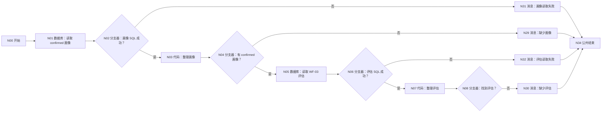
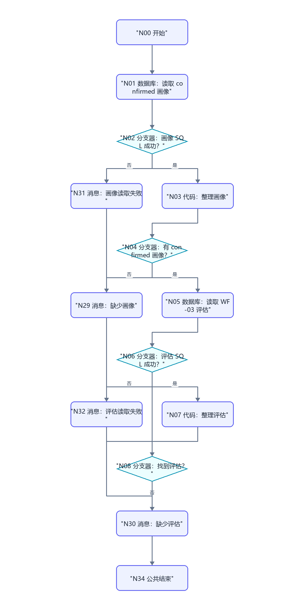
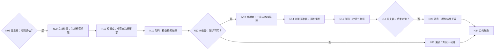
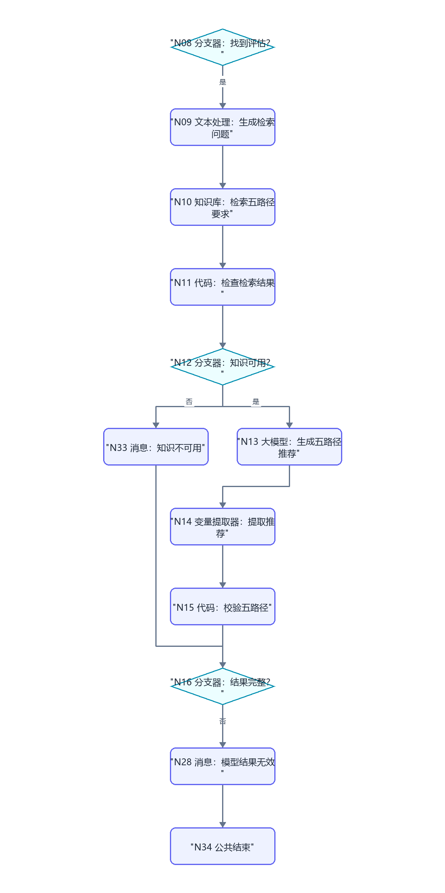
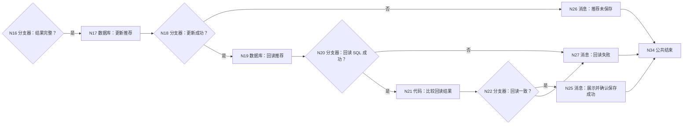
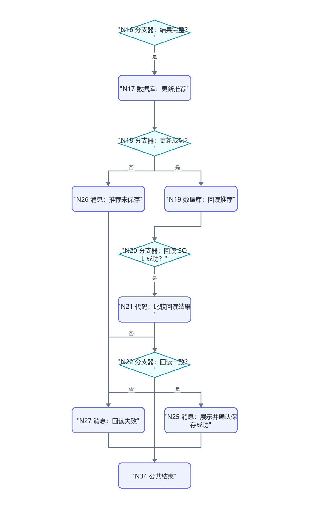

# WF-04 五路径推荐：逐节点搭建指南

> 按 WF-01 的实际页面重做。WF-04 是单轮工作流：读取已确认画像和 WF-03 评估，检索知识，生成五路径推荐，校验后更新并回读。当前结束节点仍按你选的第一种方式返回 `workflow_finished`。

## 1. 结果和前置条件

- 必须已有 DB-01 `user_profiles` 中的 confirmed 画像。
- 必须已有 DB-03 `route_assessments` 中由 WF-03 写入的 `assessment_id` 和 `adventure_result_json`。
- 结果更新回同一条 DB-03 记录的 `route_recommendation_json`。
- 五路径固定：保研、考研、就业、考公、留学；只能使用“高匹配/中匹配/待验证/当前不建议投入”，不输出成功概率。

## 2. 分段连线图

### 2.1 读取两个前置结果





### 2.2 检索、生成和校验





### 2.3 更新、回读和结束





N25～N33 所有消息连接 N34 结束。

## 3. N00 开始

| 变量名 | 类型 | 必填 | 调试值 |
|---|---|---:|---|
| `AGENT_USER_INPUT` | String | 是 | `根据场景测试给我五路径建议` |
| `uid` | String | 是 | `test_user_001` |
| `assessment_id` | String | 是 | WF-03 N23 生成并写入的 ID |
| `request_time` | String | 是 | `2026-07-19 14:00:00` |

## 4. N01～N04：读取并整理 confirmed 画像

N01 选“自定义SQL”、数据库 `university`；输入 `uid=N00/uid`：

```sql
SELECT id, uid, profile_json, pending_status, record_version, updated_at
FROM user_profiles
WHERE uid='{{uid}}' AND pending_status='confirmed'
ORDER BY updated_at DESC, create_time DESC
LIMIT 1;
```

N02：`N01/isSuccess == true`；是 → N03，否 → N31。

N03 输入 `outputList=N01/outputList`：

```python
def main(outputList):
    rows = outputList if isinstance(outputList, list) else []
    row = rows[0] if len(rows) > 0 and isinstance(rows[0], dict) else {}
    profile_text = row.get("profile_json", "")
    return {
        "has_profile": len(row) > 0 and isinstance(profile_text, str) and len(profile_text.strip()) > 2,
        "profile_json": profile_text if isinstance(profile_text, str) else "{}",
    }
```

输出 `has_profile:Boolean`、`profile_json:String`。N04：`N03/has_profile == true`；是 → N05，否 → N29。

## 5. N05～N08：读取并整理 WF-03 评估

N05 自定义 SQL，输入 `uid=N00/uid`、`assessment_id=N00/assessment_id`：

```sql
SELECT id, uid, assessment_id, adventure_result_json,
       route_recommendation_json, assessment_version, updated_at
FROM route_assessments
WHERE uid='{{uid}}' AND assessment_id='{{assessment_id}}'
ORDER BY assessment_version DESC, updated_at DESC
LIMIT 1;
```

N06：`N05/isSuccess == true`；是 → N07，否 → N32。

N07 输入 `outputList=N05/outputList`：

```python
def main(outputList):
    rows = outputList if isinstance(outputList, list) else []
    row = rows[0] if len(rows) > 0 and isinstance(rows[0], dict) else {}
    result_text = row.get("adventure_result_json", "")
    try:
        version_value = int(row.get("assessment_version", 0))
    except:
        version_value = 0
    return {
        "has_assessment": len(row) > 0 and isinstance(result_text, str) and len(result_text.strip()) > 2,
        "record_id": int(row.get("id", 0)) if str(row.get("id", "0")).isdigit() else 0,
        "adventure_result_json": result_text if isinstance(result_text, str) else "{}",
        "next_assessment_version": version_value + 1,
    }
```

输出 `has_assessment:Boolean`、`record_id:Integer`、`adventure_result_json:String`、`next_assessment_version:Integer`。N08：`N07/has_assessment == true`；是 → N09，否 → N30。

## 6. N09 文本处理和 N10 知识库

N09 拖“文本处理节点”，处理方式选“字符串拼接”。输入：`profile_json=N03/profile_json`、`adventure_result_json=N07/adventure_result_json`。规则：

```text
请检索与以下学生画像和场景测试相关的保研、考研、就业、考公、留学五条路径要求、时间节点、典型材料、风险和官方核验渠道。
画像：{{profile_json}}
测试：{{adventure_result_json}}
```

固定输出 `output:String`。

N10 拖“知识库”：输入 `query｜引用｜N09/output`；点击“+ 添加知识库”选项目五路径知识库；调用逻辑“强制调用”；参数设置 Top K=`3`、Score 阈值=`0.20`；输出固定 `results:Array<Object>`。

## 7. N11/N12：检查知识结果

N11 输入 `results=N10/results`：

```python
def main(results):
    values = results if isinstance(results, list) else []
    return {
        "knowledge_available": len(values) > 0,
        "knowledge_hits": values,
        "knowledge_error": "" if len(values) > 0 else "没有检索到可引用的五路径资料",
    }
```

输出 `knowledge_available:Boolean`、`knowledge_hits:Array<Object>`、`knowledge_error:String`。N12：`knowledge_available == true`；是 → N13，否 → N33。

## 8. N13 大模型：生成五路径推荐

模型 `Spark4.0 Ultra`，关闭对话历史。输入：`profile_json=N03/profile_json`、`adventure_result_json=N07/adventure_result_json`、`knowledge_hits=N11/knowledge_hits`。

系统提示词：

```text
你是可解释的大学路径规划教练。必须逐一评估保研、考研、就业、考公、留学。只能使用：高匹配、中匹配、待验证、当前不建议投入。不得给成功概率，不得虚构经历。
每条路径必须有 name、level、requirements、gaps、priorities、evidence、limitations、fallback、source_notes。政策性要求必须来自知识结果并保留来源/更新时间；无法确认时写“请以学校或主管部门官方渠道为准”。最后给一个 primary_route、至少一个 alternative_routes，并列出 assumptions_to_validate。
只输出合法 JSON。
```

用户提示词：

```text
已确认画像：{{profile_json}}
场景测试结果：{{adventure_result_json}}
知识检索结果：{{knowledge_hits}}
请按系统规则生成五路径推荐。
```

输出 `output:String`。

## 9. N14 变量提取器和 N15 代码校验

N14 输入 `input=N13/output`，输出：

| 变量名 | 类型 | 描述 |
|---|---|---|
| `route_recommendation_json` | String | 完整推荐对象 JSON 字符串，供数据库保存 |
| `routes` | Array | 完整 routes 数组，每项包含 name 和 level 等字段 |
| `primary_route` | String | 主路径名称 |
| `alternative_routes` | Array | 备选路径数组 |
| `reply` | String | 面向用户的简短总结 |

N15 输入上述五项：

```python
def main(route_recommendation_json, routes, primary_route, alternative_routes, reply):
    required_names = ["保研", "考研", "就业", "考公", "留学"]
    allowed_levels = ["高匹配", "中匹配", "待验证", "当前不建议投入"]
    values = routes if isinstance(routes, list) else []
    found = []
    errors = []
    for item in values:
        if isinstance(item, dict):
            name = str(item.get("name", ""))
            if name in required_names and name not in found:
                found.append(name)
            if item.get("level") not in allowed_levels:
                errors.append(name + "的 level 无效")
            for key in ["requirements", "gaps", "priorities", "evidence", "limitations", "source_notes"]:
                if not isinstance(item.get(key), list):
                    errors.append(name + "缺少" + key)
    for name in required_names:
        if name not in found:
            errors.append("缺少路径:" + name)
    if str(primary_route) not in required_names:
        errors.append("primary_route 无效")
    if not isinstance(alternative_routes, list) or len(alternative_routes) < 1:
        errors.append("缺少备选路径")
    text_value = str(route_recommendation_json).strip()
    if not text_value.startswith("{") or not text_value.endswith("}"):
        errors.append("完整 JSON 字符串无效")
    return {
        "valid": len(errors) == 0,
        "error": ";".join(errors),
        "recommendation_json": text_value if len(errors) == 0 else "",
        "reply": str(reply),
    }
```

输出 `valid:Boolean`、`error:String`、`recommendation_json:String`、`reply:String`。N16：`N15/valid == true`；是 → N17，否 → N28。

## 10. N17/N18：更新推荐

N17 选“表单处理数据”→ `university / route_assessments`→“更新数据”。

“设置数据范围”添加两个 AND 条件：

| 表字段 | 条件 | 比较类型 | 比较值 |
|---|---|---|---|
| `uid` | 等于 | 引用 | N00/uid |
| `assessment_id` | 等于 | 引用 | N00/assessment_id |

“设置更新数据”：

| 字段 | 值 |
|---|---|
| `route_recommendation_json` | N15/recommendation_json |
| `knowledge_updated_at` | N00/request_time |
| `assessment_version` | N07/next_assessment_version |
| `updated_at` | N00/request_time |

N18：`N17/isSuccess == true`；是 → N19，否 → N26。

## 11. N19～N22：回读核对

N19 自定义 SQL，输入 uid、assessment_id：

```sql
SELECT route_recommendation_json, assessment_version, updated_at
FROM route_assessments
WHERE uid='{{uid}}' AND assessment_id='{{assessment_id}}'
ORDER BY assessment_version DESC, updated_at DESC
LIMIT 1;
```

N20：`N19/isSuccess == true`；是 → N21，否 → N27。

N21 输入 `expected=N15/recommendation_json`、`outputList=N19/outputList`：

```python
def main(expected, outputList):
    rows = outputList if isinstance(outputList, list) else []
    row = rows[0] if len(rows) > 0 and isinstance(rows[0], dict) else {}
    stored = row.get("route_recommendation_json", "")
    same = str(stored).strip() == str(expected).strip() and len(str(stored).strip()) > 2
    return {"readback_matches": same, "stored_json": str(stored)}
```

输出 `readback_matches:Boolean`、`stored_json:String`。N22：`readback_matches == true`；是 → N25，否 → N27。

## 12. 消息节点 N25～N33

每个消息关闭流式输出并连接 N34。

| 节点 | 输入 | 回答内容 |
|---|---|---|
| N25 保存成功 | `reply=N15/reply`、`result=N21/stored_json` | `{{reply}}\n\n完整五路径推荐：\n{{result}}` |
| N26 更新失败 | `message=N17/message` | `推荐草稿已生成，但没有保存。错误：{{message}}` |
| N27 回读失败 | `message=N19/message` | `数据库更新后无法确认回读一致，因此不能声称已经保存。错误：{{message}}` |
| N28 模型无效 | `error=N15/error` | `推荐结果字段不完整，本轮未保存。缺失或错误：{{error}}` |
| N29 缺少画像 | 无 | `没有找到已确认画像。请先完成并确认 WF-01。` |
| N30 缺少评估 | 无 | `没有找到对应的 WF-03 场景测试结果。请先完成 WF-03，或检查 assessment_id。` |
| N31 画像读取失败 | `message=N01/message` | `画像数据库读取失败，本轮未生成推荐。错误：{{message}}` |
| N32 评估读取失败 | `message=N05/message` | `评估数据库读取失败，本轮未生成推荐。错误：{{message}}` |
| N33 知识不可用 | `error=N11/knowledge_error` | `当前没有检索到可核验的五路径资料，因此本轮不生成政策性推荐。{{error}}` |

## 13. N34 结束

- 回答模式：返回设定格式配置的回答。
- 输出：`output｜输入｜workflow_finished`。
- 回答内容：`本轮处理已结束，请以上方消息节点的提示为准。`
- 思考内容留空，流式输出关闭。

## 14. 调试指南

1. **正常**：使用真实存在的 uid 和 assessment_id。应走到 N25；DB-03 对应记录版本增加，回读文本一致。
2. **缺画像**：换一个没有 confirmed 画像的 uid。应到 N29，不调用知识库和模型。
3. **错误 assessment_id**：应到 N30，不更新数据库。
4. **知识库空**：临时移除 N10 知识库。应到 N33，不让模型编造来源。
5. **模型漏路径**：在 N13 测试输出中删掉“考公”。N15 valid=false，到 N28。
6. **更新失败**：临时清空 N17 的更新范围。应到 N26，测试后恢复。
7. **回读不一致**：临时让 N21 expected 引用错误变量。应到 N27，不能出现“保存成功”。

## 15. 验收清单

- [ ] 两次数据库读取都先检查 isSuccess，再由代码整理 outputList。
- [ ] 五条路径齐全，使用四级制，无成功概率。
- [ ] 知识库无结果时停止，不编造政策来源。
- [ ] 更新后回读，只有一致时 N25 才说已保存。
- [ ] 所有代码无 import、返回键与输出声明一致。
- [ ] 所有失败分支连接消息和 N34，没有悬空。
