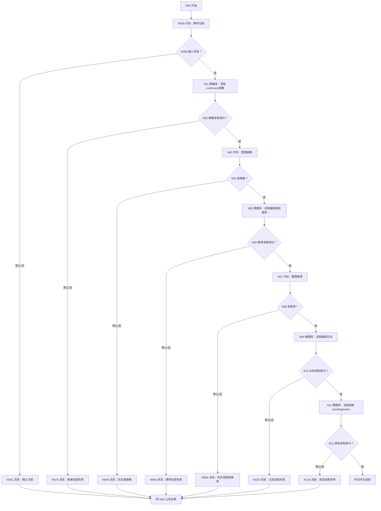
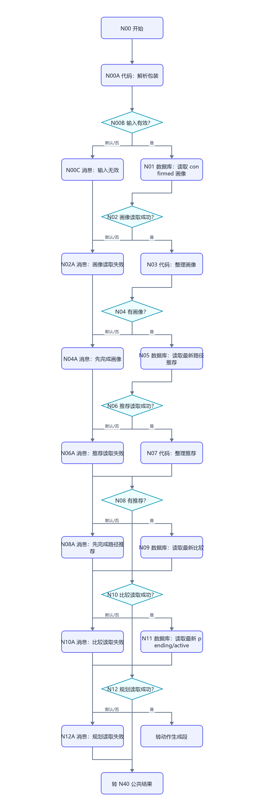
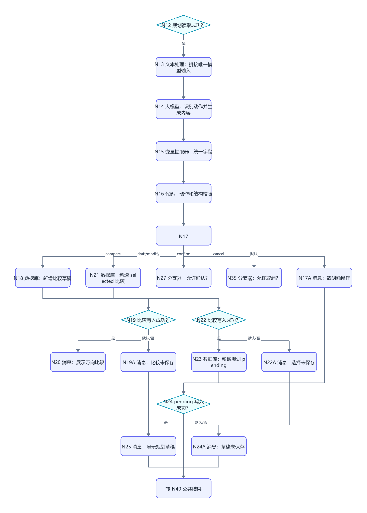
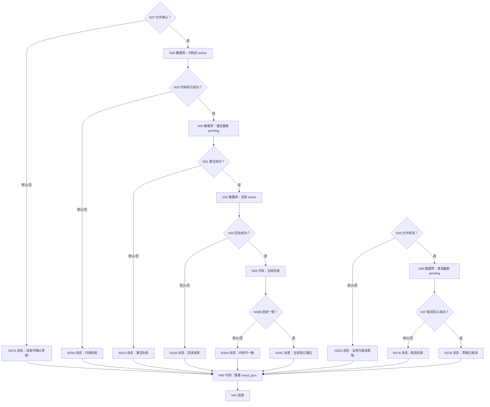
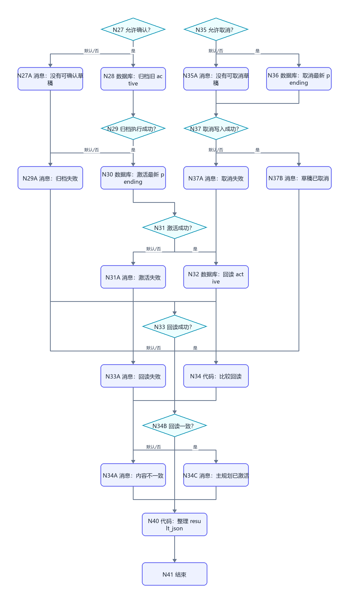

# WF-05 方向比较与主规划：逐节点搭建指南

<!-- AGENT-CONTRACT
start_inputs: AGENT_USER_INPUT:String
extractor_input_count: 1
result_output: result_json:String
-->

> 本工作流合并旧 WF-05“平行人生”和旧 WF-06“主规划”。方向比较和主规划共享同一批画像、路径推荐和选择上下文，拆开只会重复读取、提取和确认。用户仍可只比较方向，也可从比较结果直接生成主规划草稿。

## 1. 支持的自然语言动作

| 动作 | 示例 | 写入 |
|---|---|---|
| `compare` | 比较保研和就业两条路 | DB-04 draft |
| `draft_plan` | 按就业方向给我做主规划 | DB-04 selected + DB-05 pending |
| `modify_plan` | 把草稿里的实习提前到大二暑假 | DB-05 新 pending 版本 |
| `confirm_plan` | 确认保存主规划 | 旧 active→history，最新 pending→active，并回读 |
| `cancel_plan` | 取消这份主规划草稿 | 最新 pending→cancelled |
| `needs_input` | “就这样吧”等含糊表达 | 不写数据库 |

只有 `confirm_plan` 成功回读后才能返回 `completed`。草稿返回 `awaiting_confirmation`，MAIN 必须停止本轮其他规划工具调用。

## 2. 数据依赖

- DB-01 `user_profiles`：confirmed 画像，必需。
- DB-03 `route_assessments`：最新五路径推荐，必需。
- DB-04 `parallel_versions`：方向比较版本。
- DB-05 `main_plans`：pending/active/history/cancelled。

当前主规划定义为同一 user_key 下 `plan_status='active'` 且 record_version 最大的一行。即使历史修复前暂时有多行 active，下游也只取最新版本。

## 3. 画布分段





```mermaid
flowchart TD
    N12{"N12 规划读取成功？"} -->|是| N13["N13 文本处理：拼接唯一模型输入"]
    N13 --> N14["N14 大模型：识别动作并生成内容"]
    N14 --> N15["N15 变量提取器：统一字段"]
    N15 --> N16["N16 代码：动作和结构校验"]
    N16 --> N17{"N17 requested_action"]
    N17 -->|compare| N18["N18 数据库：新增比较草稿"]
    N17 -->|draft/modify| N21["N21 数据库：新增 selected 比较"]
    N17 -->|confirm| N27["N27 分支器：允许确认？"]
    N17 -->|cancel| N35["N35 分支器：允许取消？"]
    N17 -->|默认| N17A["N17A 消息：请明确操作"]
    N18 --> N19{"N19 比较写入成功？"}
    N19 -->|是| N20["N20 消息：展示方向比较"]
    N19 -->|默认/否| N19A["N19A 消息：比较未保存"]
    N21 --> N22{"N22 比较写入成功？"}
    N22 -->|是| N23["N23 数据库：新增规划 pending"]
    N22 -->|默认/否| N22A["N22A 消息：选择未保存"]
    N23 --> N24{"N24 pending 写入成功？"}
    N24 -->|是| N25["N25 消息：展示规划草稿"]
    N24 -->|默认/否| N24A["N24A 消息：草稿未保存"]
    N17A --> R["转 N40 公共结果"]
    N20 --> R
    N19A --> R
    N22A --> R
    N25 --> R
    N24A --> R
```







## 4. N00～N12：入口和四次读取

N00 只有 `AGENT_USER_INPUT:String`。N00A 复制 [WF-02 第 5.2 节](WF-02-virtual-university.md#52-n00a-代码解析包装)，输出 user_key、user_input、input_valid、input_error。N00B 必须有默认出口。

N01 confirmed 画像：

```sql
SELECT id, user_key, profile_json, pending_status, record_version, create_time
FROM user_profiles
WHERE user_key='{{user_key}}' AND pending_status='confirmed'
ORDER BY record_version DESC, create_time DESC
LIMIT 1;
```

N03 整理 rows，输出 `has_profile:Boolean`、`profile_json:String`，代码与 WF-04/N03 相同。

N05 最新五路径推荐：

```sql
SELECT id, user_key, assessment_id, route_recommendation_json,
       evidence_sources, evidence_gaps_json, confidence_level,
       assessment_version, create_time
FROM route_assessments
WHERE user_key='{{user_key}}' AND route_recommendation_json<>'{}'
ORDER BY assessment_version DESC, create_time DESC
LIMIT 1;
```

N07 输入 N05/outputList：

```python
def main(rows):
    items = rows if isinstance(rows, list) else []
    row = items[0] if items and isinstance(items[0], dict) else {}
    recommendation = str(row.get("route_recommendation_json", "")).strip()
    return {
        "has_recommendation": bool(recommendation and recommendation != "{}"),
        "assessment_id": str(row.get("assessment_id", "")),
        "recommendation_json": recommendation,
        "confidence_level": str(row.get("confidence_level", "low"))
    }
```

输出四项对应 String/Boolean。N08 默认到 N08A。

N09 最新比较：

```sql
SELECT id, user_key, comparison_id, versions_json, comparison_json,
       shared_baseline_json, selected_version_name, comparison_status,
       record_version, create_time
FROM parallel_versions
WHERE user_key='{{user_key}}'
ORDER BY record_version DESC, create_time DESC
LIMIT 1;
```

N11 同时读取最新 pending 和 active，输入 user_key：

```sql
SELECT id, user_key, plan_id, plan_json, pending_plan_json, plan_status,
       source_comparison_id, change_reason, record_version, create_time
FROM main_plans
WHERE user_key='{{user_key}}' AND plan_status IN ('pending','active')
ORDER BY record_version DESC, create_time DESC
LIMIT 2;
```

四次 SQL 都要把 `isSuccess=false` 与“成功空数组”分开。空比较/空规划是可接受状态，不走读取失败。

## 5. N13～N17：一个模型输入和动作门禁

N13 文本处理拼接：profile_json、recommendation_json、N09/outputList、N11/outputList、user_input。输出一个 String。

N14 系统提示：

```text
你是大学方向比较与主规划引擎。先识别 requested_action：compare、draft_plan、modify_plan、confirm_plan、cancel_plan、needs_input。
compare：生成 2～3 个方向版本，共用同一 baseline，按学业门槛、时间、金钱、可逆性、证据、风险比较。
draft_plan/modify_plan：必须基于已选方向，生成从当前阶段到毕业的里程碑、验证点、退出条件和备选路线；只生成 pending 草稿。
confirm_plan：仅识别用户是否明确表达“确认/保存/采用”且对象是当前主规划；不要重新生成规划。
cancel_plan：仅取消当前 pending。
不得把模型推断写成真实经历，不得省略证据缺口。只输出 JSON：
{"requested_action":"needs_input","confirmation_explicit":false,"versions_json":"[]","comparison_json":"{}","shared_baseline_json":"{}","selected_version_name":"","plan_json":"{}","change_reason":"","display_reply":"","structure_complete":true}
```

用户提示只引用 N13/output。

N15 变量提取器固定 input 只引用 N14/output，输出上面九项，类型依次为 String、Boolean、String×7、Boolean。

N16 输入 N15 全部结果、N09/outputList、N11/outputList、N00A/user_key、N00A/user_input：

```python
def main(requested_action, confirmation_explicit, versions_json, comparison_json,
         shared_baseline_json, selected_version_name, plan_json, change_reason,
         display_reply, structure_complete, comparison_rows, plan_rows, user_key, user_input):
    allowed = ["compare", "draft_plan", "modify_plan", "confirm_plan", "cancel_plan", "needs_input"]
    action = str(requested_action).strip()
    comparisons = comparison_rows if isinstance(comparison_rows, list) else []
    plans = plan_rows if isinstance(plan_rows, list) else []
    pending = {}
    active = {}
    max_plan_version = 0
    max_comparison_version = 0
    for row in comparisons:
        if isinstance(row, dict):
            try:
                max_comparison_version = max(max_comparison_version, int(row.get("record_version", 0)))
            except Exception:
                pass
    for row in plans:
        if not isinstance(row, dict):
            continue
        try:
            max_plan_version = max(max_plan_version, int(row.get("record_version", 0)))
        except Exception:
            pass
        if str(row.get("plan_status", "")) == "pending" and not pending:
            pending = row
        if str(row.get("plan_status", "")) == "active" and not active:
            active = row
    text = str(user_input)
    explicit = confirmation_explicit is True and any(word in text for word in ["确认", "保存", "采用"]) and any(word in text for word in ["规划", "计划", "方案"])
    valid = structure_complete is True and action in allowed and bool(str(display_reply).strip())
    if action == "compare":
        valid = valid and str(versions_json).strip() not in ["", "[]"] and str(comparison_json).strip() not in ["", "{}"]
    if action in ["draft_plan", "modify_plan"]:
        valid = valid and bool(str(selected_version_name).strip()) and str(plan_json).strip() not in ["", "{}"]
    confirm_allowed = action == "confirm_plan" and explicit and bool(pending)
    cancel_allowed = action == "cancel_plan" and bool(pending)
    comparison_id = "cmp_" + str(user_key)[3:15]
    plan_id = str(pending.get("plan_id", "")).strip() or ("plan_" + str(user_key)[3:15])
    return {
        "model_valid": valid, "requested_action": action,
        "confirm_allowed": confirm_allowed, "cancel_allowed": cancel_allowed,
        "pending_id": str(pending.get("id", "")), "active_id": str(active.get("id", "")),
        "comparison_id": comparison_id, "comparison_version": max_comparison_version + 1,
        "plan_id": plan_id, "plan_version": max_plan_version + 1,
        "versions_json": str(versions_json), "comparison_json": str(comparison_json),
        "baseline_json": str(shared_baseline_json), "selected_name": str(selected_version_name),
        "plan_json": str(plan_json), "change_reason": str(change_reason),
        "display_reply": str(display_reply),
        "pending_plan_json": str(pending.get("pending_plan_json", "{}")),
        "source_comparison_id": str(pending.get("source_comparison_id", "")) or comparison_id
    }
```

逐项声明输出类型：Boolean×3，其他标识/JSON/reply 为 String，两个版本为 Integer。N17 先判断 model_valid；若 false 直接走默认 N17A，不能进入任何写节点。

## 6. N18～N25：比较和 pending 草稿

N18 新增 DB-04：user_key、N16/comparison_id、versions_json、comparison_json、baseline_json、selected_name、comparison_status=`draft`、comparison_version。N19 检查 isSuccess。

draft_plan/modify_plan 路线先由 N21 新增 DB-04，字段相同但 comparison_status=`selected`；成功后 N23 新增 DB-05：

| 字段 | 值 |
|---|---|
| user_key | N00A/user_key |
| plan_id | N16/plan_id |
| plan_json | `{}` |
| pending_plan_json | N16/plan_json |
| plan_status | pending |
| source_comparison_id | N16/comparison_id |
| change_reason | N16/change_reason |
| record_version | N16/plan_version |

N25 展示 N16/display_reply，末尾固定加：“请检查后回复‘确认保存主规划’，或直接说明要修改的部分。”

## 7. N27～N37：确认、取消和回读

N27 只引用 N16/confirm_allowed；默认到 N27A。

N28 自定义 SQL 归档旧 active，输入 user_key：

```sql
UPDATE main_plans
SET plan_status='history'
WHERE user_key='{{user_key}}' AND plan_status='active';
```

N29 检查 isSuccess。N30 使用“更新表单数据”，范围必须同时限定：user_key=N00A/user_key、id=N16/pending_id、plan_status=pending。更新：plan_json=N16/pending_plan_json、pending_plan_json=`{}`、plan_status=active。N31 检查成功。

N32 回读：

```sql
SELECT id, user_key, plan_id, plan_json, plan_status,
       source_comparison_id, change_reason, record_version, create_time
FROM main_plans
WHERE user_key='{{user_key}}' AND plan_status='active'
ORDER BY record_version DESC, create_time DESC
LIMIT 1;
```

N34 输入 rows、N16/plan_id、N16/pending_plan_json：

```python
def main(rows, expected_plan_id, expected_plan_json):
    items = rows if isinstance(rows, list) else []
    row = items[0] if items and isinstance(items[0], dict) else {}
    matches = bool(row) and str(row.get("plan_id", "")) == str(expected_plan_id) and str(row.get("plan_json", "")) == str(expected_plan_json) and str(row.get("plan_status", "")) == "active"
    return {"readback_matches": matches}
```

输出 `readback_matches:Boolean`。N34B 默认到 N34A。

N35 先检查 N16/cancel_allowed=true；默认到 N35A，只有“是”才执行 N36。N36 更新范围 user_key=N00A/user_key、id=N16/pending_id、plan_status=pending；更新 plan_status=cancelled、pending_plan_json=`{}`。N37 检查 N36/isSuccess，成功到 N37B，默认到 N37A。禁止在允许取消门禁之前执行更新。

## 8. N40 公共结果

N40 输入按下表逐项添加；未执行路线的值按空值处理：

| 形参 | 引用 |
|---|---|
| input_valid | N00A/input_valid |
| profile_read / has_profile | N01/isSuccess / N03/has_profile |
| recommendation_read / has_recommendation | N05/isSuccess / N07/has_recommendation |
| comparison_read / plan_read | N09/isSuccess / N11/isSuccess |
| model_valid / action / display_reply | N16/model_valid / requested_action / display_reply |
| comparison_write / selected_write / pending_write | N18/isSuccess / N21/isSuccess / N23/isSuccess |
| confirm_allowed / cancel_allowed | N16/confirm_allowed / N16/cancel_allowed |
| archive_success / activate_success | N28/isSuccess / N30/isSuccess |
| readback_success / readback_matches | N32/isSuccess / N34/readback_matches |
| cancel_success | N36/isSuccess |

```python
def q(value):
    return '"' + str(value if value is not None else "").replace("\\", "\\\\").replace('"', '\\"').replace("\n", "\\n").replace("\r", "\\r") + '"'


def main(input_valid, profile_read, has_profile, recommendation_read,
         has_recommendation, comparison_read, plan_read, model_valid,
         action, display_reply,
         comparison_write, selected_write, pending_write, confirm_allowed,
         archive_success, activate_success, readback_success, readback_matches,
         cancel_allowed, cancel_success):
    status, reply, next_action, error_code = "needs_input", "请说明要比较方向、生成/修改/确认/取消主规划。", "choose_plan_action", "none"
    prerequisites_ok = profile_read is True and has_profile is True and recommendation_read is True and has_recommendation is True and comparison_read is True and plan_read is True
    if input_valid is not True:
        status, reply, next_action, error_code = "validation_failed", "内部输入格式无效。", "retry_same_message", "invalid_envelope"
    elif prerequisites_ok is not True:
        status, reply, next_action = "needs_input", "请先完成 confirmed 画像和五路径推荐。", "complete_route_recommendation"
    elif model_valid is not True:
        status, reply, next_action, error_code = "validation_failed", "本轮动作或内容不完整，没有写入。", "clarify_plan_action", "invalid_model_output"
    elif action == "compare":
        if comparison_write is True:
            status, reply, next_action = "completed", str(display_reply), "select_direction_or_draft_plan"
        else:
            status, reply, next_action, error_code = "write_failed", "方向比较没有保存。", "retry_later", "comparison_write_failed"
    elif action in ["draft_plan", "modify_plan"]:
        if selected_write is True and pending_write is True:
            status, reply, next_action = "awaiting_confirmation", str(display_reply) + "\n\n请确认保存主规划，或直接说明修改项。", "confirm_or_modify_plan"
        else:
            status, reply, next_action, error_code = "write_failed", "主规划草稿没有完整保存。", "retry_later", "pending_write_failed"
    elif action == "confirm_plan":
        if confirm_allowed is not True:
            status, reply, next_action, error_code = "needs_input", "当前没有可确认草稿，或确认表达不够明确。", "confirm_plan_explicitly", "ambiguous_confirmation"
        elif archive_success is True and activate_success is True and readback_success is True and readback_matches is True:
            status, reply, next_action = "completed", "主规划已经激活并完成回读。", "build_semester_tasks"
        else:
            status, reply, next_action, error_code = "write_failed", "主规划激活没有通过完整校验，请重试确认。", "retry_plan_confirmation", "activation_failed"
    elif action == "cancel_plan":
        if cancel_allowed is True and cancel_success is True:
            status, reply, next_action = "completed", "当前主规划草稿已取消，原 active 规划未改变。", "none"
        else:
            status, reply, next_action, error_code = "write_failed", "没有取消可定位的主规划草稿。", "retry_later", "cancel_failed"
    result = "{" + '"workflow_id":"WF-05",' + '"status":' + q(status) + "," + '"reply":' + q(reply) + "," + '"next_action":' + q(next_action) + "," + '"error_code":' + q(error_code) + "}"
    return {"result_json": result}
```

N40 输出只声明 `result_json:String`；N41 只返回该参数。

## 9. 调试指南

### 9.1 正常五轮

1. “比较保研和就业”：DB-04 新增 draft；不写 DB-05。
2. “我选就业，给我主规划”：DB-04 selected + DB-05 pending；返回 awaiting_confirmation。
3. “把实习提前到大二暑假”：读取最新 pending，新增更高 record_version pending。
4. “就这样”：needs_input，不归档 active、不激活 pending。
5. “确认保存主规划”：归档旧 active→激活最新 pending→回读一致；返回 completed。

### 9.2 故障和另一条路

1. 画像或推荐 SQL 成功空数组：分别提示缺前置；模型不执行。
2. 任一 SQL 失败：走对应读取失败，不能按空数组继续。
3. 另一个 user_key 的比较、pending、active 都不可见。
4. N15 漏字段：N16/model_valid=false，无写节点执行。
5. compare 写 DB-04 失败：N19A。
6. selected 成功但 pending 失败：返回 pending_write_failed；下次可重新生成，不激活半成品。
7. 无 pending 时确认：N27A。
8. 含糊确认：confirm_allowed=false。
9. 归档失败：N30 不执行。
10. 激活失败：保留 pending，可重试确认。
11. 回读失败或内容不一致：不返回 completed。
12. 取消时范围必须含 user_key+id+pending；临时去掉 id 的配置禁止验收。

## 10. 发布与验收清单

发布名称 `ULPS_WF05_DIRECTION_AND_MAIN_PLAN`；描述：`比较 2～3 个方向，生成/修改主规划草稿，并在明确确认后激活和回读主规划。`

- [ ] 只有 `AGENT_USER_INPUT:String`。
- [ ] N15 变量提取器只有唯一 input。
- [ ] 所有数据库节点只引用其前面的 N00A/N16 等确定变量。
- [ ] 方向比较和主规划共用一次前置读取。
- [ ] 含糊表达不能激活规划。
- [ ] pending、active、history 状态和版本规则已实测。
- [ ] 更新范围包含 user_key 和业务 id/状态。
- [ ] 所有失败消息进入 N40；N41 返回 `result_json:String`。
