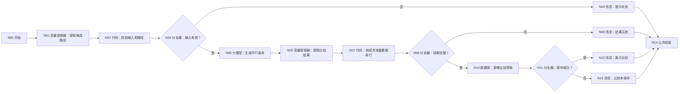
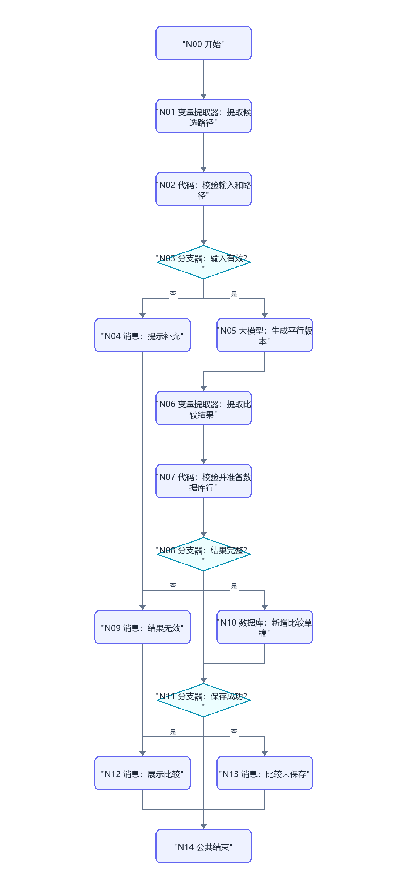

# WF-05 平行人生模拟：逐节点搭建指南

> WF-05 只比较 2～3 条路径，不生成或覆盖主规划。它可以把比较草稿保存到 `parallel_versions`，但正式主规划必须交给 WF-06 再确认。结束节点当前按第一种方式返回 `workflow_finished`。

## 1. 最终结果

- 输入：已确认画像、WF-04 五路径推荐、用户想比较的 2～3 条路径。
- 输出：完全相同起点下的 2～3 个版本、统一维度比较、取舍和待回答问题。
- 保存：DB-04 `parallel_versions`，仅保存模拟比较。
- 禁止：写 `main_plans`，把模拟结果说成预测，替用户选定最终版本。

## 2. 数据表

在 `university` 创建 `parallel_versions`，上传 [DB-04](../database/import-templates/DB-04-parallel-versions.xlsx)。保留默认 `id/uid/create_time`。业务必填字段：`comparison_id`、`versions_json`、`comparison_json`、`shared_baseline_json`、`comparison_version`、`updated_at`。

## 3. 清晰连线图





N04、N09、N12、N13 全部连接 N14 结束。

## 4. N00 开始

| 变量名 | 类型 | 必填 | 调试值 |
|---|---|---:|---|
| `AGENT_USER_INPUT` | String | 是 | `比较保研、考研和就业` |
| `uid` | String | 是 | `test_user_001` |
| `profile_json` | String | 是 | WF-01 已确认画像 |
| `route_recommendation_json` | String | 是 | WF-04 完整推荐 |
| `selected_routes` | String | 否 | `保研,考研,就业` |
| `request_time` | String | 是 | `2026-07-19 15:00:00` |

这里把 `selected_routes` 建成 String，因为开始节点截图没有稳定的 Array 输入；N01 会从文本提取数组。

## 5. N01 变量提取器：提取候选路径

模型 `Spark4.0 Ultra`。输入：

- `user_input｜引用｜N00/AGENT_USER_INPUT`
- `selected_routes｜引用｜N00/selected_routes`
- `recommendation｜引用｜N00/route_recommendation_json`

输出：

| 变量 | 类型 | 描述 |
|---|---|---|
| `routes` | Array | 从用户原话或 selected_routes 提取的路径名称数组，只允许保研、考研、就业、考公、留学 |
| `extract_reason` | String | 路径来源和无法判断的原因 |

## 6. N02 代码：校验输入和路径

输入 `profile_json=N00/profile_json`、`routes=N01/routes`、`route_recommendation_json=N00/route_recommendation_json`。

```python
def main(profile_json, routes, route_recommendation_json):
    allowed = ["保研", "考研", "就业", "考公", "留学"]
    values = routes if isinstance(routes, list) else []
    normalized = []
    for item in values:
        name = str(item).strip()
        if name in allowed and name not in normalized:
            normalized.append(name)
    profile_text = str(profile_json).strip()
    recommendation_text = str(route_recommendation_json).strip()
    valid = profile_text.startswith("{") and profile_text.endswith("}") and 2 <= len(normalized) <= 3
    return {
        "input_valid": valid,
        "validation_error": "" if valid else "需要已确认画像和 2～3 条互不重复的有效路径",
        "normalized_routes": normalized,
        "shared_baseline_json": profile_text if valid else "{}",
        "recommendation_json": recommendation_text if recommendation_text else "{}",
    }
```

输出 `input_valid:Boolean`、`validation_error:String`、`normalized_routes:Array<String>`、`shared_baseline_json:String`、`recommendation_json:String`。

## 7. N03 分支器和 N04 消息

N03 引用 `N02/input_valid`，等于固定值 `true`。是 → N05；否 → N04。

N04 输入 `error=N02/validation_error`，回答内容：

```text
还不能生成平行版本：{{error}}。
请明确选择 2～3 条不同路径，例如“比较保研、考研和就业”。
```

关闭流式输出，连接 N14。

## 8. N05 大模型：生成平行版本

模型 `Spark4.0 Ultra`，关闭对话历史。输入：`shared_baseline_json=N02/shared_baseline_json`、`normalized_routes=N02/normalized_routes`、`route_recommendation_json=N02/recommendation_json`。

系统提示词：

```text
你是大学规划情景推演师。为 routes 中每条路径生成一个平行版本，所有版本必须共用完全相同的 shared_baseline，不得补造经历，不得给成功概率。
每个版本必须包含 version_name、target_route、semester_trajectory、resume_assets、skill_tree、time_cost、economic_cost、failure_risks、reversibility、crowding_out_effect、graduation_options、limitations、official_verification。
统一比较必须覆盖：路径匹配、剩余学期轨迹、简历素材、技能深度和广度、时间、经济成本、失败风险、可逆性、挤出效应、毕业选择权。
只输出 JSON：
{"versions":[],"comparison":[],"key_tradeoffs":[],"questions_for_user":[],"reply":""}
```

用户提示词：

```text
共同起点：{{shared_baseline_json}}
候选路径：{{normalized_routes}}
已有五路径推荐：{{route_recommendation_json}}
请生成并比较全部版本，只输出规定 JSON。
```

输出格式 text，变量 `output:String`。

## 9. N06 变量提取器：提取比较结果

输入 `input=N05/output`。输出：

| 变量 | 类型 | 描述 |
|---|---|---|
| `parallel_versions_json` | String | 完整模型结果 JSON 字符串 |
| `versions` | Array | 完整 versions 数组 |
| `versions_json` | String | 仅 versions 数组序列化后的 JSON 字符串 |
| `comparison_json` | String | comparison、key_tradeoffs、questions_for_user 的 JSON 字符串 |
| `reply` | String | 面向用户的比较摘要和下一步问题 |

## 10. N07 代码：校验并准备数据库行

输入 `uid=N00/uid`、`request_time=N00/request_time`、`routes=N02/normalized_routes`、`shared_baseline_json=N02/shared_baseline_json`、N06 的全部输出。

```python
def main(uid, request_time, routes, shared_baseline_json, parallel_versions_json, versions, versions_json, comparison_json, reply):
    required = [
        "version_name", "target_route", "semester_trajectory", "resume_assets",
        "skill_tree", "time_cost", "economic_cost", "failure_risks",
        "reversibility", "crowding_out_effect", "graduation_options",
        "limitations", "official_verification"
    ]
    route_values = routes if isinstance(routes, list) else []
    version_values = versions if isinstance(versions, list) else []
    errors = []
    if len(version_values) != len(route_values):
        errors.append("版本数量与路径数量不一致")
    found_routes = []
    for index, item in enumerate(version_values):
        if not isinstance(item, dict):
            errors.append("版本不是对象:" + str(index))
            continue
        found_routes.append(str(item.get("target_route", "")))
        for key in required:
            if key not in item:
                errors.append("versions[" + str(index) + "]缺少" + key)
    for route in route_values:
        if str(route) not in found_routes:
            errors.append("缺少路径版本:" + str(route))
    full_text = str(parallel_versions_json).strip()
    if not full_text.startswith("{") or not full_text.endswith("}"):
        errors.append("完整结果不是 JSON 对象字符串")
    return {
        "result_valid": len(errors) == 0,
        "result_error": ";".join(errors),
        "comparison_id": str(uid) + "-COMPARE-" + str(request_time),
        "versions_json": str(versions_json),
        "comparison_json": str(comparison_json),
        "shared_baseline_json": str(shared_baseline_json),
        "selected_version_name": "",
        "comparison_version": 1,
        "updated_at": str(request_time),
        "display_result": full_text,
        "reply": str(reply),
    }
```

输出区声明：`result_valid:Boolean`、`result_error:String`、`comparison_version:Integer`，其余返回键均 String。不要漏掉 `display_result` 和 `reply`。

## 11. N08/N09：完整性分支

N08：`N07/result_valid == true`。是 → N10；否 → N09。

N09 输入 `error=N07/result_error`，回答：`平行版本结果字段不完整，本轮未保存。请重试。错误：{{error}}`，连接 N14。

## 12. N10 数据库：新增比较草稿

模式“表单处理数据”，数据表 `university / parallel_versions`，处理模式“新增数据”。设置：

| 表字段 | 值 |
|---|---|
| `uid` | 页面强制显示时引用 N00/uid |
| `comparison_id` | N07/comparison_id |
| `versions_json` | N07/versions_json |
| `comparison_json` | N07/comparison_json |
| `shared_baseline_json` | N07/shared_baseline_json |
| `selected_version_name` | N07/selected_version_name |
| `comparison_version` | N07/comparison_version |
| `updated_at` | N07/updated_at |

固定输出 `isSuccess/message/outputList`。

## 13. N11～N13：保存结果消息

N11：`N10/isSuccess == true`。是 → N12；否 → N13。

N12 输入 `reply=N07/reply`、`result=N07/display_result`、`comparison_id=N07/comparison_id`，回答：

```text
{{reply}}

完整比较：
{{result}}

本次比较草稿编号：{{comparison_id}}。它只是模拟版本，还没有成为主规划；选定版本后再进入 WF-06。
```

N13 输入 `result=N07/display_result`、`message=N10/message`，回答：

```text
平行版本已经生成，但比较草稿没有保存。下面仍可查看本轮结果；不要把它当作已保存记录。
{{result}}
错误：{{message}}
```

两者连接 N14。

## 14. N14 结束

- 回答模式：返回设定格式配置的回答。
- 输出：`output｜输入｜workflow_finished`。
- 回答内容：`本轮处理已结束，请以上方消息节点的提示为准。`
- 思考内容留空；流式输出关闭。

## 15. 调试指南：从 WF-01 和 WF-04 取得两个完整 JSON

### 15.1 前置工作流准备

WF-05 不查询上游数据库，`profile_json` 和 `route_recommendation_json` 都由开始节点直接传入。手工调试前按顺序准备：

1. 用 `debug_wf05_001` 完成 WF-01 两轮确认，从 DB-01 confirmed 行复制完整 `profile_json`。
2. 用同一 uid 完成 WF-03，并记下 `assessment_id`。
3. 用该 uid 和 assessment_id 完成 WF-04，必须走到 N25。
4. 从 DB-03 对应行复制完整 `route_recommendation_json`。不要复制 N25 中被界面截断的显示片段。
5. 确认推荐中确实含保研、考研、就业、考公、留学五条路径。
6. 在 DB-04 `parallel_versions` 记录该 uid 测试前行数。

保存一份调试变量备忘：

```text
uid = debug_wf05_001
profile_json = DB-01 confirmed 完整值
route_recommendation_json = WF-04 写回 DB-03 的完整值
selected_routes = 保研,考研,就业
```

### 测试 1：正常比较三条路径

N00 输入：

```text
AGENT_USER_INPUT = 请比较保研、考研和就业三个版本
uid = debug_wf05_001
profile_json = 上游完整值
route_recommendation_json = 上游完整值
selected_routes = 保研,考研,就业
request_time = 2026-07-19 15:00:00
```

预期路径：N00→N01→N02→N03（是）→N05→N06→N07→N08（是）→N10→N11（是）→N12→N14。

重点检查 N02：`normalized_routes` 恰好三项且不重复，`shared_baseline_json` 与输入画像一致。N07 生成的每个版本必须使用同一学校、专业、年级、预算和剩余时间，只允许路径策略不同。

DB-04 应新增一行：`comparison_id` 非空，`versions_json` 有三个版本，`shared_baseline_json` 与画像一致，`comparison_version=1`。复制 comparison_id 和希望选择的版本名称，供 WF-06 使用。

### 测试 2：只有一条路径

把 `selected_routes` 和用户原话都改成只含“就业”。预期 N02/input_valid=false → N03（否）→ N04 → N14；N05 不调用，DB-04 行数不增加。

### 测试 3：重复路径的去重边界

输入 `就业,就业,考研`。N02 应去重为 `就业,考研`，仍有两条所以可以继续。再测试 `就业,就业`，去重后只有一条，应走 N04。检查 N01/routes 和 N02/normalized_routes，不要仅看最终消息猜测去重是否生效。

### 测试 4：缺少或损坏画像

临时把 `profile_json` 填成空字符串或 `not-json`。预期 N02/input_valid=false → N04，不调用 N05。测试后恢复从 DB-01 复制的完整 JSON。

### 测试 5：推荐缺失但画像有效

把 `route_recommendation_json` 临时填 `{}`。当前 N02 会保留 `{}` 并允许继续，检查 N05 输出是否明确缺少推荐证据，不能虚构 WF-04 的具体结论。正式验收必须恢复完整推荐后再跑正常用例。

### 测试 6：模型漏字段或版本数量错误

在 N06/N07 的测试数据中临时删除一个版本的 `reversibility`，或让版本数少于所选路径数。预期 N07/complete=false → N08（否）→ N09 → N14，N10 不执行。恢复 N06 的完整提取字段。

### 测试 7：共同起点被模型改写

检查各版本中的学校、专业、预算、年级等共同基线。若某版本擅自修改这些条件，N07 应判为不完整或结果不可接受；不得仅因为模型 JSON 格式正确就通过。修正 N05 提示词或重新生成，直到各版本只改变路径策略。

### 测试 8：DB-04 写入失败

记录 N10 正确映射后，临时把必填 `comparison_id` 改为空输入。预期 N11（否）→ N13 → N14；N13 可以展示本轮结果，但必须说明没有保存。测试后恢复 `comparison_id=N07/comparison_id`。

### 15.2 调试完成后的交接

保存 N12 消息和 DB-04 新增行截图，并记录：

```text
uid
comparison_id
selected_version_name（必须与 versions_json 内名称完全一致）
```

WF-06 首轮将直接使用这三个值。确认 N10 的临时空值已经恢复。

## 16. 验收清单

- [ ] 开始节点的 selected_routes 是 String，N01 再提取 Array。
- [ ] 只接受 2～3 条去重路径，所有版本共享同一基线。
- [ ] 代码节点无 import，输出区声明全部返回键。
- [ ] DB-04 保存模拟比较，但不写 main_plans。
- [ ] 所有失败分支和成功分支都连接 N14。
