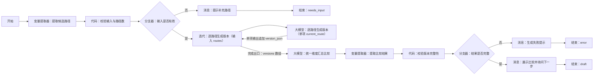

# WF-05 平行人生模拟搭建指南

## 1. 目标与调用时机

主 Agent 在用户已有 `profile_json` 和 `route_recommendation_json`，并希望比较 2～3 条发展路径时调用。本流程只生成情景推演草案，不保存或覆盖主规划；核心输出为 `parallel_versions_json`。

## 2. 搭建前准备

- 开始输入：`AGENT_USER_INPUT`、`uid`、`session_id`、`profile_json`、`route_recommendation_json`，可选 `selected_routes`。
- `selected_routes` 必须是 2～3 个互不重复的路径名；未提供时从用户输入和推荐结果提取。
- 可选知识库：五路径要求、分年级规划、项目/竞赛/实习资料，资料含来源与更新时间。
- 结束统一输出：`status`、`reply`、`data.parallel_versions_json`、`suggested_writes`、`next_action`、`error`。

## 3. 最小可运行版

```text
开始 → 大模型（生成并比较平行版本）→ 结束
```

从左侧“基础节点”拖入一个“大模型”，放在开始右侧并重命名为“生成并比较平行版本”；连接“开始 → 生成并比较平行版本 → 结束”。将开始节点五项输入映射到大模型；结束节点把大模型文本映射为 `reply`。此版只验证生成效果，不表示已校验或保存。

## 4. 完整业务版画布




```text
开始 → 变量提取器（提取候选路径）→ 代码（校验输入与路径数）→ 分支器（输入是否有效）
  ├─ 否 → 消息（提示补充路径）→ 结束
  └─ 是 → 迭代（输入 routes；单项 current_route）→ 大模型（逐路径生成版本）
          → 迭代（将单项 version_json 追加到 versions）
          → 迭代完成出口 → 大模型（统一维度汇总比较）
          → 变量提取器（提取比较结果）→ 代码（校验版本完整性）→ 分支器（结果是否完整）
            ├─ 否 → 消息（生成失败提示）→ 结束
            └─ 是 → 消息（展示比较并询问下一步）→ 结束
```

## 5. 节点清单与逐步搭建

拖入 1 个“变量提取器”、2 个“代码”、2 个“分支器”、1 个“迭代”、2 个“大模型”、3 个“消息”和 3 个“结束”，按上图从左到右摆放并重命名。将 `routes` 映射为迭代数组输入，将当前项命名 `current_route`；把迭代体“大模型：逐路径生成版本”的单项 `version_json` 映射到迭代累计输出 `versions`。只有迭代完成出口连接“大模型：统一维度汇总比较”，不得把单项出口直接接汇总节点。具体端口名称以当前编辑器显示为准。

## 6. 实际配置与变量映射

| 节点 | 输入 | 配置/输出 |
|---|---|---|
| 提取候选路径 | `AGENT_USER_INPUT`,`selected_routes`,`route_recommendation_json` | 提取 `routes`（数组） |
| 校验输入与路径数 | `profile_json`,`routes` | 输出 `input_valid`,`validation_error`,`shared_baseline` |
| 输入是否有效 | `input_valid` | 等于 `true` 走“是” |
| 迭代：逐路径生成版本 | 数组 `routes` | 当前项 `current_route`；累计数组 `versions` |
| 大模型：逐路径生成版本 | `current_route`,`shared_baseline` | 单项输出 `version_json`，每轮追加到 `versions` |
| 统一维度汇总比较 | 迭代完成出口的 `versions` | 输出严格 JSON 文本 |
| 提取比较结果 | 大模型文本 | 提取 `parallel_versions_json` |
| 校验版本完整性 | `parallel_versions_json` | 输出 `result_valid`,`result_error` |
| 展示比较并询问下一步 | 校验后结果 | `status=draft`，提示用户选一个版本或要求修改 |

“校验输入与路径数”代码逻辑：确认 `profile_json` 非空；路径数组去空、去重后长度为 2 或 3；复制画像、当前年级、剩余学期、预算和地域意愿为所有版本共同基线。不得为不同版本改写起点。

“校验版本完整性”逐版本检查：`version_name,target_route,semester_trajectory,resume_assets,skill_tree,time_cost,economic_cost,failure_risks,reversibility,crowding_out_effect,graduation_options,limitations,official_verification`；并检查版本数与路径数一致。失败时输出缺失字段名。

## 7. 可复制完整提示词

### 迭代内版本生成提示词

```text
你是大学规划情景推演师。请基于完全相同的 shared_baseline，为 current_route 生成一个平行人生版本。你提供的是可修正的情景推演，不是成功预测，不得给伪精确概率，不得虚构用户经历。

输入：
shared_baseline={{shared_baseline}}
current_route={{current_route}}

只输出一个 JSON 对象，字段必须完整：
{"version_name":"","target_route":"","semester_trajectory":[{"semester":"","focus":"","milestones":[],"tradeoffs":[]}],"resume_assets":[{"asset":"","quality":"","evidence_needed":""}],"skill_tree":{"breadth":[],"depth":[]},"time_cost":"","economic_cost":"","failure_risks":[],"reversibility":"","crowding_out_effect":[],"graduation_options":[],"limitations":[],"official_verification":[]}
要求：轨迹覆盖剩余学期；成本使用区间或定性等级；政策信息写明来源/更新时间未知时要求官方复核；清楚说明获得与放弃的机会。
```

### 汇总比较提示词

```text
你是中立的大学规划教练。比较下列版本，不替用户决定，不改变任一版本的共同起点。
versions={{迭代结果}}
按路径匹配度、剩余学期轨迹、简历素材质量、技能广度与深度、时间投入、经济成本、失败风险、可逆性、挤出效应、毕业时选择权逐项比较。
只输出 JSON：
{"versions":[],"comparison":[{"dimension":"","by_version":{},"observation":""}],"key_tradeoffs":[],"questions_for_user":[],"disclaimer":"每个人的大学都是独一无二的。模拟器给的是地图，但走路的人是你自己。"}
```

## 8. 确认、写入与失败处理

WF-05 不写正式主规划，`suggested_writes` 只能建议把选中的 `version_name` 交给 WF-06。用户说“保存这个版本”时返回 `status=awaiting_confirmation`、`next_action=call_wf_06`，不得在本流程声称保存成功。输入不全返回 `status=needs_input`；模型 JSON 解析或完整性校验失败返回 `status=error` 和具体 `error`，可重试一次，仍失败则展示简短说明。

本流程没有数据库写入；若主 Agent 后续调用 WF-06 发生写入失败，必须原样转达 `write_failed`，不得把 WF-05 的草案状态描述成已保存。

## 9. 调试用例

- 成功：大二计算机用户，`selected_routes=["保研","就业","考研"]`。观察三个迭代项的 `shared_baseline` 完全一致；预期 `status=draft`，3 个版本、10 个比较维度齐全。
- 缺失：仅传 `selected_routes=["就业"]`。预期走“提示补充路径”，`status=needs_input`，不调用迭代。
- 异常：删除某版本 `reversibility`。预期完整性校验失败，不输出可保存结果。

## 10. 常见错误与修复

- 迭代结果被覆盖：将每次结果追加到迭代结果数组，不要映射到同一个普通变量。
- 路径起点不一致：只从“校验输入与路径数”的 `shared_baseline` 映射，不让模型自行补背景。
- 平台迭代能力不同：以当前编辑器显示为准；降级为 3 个大模型节点，第三条路径为空时由分支器跳过。

## 11. 验收清单与衔接

- [ ] 只使用开始、变量提取器、代码、分支器、迭代、大模型、消息、结束。
- [ ] 只接受 2～3 个去重路径，所有版本共用相同起点。
- [ ] 版本字段和统一比较维度完整，含局限与官方复核提示。
- [ ] 不写入、不覆盖主规划，不把模拟描述成预测。
- [ ] 输出 `parallel_versions_json` 可由 WF-06 读取。

## 数据库与输入输出配置教程

本节的通用点击位置、建表入口、导入按钮和数据库节点输出解释见[数据库从零教程](../database/README.md)；请先完成该教程，再按本节配置当前 WF。

### 准备和输入

需要 `user_profiles`、`route_assessments`、`parallel_versions`，对应 [DB-01](../database/import-templates/DB-01-user-profiles.xlsx)、[DB-03](../database/import-templates/DB-03-route-assessments.xlsx)、[DB-04](../database/import-templates/DB-04-parallel-versions.xlsx)。

| 输入 | 来源 | 调试值 |
|---|---|---|
| `AGENT_USER_INPUT` | 开始节点 | `比较保研、考研和就业三个版本` |
| `uid` | 主 Agent | `test_user_001` |
| `profile_json` | DB-01 查询 | confirmed 画像 |
| `route_recommendation_json` | DB-03 查询 | 最新推荐 |

查询画像和推荐时分别选择对应表，参数都添加 `uid`；推荐查询按 `updated_at` 降序取 1 条。任一空数组都提示先完成 WF-01/WF-04。

保存比较结果：在“汇总并校验比较”之后拖入数据库，选择 `parallel_versions`，用表单新增 `comparison_id,versions_json,comparison_json,shared_baseline_json,selected_version_name,comparison_version,updated_at`。该流程只保存模拟版本，不写 `main_plans`。

| 节点 | 输入 | 输出 |
|---|---|---|
| 两个读取节点 | `uid` | `isSuccess,message,outputList` |
| 迭代/大模型 | 画像、推荐、选择路径 | 单个 `version_json` |
| 汇总校验 | versions 数组 | `parallel_versions_json` |
| 保存节点 | uid、comparison_id、校验结果 | `isSuccess` |
| 结束 | `result_json` | `output` |

调试时确认 3 个版本的 `shared_baseline_json` 完全一致，DB-04 增加一条记录；只输入一个路径应进入 `needs_input`，数据库失败应返回 `write_failed`。
