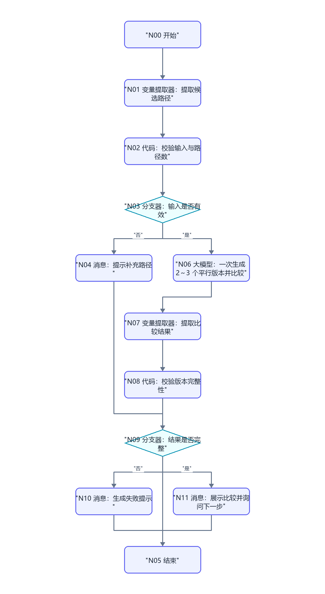
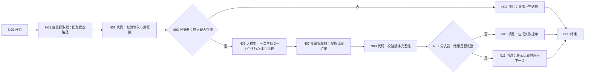

# WF-05 平行人生模拟搭建指南

## 1. 目标与调用时机

主 Agent 在用户已有 `profile_json` 和 `route_recommendation_json`，并希望比较 2～3 条发展路径时调用。本流程只生成情景推演草案，不保存或覆盖主规划；核心输出为 `parallel_versions_json`。

## 2. 搭建前准备

- 开始输入：`AGENT_USER_INPUT`、`uid`、`session_id`、`profile_json`、`route_recommendation_json`，可选 `selected_routes`。
- `selected_routes` 必须是 2～3 个互不重复的路径名；未提供时从用户输入和推荐结果提取。
- 可选知识库：五路径要求、分年级规划、项目/竞赛/实习资料，资料含来源与更新时间。
- 结束统一输出：`status`、`reply`、`data.parallel_versions_json`、`suggested_writes`、`next_action`、`error`。

## 3. 最小可运行版

```text
开始 → 大模型（生成并比较平行版本）→ 结束
```

从左侧“基础节点”拖入一个“大模型”，放在开始右侧并重命名为“生成并比较平行版本”；连接“开始 → 生成并比较平行版本 → 结束”。将开始节点五项输入映射到大模型；结束节点把大模型文本映射为 `reply`。此版只验证生成效果，不表示已校验或保存。

## 4. 完整业务版画布





```text
开始 → 变量提取器（提取候选路径）→ 代码（校验输入与路径数）→ 分支器（输入是否有效）
  ├─ 否 → 消息（提示补充路径）→ 结束
  └─ 是 → 大模型（一次生成 2～3 个平行版本并统一比较）
          → 变量提取器（提取比较结果）→ 代码（校验版本完整性）→ 分支器（结果是否完整）
            ├─ 否 → 消息（生成失败提示）→ 结束
            └─ 是 → 消息（展示比较并询问下一步）→ 结束
```

## 5. 节点清单与逐步搭建

拖入 1 个“变量提取器”、2 个“代码”、2 个“分支器”、1 个“大模型”、3 个“消息”和 1 个共享“结束”，按上图从左到右摆放并重命名。平台迭代内部映射未确认，因此本流程不用迭代；大模型一次接收 2～3 个 routes，在同一个 JSON 中生成全部版本和比较结果。

## 6. 实际配置与变量映射

| 节点 | 输入 | 配置/输出 |
|---|---|---|
| 提取候选路径 | `AGENT_USER_INPUT`,`selected_routes`,`route_recommendation_json` | 提取 `routes`（数组） |
| 校验输入与路径数 | `profile_json`,`routes` | 输出 `input_valid`,`validation_error`,`shared_baseline` |
| 输入是否有效 | `input_valid` | 等于 `true` 走“是” |
| 一次生成平行版本并比较 | `routes`,`shared_baseline` | 输出包含 `versions` 和 `comparison` 的严格 JSON 文本 |
| 提取比较结果 | `input｜引用｜平行版本大模型/output` | `parallel_versions_json:String`；描述：提取完整 JSON，不要只提取 versions |
| 校验版本完整性 | `parallel_versions_json` | 输出 `result_valid`,`result_error` |
| 展示比较并询问下一步 | 校验后结果 | `status=draft`，提示用户选一个版本或要求修改 |

“校验输入与路径数”代码逻辑：确认 `profile_json` 非空；路径数组去空、去重后长度为 2 或 3；复制画像、当前年级、剩余学期、预算和地域意愿为所有版本共同基线。不得为不同版本改写起点。

“校验版本完整性”逐版本检查：`version_name,target_route,semester_trajectory,resume_assets,skill_tree,time_cost,economic_cost,failure_risks,reversibility,crowding_out_effect,graduation_options,limitations,official_verification`；并检查版本数与路径数一致。失败时输出缺失字段名。

两个代码节点都使用 Python。

“校验输入与路径数”输入区：`profile_json｜引用｜开始/profile_json`、`routes｜引用｜提取候选路径/routes`。输出区：`input_valid:Boolean`、`validation_error:String`、`shared_baseline:Object`、`normalized_routes:Array<String>`。

```python
import json


def main(profile_json, routes):
    try:
        profile = json.loads(profile_json) if isinstance(profile_json, str) else profile_json
    except (TypeError, ValueError, json.JSONDecodeError):
        profile = {}
    values = routes if isinstance(routes, list) else []
    normalized = []
    for item in values:
        name = str(item).strip()
        if name and name not in normalized:
            normalized.append(name)
    valid = isinstance(profile, dict) and bool(profile) and 2 <= len(normalized) <= 3
    return {
        "input_valid": valid,
        "validation_error": "" if valid else "需要已确认画像和 2～3 条互不重复的路径",
        "shared_baseline": profile if valid else {},
        "normalized_routes": normalized,
    }
```

“校验版本完整性”输入区：`parallel_versions_json｜引用｜提取比较结果/parallel_versions_json`、`routes｜引用｜校验输入与路径数/normalized_routes`。输出区：`result_valid:Boolean`、`result_error:String`、`result_json:Object`。

```python
import json


def main(parallel_versions_json, routes):
    required = [
        "version_name", "target_route", "semester_trajectory", "resume_assets",
        "skill_tree", "time_cost", "economic_cost", "failure_risks",
        "reversibility", "crowding_out_effect", "graduation_options",
        "limitations", "official_verification",
    ]
    try:
        value = json.loads(parallel_versions_json) if isinstance(parallel_versions_json, str) else parallel_versions_json
    except (TypeError, ValueError, json.JSONDecodeError):
        return {"result_valid": False, "result_error": "JSON 无效", "result_json": {}}
    versions = value.get("versions", []) if isinstance(value, dict) else []
    missing = []
    if len(versions) != len(routes or []):
        missing.append("版本数量与路径数量不一致")
    for index, version in enumerate(versions):
        for key in required:
            if key not in version:
                missing.append(f"versions[{index}].{key}")
    return {
        "result_valid": not missing,
        "result_error": ",".join(missing),
        "result_json": value if not missing else {},
    }
```

## 7. 可复制完整提示词

### 平行版本生成与比较提示词

系统提示词填写角色、限制、完整字段和比较规则，即下面除“输入”两行外的全部内容。用户提示词单独填写：

```text
shared_baseline={{shared_baseline}}
routes={{normalized_routes}}
请按照系统提示词要求只输出 JSON。
```

```text
你是大学规划情景推演师。请基于完全相同的 shared_baseline，为 routes 中的每条路径生成平行人生版本并统一比较。你提供的是可修正的情景推演，不是成功预测，不得给伪精确概率，不得虚构用户经历。

输入：
shared_baseline={{shared_baseline}}
routes={{routes}}

每个版本字段必须包含 version_name,target_route,semester_trajectory,resume_assets,skill_tree,time_cost,economic_cost,failure_risks,reversibility,crowding_out_effect,graduation_options,limitations,official_verification。轨迹覆盖剩余学期；成本使用区间或定性等级；政策信息缺来源或更新时间时要求官方复核；清楚说明获得与放弃的机会。

按路径匹配度、剩余学期轨迹、简历素材质量、技能广度与深度、时间投入、经济成本、失败风险、可逆性、挤出效应、毕业时选择权逐项比较。
只输出 JSON：
{"versions":[],"comparison":[{"dimension":"","by_version":{},"observation":""}],"key_tradeoffs":[],"questions_for_user":[],"disclaimer":"每个人的大学都是独一无二的。模拟器给的是地图，但走路的人是你自己。"}
```

## 8. 确认、写入与失败处理

WF-05 不写正式主规划，`suggested_writes` 只能建议把选中的 `version_name` 交给 WF-06。用户说“保存这个版本”时返回 `status=awaiting_confirmation`、`next_action=call_wf_06`，不得在本流程声称保存成功。输入不全返回 `status=needs_input`；模型 JSON 解析或完整性校验失败返回 `status=error` 和具体 `error`，可重试一次，仍失败则展示简短说明。

本流程没有数据库写入；若主 Agent 后续调用 WF-06 发生写入失败，必须原样转达 `write_failed`，不得把 WF-05 的草案状态描述成已保存。

## 9. 调试用例

- 成功：大二计算机用户，`selected_routes=["保研","就业","考研"]`。观察三个版本的 `shared_baseline` 完全一致；预期 `status=draft`，3 个版本、10 个比较维度齐全。
- 缺失：仅传 `selected_routes=["就业"]`。预期走“提示补充路径”，`status=needs_input`，不调用生成模型。
- 异常：删除某版本 `reversibility`。预期完整性校验失败，不输出可保存结果。

## 10. 常见错误与修复

- 路径起点不一致：只从“校验输入与路径数”的 `shared_baseline` 映射，不让模型自行补背景。
- 模型漏掉路径：完整性代码比较 `routes` 和 `versions[].target_route`，不一致进入失败消息。

## 11. 验收清单与衔接

- [ ] 只使用开始、变量提取器、代码、分支器、大模型、消息、结束。
- [ ] 只接受 2～3 个去重路径，所有版本共用相同起点。
- [ ] 版本字段和统一比较维度完整，含局限与官方复核提示。
- [ ] 不写入、不覆盖主规划，不把模拟描述成预测。
- [ ] 输出 `parallel_versions_json` 可由 WF-06 读取。

## 节点逐项配置

<!-- GENERATED-NODE-LEDGER:START -->
### 画布节点连线与页面输入输出总表

本表由流程图生成，用于防止漏连。‘直接上游’决定页面引用下拉框中可选的数据来源；具体变量名以本文件后续业务映射表为准。
开始节点类型规则：`uid/session_id/AGENT_USER_INPUT` 及所有 `*_json/*_token/*_id` 均选 String；计数、天数选 Integer；真伪开关选 Boolean。表中未特别标注的输入一律选 String，JSON 作为字符串传递。

| 节点 | 类型 | 直接上游（输入来源） | 固定/声明输出 | 直接下游 |
|---|---|---|---|---|
| `A` N00 开始 | 开始 | 无（起点） | 开始节点中声明的同名变量 | B |
| `B` N01 变量提取器：提取候选路径 | 变量提取器 | A | `routes:Array<String>`（用户选择的 2～3 条候选路径） | C |
| `C` N02 代码：校验输入与路径数 | 代码 | B | 与 Python `main()` 返回 dict 的键完全一致 | D |
| `D` N03 分支器：输入是否有效 | 分支器 | C | 不产生业务变量；按条件输出连线 | E（"否"）、G（"是"） |
| `E` N04 消息：提示补充路径 | 消息 | D | 不新增业务变量；回答内容引用上游变量 | Z |
| `Z` N05 结束 | 结束 | E、K、L | `output` 引用上游最终结果 | 无；必须在正文说明为何终止或转入下一张图 |
| `G` N06 大模型：一次生成 2～3 个平行版本并比较 | 大模型 | D | `output:String` | H |
| `H` N07 变量提取器：提取比较结果 | 变量提取器 | G | `parallel_versions_json:String`（全部版本、共同基线和比较结果 JSON） | I |
| `I` N08 代码：校验版本完整性 | 代码 | H | 与 Python `main()` 返回 dict 的键完全一致 | J |
| `J` N09 分支器：结果是否完整 | 分支器 | I | 不产生业务变量；按条件输出连线 | K（"否"）、L（"是"） |
| `K` N10 消息：生成失败提示 | 消息 | J | 不新增业务变量；回答内容引用上游变量 | Z |
| `L` N11 消息：展示比较并询问下一步 | 消息 | J | 不新增业务变量；回答内容引用上游变量 | Z |
<!-- GENERATED-NODE-LEDGER:END -->

> 本节必须与[平台 UI 配置契约](PLATFORM-UI-CONTRACT.md)一起使用。先按流程图编号拖入节点并连线，再配置节点；未连线时下游“引用”下拉框会显示暂无数据。

### 本工作流所有节点的页面填写顺序

1. **开始**：按下方开始输入表逐行“+ 添加”，变量名、类型和必填状态照表填写。
2. **自定义 SQL 数据库**：输入参数选择引用；读取结果只使用固定输出 `isSuccess:Boolean`、`message:String`、`outputList:Array<Object>`。
3. **表单新增/更新数据库**：选择 `university / 目标表`；新增在“设置新增数据”逐字段添加，更新先在“设置数据范围”配置 AND 条件，再在“设置更新数据”逐字段添加；固定输出仍为 `isSuccess/message/outputList`。
4. **大模型**：输入参数名与 `{{变量名}}` 完全一致；系统提示词放角色、规则和 JSON 结构，用户提示词只放本轮变量；输出 `output:String`。
5. **变量提取器**：输入固定为 `input｜引用｜上游大模型/output`；每个输出必须填写变量名、类型和提取描述，复杂 JSON 先用 String。
6. **代码**：仅使用 Python `def main(...): return {...}`；输入名与形参一致，输出区声明每个返回键及类型。
7. **分支器**：左侧选上游变量，条件选“等于”等操作；与字面量比较时比较类型选常量/固定值；每条分支和默认分支都必须连接。
8. **消息**：输入区引用需要展示的变量，在“回答内容”用 `{{变量名}}`；流式输出关闭；消息后连接共享结束。
9. **结束**：回答模式选“返回设定格式配置的回答”，输出设置 `output｜引用｜上游最终结果`。所有成功、失败、待补充消息都进入同一个结束节点。

本节的通用点击位置、建表入口、导入按钮和数据库节点输出解释见[数据库从零教程](../database/README.md)；请先完成该教程，再按本节配置当前 WF。

### 准备和输入

需要 `user_profiles`、`route_assessments`、`parallel_versions`，对应 [DB-01](../database/import-templates/DB-01-user-profiles.xlsx)、[DB-03](../database/import-templates/DB-03-route-assessments.xlsx)、[DB-04](../database/import-templates/DB-04-parallel-versions.xlsx)。

| 输入 | 来源 | 调试值 |
|---|---|---|
| `AGENT_USER_INPUT` | 开始节点 | `比较保研、考研和就业三个版本` |
| `uid` | 主 Agent | `test_user_001` |
| `session_id` | 主 Agent/会话上下文 | `SESSION-TEST-001` |
| `profile_json` | DB-01 查询 | confirmed 画像 |
| `route_recommendation_json` | DB-03 查询 | 最新推荐 |
| `selected_routes` | 用户选择/上游路由 | 可选，2～3 条路径名称 |

查询画像和推荐时分别选择对应表，参数都添加 `uid`；推荐查询按 `updated_at` 降序取 1 条。任一空数组都提示先完成 WF-01/WF-04。

保存比较结果：在“汇总并校验比较”之后拖入数据库，选择 `parallel_versions`，用表单新增 `comparison_id,versions_json,comparison_json,shared_baseline_json,selected_version_name,comparison_version,updated_at`。该流程只保存模拟版本，不写 `main_plans`。

| 节点 | 输入 | 输出 |
|---|---|---|
| 两个读取节点 | `uid` | `isSuccess,message,outputList` |
| 平行版本大模型 | 画像、推荐、选择路径 | 完整 `parallel_versions_json` 文本 |
| 汇总校验 | versions 数组 | `parallel_versions_json` |
| 保存节点 | uid、comparison_id、校验结果 | `isSuccess` |
| 结束 | `result_json` | `output` |

调试时确认 3 个版本的 `shared_baseline_json` 完全一致，DB-04 增加一条记录；只输入一个路径应进入 `needs_input`，数据库失败应返回 `write_failed`。
