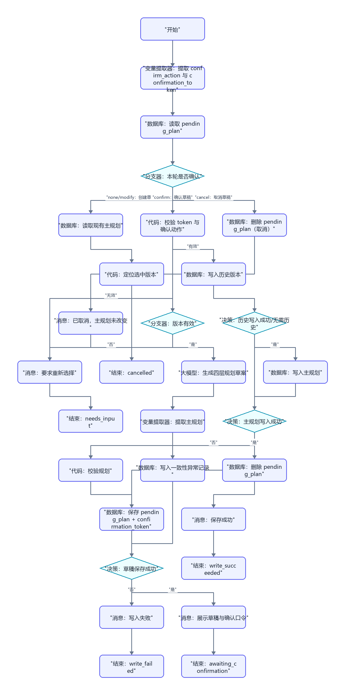
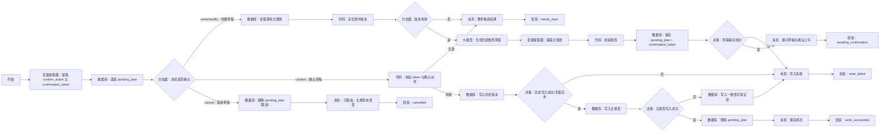

# WF-06 主规划生成与保存搭建指南

## 1. 目标与调用时机

在用户从 WF-05 选择平行版本后，生成“发展路径 → 学期目标 → 月度里程碑 → 本周行动”四层规划，并在明确确认后保存。切换或覆盖必须保留历史版本和原因。输出 `main_plan_json`。

## 2. 准备与输入

开始输入：`AGENT_USER_INPUT`,`uid`,`session_id`,`profile_json`,`parallel_versions_json`,`selected_version_name`，可选 `existing_main_plan_json`。准备“主规划”和“规划历史”数据实体；具体表字段和数据库操作以当前编辑器显示为准。若数据库能力不满足，使用“长期记忆检索/长期记忆写入”，以 `uid` 加 `main_plan`/`plan_history` 键区分。

## 3. 最小可运行版

```text
开始 → 大模型（生成四层规划草案）→ 结束
```

拖入并连接“大模型”，输入映射画像、选中版本和用户要求，结束输出映射为 `reply`。此版仅生成草案，`status=draft`，不得称已保存。

## 4. 完整业务版画布





```text
开始 → 变量提取器（提取确认动作与 token）→ 数据库（读取 pending_plan）→ 分支器（本轮确认动作）
 ├─ none/modify → 数据库（读取现有主规划）→ 代码（定位选中版本）→ 分支器（版本有效）
 ├─ 否 → 消息（要求重新选择）→ 结束
 └─ 是 → 大模型（生成四层规划草案）→ 变量提取器（提取主规划）→ 代码（校验规划）
       → 数据库（保存 pending_plan 与 confirmation_token）→ 草稿保存检查 → 消息（展示草稿与确认口令）→ 结束
 ├─ cancel → 数据库（删除 pending）→ 消息（已取消且主规划未改变）→ 结束
 └─ confirm → 代码（校验 token 与 confirm_action）→ 数据库（写入历史版本）→ 历史成功门控
       ├─ 失败 → 消息（写入失败）→ 结束
       └─ 成功/无需历史 → 数据库（写入主规划）→ 主规划写入检查
          ├─ 失败 → 数据库（写入一致性异常记录）→ 消息（写入失败）→ 结束
          └─ 成功 → 数据库（删除 pending_plan）→ 消息（保存成功）→ 结束
```

新用户无旧规划时，“写入历史版本”返回“无需历史”。切换/覆盖必须先成功写历史，失败立即终止，绝不覆盖主规划。若历史已写而新主规划失败，保留旧主规划和 pending 草稿，并写入 `consistency_error_json`（阶段、旧 plan_id、pending_id、错误）；重试应幂等，不重复制造历史记录。

## 5. 拖拽、连线、节点配置与变量映射

按上图拖入 8 个“数据库”（读 pending、读旧规划、存 pending、写历史、写主规划、写一致性异常、成功后删 pending、取消时删 pending）、2 个“代码”、2 个“分支器”、3 个“决策”、1 个“大模型”、2 个“变量提取器”、5 个“消息”和 5 个“结束”。确认发生在下一次工作流调用，图中不存在“消息后读取同一轮输入”的确认决策。

| 节点 | 输入 | 输出/条件 |
|---|---|---|
| 读取现有主规划 | `uid` | `existing_main_plan_json`；查询必须包含 `uid` |
| 提取确认动作与 token | `AGENT_USER_INPUT` | `confirm_action`（confirm/cancel/modify/none）、`confirmation_token` |
| 读取 pending_plan | `uid + confirmation_token` | `pending_plan_json`；token 不匹配不得读取他人草稿 |
| 定位选中版本 | `parallel_versions_json`,`selected_version_name` | `selected_version`,`version_valid`,`change_type`（create/switch/replace） |
| 生成四层规划草案 | 画像、选中版本、旧规划 | JSON 文本 |
| 提取主规划 | JSON 文本 | `main_plan_json` |
| 校验规划 | `main_plan_json` | `plan_valid`,`plan_error` |
| 保存 pending_plan | 规划草稿、操作类型、旧 plan_id | 生成不可猜测的 `confirmation_token`、`pending_id`、过期时间，返回 `pending_write_ok` |
| 校验 token 与确认动作 | pending 与本轮输入 | 仅 `confirm_action=confirm` 且 token、uid、未过期一致时 `confirmation_valid=true` |
| 写入历史版本 | 旧规划、切换原因、时间、`uid` | `history_write_ok` |
| 写入主规划 | 新规划、`uid`,`session_id` | `plan_write_ok` |
| 历史成功门控 | `history_write_ok`,`change_type` | 新建为“无需历史”；切换/覆盖必须 `history_write_ok=true` |
| 主规划写入检查 | `plan_write_ok` 或回读 | 成功才删除 pending；失败写一致性异常并保留旧主规划 |

规划校验必须检查：`plan_id,version_name,target_route,stage,semester_goals,monthly_milestones,weekly_actions,success_criteria,resources,risks,alternatives,not_do_list,change_reason,created_at`。每项周行动含 `task,deadline,priority,expected_evidence`。当 `change_type=switch/replace` 时 `change_reason` 必须为非空字符串，否则不允许保存 pending。

## 6. 可复制完整提示词

```text
你是大学规划教练。把用户选中的平行版本转为真实可执行规划，不承诺录取、就业或考试结果。必须结合当前年级和剩余时间，不虚构资源；缺失内容标为“待用户补充”。

profile_json={{profile_json}}
selected_version={{selected_version}}
existing_main_plan_json={{existing_main_plan_json}}
user_request={{AGENT_USER_INPUT}}

只输出 JSON：
{"plan_id":"","version_name":"","target_route":"","stage":{"name":"探索者/深耕者/破局者/启程者","color":"绿色/蓝色/橙色/金色"},"semester_goals":[{"semester":"","goal":"","success_criteria":[]}],"monthly_milestones":[{"month":"","milestone":"","success_criteria":[]}],"weekly_actions":[{"task":"","deadline":"","priority":"高/中/低","expected_evidence":""}],"success_criteria":[],"resources":[],"risks":[],"alternatives":[],"not_do_list":[],"change_reason":"","created_at":"{{当前时间}}"}
规则：大一探索、避免盲目堆活动；大二收敛 1～2 条路径；大三聚焦并保留备选；大四完成申请/求职/毕业与成果整理。每层能向上追溯；首周行动要小而明确；政策信息提示官方复核。
```

## 7. 确认与写入失败处理

第一次调用只保存 `pending_plan_json + confirmation_token` 并返回 `status=awaiting_confirmation`，明确列出版本、替换关系、历史处理和 `change_reason`。下一次调用必须携带该 token 且 `confirm_action=confirm`，重新读取 pending 后才进入正式写入；cancel 删除 pending，modify 生成新 pending 和新 token。数据库字段以当前编辑器显示为准；没有明确成功标识时回读验证。任何门控失败返回 `write_failed`，只有主规划回读成功才返回 `write_succeeded`。

## 8. 调试用例

- 新建成功：第一次选择“就业版张三”，预期保存 pending 并返回 token；第二次携带 token 输入“确认保存”，预期四层齐全且 `status=write_succeeded`。
- 切换成功：第一次从保研切到就业并给出原因，预期 pending；第二次携带 token 确认，先写历史，门控成功后再写新规划。
- 未确认：第一次收到 token 后，下一轮输入“看起来还行”且 `confirm_action=none`。预期不写正式主规划。
- 历史失败：模拟历史写入失败，预期旧主规划不变，新主规划节点不执行。
- 主规划失败：历史成功、主规划失败，预期保留旧主规划和 pending，写一致性异常记录。
- 写入失败：让数据库使用不存在字段。预期 `write_failed`，不出现“保存成功”。

## 9. 验收清单与衔接

- [ ] 四层规划均有成功标准，且包含资源、风险、替代方案和不做清单。
- [ ] 保存、切换、覆盖前均明确确认；历史版本和切换原因可查询。
- [ ] 数据读写按 `uid` 隔离，失败不声称成功。
- [ ] 输出 `main_plan_json` 可交给 WF-07；修改建议可由 WF-08 返回本流程重新确认。

## 数据库与输入输出配置教程

本节的通用点击位置、建表入口、导入按钮和数据库节点输出解释见[数据库从零教程](../database/README.md)；请先完成该教程，再按本节配置当前 WF。

### 准备和输入

创建 `parallel_versions` 与 `main_plans`，上传 [DB-04](../database/import-templates/DB-04-parallel-versions.xlsx)、[DB-05](../database/import-templates/DB-05-main-plans.xlsx)。

| 输入 | 来源 | 调试值 |
|---|---|---|
| `AGENT_USER_INPUT` | 开始节点 | `保存就业版为主规划`；下一轮 `确认保存` |
| `uid` | 主 Agent | `test_user_001` |
| `comparison_id` | WF-05 | DB-04 中的比较 ID |
| `confirmation_token` | 首轮结束输出 | 第二轮原样传回 |

数据库顺序必须是：读取比较/当前规划 → 保存 pending → 下一轮读取 pending → 历史写入成功门控 → 正式主规划写入 → 回读验证。

读取当前主规划：

```sql
SELECT * FROM main_plans
WHERE uid='{{uid}}' AND plan_status='active'
ORDER BY record_version DESC LIMIT 1;
```

读取 pending：

```sql
SELECT * FROM main_plans
WHERE uid='{{uid}}' AND confirmation_token='{{confirmation_token}}'
  AND plan_status='pending'
ORDER BY updated_at DESC LIMIT 1;
```

| 数据库节点 | 表单/输入 | 输出判断 |
|---|---|---|
| 保存 pending | 新增 `uid,plan_id,pending_plan_json,confirmation_token,plan_status=pending` | `isSuccess=true` 后才展示确认 |
| 写历史 | 更新旧记录 `plan_status=history,change_reason` | 失败时停止，不写新规划 |
| 写主规划 | 新增/更新 `plan_json,plan_status=active,record_version` | 检查 `isSuccess` |
| 回读 | `uid,plan_id,record_version` | JSON 和 active 状态一致 |

结束节点选择统一 `result_json`。首轮应为 `awaiting_confirmation`，第二轮回读成功才是 `write_succeeded`。调试后在 DB-05 检查旧 active 已变 history，且只有一个新 active。
