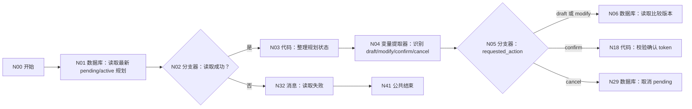
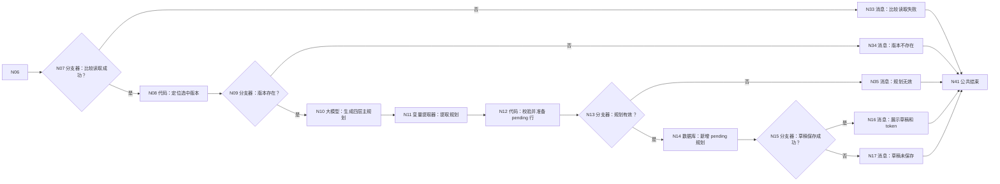
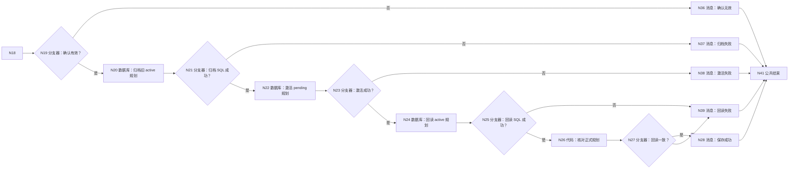
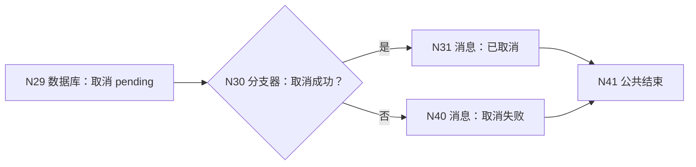

# WF-06 主规划生成与保存：逐节点搭建指南

> WF-06 是两轮确认工作流。第一轮只保存 `pending_plan_json + confirmation_token`，第二轮 token 校验通过后才把规划改成 active。当前结束节点仍使用第一种闭合方式 `workflow_finished`。

## 1. 数据表和输入

在 `university` 准备 [DB-04 parallel_versions](../database/import-templates/DB-04-parallel-versions.xlsx) 和 [DB-05 main_plans](../database/import-templates/DB-05-main-plans.xlsx)。默认 `id/uid/create_time` 保留。

开始节点输入：

| 变量 | 类型 | 必填 | 调试值 |
|---|---|---:|---|
| `AGENT_USER_INPUT` | String | 是 | 首轮“把就业版做成主规划”；次轮“确认保存主规划” |
| `uid` | String | 是 | `test_user_001` |
| `comparison_id` | String | 首轮是 | WF-05 返回的比较编号 |
| `selected_version_name` | String | 首轮是 | 例如 `就业优先版` |
| `confirmation_token` | String | 否 | 第二轮填写第一轮返回 token |
| `request_time` | String | 是 | `2026-07-19 16:00:00` |

## 2. 分段流程图

### 2.1 读取状态并识别动作



### 2.2 生成草稿



### 2.3 确认、归档旧版、激活和回读



取消路径：N29→N30“取消成功？”→是 N31“已取消”，否 N40“取消失败”。所有消息连接 N41 结束。



## 3. N01～N03：读取并整理规划状态

N01 自定义 SQL，数据库 `university`，输入 `uid=N00/uid`：

```sql
SELECT id, uid, plan_id, plan_json, plan_status, pending_plan_json,
       confirmation_token, source_comparison_id, record_version, updated_at
FROM main_plans
WHERE uid='{{uid}}' AND plan_status IN ('pending','active')
ORDER BY updated_at DESC, create_time DESC;
```

N02：`N01/isSuccess == true`；是 → N03，否 → N32。

N03 输入 `outputList=N01/outputList`：

```python
def main(outputList):
    rows = outputList if isinstance(outputList, list) else []
    pending = {}
    active = {}
    for row in rows:
        if isinstance(row, dict) and row.get("plan_status") == "pending" and len(pending) == 0:
            pending = row
        if isinstance(row, dict) and row.get("plan_status") == "active" and len(active) == 0:
            active = row
    try:
        version_value = int(active.get("record_version", 0))
    except:
        version_value = 0
    return {
        "has_pending": len(pending) > 0,
        "pending_record_id": int(pending.get("id", 0)) if str(pending.get("id", "0")).isdigit() else 0,
        "pending_plan_json": str(pending.get("pending_plan_json", "{}")),
        "stored_confirmation_token": str(pending.get("confirmation_token", "")),
        "pending_plan_id": str(pending.get("plan_id", "")),
        "has_active": len(active) > 0,
        "active_plan_json": str(active.get("plan_json", "{}")),
        "next_record_version": version_value + 1,
    }
```

输出区声明 `has_pending:Boolean`、`pending_record_id:Integer`、`pending_plan_json:String`、`stored_confirmation_token:String`、`pending_plan_id:String`、`has_active:Boolean`、`active_plan_json:String`、`next_record_version:Integer`。

## 4. N04/N05：识别并分流用户动作

N04 变量提取器输入：`user_input=N00/AGENT_USER_INPUT`、`has_pending=N03/has_pending`。输出：

| 变量 | 类型 | 描述 |
|---|---|---|
| `requested_action` | String | 只能是 draft、modify、confirm、cancel；首次生成/重新生成= draft，修改=modify，明确保存=confirm，取消=cancel |
| `action_reason` | String | 判断依据 |

N05 添加四条字符串分支，比较类型都选固定值：

- `requested_action == draft` → N06。
- `requested_action == modify` → N06。
- `requested_action == confirm` → N18。
- `requested_action == cancel` → N29。
- 默认分支 → N34，提示用户明确选择。

## 5. N06～N09：读取并定位 WF-05 版本

N06 自定义 SQL，输入 `uid=N00/uid`、`comparison_id=N00/comparison_id`：

```sql
SELECT id, comparison_id, versions_json, comparison_json,
       shared_baseline_json, comparison_version, updated_at
FROM parallel_versions
WHERE uid='{{uid}}' AND comparison_id='{{comparison_id}}'
ORDER BY comparison_version DESC, updated_at DESC
LIMIT 1;
```

N07：`N06/isSuccess == true`；是 → N08，否 → N33。

N08 输入 `outputList=N06/outputList`、`selected_version_name=N00/selected_version_name`。本节点不使用 JSON 库，因此让代码只整理记录；具体版本由 N10 根据文本和名称定位：

```python
def main(outputList, selected_version_name):
    rows = outputList if isinstance(outputList, list) else []
    row = rows[0] if len(rows) > 0 and isinstance(rows[0], dict) else {}
    name = str(selected_version_name).strip()
    versions_text = str(row.get("versions_json", ""))
    return {
        "version_available": len(row) > 0 and len(name) > 0 and len(versions_text.strip()) > 2,
        "versions_json": versions_text if versions_text else "[]",
        "comparison_json": str(row.get("comparison_json", "{}")),
        "shared_baseline_json": str(row.get("shared_baseline_json", "{}")),
        "selected_version_name": name,
    }
```

输出 `version_available:Boolean` 和四个 String。N09：`version_available == true`；是 → N10，否 → N34。

## 6. N10 大模型：生成四层主规划

模型 `Spark4.0 Ultra`，关闭对话历史。输入 `versions_json/comparison_json/shared_baseline_json/selected_version_name` 均引用 N08，`active_plan_json=N03/active_plan_json`。

系统提示词：

```text
你是大学主规划生成器。只围绕用户明确选中的版本生成四层规划：总目标、学年目标、学期里程碑、未来四周动作。所有目标必须包含验收证据、时间窗口、风险、备选和复盘点。不得虚构用户经历，不得承诺结果；成本使用区间或等级。修改规划时保留用户未要求改变的有效内容。
只输出 JSON：
{"selected_version_name":"","north_star":"","year_goals":[],"semester_milestones":[],"next_four_weeks":[],"risks":[],"fallbacks":[],"review_points":[],"reply":""}
```

用户提示词：

```text
共同起点：{{shared_baseline_json}}
可选版本：{{versions_json}}
比较结果：{{comparison_json}}
用户选中：{{selected_version_name}}
当前 active 规划：{{active_plan_json}}
请生成或按用户要求修改主规划草稿。
```

输出 `output:String`。

## 7. N11/N12/N13：提取、校验并准备 pending

N11 输入 `input=N10/output`，输出：`plan_json:String`（完整规划 JSON）、`selected_version_name:String`、`year_goals:Array`、`semester_milestones:Array`、`next_four_weeks:Array`、`reply:String`。

N12 输入 `uid=N00/uid`、`request_time=N00/request_time`、`comparison_id=N00/comparison_id`、`next_record_version=N03/next_record_version`、N11 全部输出：

```python
def main(uid, request_time, comparison_id, next_record_version, plan_json, selected_version_name, year_goals, semester_milestones, next_four_weeks, reply):
    errors = []
    if not str(plan_json).strip().startswith("{") or not str(plan_json).strip().endswith("}"):
        errors.append("plan_json 无效")
    if not str(selected_version_name).strip():
        errors.append("缺少选中版本")
    for name, value in [("year_goals", year_goals), ("semester_milestones", semester_milestones), ("next_four_weeks", next_four_weeks)]:
        if not isinstance(value, list) or len(value) == 0:
            errors.append(name + " 为空")
    try:
        version_value = int(next_record_version)
    except:
        version_value = 1
    token = str(uid) + "-PLAN-" + str(request_time)
    return {
        "plan_valid": len(errors) == 0,
        "validation_error": ";".join(errors),
        "plan_id": str(uid) + "-PLAN-" + str(request_time),
        "plan_json_empty": "{}",
        "plan_status": "pending",
        "pending_plan_json": str(plan_json),
        "confirmation_token": token,
        "source_comparison_id": str(comparison_id),
        "change_reason": "生成或修改主规划草稿",
        "record_version": version_value,
        "updated_at": str(request_time),
        "reply": str(reply),
    }
```

输出区声明：`plan_valid:Boolean`、`validation_error:String`、`plan_id:String`、`plan_json_empty:String`、`plan_status:String`、`pending_plan_json:String`、`confirmation_token:String`、`source_comparison_id:String`、`change_reason:String`、`record_version:Integer`、`updated_at:String`、`reply:String`。N13：`plan_valid == true`；是 → N14，否 → N35。

## 8. N14～N17：新增 pending 规划

N14 表单处理数据 → `university/main_plans` → 新增数据。设置：`plan_id=N12/plan_id`、`plan_json=N12/plan_json_empty`、`plan_status=N12/plan_status`、`pending_plan_json=N12/pending_plan_json`、`confirmation_token=N12/confirmation_token`、`source_comparison_id=N12/source_comparison_id`、`change_reason=N12/change_reason`、`record_version=N12/record_version`、`updated_at=N12/updated_at`；页面强制 uid 时引用 N00/uid。

N15：`N14/isSuccess == true`；是 → N16，否 → N17。

- N16 输入 `reply=N12/reply`、`plan=N12/pending_plan_json`、`token=N12/confirmation_token`，回答：`{{reply}}\n\n{{plan}}\n\n如确认保存，请明确回复“确认保存主规划”，并提交 token：{{token}}`。
- N17 输入 `plan=N12/pending_plan_json`、`message=N14/message`，回答：`规划草稿已生成，但 pending 草稿没有保存，不能进入确认。{{plan}}\n错误：{{message}}`。

## 9. N18/N19：确认安全校验

N18 输入 `requested_action=N04/requested_action`、`input_token=N00/confirmation_token`、`stored_token=N03/stored_confirmation_token`、`has_pending=N03/has_pending`：

```python
def main(requested_action, input_token, stored_token, has_pending):
    valid = requested_action == "confirm" and has_pending is True and str(input_token) != "" and str(input_token) == str(stored_token)
    return {"confirm_valid": valid, "confirm_error": "" if valid else "没有 pending 草稿、确认动作不明确或 token 不匹配"}
```

输出 `confirm_valid:Boolean`、`confirm_error:String`。N19：true → N20，false → N36。

## 10. N20～N23：归档旧 active 并激活 pending

N20 表单更新 `main_plans`：范围 `uid == N00/uid` AND `plan_status == 固定值 active`；更新 `plan_status=固定值 history`、`change_reason=固定值 被新确认规划替换`、`updated_at=N00/request_time`。

N21：`N20/isSuccess == true`；是 → N22，否 → N37。若该用户从未有 active 规划，平台可能仍返回 true，这是正常情况。

N22 表单更新 `main_plans`：范围 `id == N03/pending_record_id` AND `uid == N00/uid` AND `confirmation_token == N03/stored_confirmation_token`；更新：

| 字段 | 值 |
|---|---|
| `plan_json` | N03/pending_plan_json |
| `plan_status` | 固定值 `active` |
| `pending_plan_json` | 固定值 `{}` |
| `confirmation_token` | 固定空字符串 |
| `change_reason` | 固定值 `用户明确确认保存` |
| `record_version` | N03/next_record_version |
| `updated_at` | N00/request_time |

N23：`N22/isSuccess == true`；是 → N24，否 → N38。

## 11. N24～N28：回读正式规划

N24 自定义 SQL，输入 `uid=N00/uid`、`plan_id=N03/pending_plan_id`：

```sql
SELECT plan_id, plan_json, plan_status, record_version, updated_at
FROM main_plans
WHERE uid='{{uid}}' AND plan_id='{{plan_id}}' AND plan_status='active'
ORDER BY updated_at DESC LIMIT 1;
```

N25：`N24/isSuccess == true`；是 → N26，否 → N39。

N26 输入 `expected=N03/pending_plan_json`、`outputList=N24/outputList`：

```python
def main(expected, outputList):
    rows = outputList if isinstance(outputList, list) else []
    row = rows[0] if len(rows) > 0 and isinstance(rows[0], dict) else {}
    stored = str(row.get("plan_json", ""))
    return {"readback_matches": len(stored.strip()) > 2 and stored.strip() == str(expected).strip(), "stored_plan_json": stored}
```

输出 `readback_matches:Boolean`、`stored_plan_json:String`。N27：true → N28，false → N39。N28 输入 `plan=N26/stored_plan_json`，回答 `主规划已经保存并回读确认：\n{{plan}}`。

## 12. N29～N31：取消 pending

N29 表单更新 `main_plans`：范围 `id=N03/pending_record_id` AND `uid=N00/uid`；更新 `plan_status=archived`、`pending_plan_json={}`、`confirmation_token=空字符串`、`change_reason=用户取消`、`updated_at=N00/request_time`。

N30：`N29/isSuccess == true`；是 → N31，否 → N40。N31 回答：`已取消待确认主规划，现有 active 主规划没有改变。`

## 13. 错误消息和 N41 结束

所有消息关闭流式输出并连接 N41：

| 节点 | 内容 |
|---|---|
| N32 | 引用 N01/message：规划状态读取失败，本轮未写入 |
| N33 | 引用 N06/message：比较版本读取失败 |
| N34 | 缺少 comparison_id、selected_version_name 或动作无法识别，请明确选择版本 |
| N35 | 引用 N12/validation_error：规划字段不完整，未保存 |
| N36 | 引用 N18/confirm_error：确认无效或 token 不匹配 |
| N37 | 引用 N20/message：旧 active 规划归档失败，停止激活新规划 |
| N38 | 引用 N22/message：pending 激活失败，不能声称保存成功 |
| N39 | 引用 N24/message：写入后无法回读一致，不能声称保存成功 |
| N40 | 引用 N29/message：取消操作失败 |

N41：回答模式“返回设定格式配置的回答”；输出 `output｜输入｜workflow_finished`；回答内容“本轮处理已结束，请以上方消息节点的提示为准。”；思考内容空，流式关闭。

## 14. 调试指南

1. 首轮选版本：应新增 plan_status=pending，active 不变。
2. 错 token：应到 N36，数据库不改变。
3. 正确确认：应先把旧 active 改 history，再把 pending 改 active，N28 才说成功。
4. 修改：生成新 pending；旧 active 在用户再次确认前保持 active。
5. 取消：pending 归档，active 不变。
6. 归档失败：临时改错 N20 表名/范围，应到 N37，不能继续激活。
7. 回读不一致：应到 N39。

## 15. 验收清单

- [ ] 草稿轮不写 active；确认轮不重新生成规划。
- [ ] token 由代码确定性比较，不交给大模型决定。
- [ ] 激活前归档旧 active，激活后回读一致才说成功。
- [ ] 每个数据库节点写清范围、更新字段和固定输出。
- [ ] 所有代码无 import、无 None、输出区声明完整。
- [ ] 所有成功/失败/取消分支连接 N41。
