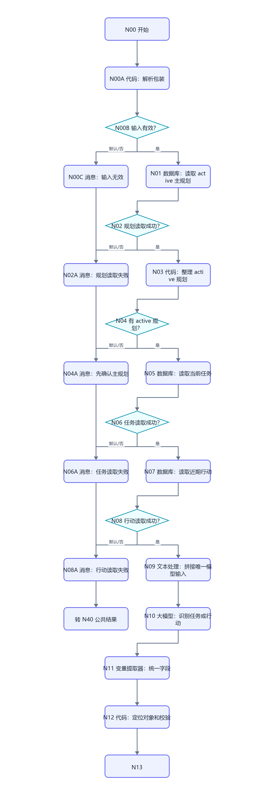
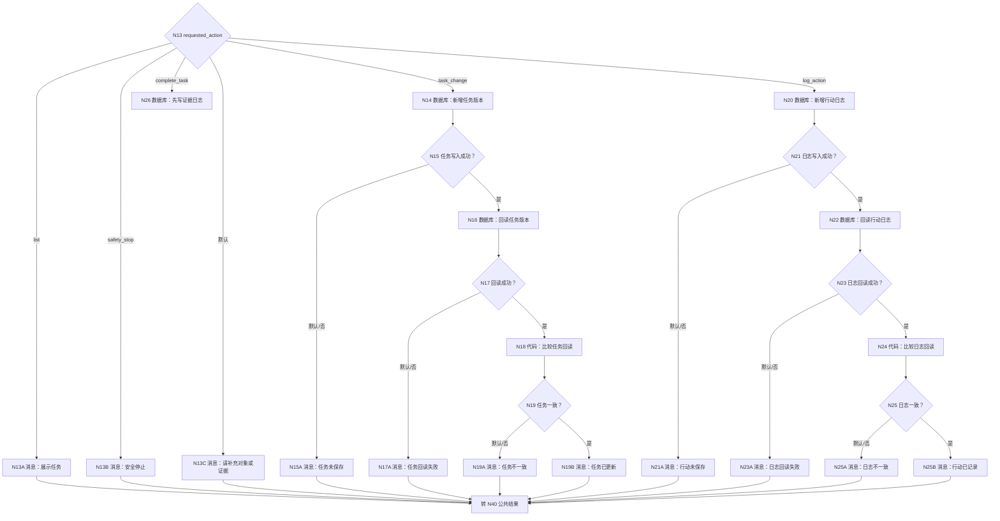
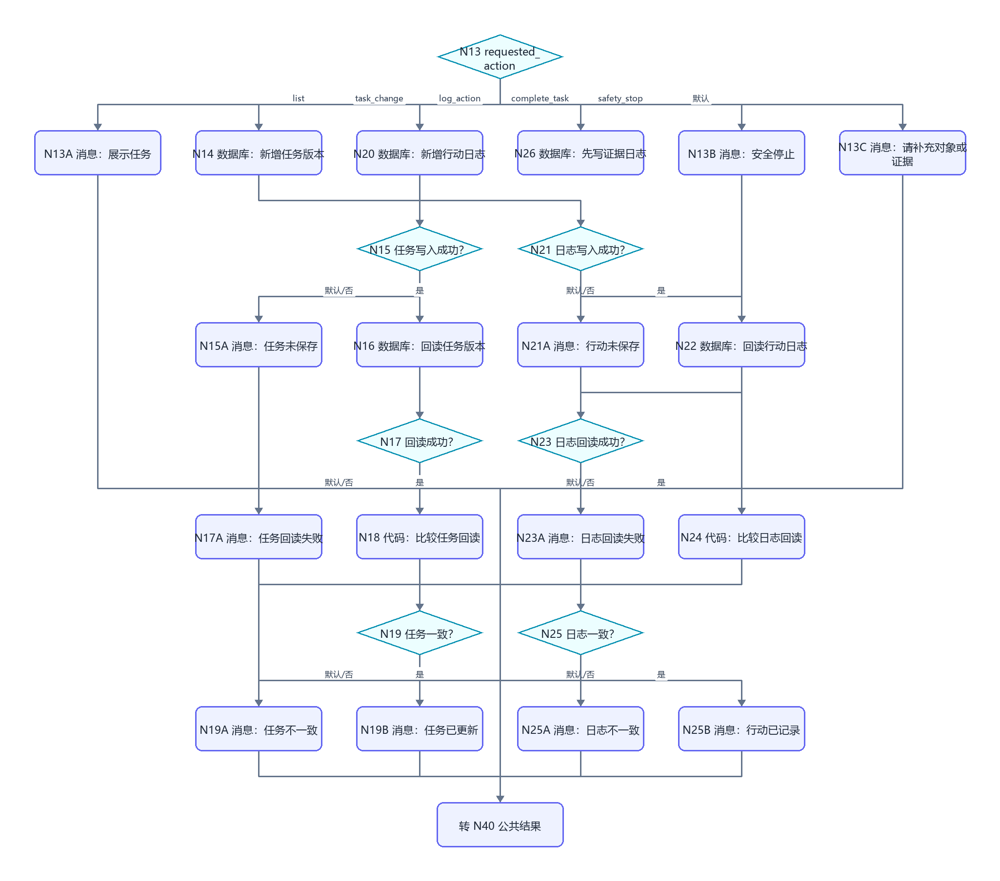
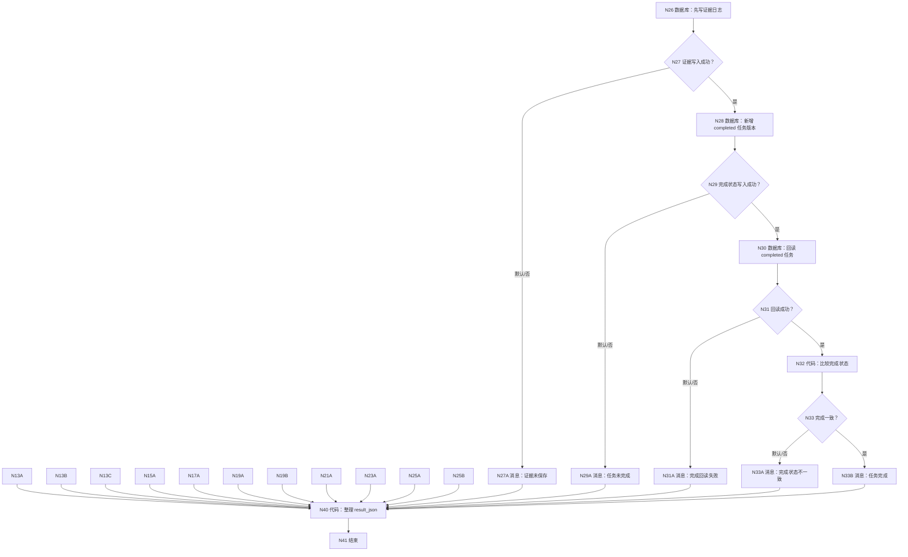
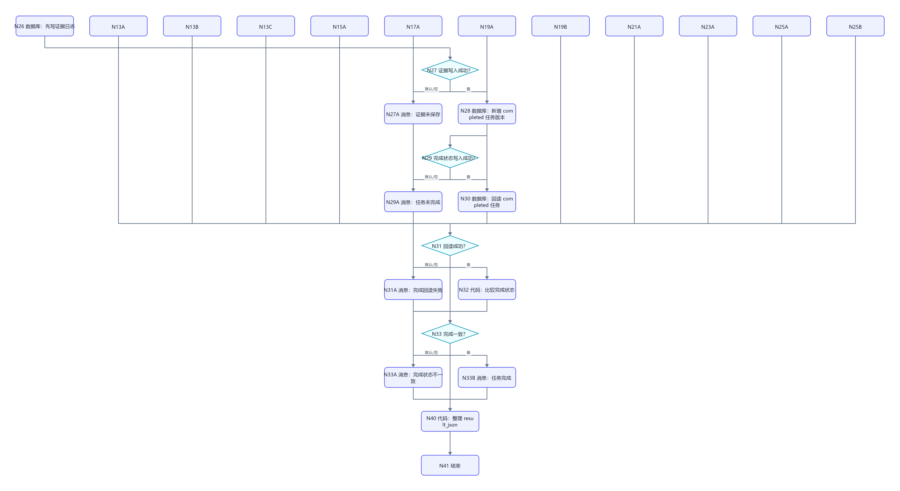

# WF-06 学期任务与行动记录：逐节点搭建指南

<!-- AGENT-CONTRACT
start_inputs: AGENT_USER_INPUT:String
extractor_input_count: 1
result_output: result_json:String
-->

> 本工作流合并旧 WF-07“学期任务”和旧 WF-11“微习惯”。任务是计划定义，行动日志是发生过的事实；二者仍分表保存，但共享一次自然语言理解和同一 active 主规划。这样用户可以直接说“把英语背词设为每天 20 分钟”“今天完成了并有截图”，不用先进入不同模式。

## 1. 自然语言动作与数据规则

| requested_action | 示例 | 数据变化 |
|---|---|---|
| `list_tasks` | 我这周要做什么 | 只读 |
| `create_task` | 新增一个大二暑假实习投递任务 | DB-06 新版本 |
| `update_task` | 把论文初稿改到下周五 | DB-06 新版本 |
| `postpone_task` | 这周太忙，把竞赛准备延期 | DB-06 新版本，必须有原因 |
| `cancel_task` | 取消这条任务 | DB-06 新版本 |
| `log_action` | 今天背了 30 个单词/跑了 3 公里/花了 25 元 | DB-10 新日志 |
| `complete_task` | 初稿完成了，文档在网盘链接… | 先写 DB-10 evidence，再写 DB-06 completed |
| `needs_input` | “搞一下那个” | 不写 |
| `safety_stop` | 现实紧急危险、自伤、违法风险 | 不写普通任务，给求助提示 |

任务完成必须有 `evidence_text`。模型只能整理用户自述，不能编造完成证据。旧“连续打卡”不再维护不断增长的数组；每次打卡都是 DB-10 的独立一行。

## 2. 画布

```mermaid
flowchart TD
    N00["N00 开始"] --> N00A["N00A 代码：解析包装"]
    N00A --> N00B{"N00B 输入有效？"}
    N00B -->|默认/否| N00C["N00C 消息：输入无效"]
    N00B -->|是| N01["N01 数据库：读取 active 主规划"]
    N01 --> N02{"N02 规划读取成功？"}
    N02 -->|默认/否| N02A["N02A 消息：规划读取失败"]
    N02 -->|是| N03["N03 代码：整理 active 规划"]
    N03 --> N04{"N04 有 active 规划？"}
    N04 -->|默认/否| N04A["N04A 消息：先确认主规划"]
    N04 -->|是| N05["N05 数据库：读取当前任务"]
    N05 --> N06{"N06 任务读取成功？"}
    N06 -->|默认/否| N06A["N06A 消息：任务读取失败"]
    N06 -->|是| N07["N07 数据库：读取近期行动"]
    N07 --> N08{"N08 行动读取成功？"}
    N08 -->|默认/否| N08A["N08A 消息：行动读取失败"]
    N08 -->|是| N09["N09 文本处理：拼接唯一模型输入"]
    N09 --> N10["N10 大模型：识别任务或行动"]
    N10 --> N11["N11 变量提取器：统一字段"]
    N11 --> N12["N12 代码：定位对象和校验"]
    N12 --> N13{"N13 requested_action"]
    N00C --> R["转 N40 公共结果"]
    N02A --> R
    N04A --> R
    N06A --> R
    N08A --> R
```











## 3. N00～N08：入口和读取

N00 只有 `AGENT_USER_INPUT:String`；N00A 使用 WF-02 第 5.2 节的两字段解析代码。

N01 active 主规划：

```sql
SELECT id, user_key, plan_id, plan_json, plan_status, record_version, create_time
FROM main_plans
WHERE user_key='{{user_key}}' AND plan_status='active'
ORDER BY record_version DESC, create_time DESC
LIMIT 1;
```

N03 输入 N01/outputList，输出 has_plan、plan_id、plan_json：

```python
def main(rows):
    items = rows if isinstance(rows, list) else []
    row = items[0] if items and isinstance(items[0], dict) else {}
    plan = str(row.get("plan_json", "")).strip()
    return {"has_plan": bool(plan and plan != "{}"), "plan_id": str(row.get("plan_id", "")), "plan_json": plan}
```

N05 读取最新任务版本。平台数据库没有窗口函数保证时，用 `ORDER BY record_version DESC LIMIT 50`，再由模型/代码按 task_id 识别最新一行：

```sql
SELECT id, user_key, task_id, plan_id, task_type, semester, period_label,
       task, deadline_text, priority, status, expected_evidence,
       latest_evidence, delay_reason, record_version, create_time
FROM semester_tasks
WHERE user_key='{{user_key}}'
ORDER BY record_version DESC, create_time DESC
LIMIT 50;
```

N07 近期行动：

```sql
SELECT id, user_key, log_id, task_id, log_type, content_json,
       evidence_text, day_number, completed, safety_flag,
       record_version, create_time
FROM action_logs
WHERE user_key='{{user_key}}'
ORDER BY create_time DESC
LIMIT 30;
```

N02/N06/N08 都以 isSuccess=true 为成功，默认路线分别到失败消息。成功空数组允许继续。

## 4. N09～N13：自然语言理解和确定性校验

N09 把 N03/plan_json、N05/outputList、N07/outputList、N00A/user_input 拼成一个 String。

N10 系统提示：

```text
你是学期任务与行动记录引擎。识别 requested_action：list_tasks、create_task、update_task、postpone_task、cancel_task、log_action、complete_task、needs_input、safety_stop。
只能定位输入 tasks 中属于当前用户的任务；对象不唯一时 needs_input。
create/update/postpone/cancel/complete 必须给出完整任务快照。complete_task 必须有用户提供的 evidence_text；没有则 needs_input。
log_action 的 log_type 只能是 progress、evidence、habit、fitness、expense、safety。只记录用户明确说已经发生的事实。
现实危险、自伤、违法或医疗紧急情况 safety_stop=true，不生成普通打卡。
只输出 JSON：
{"requested_action":"needs_input","task_id":"","task_type":"academic","semester":"","period_label":"","task":"","deadline_text":"","priority":"中","status":"pending","expected_evidence":"","latest_evidence":"","delay_reason":"","log_type":"progress","content_json":"{}","evidence_text":"","day_number":0,"completed":false,"safety_stop":false,"display_reply":"","structure_complete":true}
```

用户提示只引用 N09/output。N11 变量提取器固定 input 只引用 N10/output；逐项创建上述字段，day_number 为 Integer，completed/safety_stop/structure_complete 为 Boolean，其余 String。

N12 输入 N11 全部输出、N03/plan_id、N05/outputList、N07/outputList、N00A/user_key：

```python
def main(requested_action, task_id, task_type, semester, period_label, task,
         deadline_text, priority, status, expected_evidence, latest_evidence,
         delay_reason, log_type, content_json, evidence_text, day_number,
         completed, safety_stop, display_reply, structure_complete,
         plan_id, task_rows, log_rows, user_key):
    actions = ["list_tasks", "create_task", "update_task", "postpone_task", "cancel_task", "log_action", "complete_task", "needs_input", "safety_stop"]
    task_types = ["academic", "project", "research", "career", "habit", "fitness", "finance", "life"]
    log_types = ["progress", "evidence", "habit", "fitness", "expense", "safety"]
    action = str(requested_action).strip()
    rows = task_rows if isinstance(task_rows, list) else []
    logs = log_rows if isinstance(log_rows, list) else []
    chosen_id = str(task_id).strip()
    max_task_version = 0
    found = False
    for row in rows:
        if not isinstance(row, dict):
            continue
        try:
            max_task_version = max(max_task_version, int(row.get("record_version", 0)))
        except Exception:
            pass
        if chosen_id and str(row.get("task_id", "")) == chosen_id:
            found = True
    max_log_version = 0
    for row in logs:
        if isinstance(row, dict):
            try:
                max_log_version = max(max_log_version, int(row.get("record_version", 0)))
            except Exception:
                pass
    if action == "create_task" and not chosen_id:
        chosen_id = "task_" + str(user_key)[3:11] + "_" + str(max_task_version + 1)
    needs_existing = action in ["update_task", "postpone_task", "cancel_task", "complete_task"]
    evidence_ok = bool(str(evidence_text).strip() or str(latest_evidence).strip())
    valid = structure_complete is True and action in actions and bool(str(display_reply).strip())
    valid = valid and (not needs_existing or found)
    valid = valid and (action not in ["create_task", "update_task", "postpone_task", "cancel_task", "complete_task"] or (str(task_type) in task_types and bool(str(task).strip())))
    if action == "complete_task" and not evidence_ok:
        valid = False
        action = "needs_input"
    if action == "log_action" and str(log_type) not in log_types:
        valid = False
    if safety_stop is True:
        action = "safety_stop"
    return {
        "model_valid": valid, "requested_action": action, "task_id_out": chosen_id,
        "plan_id_out": str(plan_id), "task_type_out": str(task_type), "semester_out": str(semester),
        "period_label_out": str(period_label), "task_out": str(task), "deadline_out": str(deadline_text),
        "priority_out": str(priority), "status_out": "completed" if action == "complete_task" else str(status),
        "expected_evidence_out": str(expected_evidence), "latest_evidence_out": str(latest_evidence) or str(evidence_text),
        "delay_reason_out": str(delay_reason), "task_version_out": max_task_version + 1,
        "log_id_out": "log_" + str(user_key)[3:11] + "_" + str(max_log_version + 1),
        "log_type_out": "evidence" if action == "complete_task" else str(log_type),
        "content_json_out": str(content_json), "evidence_text_out": str(evidence_text),
        "day_number_out": int(day_number), "completed_out": "true" if completed is True or action == "complete_task" else "false",
        "safety_flag_out": "stop_and_seek_help" if action == "safety_stop" else "none",
        "log_version_out": max_log_version + 1, "display_reply": str(display_reply)
    }
```

输出按返回键逐项声明。N13 路由前先检查 model_valid；无效走默认 N13C。映射：create/update/postpone/cancel → task_change，log_action → log_action，complete → complete_task，list → list，safety → safety_stop。

## 5. DB-06 任务写入和回读

N14 新增完整任务快照，所有字段引用 N12 的 `*_out`，record_version=N12/task_version_out，user_key=N00A/user_key。N16 回读：

```sql
SELECT id, user_key, task_id, status, latest_evidence, record_version, create_time
FROM semester_tasks
WHERE user_key='{{user_key}}' AND task_id='{{task_id}}'
  AND record_version={{record_version}}
ORDER BY create_time DESC
LIMIT 1;
```

N18 比较 task_id、record_version、status；输出 `readback_matches:Boolean`。只有 N19=true 才返回任务已更新。

## 6. DB-10 行动写入和回读

N20 新增：user_key、N12/log_id_out、task_id_out、log_type_out、content_json_out、evidence_text_out、day_number_out、completed_out、safety_flag_out、log_version_out。

N22 回读：

```sql
SELECT id, user_key, log_id, task_id, log_type, evidence_text,
       completed, safety_flag, record_version, create_time
FROM action_logs
WHERE user_key='{{user_key}}' AND log_id='{{log_id}}'
  AND record_version={{record_version}}
ORDER BY create_time DESC
LIMIT 1;
```

N24 比较 log_id、record_version、log_type，输出 `readback_matches:Boolean`。

complete_task 路线先用 N26 写相同 DB-10 证据日志；N27 成功后 N28 才新增 DB-06 completed 快照。N30 使用第 5 节同一回读 SQL，N32 额外检查 status=completed 且 latest_evidence 非空。证据写失败时绝不执行 N28。

## 7. N40 结果节点

N40 根据 action 与各路线 write/readback 标志生成：list_tasks→completed；普通任务/行动写入回读一致→completed；安全→safety_stop；缺对象/证据→needs_input；任一写入/回读失败→write_failed。

```python
def q(value):
    return '"' + str(value if value is not None else "").replace("\\", "\\\\").replace('"', '\\"').replace("\n", "\\n").replace("\r", "\\r") + '"'


def main(input_valid, prerequisites_ok, model_valid, action, display_reply,
         task_write_ok, task_read_ok, task_match, log_write_ok, log_read_ok,
         log_match, evidence_write_ok, completion_write_ok, completion_read_ok,
         completion_match):
    status, reply, next_action, error_code = "needs_input", "请说明具体任务或已发生的行动。", "clarify_task_or_action", "none"
    if input_valid is not True:
        status, reply, next_action, error_code = "validation_failed", "内部输入格式无效。", "retry_same_message", "invalid_envelope"
    elif prerequisites_ok is not True:
        status, reply, next_action = "needs_input", "请先确认一份 active 主规划。", "confirm_main_plan"
    elif action == "safety_stop":
        status, reply, next_action, error_code = "safety_stop", str(display_reply), "seek_real_world_help", "safety_stop"
    elif model_valid is not True or action == "needs_input":
        status, reply, next_action = "needs_input", str(display_reply), "provide_task_object_or_evidence"
    elif action == "list_tasks":
        status, reply, next_action = "completed", str(display_reply), "choose_task_action"
    elif action in ["create_task", "update_task", "postpone_task", "cancel_task"]:
        if task_write_ok is True and task_read_ok is True and task_match is True:
            status, reply, next_action = "completed", str(display_reply), "continue_or_review_tasks"
        else:
            status, reply, next_action, error_code = "write_failed", "任务版本没有通过写入回读校验。", "retry_later", "task_write_failed"
    elif action == "log_action":
        if log_write_ok is True and log_read_ok is True and log_match is True:
            status, reply, next_action = "completed", str(display_reply), "continue_action"
        else:
            status, reply, next_action, error_code = "write_failed", "行动日志没有通过写入回读校验。", "retry_later", "log_write_failed"
    elif action == "complete_task":
        if evidence_write_ok is True and completion_write_ok is True and completion_read_ok is True and completion_match is True:
            status, reply, next_action = "completed", str(display_reply), "review_or_choose_next_task"
        else:
            status, reply, next_action, error_code = "write_failed", "任务完成状态没有通过证据和回读校验。", "retry_completion", "completion_failed"
    result = "{" + '"workflow_id":"WF-06",' + '"status":' + q(status) + "," + '"reply":' + q(reply) + "," + '"next_action":' + q(next_action) + "," + '"error_code":' + q(error_code) + "}"
    return {"result_json": result}
```

`prerequisites_ok` 由 N01/isSuccess、N03/has_plan、N05/isSuccess、N07/isSuccess 合并。N40 输出 `result_json:String`，N41 只返回这一项。

## 8. 调试指南

### 8.1 正常场景

1. 列表：“我这周要做什么”只读，不新增行。
2. 创建：“新增一个本周完成课程项目选题的任务”→DB-06 version。
3. 修改：用自然语言指向刚才任务→同 task_id 更高版本。
4. 习惯：“今天背了 30 个词”→DB-10 log_type=habit，不创建独立习惯表。
5. 进展：“项目完成了一半”→DB-10 progress。
6. 无证据完成：“这任务完成了”→needs_input，不写 completed。
7. 有证据完成：“初稿完成，文件在……”→先 DB-10 evidence，再 DB-06 completed，均回读。

### 8.2 必测失败和隔离

- active 规划空数组、规划 SQL 失败分别走 N04A/N02A。
- 另一个 user_key 的任务名相同也不可定位。
- 对象匹配多个时 needs_input。
- N11 漏字段或非法 log_type 时无写入。
- DB-06 写入失败、回读失败、版本不一致分别触发对应消息。
- DB-10 同样测试三种失败。
- evidence 日志成功但 completed 写入失败：事实证据保留，任务仍未完成，可安全重试。
- safety_stop 时 N14/N20/N26 都不执行。

## 9. 发布与验收清单

发布名称 `ULPS_WF06_SEMESTER_ACTIONS`；描述：`读取 active 主规划，创建/修改学期任务，记录行动与证据，并在证据存在时完成任务。`

- [ ] N00 只有 `AGENT_USER_INPUT:String`。
- [ ] N11 变量提取器只有一个 input。
- [ ] DB-06 是任务快照，DB-10 是事实日志。
- [ ] 旧微习惯能力已并入 log_type=habit。
- [ ] 完成任务先证据、后状态、再回读。
- [ ] 所有 SQL/更新范围含 user_key。
- [ ] 每个消息进入 N40；N41 返回 `result_json:String`。
