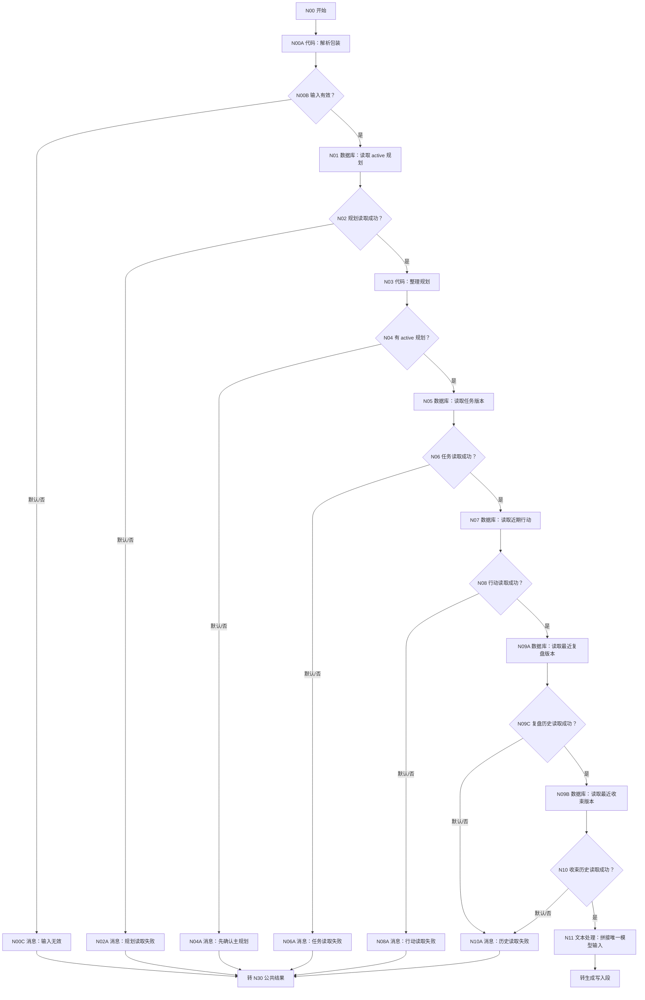
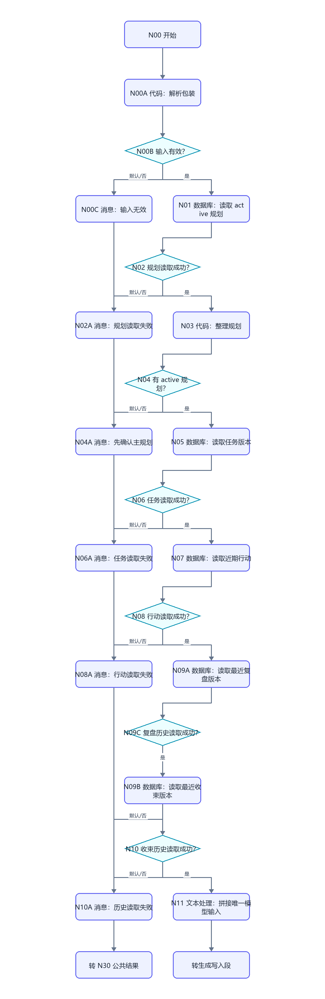
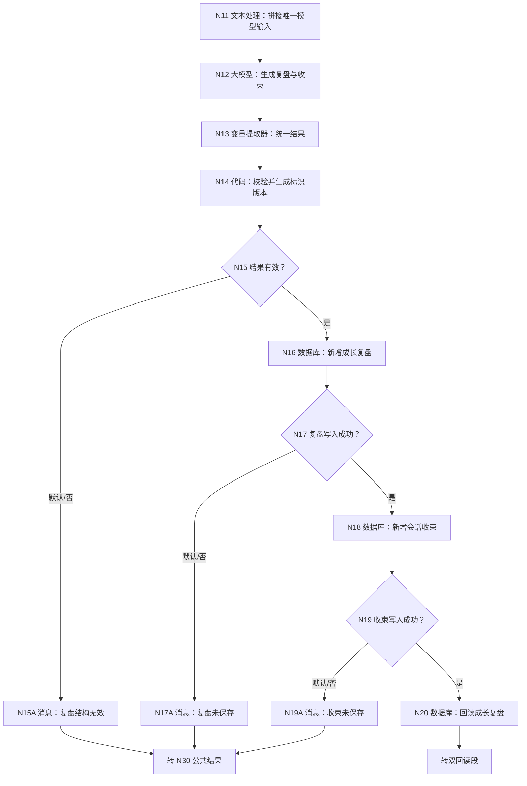
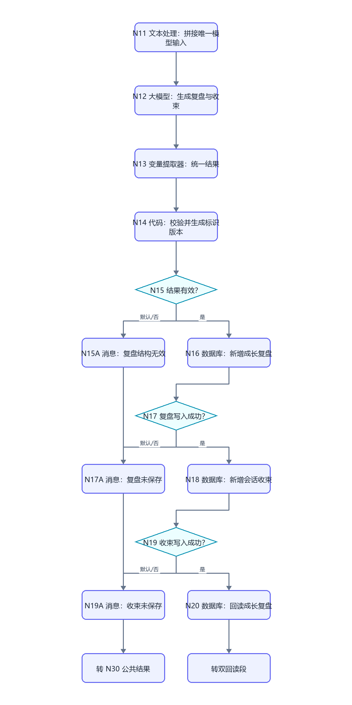
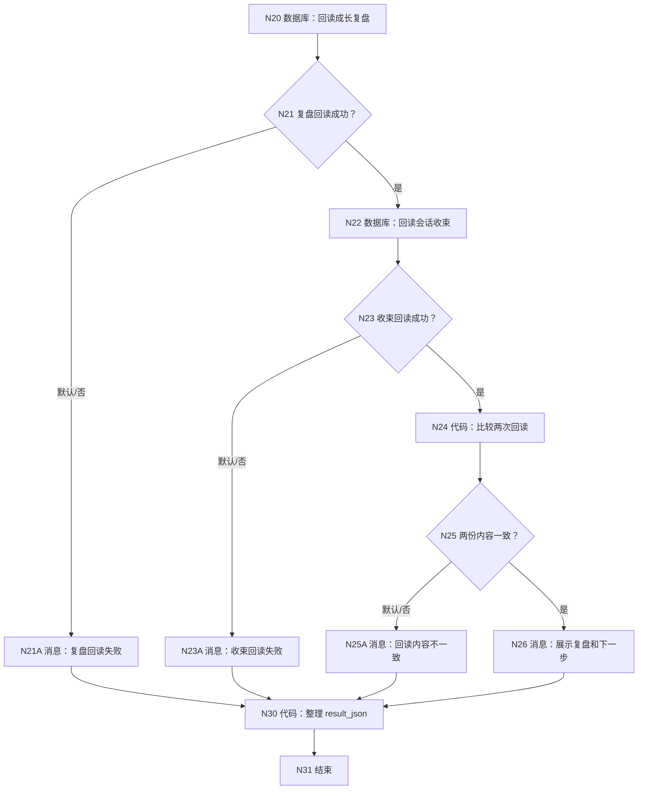
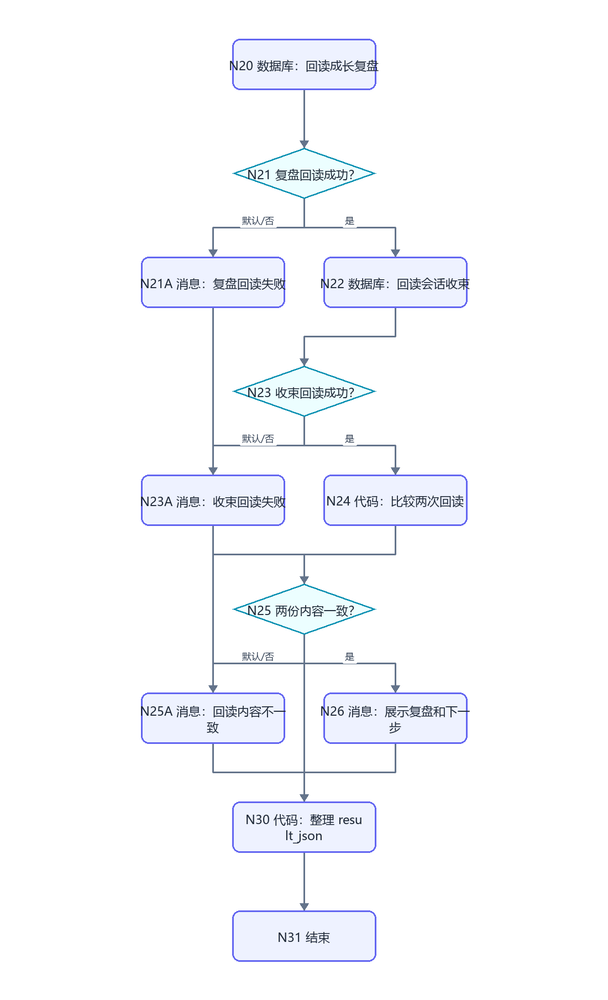

# WF-07 成长复盘与会话收束：逐节点搭建指南

<!-- AGENT-CONTRACT
start_inputs: AGENT_USER_INPUT:String
extractor_input_count: 1
result_output: result_json:String
-->

> 本工作流合并旧 WF-08“成长复盘”和旧 WF-12“会话收束”。二者读取相同的 active 规划、任务和行动证据：复盘负责判断，收束负责把本轮事实、变化、未决问题和下一入口保存为可续接摘要。一次调用顺序写 DB-07、DB-11，不直接修改主规划。

## 1. 输出边界

- 推荐类型只允许 `continue/adjust/consider_switch`。
- `adjust/consider_switch` 只能写 `pending_change_json`，不得直接改 DB-05。
- 证据不足必须进入 `evidence_gaps_json`，不能用鼓励性文字冒充进展。
- `new_facts_json` 只能包含用户明确陈述或数据库已证明的事实。
- 只有 DB-07 和 DB-11 都写入且回读一致，才返回 `completed`。

## 2. 画布













## 3. N00～N10：入口和证据读取

N00 只保留 `AGENT_USER_INPUT:String`；N00A 使用 WF-02 第 5.2 节的两字段解析代码。

N01：

```sql
SELECT id, user_key, plan_id, plan_json, plan_status, record_version, create_time
FROM main_plans
WHERE user_key='{{user_key}}' AND plan_status='active'
ORDER BY record_version DESC, create_time DESC
LIMIT 1;
```

N03 输出 has_plan、plan_id、plan_json，代码与 WF-06/N03 相同。

N05 读取任务：

```sql
SELECT id, user_key, task_id, task_type, semester, period_label, task,
       deadline_text, priority, status, expected_evidence, latest_evidence,
       delay_reason, record_version, create_time
FROM semester_tasks
WHERE user_key='{{user_key}}'
ORDER BY record_version DESC, create_time DESC
LIMIT 80;
```

N07 近期行动：

```sql
SELECT id, user_key, log_id, task_id, log_type, content_json,
       evidence_text, day_number, completed, safety_flag,
       record_version, create_time
FROM action_logs
WHERE user_key='{{user_key}}'
ORDER BY create_time DESC
LIMIT 80;
```

N09A 与 N09B 是两个串行数据库节点，因为每个节点只能选一张表。N09C 先检查 N09A/isSuccess；成功才执行 N09B。N10 再检查 N09B/isSuccess；任一次失败都到 N10A，成功空数组代表首次复盘，允许继续。

DB-07：

```sql
SELECT id, user_key, review_id, recommendation_type, record_version, create_time
FROM growth_reviews
WHERE user_key='{{user_key}}'
ORDER BY record_version DESC, create_time DESC
LIMIT 1;
```

DB-11：

```sql
SELECT id, user_key, recap_id, next_action, record_version, create_time
FROM session_recaps
WHERE user_key='{{user_key}}'
ORDER BY record_version DESC, create_time DESC
LIMIT 1;
```

N09C 条件固定为 N09A/isSuccess=true，N10 条件固定为 N09B/isSuccess=true；两者都必须保留默认路线。

## 4. N11～N15：生成、单输入提取和校验

N11 文本处理拼接：N03/plan_json、N05/outputList、N07/outputList、N09A/outputList、N09B/outputList、N00A/user_input。

N12 系统提示：

```text
你是证据驱动的大学成长复盘器。基于 active_plan、任务快照和行动日志同时生成成长复盘与会话收束。
recommendation_type 只能为 continue、adjust、consider_switch。完成、进步、风险都必须引用输入证据；缺失证据写入 evidence_gaps_json。
不要直接修改主规划。若建议调整，只写 pending_change_json，交给用户后续在 WF-05 确认。
user_recap_json 面向用户；agent_recap_json 是下一轮续接摘要；new_facts_json 只含用户明确自述或数据库已证明事实；state_changes_json 只含本轮已证明成功的状态变化。
只输出 JSON：
{"review_json":"{}","recommendation_type":"continue","evidence_summary_json":"{}","evidence_gaps_json":"[]","pending_change_json":"{}","user_recap_json":"{}","agent_recap_json":"{}","new_facts_json":"[]","state_changes_json":"[]","open_questions_json":"[]","next_action":"","display_reply":"","structure_complete":true,"evidence_grounded":true}
```

用户提示只引用 N11/output。

N13 变量提取器固定 input 只引用 N12/output；按上面字段逐项建立，最后两个为 Boolean，其余 String。

N14 输入 N13 输出、N03/plan_id、N09A/outputList、N09B/outputList、N00A/user_key：

```python
def latest_version(rows):
    items = rows if isinstance(rows, list) else []
    row = items[0] if items and isinstance(items[0], dict) else {}
    try:
        return int(row.get("record_version", 0))
    except Exception:
        return 0


def main(review_json, recommendation_type, evidence_summary_json, evidence_gaps_json,
         pending_change_json, user_recap_json, agent_recap_json, new_facts_json,
         state_changes_json, open_questions_json, next_action, display_reply,
         structure_complete, evidence_grounded, plan_id, review_rows, recap_rows, user_key):
    rec_type = str(recommendation_type).strip()
    valid = structure_complete is True and evidence_grounded is True and rec_type in ["continue", "adjust", "consider_switch"]
    required = [review_json, evidence_summary_json, user_recap_json, agent_recap_json, next_action, display_reply]
    valid = valid and all(str(value).strip() not in ["", "{}"] for value in required)
    return {
        "result_valid": valid, "review_id": "review_" + str(user_key)[3:15],
        "review_version": latest_version(review_rows) + 1,
        "recap_id": "recap_" + str(user_key)[3:15],
        "recap_version": latest_version(recap_rows) + 1,
        "plan_id_out": str(plan_id), "review_json_out": str(review_json),
        "recommendation_type_out": rec_type, "evidence_summary_out": str(evidence_summary_json),
        "evidence_gaps_out": str(evidence_gaps_json), "pending_change_out": str(pending_change_json),
        "user_recap_out": str(user_recap_json), "agent_recap_out": str(agent_recap_json),
        "new_facts_out": str(new_facts_json), "state_changes_out": str(state_changes_json),
        "open_questions_out": str(open_questions_json), "next_action_out": str(next_action),
        "display_reply": str(display_reply)
    }
```

输出按返回键声明；两个 version 为 Integer、result_valid 为 Boolean，其余 String。N15 true → N16；默认 → N15A。

## 5. N16～N25：双写和双回读

N16 新增 DB-07：user_key、review_id、plan_id、review_json、recommendation_type、evidence_summary_json、evidence_gaps_json、pending_change_json、record_version，全部引用 N14。

N17 成功后 N18 新增 DB-11：user_key、recap_id、user_recap_json、agent_recap_json、new_facts_json、state_changes_json、open_questions_json、next_action、record_version。

N20 回读 DB-07：

```sql
SELECT id, user_key, review_id, review_json, recommendation_type,
       evidence_summary_json, evidence_gaps_json, pending_change_json,
       record_version, create_time
FROM growth_reviews
WHERE user_key='{{user_key}}' AND review_id='{{review_id}}'
  AND record_version={{record_version}}
ORDER BY create_time DESC
LIMIT 1;
```

N22 回读 DB-11：

```sql
SELECT id, user_key, recap_id, user_recap_json, agent_recap_json,
       new_facts_json, state_changes_json, open_questions_json,
       next_action, record_version, create_time
FROM session_recaps
WHERE user_key='{{user_key}}' AND recap_id='{{recap_id}}'
  AND record_version={{record_version}}
ORDER BY create_time DESC
LIMIT 1;
```

N24 输入两次 rows 和 N14 的期望 id/version/content：

```python
def main(review_rows, recap_rows, review_id, review_version, review_json,
         recap_id, recap_version, agent_recap_json):
    reviews = review_rows if isinstance(review_rows, list) else []
    recaps = recap_rows if isinstance(recap_rows, list) else []
    review = reviews[0] if reviews and isinstance(reviews[0], dict) else {}
    recap = recaps[0] if recaps and isinstance(recaps[0], dict) else {}
    try:
        review_ok = str(review.get("review_id", "")) == str(review_id) and int(review.get("record_version", -1)) == int(review_version) and str(review.get("review_json", "")) == str(review_json)
        recap_ok = str(recap.get("recap_id", "")) == str(recap_id) and int(recap.get("record_version", -1)) == int(recap_version) and str(recap.get("agent_recap_json", "")) == str(agent_recap_json)
    except Exception:
        review_ok, recap_ok = False, False
    return {"review_matches": review_ok, "recap_matches": recap_ok, "both_match": review_ok and recap_ok}
```

N25 只以 both_match=true 为成功。

## 6. N30 结果节点

```python
def q(value):
    return '"' + str(value if value is not None else "").replace("\\", "\\\\").replace('"', '\\"').replace("\n", "\\n").replace("\r", "\\r") + '"'


def main(input_valid, plan_read, has_plan, tasks_read, actions_read,
         review_history_read, recap_history_read, result_valid, display_reply,
         review_write, recap_write, review_read, recap_read, both_match):
    status, reply, next_action, error_code = "needs_input", "请先确认主规划。", "confirm_main_plan", "none"
    prerequisites_ok = plan_read is True and has_plan is True and tasks_read is True and actions_read is True and review_history_read is True and recap_history_read is True
    if input_valid is not True:
        status, reply, next_action, error_code = "validation_failed", "内部输入格式无效。", "retry_same_message", "invalid_envelope"
    elif prerequisites_ok is not True:
        status, reply, next_action = "needs_input", "请先确认 active 主规划，再进行成长复盘。", "confirm_main_plan"
    elif result_valid is not True:
        status, reply, next_action, error_code = "validation_failed", "复盘缺少结构或证据依据，本轮未保存。", "add_review_evidence", "invalid_review"
    elif review_write is not True or recap_write is not True or review_read is not True or recap_read is not True or both_match is not True:
        status, reply, next_action, error_code = "write_failed", "复盘与收束没有完成双写双回读校验。", "retry_later", "dual_write_failed"
    else:
        status, reply, next_action = "completed", str(display_reply), "follow_recap_next_action"
    result = "{" + '"workflow_id":"WF-07",' + '"status":' + q(status) + "," + '"reply":' + q(reply) + "," + '"next_action":' + q(next_action) + "," + '"error_code":' + q(error_code) + "}"
    return {"result_json": result}
```

N30 形参映射：input_valid=N00A/input_valid；plan_read/has_plan=N01/isSuccess、N03/has_plan；tasks_read=N05/isSuccess；actions_read=N07/isSuccess；review_history_read=N09A/isSuccess；recap_history_read=N09B/isSuccess；result_valid/display_reply=N14；review_write/recap_write=N16/N18 的 isSuccess；review_read/recap_read=N20/N22 的 isSuccess；both_match=N24/both_match。输出 `result_json:String`；N31 只返回该参数。

## 7. 调试指南

### 7.1 正常路线

1. 准备 active 规划、至少两个任务、一个 progress 和一个 evidence 日志。
2. 输入“复盘一下我这两周的执行情况”。
3. 预期 N13 只有一个 input；N14/result_valid=true。
4. DB-07 和 DB-11 各新增 version=1；双回读一致；status=completed。
5. 再次复盘：两个表各自 version+1，不覆盖上一轮。

### 7.2 证据和失败路线

- 只有任务计划、没有行动证据：允许复盘，但必须列 evidence gaps，不得声称完成。
- recommendation_type=adjust：DB-05 不变化，pending_change_json 非空。
- 另一个 user_key 的行动日志不可进入摘要。
- 任一读取 SQL 失败：模型不执行。
- N13 漏 evidence_grounded：N15A。
- DB-07 写失败：DB-11 不执行。
- DB-07 成功、DB-11 失败：返回 dual_write_failed；下次版本继续递增，不覆盖已保存复盘。
- 任一回读失败或内容不一致：不返回 completed。

## 8. 发布与验收清单

发布名称 `ULPS_WF07_REVIEW_AND_RECAP`；描述：`基于 active 规划、任务和行动证据生成成长复盘及可续接会话收束，不直接修改主规划。`

- [ ] 只有 `AGENT_USER_INPUT:String`。
- [ ] N13 变量提取器只有一个 input。
- [ ] 复盘和收束共用一次证据读取。
- [ ] 建议调整只写 pending_change_json。
- [ ] DB-07 成功后才写 DB-11，并分别回读。
- [ ] 所有 SQL 按 user_key 隔离。
- [ ] 所有消息进入 N30；N31 返回 `result_json:String`。
