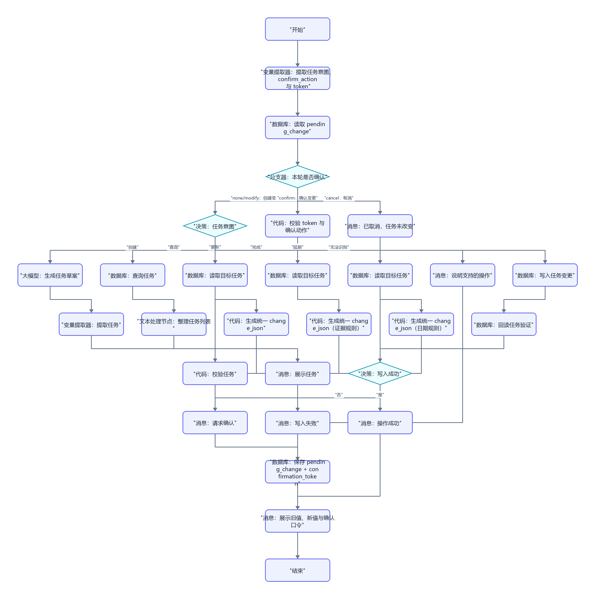
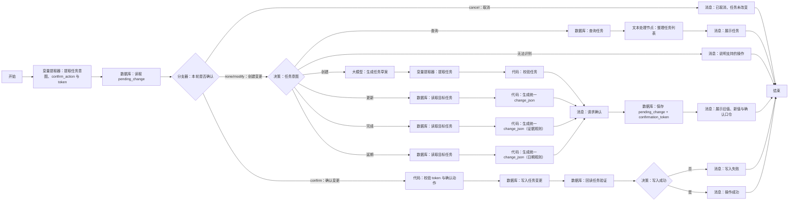

# WF-07 学期任务管理搭建指南

## 1. 目标与边界

主 Agent 在用户要创建、查询、更新、完成或延期任务时调用。流程读取 `main_plan_json`，只改任务记录，不擅自改变发展路径或覆盖主规划；核心输出 `semester_tasks_json`。

## 2. 搭建前准备

输入：`AGENT_USER_INPUT`,`user_id`,`session_id`,`main_plan_json`，可选 `task_id`,`action_evidence`。任务实体建议字段：`task_id,user_id,plan_id,semester,month,week,task,deadline,priority,status,expected_evidence,actual_evidence,delay_reason,updated_at`。数据库字段、查询和更新方式以当前编辑器显示为准；不支持更新时采用“新增事件记录 + 查询时汇总最新状态”，不得假装已原地更新。

## 3. 最小可运行版

```text
开始 → 大模型（生成首批学期任务）→ 结束
```

拖入“大模型”并连接，输入映射 `main_plan_json` 和用户文本，输出 `semester_tasks_json` 草案。最小版不读写数据库，只能返回 `status=draft`。

## 4. 完整业务版画布





```text
开始 → 变量提取器（提取意图、confirm_action 与 token）→ 数据库（读取 pending_change）→ 分支器（本轮是否确认）
 ├─ 创建变更 → 决策（任务意图）
 │  ├─ 创建 → 大模型（生成任务草案）→ 变量提取器（提取任务）→ 代码（校验任务）
 ├─ 查询 → 数据库（查询任务）→ 文本处理节点（整理任务列表）→ 消息 → 结束
 │  ├─ 更新/完成/延期 → 数据库（读取目标任务）→ 代码（生成统一 change_json）
 │  └─ 所有写操作汇合 → 数据库（保存 pending_change + token）→ 消息（展示旧新值和口令）→ 结束
 └─ 确认变更 → 代码（校验 token 与 confirm_action）→ 数据库（写入任务变更）→ 写入检查 → 成功/失败消息 → 结束
```

画布较宽时可让更新、完成、延期共用“读取目标任务 → 生成统一 change_json → 保存 pending_change → 下一次调用确认 → 写入任务变更”，由 `intent` 决定允许字段。拖入节点后严格按 Mermaid 图重命名和连线；“任务意图”没有匹配项时连接“消息：说明支持的操作 → 结束”。

节点数量（与 Mermaid 未复用画布一致）：2 个“变量提取器”、1 个“大模型”、5 个“代码”、1 个“分支器”、2 个“决策”、8 个“数据库”（读 pending、查询、三条读目标任务、存 pending、写变更、回读验证）、1 个“文本处理节点”、7 个“消息”和 1 个共享“结束”。

## 5. 实际节点配置与变量映射

| 意图 | 必需参数 | 数据库条件 | 允许写入 |
|---|---|---|---|
| create | `main_plan_json`、任务内容 | 新 `task_id` + `user_id` | 完整新任务，初始 `status=pending` |
| query | 可选状态/时间范围 | 必须含 `user_id`，可加 `plan_id/status` | 无 |
| update | `task_id`、变更内容 | `user_id + task_id` | `task,deadline,priority,expected_evidence` |
| complete | `task_id`、完成说明 | `user_id + task_id` | `status=completed,actual_evidence,updated_at` |
| postpone | `task_id`、新截止时间/原因 | `user_id + task_id` | `deadline,delay_reason,status,updated_at` |

跨轮节点映射：读取 pending 使用 `user_id + confirmation_token` 输出 `pending_change_json`；保存 pending 写入完整 `change_json`、token、过期时间和 `status=pending`；token 校验输出 `confirmation_valid`；回读验证输出最终 `semester_tasks_json`。

“提取任务意图与参数”输出 `intent,task_id,requested_changes,filters,confirmation_text,action_evidence,confirm_action,confirmation_token`。如果同一句包含多个操作，优先追问，不批量猜测。

“校验任务”检查每个任务具备 `task_id,plan_id,semester,month,week,task,deadline,priority,status,expected_evidence`，截止时间可理解且不早于创建时间；不合格返回缺失字段。完成任务可以没有量化结果，但必须如实记录“暂无证据”，不能点亮已验证技能。

所有写分支统一产出 `change_json={change_id,intent,task_id,old_values,new_values,action_evidence,change_reason,requested_at}`。更新白名单仅允许 `task,deadline,priority,expected_evidence`；延期只允许 `deadline,delay_reason,status,updated_at`，新日期必须可解析且晚于原截止时间；完成只允许 `status=completed,actual_evidence,updated_at`，证据为空时明确写“暂无证据”，不得生成验证型技能。`old_values` 与 `new_values` 都必须非空并在确认消息逐项展示。

## 6. 可复制提示词

### 意图提取提示词

```text
从用户输入中识别且只识别一个任务操作：create、query、update、complete、postpone。不要把“我想改变就业方向”当成任务更新，应返回 needs_plan_change=true。
输入={{AGENT_USER_INPUT}}
只输出 JSON：{"intent":"","task_id":"","requested_changes":{},"filters":{},"confirmation_text":"","action_evidence":"","needs_plan_change":false,"missing_fields":[]}
信息不够时列入 missing_fields，不猜 task_id 或日期。
```

### 创建任务提示词

```text
你是行动规划教练。依据主规划生成当前学期首批任务，层级为学期目标→月度里程碑→本周行动。任务数量适合执行，不用堆数量制造压力。
main_plan_json={{main_plan_json}}
request={{AGENT_USER_INPUT}}
只输出 JSON：{"tasks":[{"task_id":"","plan_id":"","semester":"","month":"","week":"","task":"","deadline":"","priority":"高/中/低","status":"pending","expected_evidence":""}],"not_do_list":[],"limitations":[]}
任务必须具体、可观察、可调整；不得承诺结果；涉及学校政策提示官方复核。
```

### 更新、完成、延期统一变更代码规则（可复制）

```text
输入 intent、current_task、requested_changes、action_evidence、当前时间。
1. update：拒绝 task/deadline/priority/expected_evidence 之外的键；合并后生成 old_values 与 new_values。
2. complete：new_values 固定含 status=completed、actual_evidence（空则“暂无证据”）、updated_at；不得修改 task 或 plan_id。
3. postpone：必须有 delay_reason；新 deadline 可解析、晚于旧 deadline；new_values 只含 deadline、delay_reason、status、updated_at。
4. 输出统一 JSON：{"change_id":"","intent":"update/complete/postpone","task_id":"","old_values":{},"new_values":{},"action_evidence":"","change_reason":"","requested_at":""}
任一规则失败输出 change_valid=false 和具体 error，不生成可确认草稿。
```

### 完整结果包装

```text
所有结束节点输出变量 `result_json`，完整值为：{"status":"draft/awaiting_confirmation/write_succeeded/write_failed/needs_input","reply":"","data":{"semester_tasks_json":{"tasks":[]},"change_json":{}},"suggested_writes":[],"next_action":"","error":null}
```

## 7. 确认与失败处理

查询是只读操作。创建、更新、完成、延期第一次调用只保存 `pending_change + confirmation_token`，展示旧值、新值和口令后结束。下一次调用读取 pending，只有 token、`user_id`、未过期状态一致且 `confirm_action=confirm` 才写任务；cancel 删除 pending，modify 生成新 token。无成功标识时回读 `user_id + task_id`。失败返回完整 `result_json` 和未保存的 `change_json`，不得把任务表示为已变更。

## 8. 调试用例

- 创建：第一次输入“根据我的大二就业主规划生成本周 3 个任务”，预期 pending 和 token；第二次携带 token 确认后写入，均绑定 `plan_id`。
- 查询：“查看本周未完成任务。”预期只读且仅返回当前 `user_id` 数据。
- 完成：第一次输入“完成 T-01，提交了 GitHub 仓库链接”，预期展示旧新值和 token；第二次携带 token 确认后状态完成。
- 缺失：“把那个任务延期。”预期要求提供或选择 `task_id`，无写入。
- 写入失败：模拟数据库失败，预期 `write_failed`，不称已延期/已完成。

## 9. 常见错误与验收清单

- 分支串线：逐一测试五个意图，确认一次只进入一个写分支。
- 越权修改主规划：`needs_plan_change=true` 时返回 WF-06，不在任务表改目标路径。
- 用户隔离遗漏：每个数据库查询、更新条件都包含 `user_id`。

- [ ] 五种意图均可达，查询不写入，其余写入前确认。
- [ ] 任务与 `plan_id`、学期/月/周映射一致。
- [ ] 完成状态绑定真实行动或明确标注暂无证据。
- [ ] 写入失败不声称成功；输出可供 WF-08 读取近期任务和行动证据。
