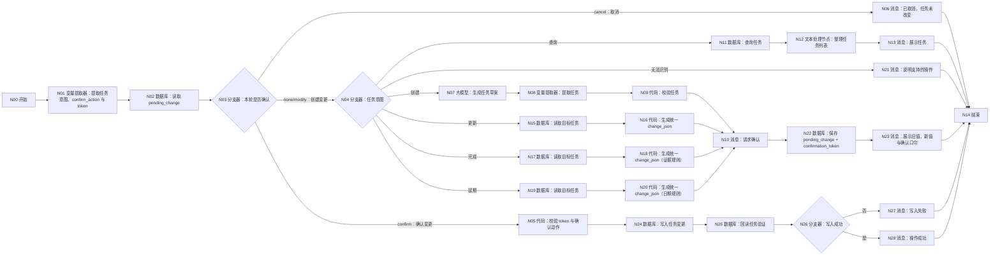

# WF-07 学期任务管理搭建指南

## 1. 目标与边界

主 Agent 在用户要创建、查询、更新、完成或延期任务时调用。流程读取 `main_plan_json`，只改任务记录，不擅自改变发展路径或覆盖主规划；核心输出 `semester_tasks_json`。

## 2. 搭建前准备

输入：`AGENT_USER_INPUT`,`uid`,`session_id`,`main_plan_json`，可选 `task_id`,`action_evidence`。任务实体建议字段：`task_id,uid,plan_id,semester,month,week,task,deadline,priority,status,expected_evidence,actual_evidence,delay_reason,updated_at`。数据库字段、查询和更新方式按本文件逐栏配置；不支持更新时采用“新增事件记录 + 查询时汇总最新状态”，不得假装已原地更新。

## 3. 最小可运行版

```text
开始 → 大模型（生成首批学期任务）→ 结束
```

拖入“大模型”并连接，输入映射 `main_plan_json` 和用户文本，输出 `semester_tasks_json` 草案。最小版不读写数据库，只能返回 `status=draft`。

## 4. 完整业务版画布




```text
开始 → 变量提取器（提取意图、confirm_action 与 token）→ 数据库（读取 pending_change）→ 分支器（本轮是否确认）
 ├─ 创建变更 → 分支器（任务意图）
 │  ├─ 创建 → 大模型（生成任务草案）→ 变量提取器（提取任务）→ 代码（校验任务）
 ├─ 查询 → 数据库（查询任务）→ 文本处理节点（整理任务列表）→ 消息 → 结束
 │  ├─ 更新/完成/延期 → 数据库（读取目标任务）→ 代码（生成统一 change_json）
 │  └─ 所有写操作汇合 → 数据库（保存 pending_change + token）→ 消息（展示旧新值和口令）→ 结束
 └─ 确认变更 → 代码（校验 token 与 confirm_action）→ 数据库（写入任务变更）→ 写入检查 → 成功/失败消息 → 结束
```

画布较宽时可让更新、完成、延期共用“读取目标任务 → 生成统一 change_json → 保存 pending_change → 下一次调用确认 → 写入任务变更”，由 `intent` 决定允许字段。拖入节点后严格按 Mermaid 图重命名和连线；“任务意图”没有匹配项时连接“消息：说明支持的操作 → 结束”。

节点数量（与 Mermaid 未复用画布一致）：2 个“变量提取器”、1 个“大模型”、5 个“代码”、3 个“分支器”、8 个“数据库”（读 pending、查询、三条读目标任务、存 pending、写变更、回读验证）、1 个“文本处理节点”、7 个“消息”和 1 个共享“结束”。

## 5. 实际节点配置与变量映射

| 意图 | 必需参数 | 数据库条件 | 允许写入 |
|---|---|---|---|
| create | `main_plan_json`、任务内容 | 新 `task_id` + `uid` | 完整新任务，初始 `status=pending` |
| query | 可选状态/时间范围 | 必须含 `uid`，可加 `plan_id/status` | 无 |
| update | `task_id`、变更内容 | `uid + task_id` | `task,deadline,priority,expected_evidence` |
| complete | `task_id`、完成说明 | `uid + task_id` | `status=completed,actual_evidence,updated_at` |
| postpone | `task_id`、新截止时间/原因 | `uid + task_id` | `deadline,delay_reason,status,updated_at` |

跨轮节点映射：读取 pending 使用 `uid + confirmation_token` 输出 `pending_change_json`；保存 pending 写入完整 `change_json`、token、过期时间和 `status=pending`；token 校验输出 `confirmation_valid`；回读验证输出最终 `semester_tasks_json`。

“提取任务意图与参数”输出 `intent,task_id,requested_changes,filters,confirmation_text,action_evidence,confirm_action,confirmation_token`。如果同一句包含多个操作，优先追问，不批量猜测。

“校验任务”检查每个任务具备 `task_id,plan_id,semester,month,week,task,deadline,priority,status,expected_evidence`，截止时间可理解且不早于创建时间；不合格返回缺失字段。完成任务可以没有量化结果，但必须如实记录“暂无证据”，不能点亮已验证技能。

所有写分支统一产出 `change_json={change_id,intent,task_id,old_values,new_values,action_evidence,change_reason,requested_at}`。更新白名单仅允许 `task,deadline,priority,expected_evidence`；延期只允许 `deadline,delay_reason,status,updated_at`，新日期必须可解析且晚于原截止时间；完成只允许 `status=completed,actual_evidence,updated_at`，证据为空时明确写“暂无证据”，不得生成验证型技能。`old_values` 与 `new_values` 都必须非空并在确认消息逐项展示。

### 五个代码节点：页面输入、Python 与输出

N05 的输入为 `pending_change_json`、`confirm_action`、`confirmation_token`、`uid`；输出声明 `confirmation_valid:Boolean`、`confirmation_error:String`：

```python
import json

def main(pending_change_json, confirm_action, confirmation_token, uid):
    try:
        pending = json.loads(pending_change_json) if isinstance(pending_change_json, str) else (pending_change_json or {})
        valid = confirm_action == "confirm" and bool(confirmation_token) and pending.get("confirmation_token") == confirmation_token and pending.get("uid") == uid and pending.get("status") == "pending"
        return {"confirmation_valid": valid, "confirmation_error": "" if valid else "确认动作、用户、token 或 pending 状态不匹配"}
    except Exception as exc:
        return {"confirmation_valid": False, "confirmation_error": str(exc)}
```

N09 输入 `tasks_json`；输出声明 `task_valid:Boolean`、`task_error:String`、`change_json:Object`：

```python
import json

def main(tasks_json):
    try:
        value = json.loads(tasks_json) if isinstance(tasks_json, str) else (tasks_json or {})
        tasks = value.get("tasks", [])
        required = ("task_id", "plan_id", "semester", "month", "week", "task", "deadline", "priority", "status", "expected_evidence")
        valid = bool(tasks) and all(all(item.get(key) not in (None, "") for key in required) for item in tasks)
        return {"task_valid": valid, "task_error": "" if valid else "任务为空或存在必填字段缺失", "change_json": {"intent": "create", "new_values": {"tasks": tasks}} if valid else {}}
    except Exception as exc:
        return {"task_valid": False, "task_error": str(exc), "change_json": {}}
```

N16、N18、N20 共用下列代码，但页面 `intent` 分别选择固定值 `update`、`complete`、`postpone`；其余输入为 `current_task`、`requested_changes`、`action_evidence`、`requested_at`。三个节点输出都声明 `change_valid:Boolean`、`change_error:String`、`change_json:Object`：

```python
import json

def main(intent, current_task, requested_changes, action_evidence, requested_at):
    try:
        current = json.loads(current_task) if isinstance(current_task, str) else (current_task or {})
        requested = json.loads(requested_changes) if isinstance(requested_changes, str) else (requested_changes or {})
        new_values = {}
        error = ""
        if intent == "update":
            allowed = {"task", "deadline", "priority", "expected_evidence"}
            new_values = {k: v for k, v in requested.items() if k in allowed}
            if set(requested) - allowed:
                error = "更新包含不允许字段"
        elif intent == "complete":
            new_values = {"status": "completed", "actual_evidence": action_evidence or "暂无证据", "updated_at": requested_at}
        elif intent == "postpone":
            if not requested.get("deadline") or not requested.get("delay_reason"):
                error = "延期必须填写新截止时间和原因"
            new_values = {"deadline": requested.get("deadline"), "delay_reason": requested.get("delay_reason"), "status": "postponed", "updated_at": requested_at}
        else:
            error = "不支持的写操作"
        valid = bool(current.get("task_id")) and bool(new_values) and not error
        change = {"intent": intent, "task_id": current.get("task_id", ""), "old_values": current, "new_values": new_values, "action_evidence": action_evidence or "", "change_reason": requested.get("delay_reason", ""), "requested_at": requested_at} if valid else {}
        return {"change_valid": valid, "change_error": error or ("" if valid else "找不到目标任务"), "change_json": change}
    except Exception as exc:
        return {"change_valid": False, "change_error": str(exc), "change_json": {}}
```

## 6. 可复制提示词

### 意图提取提示词

```text
从用户输入中识别且只识别一个任务操作：create、query、update、complete、postpone。不要把“我想改变就业方向”当成任务更新，应返回 needs_plan_change=true。
输入={{AGENT_USER_INPUT}}
只输出 JSON：{"intent":"","task_id":"","requested_changes":{},"filters":{},"confirmation_text":"","action_evidence":"","needs_plan_change":false,"missing_fields":[]}
信息不够时列入 missing_fields，不猜 task_id 或日期。
```

### 创建任务提示词

```text
你是行动规划教练。依据主规划生成当前学期首批任务，层级为学期目标→月度里程碑→本周行动。任务数量适合执行，不用堆数量制造压力。
main_plan_json={{main_plan_json}}
request={{AGENT_USER_INPUT}}
只输出 JSON：{"tasks":[{"task_id":"","plan_id":"","semester":"","month":"","week":"","task":"","deadline":"","priority":"高/中/低","status":"pending","expected_evidence":""}],"not_do_list":[],"limitations":[]}
任务必须具体、可观察、可调整；不得承诺结果；涉及学校政策提示官方复核。
```

### 更新、完成、延期统一变更代码规则（可复制）

```text
输入 intent、current_task、requested_changes、action_evidence、当前时间。
1. update：拒绝 task/deadline/priority/expected_evidence 之外的键；合并后生成 old_values 与 new_values。
2. complete：new_values 固定含 status=completed、actual_evidence（空则“暂无证据”）、updated_at；不得修改 task 或 plan_id。
3. postpone：必须有 delay_reason；新 deadline 可解析、晚于旧 deadline；new_values 只含 deadline、delay_reason、status、updated_at。
4. 输出统一 JSON：{"change_id":"","intent":"update/complete/postpone","task_id":"","old_values":{},"new_values":{},"action_evidence":"","change_reason":"","requested_at":""}
任一规则失败输出 change_valid=false 和具体 error，不生成可确认草稿。
```

### 完整结果包装

```text
所有结束节点输出变量 `result_json`，完整值为：{"status":"draft/awaiting_confirmation/write_succeeded/write_failed/needs_input","reply":"","data":{"semester_tasks_json":{"tasks":[]},"change_json":{}},"suggested_writes":[],"next_action":"","error":null}
```

## 7. 确认与失败处理

查询是只读操作。创建、更新、完成、延期第一次调用只保存 `pending_change + confirmation_token`，展示旧值、新值和口令后结束。下一次调用读取 pending，只有 token、`uid`、未过期状态一致且 `confirm_action=confirm` 才写任务；cancel 删除 pending，modify 生成新 token。无成功标识时回读 `uid + task_id`。失败返回完整 `result_json` 和未保存的 `change_json`，不得把任务表示为已变更。

## 8. 调试用例

- 创建：第一次输入“根据我的大二就业主规划生成本周 3 个任务”，预期 pending 和 token；第二次携带 token 确认后写入，均绑定 `plan_id`。
- 查询：“查看本周未完成任务。”预期只读且仅返回当前 `uid` 数据。
- 完成：第一次输入“完成 T-01，提交了 GitHub 仓库链接”，预期展示旧新值和 token；第二次携带 token 确认后状态完成。
- 缺失：“把那个任务延期。”预期要求提供或选择 `task_id`，无写入。
- 写入失败：模拟数据库失败，预期 `write_failed`，不称已延期/已完成。

## 9. 常见错误与验收清单

- 分支串线：逐一测试五个意图，确认一次只进入一个写分支。
- 越权修改主规划：`needs_plan_change=true` 时返回 WF-06，不在任务表改目标路径。
- 用户隔离遗漏：每个数据库查询、更新条件都包含 `uid`。

- [ ] 五种意图均可达，查询不写入，其余写入前确认。
- [ ] 任务与 `plan_id`、学期/月/周映射一致。
- [ ] 完成状态绑定真实行动或明确标注暂无证据。
- [ ] 写入失败不声称成功；输出可供 WF-08 读取近期任务和行动证据。

## 节点逐项配置

<!-- GENERATED-NODE-LEDGER:START -->
### 画布节点连线与页面输入输出总表

本表由流程图生成，用于防止漏连。‘直接上游’决定页面引用下拉框中可选的数据来源；具体变量名以本文件后续业务映射表为准。
开始节点类型规则：`uid/session_id/AGENT_USER_INPUT` 及所有 `*_json/*_token/*_id` 均选 String；计数、天数选 Integer；真伪开关选 Boolean。表中未特别标注的输入一律选 String，JSON 作为字符串传递。

| 节点 | 类型 | 直接上游（输入来源） | 固定/声明输出 | 直接下游 |
|---|---|---|---|---|
| `A` N00 开始 | 开始 | 无（起点） | 开始节点中声明的同名变量 | A1 |
| `A1` N01 变量提取器：提取任务意图、confirm_action 与 token | 变量提取器 | A | `intent:String`、`task_id:String`、`requested_changes:String`、`filters:String`、`action_evidence:String`、`confirm_action:String`、`confirmation_token:String` | A2 |
| `A2` N02 数据库：读取 pending_change | 数据库 | A1 | `isSuccess:Boolean`、`message:String`、`outputList:Array<Object>` | A3 |
| `A3` N03 分支器：本轮是否确认 | 分支器 | A2 | 不产生业务变量；按条件输出连线 | C（"none/modify：创建变更"）、X（"confirm：确认变更"）、XC（"cancel：取消"） |
| `C` N04 分支器：任务意图 | 分支器 | A3 | 不产生业务变量；按条件输出连线 | D（"创建"）、H（"查询"）、K（"更新"）、M（"完成"）、O（"延期"）、Q（"无法识别"） |
| `X` N05 代码：校验 token 与确认动作 | 代码 | A3 | 与 Python `main()` 返回 dict 的键完全一致 | T |
| `T` N24 数据库：写入任务变更 | 数据库 | X | `isSuccess:Boolean`、`message:String`、`outputList:Array<Object>` | Y |
| `XC` N06 消息：已取消，任务未改变 | 消息 | A3 | 不新增业务变量；回答内容引用上游变量 | Z |
| `Z` N14 结束 | 结束 | XC、J、Q、S、V、W | `output` 引用上游最终结果 | 无；必须在正文说明为何终止或转入下一张图 |
| `D` N07 大模型：生成任务草案 | 大模型 | C | `output:String` | E |
| `E` N08 变量提取器：提取任务 | 变量提取器 | D | `tasks_json:String`（完整 tasks 数组 JSON） | F |
| `F` N09 代码：校验任务 | 代码 | E | 与 Python `main()` 返回 dict 的键完全一致 | G |
| `G` N10 消息：请求确认 | 消息 | F、L、N、P | 不新增业务变量；回答内容引用上游变量 | R |
| `H` N11 数据库：查询任务 | 数据库 | C | `isSuccess:Boolean`、`message:String`、`outputList:Array<Object>` | I |
| `I` N12 文本处理节点：整理任务列表 | 文本处理 | H | `output:String` | J |
| `J` N13 消息：展示任务 | 消息 | I | 不新增业务变量；回答内容引用上游变量 | Z |
| `K` N15 数据库：读取目标任务 | 数据库 | C | `isSuccess:Boolean`、`message:String`、`outputList:Array<Object>` | L |
| `L` N16 代码：生成统一 change_json | 代码 | K | 与 Python `main()` 返回 dict 的键完全一致 | G |
| `M` N17 数据库：读取目标任务 | 数据库 | C | `isSuccess:Boolean`、`message:String`、`outputList:Array<Object>` | N |
| `N` N18 代码：生成统一 change_json（证据规则） | 代码 | M | 与 Python `main()` 返回 dict 的键完全一致 | G |
| `O` N19 数据库：读取目标任务 | 数据库 | C | `isSuccess:Boolean`、`message:String`、`outputList:Array<Object>` | P |
| `P` N20 代码：生成统一 change_json（日期规则） | 代码 | O | 与 Python `main()` 返回 dict 的键完全一致 | G |
| `Q` N21 消息：说明支持的操作 | 消息 | C | 不新增业务变量；回答内容引用上游变量 | Z |
| `R` N22 数据库：保存 pending_change + confirmation_token | 数据库 | G | `isSuccess:Boolean`、`message:String`、`outputList:Array<Object>` | S |
| `S` N23 消息：展示旧值、新值与确认口令 | 消息 | R | 不新增业务变量；回答内容引用上游变量 | Z |
| `Y` N25 数据库：回读任务验证 | 数据库 | T | `isSuccess:Boolean`、`message:String`、`outputList:Array<Object>` | U |
| `U` N26 分支器：写入成功 | 分支器 | Y | 不产生业务变量；按条件输出连线 | V（"否"）、W（"是"） |
| `V` N27 消息：写入失败 | 消息 | U | 不新增业务变量；回答内容引用上游变量 | Z |
| `W` N28 消息：操作成功 | 消息 | U | 不新增业务变量；回答内容引用上游变量 | Z |
<!-- GENERATED-NODE-LEDGER:END -->

> 本节必须与[平台 UI 配置契约](PLATFORM-UI-CONTRACT.md)一起使用。先按流程图编号拖入节点并连线，再配置节点；未连线时下游“引用”下拉框会显示暂无数据。

### 本工作流所有节点的页面填写顺序

1. **开始**：按下方开始输入表逐行“+ 添加”，变量名、类型和必填状态照表填写。
2. **自定义 SQL 数据库**：输入参数选择引用；读取结果只使用固定输出 `isSuccess:Boolean`、`message:String`、`outputList:Array<Object>`。
3. **表单新增/更新数据库**：选择 `university / 目标表`；新增在“设置新增数据”逐字段添加，更新先在“设置数据范围”配置 AND 条件，再在“设置更新数据”逐字段添加；固定输出仍为 `isSuccess/message/outputList`。
4. **大模型**：输入参数名与 `{{变量名}}` 完全一致；系统提示词放角色、规则和 JSON 结构，用户提示词只放本轮变量；输出 `output:String`。
5. **变量提取器**：输入固定为 `input｜引用｜上游大模型/output`；每个输出必须填写变量名、类型和提取描述，复杂 JSON 先用 String。
6. **代码**：仅使用 Python `def main(...): return {...}`；输入名与形参一致，输出区声明每个返回键及类型。
7. **分支器**：左侧选上游变量，条件选“等于”等操作；与字面量比较时比较类型选常量/固定值；每条分支和默认分支都必须连接。
8. **消息**：输入区引用需要展示的变量，在“回答内容”用 `{{变量名}}`；流式输出关闭；消息后连接共享结束。
9. **结束**：回答模式选“返回设定格式配置的回答”，输出设置 `output｜引用｜上游最终结果`。所有成功、失败、待补充消息都进入同一个结束节点。

本节的通用点击位置、建表入口、导入按钮和数据库节点输出解释见[数据库从零教程](../database/README.md)；请先完成该教程，再按本节配置当前 WF。

### 准备和输入

创建 `main_plans` 和 `semester_tasks`，上传 [DB-05](../database/import-templates/DB-05-main-plans.xlsx)、[DB-06](../database/import-templates/DB-06-semester-tasks.xlsx)。

| 输入 | 来源 | 示例 |
|---|---|---|
| `AGENT_USER_INPUT` | 开始节点 | `生成本周任务`、`完成任务 T001`、`延期任务 T002` |
| `uid` | 主 Agent | `test_user_001` |
| `session_id` | 主 Agent/会话上下文 | `SESSION-TEST-001` |
| `main_plan_json` | WF-06/当前规划查询 | active 主规划 |
| `plan_id` | 当前主规划 | active 规划 ID |
| `task_id` | 用户输入/变量提取 | 更新、完成、延期时必填 |
| `action_evidence` | 用户输入/上游变量 | 可选；完成任务时的真实证据 |
| `confirm_action` | 总流程/变量提取器 | `none/modify/confirm/cancel` |
| `confirmation_token` | 首轮 pending 输出 | 确认轮原样传回 |

读取 active 主规划使用 WF-06 的 SQL。查询任务：

```sql
SELECT * FROM semester_tasks
WHERE uid='{{uid}}' AND plan_id='{{plan_id}}'
ORDER BY deadline ASC;
```

创建用表单新增；更新、完成、延期优先按数据库返回的系统 `id` 更新，拿不到 id 时条件必须同时包含 `uid + task_id`。写入字段详见 [DB-06 字典](../database/DATABASE-SCHEMA.md#db-06-semester_tasks学期任务与行动)。

| 节点 | 输入 | 输出 |
|---|---|---|
| 意图提取 | `AGENT_USER_INPUT` | `intent,task_id,change_json` |
| 查询任务 | `uid,plan_id/task_id` | `outputList` |
| 保存 pending 变更 | `uid,task_id,change_json,confirmation_token` | `isSuccess` |
| 正式写入 | 校验后的 new_values | `isSuccess,message` |
| 回读 | `uid,task_id` | 最新任务 JSON |
| 结束 | `result_json` | `output` |

调试至少覆盖：创建一条任务；查询列表；确认后完成；延期时缺少原因；错误 task_id 空查询；数据库失败。完成后在 DB-06 筛选 uid，确认状态和证据字段正确。
