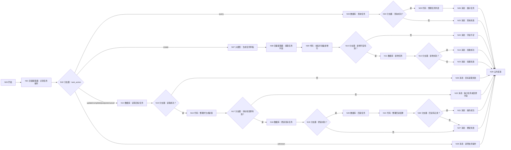

# WF-07 学期任务管理：逐节点搭建指南

> 本版严格使用 DB-06 模板已有字段，不再虚构 `pending_change` 或 `confirmation_token`。任务创建、更新、完成、延期、取消必须由用户本轮明确提出；主规划的保存/切换仍由 WF-06 两轮确认。当前结束节点返回 `workflow_finished`。

## 1. 数据表和开始输入

在 `university` 上传 [DB-06 semester_tasks](../database/import-templates/DB-06-semester-tasks.xlsx)。默认 `id/uid/create_time` 保留。

N00 开始输入：

| 变量 | 类型 | 必填 | 说明/调试值 |
|---|---|---:|---|
| `AGENT_USER_INPUT` | String | 是 | `创建本周完成项目需求分析的任务` |
| `uid` | String | 是 | `test_user_001` |
| `plan_id` | String | 创建时是 | 当前 active 主规划 ID |
| `semester` | String | 创建时是 | `2026秋` |
| `request_time` | String | 是 | `2026-07-19 17:00:00` |

## 2. 连线图



N06、N13、N22～N28、N31 都连接 N29 结束。

## 3. N01/N02：识别操作

N01 模型 `Spark4.0 Ultra`，输入 `user_input=N00/AGENT_USER_INPUT`，输出：

| 变量 | 类型 | 描述 |
|---|---|---|
| `task_action` | String | 只能是 create、query、update、complete、postpone、cancel、unknown |
| `task_id` | String | 用户提到的任务 ID；未提及为空 |
| `task_text` | String | 新任务内容或修改后的任务内容 |
| `deadline_text` | String | 用户明确提出的新截止时间；未提及为空 |
| `priority` | String | 高/中/低；未提及为空 |
| `actual_evidence` | String | 完成任务时用户提供的成果证据 |
| `delay_reason` | String | 延期原因 |
| `query_scope` | String | 查询条件，如本周/未完成/全部 |

N02 为 `N01/task_action` 添加七条固定值分支；update、complete、postpone、cancel 四条都连 N14；默认连 N28。

## 4. 查询路径 N03～N06

N03 自定义 SQL，输入 `uid=N00/uid`：

```sql
SELECT task_id, plan_id, semester, month, week, task, deadline,
       priority, status, expected_evidence, actual_evidence,
       delay_reason, action_log_json, updated_at
FROM semester_tasks
WHERE uid='{{uid}}'
ORDER BY updated_at DESC, create_time DESC
LIMIT 50;
```

N04：`N03/isSuccess == true`；是 → N05，否 → N25。

N05 输入 `outputList=N03/outputList`、`query_scope=N01/query_scope`：

```python
def main(outputList, query_scope):
    rows = outputList if isinstance(outputList, list) else []
    lines = []
    for row in rows:
        if isinstance(row, dict):
            lines.append(str(row.get("task_id", "")) + " | " + str(row.get("status", "")) + " | " + str(row.get("task", "")) + " | 截止:" + str(row.get("deadline", "")))
    text = "\n".join(lines) if len(lines) > 0 else "当前没有任务记录。"
    return {"task_list_text": text, "task_count": len(lines)}
```

输出 `task_list_text:String`、`task_count:Integer`。N06 输入 `tasks=N05/task_list_text`，回答 `任务列表：\n{{tasks}}`。

> 当前版本先展示最近 50 条。若以后要真正按“本周/未完成”筛选，再为 N03 增加对应 SQL 参数；不要让模型假装已经筛选。

## 5. 创建路径 N07～N13

N07 大模型输入 `user_input=N00/AGENT_USER_INPUT`、`plan_id=N00/plan_id`、`semester=N00/semester`。系统提示词：

```text
你是大学任务拆解助手。只根据用户明确目标生成一条可执行任务，不虚构截止日期和成果。任务必须短、可行动、可验收；未知截止时间留空。优先级只能高/中/低。
只输出 JSON：
{"task":"","month":"","week":"","deadline":"","priority":"中","expected_evidence":"","reply":""}
```

用户提示词：`用户要求：{{user_input}}\n主规划：{{plan_id}}\n学期：{{semester}}`。输出 `output:String`。

N08 输入 `input=N07/output`，输出 `task:String`、`month:String`、`week:String`、`deadline:String`、`priority:String`、`expected_evidence:String`、`reply:String`。

N09 输入 `uid=N00/uid`、`plan_id=N00/plan_id`、`semester=N00/semester`、`request_time=N00/request_time` 和 N08 全部输出：

```python
def main(uid, plan_id, semester, request_time, task, month, week, deadline, priority, expected_evidence, reply):
    allowed = ["高", "中", "低"]
    errors = []
    if not str(plan_id).strip(): errors.append("缺少 plan_id")
    if not str(semester).strip(): errors.append("缺少 semester")
    if not str(task).strip(): errors.append("缺少 task")
    if str(priority) not in allowed: errors.append("priority 无效")
    return {
        "create_valid": len(errors) == 0,
        "create_error": ";".join(errors),
        "task_id": str(uid) + "-TASK-" + str(request_time),
        "plan_id": str(plan_id),
        "semester": str(semester),
        "month": str(month),
        "week": str(week),
        "task": str(task),
        "deadline": str(deadline),
        "priority": str(priority),
        "status": "pending",
        "expected_evidence": str(expected_evidence),
        "actual_evidence": "",
        "delay_reason": "",
        "action_log_json": "[]",
        "updated_at": str(request_time),
        "reply": str(reply),
    }
```

输出区声明：`create_valid:Boolean`，以及 `create_error/task_id/plan_id/semester/month/week/task/deadline/priority/status/expected_evidence/actual_evidence/delay_reason/action_log_json/updated_at/reply:String`。N10：true → N11，false → N24。

N11 表单新增 `semester_tasks`，把 N09 的 `task_id/plan_id/semester/month/week/task/deadline/priority/status/expected_evidence/actual_evidence/delay_reason/action_log_json/updated_at` 全部逐行映射；页面强制 uid 时引用 N00/uid。

N12：`N11/isSuccess == true`；是 → N13，否 → N23。N13 输入 `reply=N09/reply`、`task_id=N09/task_id`，回答 `任务已创建：{{reply}}\n任务 ID：{{task_id}}`。

## 6. 更新类路径 N14～N21

N14 自定义 SQL，输入 `uid=N00/uid`、`task_id=N01/task_id`：

```sql
SELECT id, task_id, plan_id, semester, month, week, task, deadline,
       priority, status, expected_evidence, actual_evidence,
       delay_reason, action_log_json, updated_at
FROM semester_tasks
WHERE uid='{{uid}}' AND task_id='{{task_id}}'
ORDER BY updated_at DESC LIMIT 1;
```

N15：`N14/isSuccess == true`；是 → N16，否 → N26。

N16 输入 `outputList=N14/outputList`、N01 的 `task_action/task_text/deadline_text/priority/actual_evidence/delay_reason`、`request_time=N00/request_time`：

```python
def main(outputList, task_action, task_text, deadline_text, priority, actual_evidence, delay_reason, request_time):
    rows = outputList if isinstance(outputList, list) else []
    row = rows[0] if len(rows) > 0 and isinstance(rows[0], dict) else {}
    action = str(task_action)
    old_status = str(row.get("status", ""))
    new_status = old_status
    if action == "complete": new_status = "completed"
    if action == "postpone": new_status = "postponed"
    if action == "cancel": new_status = "cancelled"
    new_task = str(task_text).strip() if str(task_text).strip() else str(row.get("task", ""))
    new_deadline = str(deadline_text).strip() if str(deadline_text).strip() else str(row.get("deadline", ""))
    new_priority = str(priority).strip() if str(priority).strip() else str(row.get("priority", "中"))
    evidence = str(actual_evidence).strip() if str(actual_evidence).strip() else str(row.get("actual_evidence", ""))
    reason = str(delay_reason).strip() if str(delay_reason).strip() else str(row.get("delay_reason", ""))
    errors = []
    if len(row) == 0: errors.append("未找到 task_id")
    if action == "complete" and not evidence: errors.append("完成任务必须提供成果证据")
    if action == "postpone" and (not str(deadline_text).strip() or not reason): errors.append("延期必须提供新截止时间和原因")
    if action == "update" and not str(task_text).strip() and not str(deadline_text).strip() and not str(priority).strip(): errors.append("没有提供要修改的字段")
    return {
        "change_valid": len(errors) == 0,
        "change_error": ";".join(errors),
        "task_id": str(row.get("task_id", "")),
        "task": new_task,
        "deadline": new_deadline,
        "priority": new_priority,
        "status": new_status,
        "actual_evidence": evidence,
        "delay_reason": reason,
        "updated_at": str(request_time),
        "display_text": action + "：" + new_task,
    }
```

输出 `change_valid:Boolean`，以及 `change_error/task_id/task/deadline/priority/status/actual_evidence/delay_reason/updated_at/display_text:String`。N17：true → N18，false → N22。

N18 表单更新 `semester_tasks`。范围：`uid=N00/uid` AND `task_id=N16/task_id`。更新 `task/deadline/priority/status/actual_evidence/delay_reason/updated_at`，全部引用 N16。当前代码环境不能安全解析并追加 JSON，因此更新时不要添加 `action_log_json`，让数据库保留旧值；本次变更由 `updated_at` 和任务新状态体现，不能写入伪 JSON 文本。

N19：`N18/isSuccess == true`；是 → N20，否 → N27。

N20 自定义 SQL，输入 uid、task_id，查询与 N14 相同字段。为避免“写入节点成功但实际未改”这一误判，N21 的输入使用 N20/outputList：

```python
def main(outputList):
    rows = outputList if isinstance(outputList, list) else []
    row = rows[0] if len(rows) > 0 and isinstance(rows[0], dict) else {}
    return {"readback_ok": len(row) > 0, "task_result_text": str(row)}
```

把这个代码作为 N21（原消息前插入），输出 `readback_ok:Boolean`、`task_result_text:String`；再连接 N30 分支器 `readback_ok == true`：是 → N31 成功消息，否 → N27。为保持画布编号清晰，实际画布最后采用：N20 数据库回读 → N21 代码整理 → N30 分支器 → N31 消息。

## 7. 消息和结束

| 节点 | 回答内容 |
|---|---|
| N22 | 引用 N16/change_error：`任务变更信息不足：{{change_error}}` |
| N23 | 引用 N11/message：`任务草稿有效，但创建失败：{{message}}` |
| N24 | 引用 N09/create_error：`不能创建任务：{{create_error}}` |
| N25 | 引用 N03/message：`任务查询失败：{{message}}` |
| N26 | 引用 N14/message：`目标任务读取失败：{{message}}` |
| N27 | 引用 N18/message：`任务更新或回读失败，不能声称操作成功：{{message}}` |
| N28 | `请明确说“创建/查询/更新/完成/延期/取消任务”，并在变更时提供 task_id。` |
| N31 | 输入 `result=N21/task_result_text`：`任务操作成功并已回读：{{result}}` |

所有消息连接 N29 结束。N29 配置：`output｜输入｜workflow_finished`，回答内容“本轮处理已结束，请以上方消息节点的提示为准。”，流式关闭。

## 8. 调试指南

1. 创建：检查 DB-06 必填字段均有值，status=pending。
2. 查询：空表时显示“当前没有任务记录”，不是 SQL 失败。
3. 更新：缺 task_id 时到 N22，不写库。
4. 完成：缺 actual_evidence 时到 N22；提供证据后 status=completed。
5. 延期：必须同时有新截止时间和 delay_reason。
6. 取消：只把目标任务 status 改 cancelled，不删除记录。
7. 写入失败：临时清空更新范围，必须到 N27。

## 9. 验收清单

- [ ] 不存在模板外的 pending_change/token 字段。
- [ ] 任务写操作必须由本轮明确动作触发。
- [ ] 完成有成果证据，延期有新日期和原因。
- [ ] 写入后回读，失败不说成功。
- [ ] 所有代码无 import，输出声明完整；所有分支有终点。
