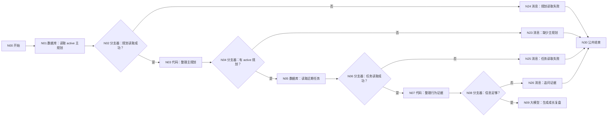
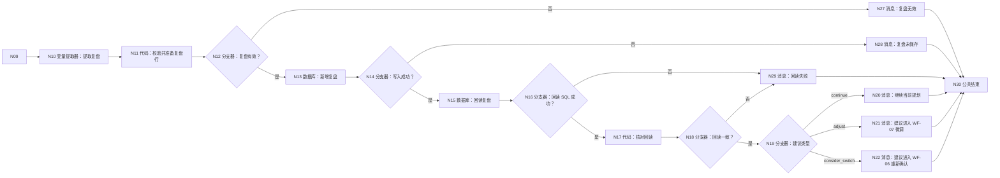

# WF-08 成长复盘与动态修正：逐节点搭建指南

> WF-08 只保存“复盘记录”和“建议变更草稿”，不直接修改主规划或学期任务。建议微调时由 WF-07 执行；建议切换主路径时由 WF-06 再次确认。这样不会出现复盘模型直接改正式数据的问题。

## 1. 数据表和输入

准备 DB-05 `main_plans`、DB-06 `semester_tasks`、[DB-07 growth_reviews](../database/import-templates/DB-07-growth-reviews.xlsx)。默认字段保留。

N00 开始：

| 变量 | 类型 | 必填 | 调试值 |
|---|---|---:|---|
| `AGENT_USER_INPUT` | String | 是 | `帮我复盘最近一个月的执行情况` |
| `uid` | String | 是 | `test_user_001` |
| `plan_id` | String | 是 | 当前 active 规划 ID |
| `request_time` | String | 是 | `2026-07-19 18:00:00` |

## 2. 分段流程图





所有消息连接 N30 结束。

## 3. N01～N04：读取主规划

N01 自定义 SQL，输入 `uid=N00/uid`、`plan_id=N00/plan_id`：

```sql
SELECT plan_id, plan_json, plan_status, record_version, updated_at
FROM main_plans
WHERE uid='{{uid}}' AND plan_id='{{plan_id}}' AND plan_status='active'
ORDER BY updated_at DESC LIMIT 1;
```

N02：`N01/isSuccess == true`；是 → N03，否 → N24。

N03 输入 outputList：

```python
def main(outputList):
    rows = outputList if isinstance(outputList, list) else []
    row = rows[0] if len(rows) > 0 and isinstance(rows[0], dict) else {}
    plan_text = str(row.get("plan_json", ""))
    return {"has_plan": len(row) > 0 and len(plan_text.strip()) > 2, "plan_json": plan_text if plan_text else "{}"}
```

输出 `has_plan:Boolean`、`plan_json:String`。N04：true → N05，false → N23。

## 4. N05～N08：读取并整理任务证据

N05 自定义 SQL，输入 uid、plan_id：

```sql
SELECT task_id, task, deadline, priority, status, expected_evidence,
       actual_evidence, delay_reason, action_log_json, updated_at
FROM semester_tasks
WHERE uid='{{uid}}' AND plan_id='{{plan_id}}'
ORDER BY updated_at DESC, create_time DESC
LIMIT 100;
```

N06：`N05/isSuccess == true`；是 → N07，否 → N25。

N07 输入 `outputList=N05/outputList`、`user_input=N00/AGENT_USER_INPUT`：

```python
def main(outputList, user_input):
    rows = outputList if isinstance(outputList, list) else []
    evidence_rows = []
    completed = 0
    postponed = 0
    with_evidence = 0
    for row in rows:
        if isinstance(row, dict):
            status = str(row.get("status", ""))
            if status == "completed": completed += 1
            if status == "postponed": postponed += 1
            if str(row.get("actual_evidence", "")).strip(): with_evidence += 1
            evidence_rows.append(row)
    enough = len(evidence_rows) > 0 or len(str(user_input).strip()) >= 20
    summary = "任务数=" + str(len(evidence_rows)) + ",完成=" + str(completed) + ",延期=" + str(postponed) + ",有证据=" + str(with_evidence)
    return {
        "evidence_enough": enough,
        "evidence_rows": evidence_rows,
        "evidence_summary_text": summary,
        "question_for_user": "请补充最近完成、延期或放弃了什么，以及可验证的成果。" if not enough else "",
    }
```

输出 `evidence_enough:Boolean`、`evidence_rows:Array<Object>`、`evidence_summary_text:String`、`question_for_user:String`。N08：true → N09，false → N26。

## 5. N09 大模型：生成成长复盘

模型 `Spark4.0 Ultra`，关闭对话历史。输入 `user_input=N00/AGENT_USER_INPUT`、`plan_json=N03/plan_json`、`evidence_rows=N07/evidence_rows`、`evidence_summary=N07/evidence_summary_text`。

系统提示词：

```text
你是大学成长复盘教练。必须区分用户自述、数据库行为证据和推断；不得把没完成简单归因于懒惰。输出事实、变化、有效策略、阻碍、证据缺口和下一周期动作。
recommendation_type 只能是 continue、adjust、consider_switch。continue 不生成正式变更；adjust 只给任务微调草稿；consider_switch 只说明切换影响并建议进入 WF-06，不能直接改主规划。
只输出 JSON：
{"review":{},"recommendation_type":"continue","pending_change":{},"evidence_summary":{},"reply":""}
```

用户提示词：

```text
用户复盘请求：{{user_input}}
当前主规划：{{plan_json}}
近期任务：{{evidence_rows}}
证据统计：{{evidence_summary}}
```

输出 `output:String`。

## 6. N10/N11/N12：提取、校验、准备写入

N10 输入 `input=N09/output`，输出：

| 变量 | 类型 | 描述 |
|---|---|---|
| `review_json` | String | 完整 review JSON 字符串 |
| `recommendation_type` | String | continue/adjust/consider_switch |
| `pending_change_json` | String | 完整建议变更 JSON；continue 时 `{}` |
| `evidence_summary_json` | String | 完整证据摘要 JSON |
| `reply` | String | 用户可读复盘摘要 |

N11 输入 `uid=N00/uid`、`plan_id=N00/plan_id`、`request_time=N00/request_time` 和 N10 全部：

```python
def main(uid, plan_id, request_time, review_json, recommendation_type, pending_change_json, evidence_summary_json, reply):
    allowed = ["continue", "adjust", "consider_switch"]
    review_text = str(review_json).strip()
    evidence_text = str(evidence_summary_json).strip()
    errors = []
    if not review_text.startswith("{") or not review_text.endswith("}"): errors.append("review_json 无效")
    if str(recommendation_type) not in allowed: errors.append("recommendation_type 无效")
    if not evidence_text.startswith("{") or not evidence_text.endswith("}"): errors.append("evidence_summary_json 无效")
    token = str(uid) + "-REVIEW-" + str(request_time) if str(recommendation_type) != "continue" else ""
    return {
        "review_valid": len(errors) == 0,
        "review_error": ";".join(errors),
        "review_id": str(uid) + "-REVIEW-" + str(request_time),
        "plan_id": str(plan_id),
        "review_json": review_text,
        "recommendation_type": str(recommendation_type),
        "pending_change_json": str(pending_change_json) if pending_change_json else "{}",
        "confirmation_token": token,
        "evidence_summary_json": evidence_text,
        "updated_at": str(request_time),
        "reply": str(reply),
    }
```

输出区声明 `review_valid:Boolean`，以及 `review_error/review_id/plan_id/review_json/recommendation_type/pending_change_json/confirmation_token/evidence_summary_json/updated_at/reply:String`。N12：true → N13，false → N27。

## 7. N13/N14：新增复盘记录

N13 表单新增 `growth_reviews`：映射 N11 的 `review_id/plan_id/review_json/recommendation_type/pending_change_json/confirmation_token/evidence_summary_json/updated_at`；页面强制 uid 时引用 N00/uid。

N14：`N13/isSuccess == true`；是 → N15，否 → N28。

## 8. N15～N19：回读并按建议类型分流

N15 自定义 SQL，输入 uid、review_id：

```sql
SELECT review_id, review_json, recommendation_type, pending_change_json,
       confirmation_token, evidence_summary_json, updated_at
FROM growth_reviews
WHERE uid='{{uid}}' AND review_id='{{review_id}}'
ORDER BY updated_at DESC LIMIT 1;
```

`review_id` 引用 N11/review_id。N16：`N15/isSuccess == true`；是 → N17，否 → N29。

N17 输入 `expected=N11/review_json`、`outputList=N15/outputList`：

```python
def main(expected, outputList):
    rows = outputList if isinstance(outputList, list) else []
    row = rows[0] if len(rows) > 0 and isinstance(rows[0], dict) else {}
    stored = str(row.get("review_json", ""))
    return {"readback_matches": len(stored.strip()) > 2 and stored.strip() == str(expected).strip(), "stored_review_json": stored}
```

输出 `readback_matches:Boolean`、`stored_review_json:String`。N18：true → N19，false → N29。

N19 为 `N11/recommendation_type` 添加三条固定值分支：continue→N20、adjust→N21、consider_switch→N22；默认→N27。

## 9. 消息节点和结束

| 节点 | 输入和回答内容 |
|---|---|
| N20 | `reply=N11/reply`、`review=N17/stored_review_json`；`{{reply}}\n{{review}}\n建议：继续当前主规划，按复盘点再检查。` |
| N21 | 再输入 `change=N11/pending_change_json`、`token=N11/confirmation_token`；说明“这是任务微调草稿，未修改任务；确认后进入 WF-07”，展示 token |
| N22 | 同上；说明“这是路径切换建议，未修改主规划；确认后进入 WF-06” |
| N23 | `没有找到指定 active 主规划，请先在 WF-06 确认主规划。` |
| N24 | 引用 N01/message：主规划读取失败 |
| N25 | 引用 N05/message：任务证据读取失败 |
| N26 | 引用 N07/question_for_user：信息不足追问 |
| N27 | 引用 N11/review_error：复盘结构无效，未保存 |
| N28 | 引用 N13/message：复盘生成但写入失败 |
| N29 | 引用 N15/message：写入后回读不一致，不能说已保存 |

所有消息连接 N30。N30：`output｜输入｜workflow_finished`；回答内容“本轮处理已结束，请以上方消息节点的提示为准。”；流式关闭。

## 10. 调试指南

1. 有 active 规划和任务：应写 DB-07 并回读。
2. 无任务但用户提供详细事实：N07 可以判定信息足够；证据必须标为用户自述。
3. 无任务且输入过短：到 N26，不调用模型。
4. continue：不产生需要执行的正式变更。
5. adjust：只展示 pending_change 和 token，不直接改 DB-06。
6. consider_switch：只引导 WF-06，不直接改 DB-05。
7. 写入/回读失败：到 N28/N29，不说已保存。

## 11. 验收清单

- [ ] 复盘、证据和推断明确区分。
- [ ] 本工作流只写 growth_reviews，不直接改主规划/任务。
- [ ] 写入后回读一致才进入 N19。
- [ ] 三种 recommendation_type 都有明确终点。
- [ ] 所有代码无 import、输出声明完整。
