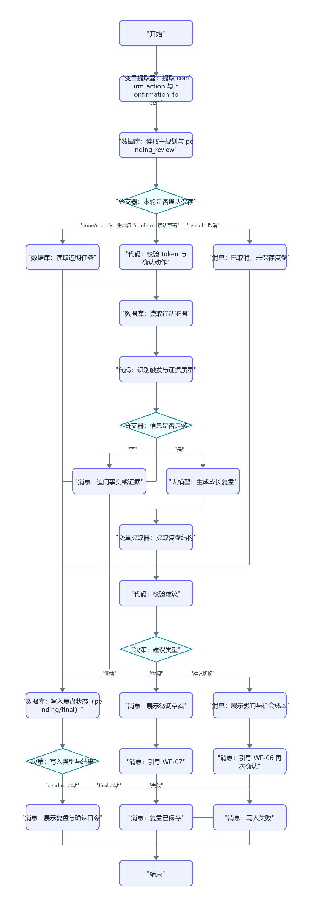
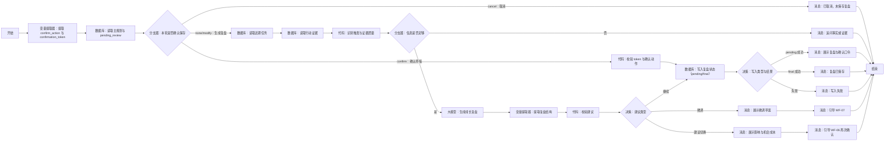

# WF-08 成长复盘与动态修正搭建指南

## 1. 目标与调用时机

当成绩/排名显著变化、新增重要经历、连续任务未完成、预算或地域变化、用户修改目标或完成七天试错时调用。读取主规划、近期任务和行动证据，给出继续、微调或建议切换；不得直接覆盖主规划。输出 `growth_review_json`。

## 2. 搭建前准备

输入：`AGENT_USER_INPUT`,`user_id`,`session_id`,`main_plan_json`，可选 `semester_tasks_json`,`action_records_json`,`new_evidence_json`,`trigger_reason`,`confirm_action`,`confirmation_token`。准备只读的主规划、任务、行动记录，以及可存 pending 和正式记录的“成长复盘”实体。任何技能点亮必须绑定证据。具体数据库字段以当前编辑器显示为准；降级为长期记忆检索/写入时，使用 `user_id + growth_review + 时间` 保存复盘，不覆盖 `main_plan`。

## 3. 最小可运行版

```text
开始 → 大模型（生成成长复盘草案）→ 结束
```

拖入一个“大模型”，映射主规划、用户输入和行动记录，连接结束。输出只能是 `status=draft`；没有实际证据时必须标为待验证。

## 4. 完整业务版画布





```text
开始 → 变量提取器（提取确认动作与 token）→ 数据库（读取主规划与 pending_review）→ 分支器（本轮是否确认保存）
 ├─ 生成复盘 → 数据库（读取近期任务）→ 数据库（读取行动证据）
 → 代码（识别触发与证据质量）→ 分支器（信息是否足够）
 ├─ 否 → 消息（追问事实或证据）→ 结束
 └─ 是 → 大模型（生成成长复盘）→ 变量提取器（提取复盘结构）→ 代码（校验建议）
       → 决策（建议类型）
       ├─ 继续 → 数据库（保存 pending_review + token）→ 消息（展示复盘与口令）→ 结束
       ├─ 微调 → 消息（展示微调草案）→ 消息（引导 WF-07）→ 结束
       └─ 建议切换 → 消息（展示影响与机会成本）→ 消息（引导 WF-06 再次确认）→ 结束
 └─ 确认草稿 → 代码（校验 token 与 confirm_action）→ 数据库（写入复盘状态，final 模式）→ 写入类型与结果 → 成功/失败消息 → 结束
```

拖入 4 个“数据库”（合并读取主规划与 pending、读取近期任务、读取行动证据、写入复盘状态）、3 个“代码”（识别证据、校验建议、校验 token）、2 个“分支器”、2 个“决策”（建议类型、写入类型与结果）、1 个“大模型”、2 个“变量提取器”、9 个“消息”和 1 个共享“结束”，按图连接。“写入复盘状态”按输入 `write_mode=pending/final` 复用：pending 保存草稿和 token，final 写正式复盘。第一个数据库节点按 `user_id` 查询主规划，并按 token 可选查询 pending；不支持一次返回两类记录时改用“长期记忆检索”读取 pending，仍保持 4 个数据库。

## 5. 节点配置与变量映射

| 节点 | 查询/输入 | 输出 |
|---|---|---|
| 读取近期任务 | `user_id` + `plan_id` + 最近周期 | `semester_tasks_json` |
| 读取行动证据 | `user_id` + 最近周期 | `action_records_json` |
| 识别触发与证据质量 | 用户输入及三份数据 | `trigger_reason,facts,evidence,assumptions,info_sufficient` |
| 生成成长复盘 | 上述结构化值 | JSON 文本 |
| 提取复盘结构 | 模型文本 | `growth_review_json` |
| 校验建议 | 复盘 JSON | `review_valid,review_error,recommendation_type,next_workflow` |
| 建议类型 | `recommendation_type` | `continue` / `fine_tune` / `consider_switch` |
| 写入复盘状态 | `write_mode`,`growth_review_json`,`confirmation_token` | pending 模式保存草稿；final 模式只写成长复盘记录；输出 `review_write_ok` |
| 读取主规划与 pending_review | `user_id`，可选 `confirmation_token` | `main_plan_json`,`pending_review_json`；pending 含过期时间 |
| 校验 token 与确认动作 | 本轮 `confirm_action`、token、pending | 三者匹配且未过期才 `confirmation_valid=true` |

事实、推断和证据必须分开：`facts` 只放用户明确陈述或数据库事实；`evidence` 记录证据类型与位置；模型解释放 `assumptions` 并标“待验证”。校验必须拒绝 `consider_switch` 缺少 `impact_on_main_plan,opportunity_cost,alternatives,confirmation_required` 的结果。

## 6. 可复制完整提示词

```text
你是审慎、非惩罚性的大学成长教练。依据当前主规划、近期任务和行为证据做阶段复盘。先陈述发生变化的事实，再解释影响；不能把推断写成事实，不能因一次未完成就建议切换，也不能直接覆盖主规划。

main_plan_json={{main_plan_json}}
semester_tasks_json={{semester_tasks_json}}
action_records_json={{action_records_json}}
trigger_reason={{trigger_reason}}
facts={{facts}}
evidence={{evidence}}
assumptions={{assumptions}}

只输出 JSON：
{"review_period":"","trigger_reason":"","changed_facts":[],"evidence_assessment":[{"claim":"","evidence_type":"用户陈述/行为已验证/待验证推断","evidence":""}],"progress":{"completed":[],"unfinished":[],"patterns":[]},"impact_on_main_plan":[],"recommendation_type":"continue/fine_tune/consider_switch","recommendation_reasons":[],"suggested_changes":[],"opportunity_cost":[],"alternatives":[],"skills_and_achievements":[{"item":"","evidence":"","eligible":false}],"confirmation_required":false,"next_workflow":"none/WF-07/WF-06","limitations":[],"supportive_reply":""}

判定：基本假设仍成立且进展合理用 continue；执行层时间、优先级或任务粒度需变用 fine_tune；目标、约束或关键证据发生结构性变化才用 consider_switch。建议切换时 confirmation_required=true、next_workflow=WF-06。技能或徽章没有行为/成果证据时 eligible=false。不排行榜、不惩罚、不制造焦虑。
```

## 7. 确认、写入和失败处理

生成复盘无需确认；要保存时，第一次调用只保存 `pending_review_json + confirmation_token` 并结束，返回 `awaiting_confirmation`。下一次调用读取 pending，只有 token、`user_id`、未过期状态一致且 `confirm_action=confirm` 才写复盘；cancel 删除/失效 pending，modify 生成新 token。微调只交 WF-07，建议切换只交 WF-06，并明确主规划未改变。写入失败返回 `write_failed` 和复盘草案，不得称已保存。

## 8. 调试用例

- 继续：近四周核心任务大多完成且有项目链接。预期 `continue`，可点亮项目相关技能但必须附证据。
- 微调：连续两周因课程冲突延期，目标未变。预期 `fine_tune`、`next_workflow=WF-07`，给出缩小任务或改期方案。
- 建议切换：预算显著下降且用户明确不再留学。预期说明事实、影响、机会成本和备选，`next_workflow=WF-06`，不覆盖主规划。
- 缺失：用户只说“我不行了，重做规划”。预期先追问具体变化，不直接切换。
- 写入失败：保存复盘失败。预期保留草案并返回 `write_failed`。

## 9. 常见错误与验收清单

- 把模型判断写成事实：检查 `evidence_type`，无证据一律“待验证推断”。
- 微调越界：目标路径变化必须去 WF-06；普通任务修改去 WF-07。
- 复盘覆盖主规划：数据库写入目标只能是成长复盘实体。

- [ ] 六类触发均能表示，缺信息时追问。
- [ ] 输出明确变化事实、影响、继续/微调/切换建议和机会成本。
- [ ] 技能与成就绑定证据，无惩罚性表达。
- [ ] 任何覆盖动作都返回 WF-06 再次确认，历史版本由 WF-06 保留。
- [ ] 写入失败不得声称成功；输出 `growth_review_json` 可供主 Agent 和 WF-12 使用。
