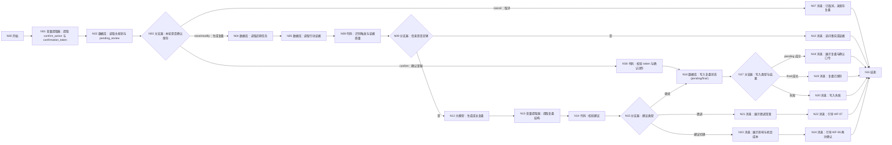

# WF-08 成长复盘与动态修正搭建指南

## 1. 目标与调用时机

当成绩/排名显著变化、新增重要经历、连续任务未完成、预算或地域变化、用户修改目标或完成七天试错时调用。读取主规划、近期任务和行动证据，给出继续、微调或建议切换；不得直接覆盖主规划。输出 `growth_review_json`。

## 2. 搭建前准备

输入：`AGENT_USER_INPUT`,`uid`,`session_id`,`main_plan_json`，可选 `semester_tasks_json`,`action_records_json`,`new_evidence_json`,`trigger_reason`,`confirm_action`,`confirmation_token`。准备只读的主规划、任务、行动记录，以及可存 pending 和正式记录的“成长复盘”实体。任何技能点亮必须绑定证据。具体数据库字段按本文件逐栏配置；降级为长期记忆检索/写入时，使用 `uid + growth_review + 时间` 保存复盘，不覆盖 `main_plan`。

## 3. 最小可运行版

```text
开始 → 大模型（生成成长复盘草案）→ 结束
```

拖入一个“大模型”，映射主规划、用户输入和行动记录，连接结束。输出只能是 `status=draft`；没有实际证据时必须标为待验证。

## 4. 完整业务版画布




```text
开始 → 变量提取器（提取确认动作与 token）→ 数据库（读取主规划与 pending_review）→ 分支器（本轮是否确认保存）
 ├─ 生成复盘 → 数据库（读取近期任务）→ 数据库（读取行动证据）
 → 代码（识别触发与证据质量）→ 分支器（信息是否足够）
 ├─ 否 → 消息（追问事实或证据）→ 结束
 └─ 是 → 大模型（生成成长复盘）→ 变量提取器（提取复盘结构）→ 代码（校验建议）
       → 分支器（建议类型）
       ├─ 继续 → 数据库（保存 pending_review + token）→ 消息（展示复盘与口令）→ 结束
       ├─ 微调 → 消息（展示微调草案）→ 消息（引导 WF-07）→ 结束
       └─ 建议切换 → 消息（展示影响与机会成本）→ 消息（引导 WF-06 再次确认）→ 结束
 └─ 确认草稿 → 代码（校验 token 与 confirm_action）→ 数据库（写入复盘状态，final 模式）→ 写入类型与结果 → 成功/失败消息 → 结束
```

拖入 4 个“数据库”（合并读取主规划与 pending、读取近期任务、读取行动证据、写入复盘状态）、3 个“代码”（识别证据、校验建议、校验 token）、4 个“分支器”、1 个“大模型”、2 个“变量提取器”、9 个“消息”和 1 个共享“结束”，按图连接。“写入复盘状态”按输入 `write_mode=pending/final` 复用：pending 保存草稿和 token，final 写正式复盘。第一个数据库节点按 `uid` 查询主规划，并按 token 可选查询 pending；不支持一次返回两类记录时改用“长期记忆检索”读取 pending，仍保持 4 个数据库。

## 5. 节点配置与变量映射

| 节点 | 查询/输入 | 输出 |
|---|---|---|
| 读取近期任务 | `uid` + `plan_id` + 最近周期 | `semester_tasks_json` |
| 读取行动证据 | `uid` + 最近周期 | `action_records_json` |
| 识别触发与证据质量 | 用户输入及三份数据 | `trigger_reason,facts,evidence,assumptions,info_sufficient` |
| 生成成长复盘 | 上述结构化值 | JSON 文本 |
| 提取复盘结构 | 模型文本 | `growth_review_json` |
| 校验建议 | 复盘 JSON | `review_valid,review_error,recommendation_type,next_workflow` |
| 建议类型 | `recommendation_type` | `continue` / `fine_tune` / `consider_switch` |
| 写入复盘状态 | `write_mode`,`growth_review_json`,`confirmation_token` | pending 模式保存草稿；final 模式只写成长复盘记录；输出 `review_write_ok` |
| 读取主规划与 pending_review | `uid`，可选 `confirmation_token` | `main_plan_json`,`pending_review_json`；pending 含过期时间 |
| 校验 token 与确认动作 | 本轮 `confirm_action`、token、pending | 三者匹配且未过期才 `confirmation_valid=true` |

事实、推断和证据必须分开：`facts` 只放用户明确陈述或数据库事实；`evidence` 记录证据类型与位置；模型解释放 `assumptions` 并标“待验证”。校验必须拒绝 `consider_switch` 缺少 `impact_on_main_plan,opportunity_cost,alternatives,confirmation_required` 的结果。

### 三个代码节点：页面输入、Python 与输出

N06 输入 `pending_review_json`、`confirm_action`、`confirmation_token`、`uid`；输出 `confirmation_valid:Boolean`、`confirmation_error:String`：

```python
import json

def main(pending_review_json, confirm_action, confirmation_token, uid):
    try:
        pending = json.loads(pending_review_json) if isinstance(pending_review_json, str) else (pending_review_json or {})
        valid = confirm_action == "confirm" and bool(confirmation_token) and pending.get("confirmation_token") == confirmation_token and pending.get("uid") == uid and pending.get("status") == "pending"
        return {"confirmation_valid": valid, "confirmation_error": "" if valid else "确认动作、用户、token 或 pending 状态不匹配"}
    except Exception as exc:
        return {"confirmation_valid": False, "confirmation_error": str(exc)}
```

N08 输入 `AGENT_USER_INPUT`、`main_plan_json`、`semester_tasks_json`、`action_records_json`、`new_evidence_json`、`trigger_reason`；输出 `facts:Array<String>`、`evidence:Array<Object>`、`assumptions:Array<String>`、`info_sufficient:Boolean`：

```python
import json

def main(AGENT_USER_INPUT, main_plan_json, semester_tasks_json, action_records_json, new_evidence_json, trigger_reason):
    def obj(value):
        return json.loads(value) if isinstance(value, str) and value.strip() else (value or {})
    try:
        plan, tasks, actions, new_evidence = map(obj, (main_plan_json, semester_tasks_json, action_records_json, new_evidence_json))
        facts = [AGENT_USER_INPUT] if AGENT_USER_INPUT else []
        evidence = [{"source": "tasks", "value": tasks}, {"source": "actions", "value": actions}, {"source": "new_evidence", "value": new_evidence}]
        sufficient = bool(plan) and bool(trigger_reason or facts) and any(bool(item["value"]) for item in evidence)
        return {"facts": facts, "evidence": evidence, "assumptions": [], "info_sufficient": sufficient}
    except Exception:
        return {"facts": [], "evidence": [], "assumptions": [], "info_sufficient": False}
```

N14 输入 `growth_review_json`；输出 `review_valid:Boolean`、`review_error:String`、`recommendation_type:String`、`next_workflow:String`：

```python
import json

def main(growth_review_json):
    try:
        review = json.loads(growth_review_json) if isinstance(growth_review_json, str) else (growth_review_json or {})
        kind = review.get("recommendation_type", "")
        valid = kind in ("continue", "fine_tune", "consider_switch")
        if kind == "consider_switch":
            valid = valid and all(review.get(key) not in (None, "", []) for key in ("impact_on_main_plan", "opportunity_cost", "alternatives")) and review.get("confirmation_required") is True
        next_workflow = {"continue": "none", "fine_tune": "WF-07", "consider_switch": "WF-06"}.get(kind, "none")
        return {"review_valid": valid, "review_error": "" if valid else "建议类型或切换必填信息无效", "recommendation_type": kind, "next_workflow": next_workflow}
    except Exception as exc:
        return {"review_valid": False, "review_error": str(exc), "recommendation_type": "", "next_workflow": "none"}
```

## 6. 可复制完整提示词

```text
你是审慎、非惩罚性的大学成长教练。依据当前主规划、近期任务和行为证据做阶段复盘。先陈述发生变化的事实，再解释影响；不能把推断写成事实，不能因一次未完成就建议切换，也不能直接覆盖主规划。

main_plan_json={{main_plan_json}}
semester_tasks_json={{semester_tasks_json}}
action_records_json={{action_records_json}}
trigger_reason={{trigger_reason}}
facts={{facts}}
evidence={{evidence}}
assumptions={{assumptions}}

只输出 JSON：
{"review_period":"","trigger_reason":"","changed_facts":[],"evidence_assessment":[{"claim":"","evidence_type":"用户陈述/行为已验证/待验证推断","evidence":""}],"progress":{"completed":[],"unfinished":[],"patterns":[]},"impact_on_main_plan":[],"recommendation_type":"continue/fine_tune/consider_switch","recommendation_reasons":[],"suggested_changes":[],"opportunity_cost":[],"alternatives":[],"skills_and_achievements":[{"item":"","evidence":"","eligible":false}],"confirmation_required":false,"next_workflow":"none/WF-07/WF-06","limitations":[],"supportive_reply":""}

判定：基本假设仍成立且进展合理用 continue；执行层时间、优先级或任务粒度需变用 fine_tune；目标、约束或关键证据发生结构性变化才用 consider_switch。建议切换时 confirmation_required=true、next_workflow=WF-06。技能或徽章没有行为/成果证据时 eligible=false。不排行榜、不惩罚、不制造焦虑。
```

## 7. 确认、写入和失败处理

生成复盘无需确认；要保存时，第一次调用只保存 `pending_review_json + confirmation_token` 并结束，返回 `awaiting_confirmation`。下一次调用读取 pending，只有 token、`uid`、未过期状态一致且 `confirm_action=confirm` 才写复盘；cancel 删除/失效 pending，modify 生成新 token。微调只交 WF-07，建议切换只交 WF-06，并明确主规划未改变。写入失败返回 `write_failed` 和复盘草案，不得称已保存。

## 8. 调试用例

- 继续：近四周核心任务大多完成且有项目链接。预期 `continue`，可点亮项目相关技能但必须附证据。
- 微调：连续两周因课程冲突延期，目标未变。预期 `fine_tune`、`next_workflow=WF-07`，给出缩小任务或改期方案。
- 建议切换：预算显著下降且用户明确不再留学。预期说明事实、影响、机会成本和备选，`next_workflow=WF-06`，不覆盖主规划。
- 缺失：用户只说“我不行了，重做规划”。预期先追问具体变化，不直接切换。
- 写入失败：保存复盘失败。预期保留草案并返回 `write_failed`。

## 9. 常见错误与验收清单

- 把模型判断写成事实：检查 `evidence_type`，无证据一律“待验证推断”。
- 微调越界：目标路径变化必须去 WF-06；普通任务修改去 WF-07。
- 复盘覆盖主规划：数据库写入目标只能是成长复盘实体。

- [ ] 六类触发均能表示，缺信息时追问。
- [ ] 输出明确变化事实、影响、继续/微调/切换建议和机会成本。
- [ ] 技能与成就绑定证据，无惩罚性表达。
- [ ] 任何覆盖动作都返回 WF-06 再次确认，历史版本由 WF-06 保留。
- [ ] 写入失败不得声称成功；输出 `growth_review_json` 可供主 Agent 和 WF-12 使用。

## 节点逐项配置

<!-- GENERATED-NODE-LEDGER:START -->
### 画布节点连线与页面输入输出总表

本表由流程图生成，用于防止漏连。‘直接上游’决定页面引用下拉框中可选的数据来源；具体变量名以本文件后续业务映射表为准。
开始节点类型规则：`uid/session_id/AGENT_USER_INPUT` 及所有 `*_json/*_token/*_id` 均选 String；计数、天数选 Integer；真伪开关选 Boolean。表中未特别标注的输入一律选 String，JSON 作为字符串传递。

| 节点 | 类型 | 直接上游（输入来源） | 固定/声明输出 | 直接下游 |
|---|---|---|---|---|
| `A` N00 开始 | 开始 | 无（起点） | 开始节点中声明的同名变量 | A1 |
| `A1` N01 变量提取器：提取 confirm_action 与 confirmation_token | 变量提取器 | A | `confirm_action:String`（none/modify/confirm/cancel）、`confirmation_token:String` | A2 |
| `A2` N02 数据库：读取主规划与 pending_review | 数据库 | A1 | `isSuccess:Boolean`、`message:String`、`outputList:Array<Object>` | A3 |
| `A3` N03 分支器：本轮是否确认保存 | 分支器 | A2 | 不产生业务变量；按条件输出连线 | C（"none/modify：生成复盘"）、X（"confirm：确认草稿"）、XC（"cancel：取消"） |
| `C` N04 数据库：读取近期任务 | 数据库 | A3 | `isSuccess:Boolean`、`message:String`、`outputList:Array<Object>` | D |
| `D` N05 数据库：读取行动证据 | 数据库 | C | `isSuccess:Boolean`、`message:String`、`outputList:Array<Object>` | E |
| `X` N06 代码：校验 token 与确认动作 | 代码 | A3 | 与 Python `main()` 返回 dict 的键完全一致 | W |
| `W` N16 数据库：写入复盘状态（pending/final） | 数据库 | X、K | `isSuccess:Boolean`、`message:String`、`outputList:Array<Object>` | Y |
| `XC` N07 消息：已取消，未保存复盘 | 消息 | A3 | 不新增业务变量；回答内容引用上游变量 | Z |
| `Z` N11 结束 | 结束 | XC、G、M、R、Q、T、V | `output` 引用上游最终结果 | 无；必须在正文说明为何终止或转入下一张图 |
| `E` N08 代码：识别触发与证据质量 | 代码 | D | 与 Python `main()` 返回 dict 的键完全一致 | F |
| `F` N09 分支器：信息是否足够 | 分支器 | E | 不产生业务变量；按条件输出连线 | G（"否"）、H（"是"） |
| `G` N10 消息：追问事实或证据 | 消息 | F | 不新增业务变量；回答内容引用上游变量 | Z |
| `H` N12 大模型：生成成长复盘 | 大模型 | F | `output:String` | I |
| `I` N13 变量提取器：提取复盘结构 | 变量提取器 | H | `growth_review_json:String`（完整成长复盘 JSON） | J |
| `J` N14 代码：校验建议 | 代码 | I | 与 Python `main()` 返回 dict 的键完全一致 | K |
| `K` N15 分支器：建议类型 | 分支器 | J | 不产生业务变量；按条件输出连线 | W（"继续"）、S（"微调"）、U（"建议切换"） |
| `Y` N17 分支器：写入类型与结果 | 分支器 | W | 不产生业务变量；按条件输出连线 | M（"pending 成功"）、R（"final 成功"）、Q（"失败"） |
| `M` N18 消息：展示复盘与确认口令 | 消息 | Y | 不新增业务变量；回答内容引用上游变量 | Z |
| `R` N19 消息：复盘已保存 | 消息 | Y | 不新增业务变量；回答内容引用上游变量 | Z |
| `Q` N20 消息：写入失败 | 消息 | Y | 不新增业务变量；回答内容引用上游变量 | Z |
| `S` N21 消息：展示微调草案 | 消息 | K | 不新增业务变量；回答内容引用上游变量 | T |
| `T` N22 消息：引导 WF-07 | 消息 | S | 不新增业务变量；回答内容引用上游变量 | Z |
| `U` N23 消息：展示影响与机会成本 | 消息 | K | 不新增业务变量；回答内容引用上游变量 | V |
| `V` N24 消息：引导 WF-06 再次确认 | 消息 | U | 不新增业务变量；回答内容引用上游变量 | Z |
<!-- GENERATED-NODE-LEDGER:END -->

> 本节必须与[平台 UI 配置契约](PLATFORM-UI-CONTRACT.md)一起使用。先按流程图编号拖入节点并连线，再配置节点；未连线时下游“引用”下拉框会显示暂无数据。

### 本工作流所有节点的页面填写顺序

1. **开始**：按下方开始输入表逐行“+ 添加”，变量名、类型和必填状态照表填写。
2. **自定义 SQL 数据库**：输入参数选择引用；读取结果只使用固定输出 `isSuccess:Boolean`、`message:String`、`outputList:Array<Object>`。
3. **表单新增/更新数据库**：选择 `university / 目标表`；新增在“设置新增数据”逐字段添加，更新先在“设置数据范围”配置 AND 条件，再在“设置更新数据”逐字段添加；固定输出仍为 `isSuccess/message/outputList`。
4. **大模型**：输入参数名与 `{{变量名}}` 完全一致；系统提示词放角色、规则和 JSON 结构，用户提示词只放本轮变量；输出 `output:String`。
5. **变量提取器**：输入固定为 `input｜引用｜上游大模型/output`；每个输出必须填写变量名、类型和提取描述，复杂 JSON 先用 String。
6. **代码**：仅使用 Python `def main(...): return {...}`；输入名与形参一致，输出区声明每个返回键及类型。
7. **分支器**：左侧选上游变量，条件选“等于”等操作；与字面量比较时比较类型选常量/固定值；每条分支和默认分支都必须连接。
8. **消息**：输入区引用需要展示的变量，在“回答内容”用 `{{变量名}}`；流式输出关闭；消息后连接共享结束。
9. **结束**：回答模式选“返回设定格式配置的回答”，输出设置 `output｜引用｜上游最终结果`。所有成功、失败、待补充消息都进入同一个结束节点。

本节的通用点击位置、建表入口、导入按钮和数据库节点输出解释见[数据库从零教程](../database/README.md)；请先完成该教程，再按本节配置当前 WF。

### 准备和输入

WF-08 读取 `main_plans`、`semester_tasks`、`resume_entries`、`habit_logs`，写 `growth_reviews`。请上传 [DB-05](../database/import-templates/DB-05-main-plans.xlsx)、[DB-06](../database/import-templates/DB-06-semester-tasks.xlsx)、[DB-07](../database/import-templates/DB-07-growth-reviews.xlsx)、[DB-08](../database/import-templates/DB-08-resume-entries.xlsx)、[DB-10](../database/import-templates/DB-10-habit-logs.xlsx)。

开始节点点击“+ 添加”，按下表逐行配置：

| 输入 | 来源 | 示例/是否必填 |
|---|---|---|
| `AGENT_USER_INPUT` | 开始节点 | “最近两周任务都没完成，帮我复盘”；必填 |
| `uid` | 主 Agent | `test_user_001`；必填 |
| `session_id` | 主 Agent/会话上下文 | `SESSION-TEST-001`；必填 |
| `main_plan_json` | WF-06/当前规划查询 | active 主规划；必填 |
| `semester_tasks_json` | WF-07/任务查询 | 可选 |
| `action_records_json` | 行动记录查询 | 可选 |
| `new_evidence_json` | 用户本轮提供 | 可选 |
| `trigger_reason` | 总流程/变量提取器 | 可选，不提供则从用户原话提取 |
| `confirm_action` | 总流程/变量提取器 | `none/modify/confirm/cancel` |
| `confirmation_token` | 首轮 pending 输出 | 确认轮原样传回 |

四个读取节点都必须带 `uid`。主规划取 active 1 条；任务取近期记录；履历和习惯允许空数组。任何 `isSuccess=false` 停止；非核心证据表为空只表示没有相关证据。

保存复盘到 `growth_reviews`，字段为 `review_id,plan_id,review_json,recommendation_type,pending_change_json,confirmation_token,evidence_summary_json,updated_at`。如果建议覆盖主规划，只保存 pending change 并返回 WF-06，不能直接更新 DB-05。

| 节点 | 输入 | 输出 |
|---|---|---|
| 多表读取 | `uid,plan_id` | 各自 `outputList` |
| 证据汇总 | 任务/履历/习惯记录 | `evidence_summary_json` |
| 复盘大模型 | 主规划、证据、用户输入 | `growth_review_json` |
| 保存复盘 | uid、review_id、校验 JSON | `isSuccess` |
| 结束 | `result_json` | `output` |

调试正常证据、全部可选证据为空、任务读取失败、建议切换四种情况；建议切换时确认 DB-07 有 pending change，而 DB-05 未被直接覆盖。
