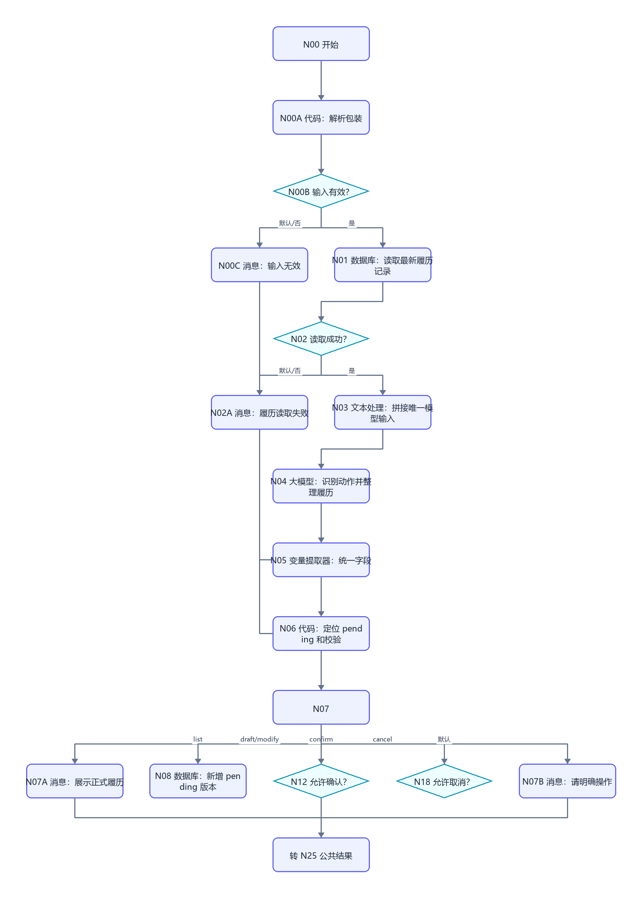
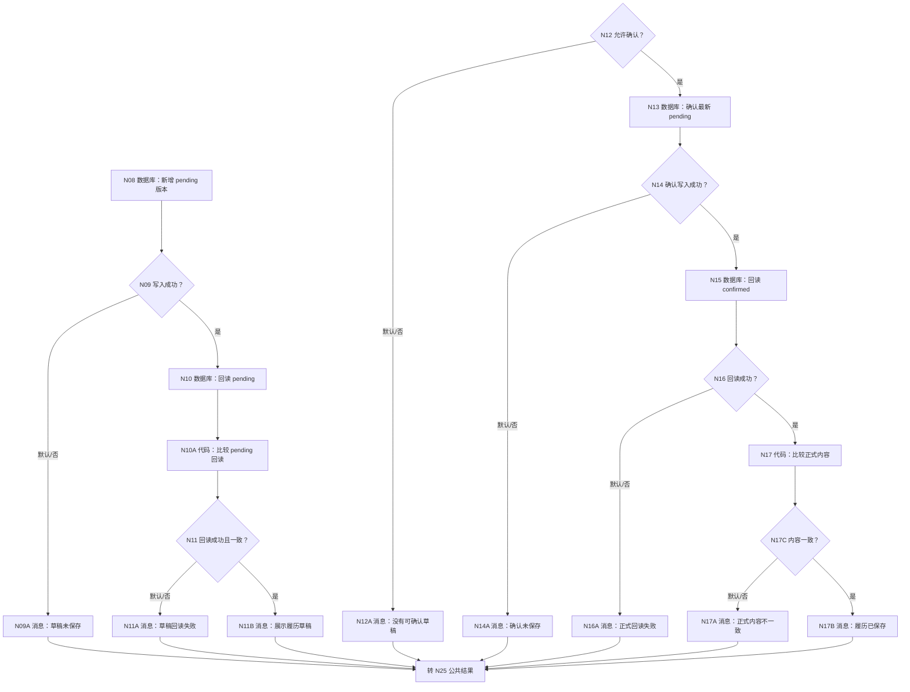
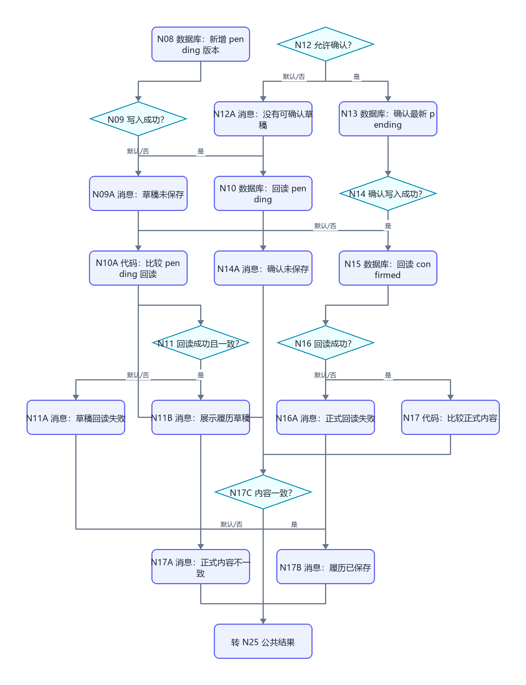
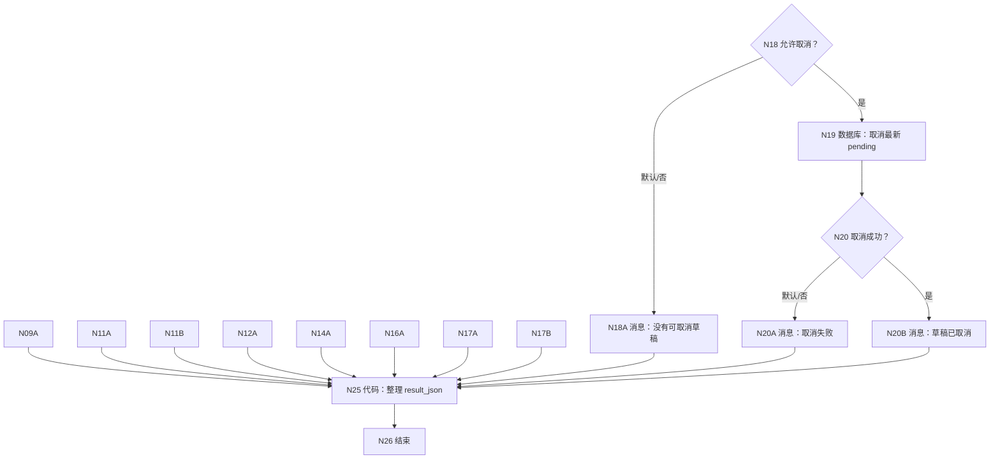
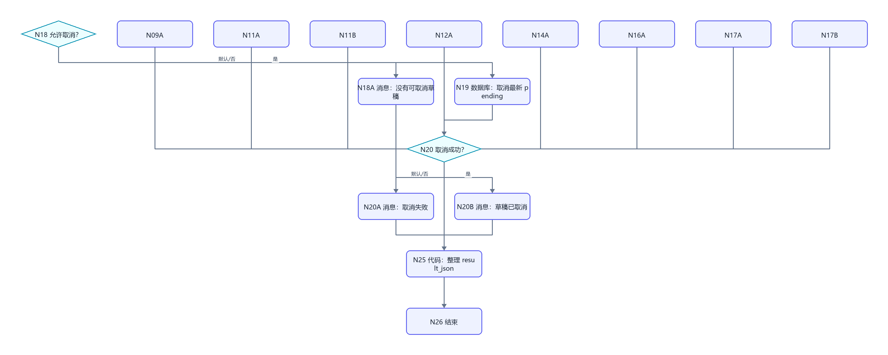

# WF-08 履历证据：逐节点搭建指南

<!-- AGENT-CONTRACT
start_inputs: AGENT_USER_INPUT:String
extractor_input_count: 1
result_output: result_json:String
-->

> 本工作流是旧 WF-09 的单参数、内部确认版。用户只描述真实经历、修改意见或“确认保存这条履历”；工作流按最新 pending 和明确对象定位，不要求用户保管任何内部标识。

## 1. 可信履历规则

- 只整理用户明确陈述的真实经历，不能把 WF-02/WF-03 模拟选择写入履历。
- 量化数字、奖项、排名、影响人数、技术指标必须来自用户输入或已有 pending；不得补写。
- 没有证据位置不禁止形成草稿，但 quality_status 必须是 `缺证明` 或 `需打磨`。
- 保存前始终需要下一轮明确确认；含糊表达不确认。
- 修改产生新的 pending 版本；confirmed 历史不覆盖。

## 2. 画布

```mermaid
flowchart TD
    N00["N00 开始"] --> N00A["N00A 代码：解析包装"]
    N00A --> N00B{"N00B 输入有效？"}
    N00B -->|默认/否| N00C["N00C 消息：输入无效"]
    N00B -->|是| N01["N01 数据库：读取最新履历记录"]
    N01 --> N02{"N02 读取成功？"}
    N02 -->|默认/否| N02A["N02A 消息：履历读取失败"]
    N02 -->|是| N03["N03 文本处理：拼接唯一模型输入"]
    N03 --> N04["N04 大模型：识别动作并整理履历"]
    N04 --> N05["N05 变量提取器：统一字段"]
    N05 --> N06["N06 代码：定位 pending 和校验"]
    N06 --> N07{"N07 requested_action"]
    N07 -->|list| N07A["N07A 消息：展示正式履历"]
    N07 -->|draft/modify| N08["N08 数据库：新增 pending 版本"]
    N07 -->|confirm| N12{"N12 允许确认？"}
    N07 -->|cancel| N18{"N18 允许取消？"}
    N07 -->|默认| N07B["N07B 消息：请明确操作"]
    N00C --> R["转 N25 公共结果"]
    N02A --> R
    N07A --> R
    N07B --> R
```











## 3. N00～N06：入口、读取和模型

N00 只有 `AGENT_USER_INPUT:String`；N00A 使用 WF-02 第 5.2 节解析代码。

N01 输入 `user_key=N00A/user_key`：

```sql
SELECT id, user_key, entry_id, entry_type, resume_entry_json,
       pending_entry_json, quality_status, evidence_location,
       record_status, record_version, create_time
FROM resume_entries
WHERE user_key='{{user_key}}'
ORDER BY record_version DESC, create_time DESC
LIMIT 30;
```

N02 只检查 isSuccess；成功空数组代表首次建履历。

N03 文本处理拼接 N01/outputList 和 N00A/user_input。N04 系统提示：

```text
你是严格的履历证据编辑器。识别 requested_action：list_entries、draft_entry、modify_entry、confirm_entry、cancel_entry、needs_input。
draft/modify 只整理用户明确说出的真实经历；不得把模拟内容当真实经历，不得创造数字、奖项、排名、技术指标或证明材料。
resume_entry_json 必须包含背景、行动、结果、证据、待补项，并区分 confirmed_fact 与 missing_fact。
quality_status 只能是 可用、缺量化、缺证明、需打磨。confirm/cancel 不重新生成内容。
只输出 JSON：
{"requested_action":"needs_input","confirmation_explicit":false,"entry_id":"","entry_type":"","resume_entry_json":"{}","quality_status":"需打磨","evidence_location":"","display_reply":"","structure_complete":true}
```

用户提示只引用 N03/output。

N05 变量提取器固定 input 只引用 N04/output；输出上述九项，confirmation_explicit/structure_complete 为 Boolean，其余 String。

N06 输入 N05、N01/outputList、N00A/user_key、N00A/user_input：

```python
def main(requested_action, confirmation_explicit, entry_id, entry_type,
         resume_entry_json, quality_status, evidence_location, display_reply,
         structure_complete, rows, user_key, user_input):
    actions = ["list_entries", "draft_entry", "modify_entry", "confirm_entry", "cancel_entry", "needs_input"]
    items = rows if isinstance(rows, list) else []
    pending = {}
    max_version = 0
    for row in items:
        if not isinstance(row, dict):
            continue
        try:
            max_version = max(max_version, int(row.get("record_version", 0)))
        except Exception:
            pass
        if str(row.get("record_status", "")) == "pending" and not pending:
            pending = row
    action = str(requested_action).strip()
    target_id = str(entry_id).strip() or str(pending.get("entry_id", "")).strip()
    if action == "draft_entry" and not target_id:
        target_id = "entry_" + str(user_key)[3:11] + "_" + str(max_version + 1)
    text = str(user_input)
    explicit = confirmation_explicit is True and any(word in text for word in ["确认", "保存", "采用"]) and any(word in text for word in ["履历", "经历", "这条"])
    quality_ok = str(quality_status) in ["可用", "缺量化", "缺证明", "需打磨"]
    valid = structure_complete is True and action in actions and bool(str(display_reply).strip())
    if action in ["draft_entry", "modify_entry"]:
        valid = valid and bool(str(entry_type).strip()) and str(resume_entry_json).strip() not in ["", "{}"] and quality_ok
    return {
        "model_valid": valid, "requested_action": action,
        "confirm_allowed": action == "confirm_entry" and explicit and bool(pending),
        "cancel_allowed": action == "cancel_entry" and bool(pending),
        "pending_id": str(pending.get("id", "")),
        "entry_id_out": target_id, "entry_type_out": str(entry_type) or str(pending.get("entry_type", "")),
        "entry_json_out": str(resume_entry_json), "quality_out": str(quality_status),
        "evidence_location_out": str(evidence_location), "next_version": max_version + 1,
        "pending_json": str(pending.get("pending_entry_json", "{}")),
        "pending_entry_id": str(pending.get("entry_id", "")),
        "display_reply": str(display_reply)
    }
```

逐项声明类型：model_valid/confirm_allowed/cancel_allowed 为 Boolean，next_version 为 Integer，其余 String。N07 在 model_valid=false 时走默认 N07B。

## 4. N08～N11：pending 草稿

N08 新增 DB-08：

| 字段 | 值 |
|---|---|
| user_key | N00A/user_key |
| entry_id | N06/entry_id_out |
| entry_type | N06/entry_type_out |
| resume_entry_json | `{}` |
| pending_entry_json | N06/entry_json_out |
| quality_status | N06/quality_out |
| evidence_location | N06/evidence_location_out |
| record_status | pending |
| record_version | N06/next_version |

N10 回读：

```sql
SELECT id, user_key, entry_id, pending_entry_json, quality_status,
       evidence_location, record_status, record_version, create_time
FROM resume_entries
WHERE user_key='{{user_key}}' AND entry_id='{{entry_id}}'
  AND record_version={{record_version}} AND record_status='pending'
ORDER BY create_time DESC
LIMIT 1;
```

N10A 输入 `read_success=N10/isSuccess`、`rows=N10/outputList`、`expected_entry_id=N06/entry_id_out`、`expected_version=N06/next_version`、`expected_pending=N06/entry_json_out`：

```python
def main(read_success, rows, expected_entry_id, expected_version, expected_pending):
    items = rows if isinstance(rows, list) else []
    row = items[0] if items and isinstance(items[0], dict) else {}
    try:
        version_ok = int(row.get("record_version", -1)) == int(expected_version)
    except Exception:
        version_ok = False
    matches = read_success is True and bool(row) and str(row.get("entry_id", "")) == str(expected_entry_id) and version_ok and str(row.get("pending_entry_json", "")) == str(expected_pending) and str(row.get("record_status", "")) == "pending"
    return {"pending_read_success": read_success is True, "pending_matches": matches}
```

输出 `pending_read_success:Boolean`、`pending_matches:Boolean`。N11 条件同时要求两项为 true；是到 N11B，默认到 N11A。N11B 固定追加：“请检查后回复‘确认保存这条履历’，或直接说明修改内容。”

## 5. N12～N20：确认和取消

N12 只引用 N06/confirm_allowed。N13 更新范围：user_key=N00A/user_key、id=N06/pending_id、record_status=pending；更新 resume_entry_json=N06/pending_json、pending_entry_json=`{}`、record_status=confirmed。

N15 回读：

```sql
SELECT id, user_key, entry_id, resume_entry_json, quality_status,
       evidence_location, record_status, record_version, create_time
FROM resume_entries
WHERE user_key='{{user_key}}' AND entry_id='{{entry_id}}'
  AND record_status='confirmed'
ORDER BY record_version DESC, create_time DESC
LIMIT 1;
```

N17 比较 entry_id=N06/pending_entry_id、resume_entry_json=N06/pending_json、status=confirmed，输出 `readback_matches:Boolean`。

N18 只引用 N06/cancel_allowed。N19 更新范围必须含 user_key、id、record_status=pending；更新 pending_entry_json=`{}`、record_status=cancelled。不要使用模糊的“当前用户所有 pending”。

## 6. N25 公共结果

```python
def q(value):
    return '"' + str(value if value is not None else "").replace("\\", "\\\\").replace('"', '\\"').replace("\n", "\\n").replace("\r", "\\r") + '"'


def main(input_valid, read_success, model_valid, action, display_reply,
         pending_write, pending_read, pending_match, confirm_allowed,
         confirm_write, confirm_read, confirm_match, cancel_allowed, cancel_write):
    status, reply, next_action, error_code = "needs_input", "请描述一段真实经历，或说明要查看、修改、确认、取消哪条履历。", "describe_resume_evidence", "none"
    if input_valid is not True:
        status, reply, next_action, error_code = "validation_failed", "内部输入格式无效。", "retry_same_message", "invalid_envelope"
    elif read_success is not True:
        status, reply, next_action, error_code = "read_failed", "暂时无法读取履历记录。", "retry_later", "read_failed"
    elif model_valid is not True:
        status, reply, next_action, error_code = "validation_failed", "履历动作或结构不完整，本轮未保存。", "add_resume_facts", "invalid_entry"
    elif action == "list_entries":
        status, reply, next_action = "completed", str(display_reply), "choose_resume_action"
    elif action in ["draft_entry", "modify_entry"]:
        if pending_write is True and pending_read is True and pending_match is True:
            status, reply, next_action = "awaiting_confirmation", str(display_reply) + "\n\n请确认保存这条履历，或直接说明修改内容。", "confirm_or_modify_entry"
        else:
            status, reply, next_action, error_code = "write_failed", "履历草稿没有通过写入回读校验。", "retry_later", "pending_write_failed"
    elif action == "confirm_entry":
        if confirm_allowed is not True:
            status, reply, next_action, error_code = "needs_input", "当前没有可确认草稿，或确认表达不够明确。", "confirm_entry_explicitly", "ambiguous_confirmation"
        elif confirm_write is True and confirm_read is True and confirm_match is True:
            status, reply, next_action = "completed", "这条履历已正式保存并回读一致。", "add_or_review_entries"
        else:
            status, reply, next_action, error_code = "write_failed", "正式履历没有通过写入回读校验。", "retry_confirmation", "confirmation_failed"
    elif action == "cancel_entry":
        if cancel_allowed is True and cancel_write is True:
            status, reply, next_action = "completed", "当前履历草稿已取消。", "none"
        else:
            status, reply, next_action, error_code = "write_failed", "没有取消可定位的履历草稿。", "retry_later", "cancel_failed"
    result = "{" + '"workflow_id":"WF-08",' + '"status":' + q(status) + "," + '"reply":' + q(reply) + "," + '"next_action":' + q(next_action) + "," + '"error_code":' + q(error_code) + "}"
    return {"result_json": result}
```

N25 输出 `result_json:String`；N26 只返回该参数。

## 7. 调试指南

### 7.1 三轮正常路线

1. “我参加课程项目，负责接口开发，最后做出了可运行演示”→pending，quality 根据证据缺口设置，awaiting_confirmation。
2. “补充：代码在 GitHub 的某仓库，三人团队”→读取最新 pending，新增更高版本 pending。
3. “确认保存这条履历”→只确认最新 pending，回读一致，completed。

### 7.2 可信和失败测试

- 输入模拟大学选择：模型必须拒绝当作真实经历或要求用户确认其真实发生。
- 没有量化信息：不得自动补数字，quality=缺量化/需打磨。
- “就这样吧”：confirm_allowed=false。
- 无 pending 时确认/取消：不执行更新。
- 另一个 user_key 的 pending 不可见。
- 草稿写入、草稿回读、正式写入、正式回读、内容不一致分别测试。
- 更新范围去掉 id 时必须判定配置不合格。
- 再次 list 只读 confirmed 行，不生成新版本。

## 8. 发布与验收清单

发布名称 `ULPS_WF08_RESUME_EVIDENCE`；描述：`把用户真实经历整理为可核验履历草稿，并在明确确认后正式保存和回读。`

- [ ] 只有 `AGENT_USER_INPUT:String`。
- [ ] N05 变量提取器只有一个 input。
- [ ] 用户不需要接触内部标识。
- [ ] 模拟内容、推断和事实严格分开。
- [ ] 含糊确认不写正式履历。
- [ ] 更新范围含 user_key+id+status。
- [ ] 所有消息进入 N25；N26 返回 `result_json:String`。
