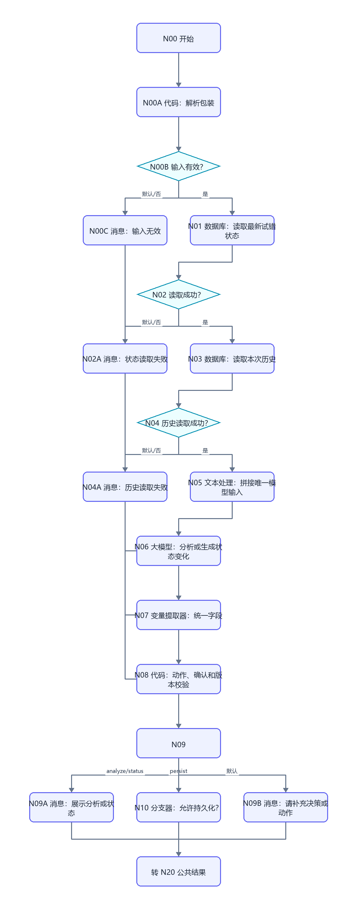
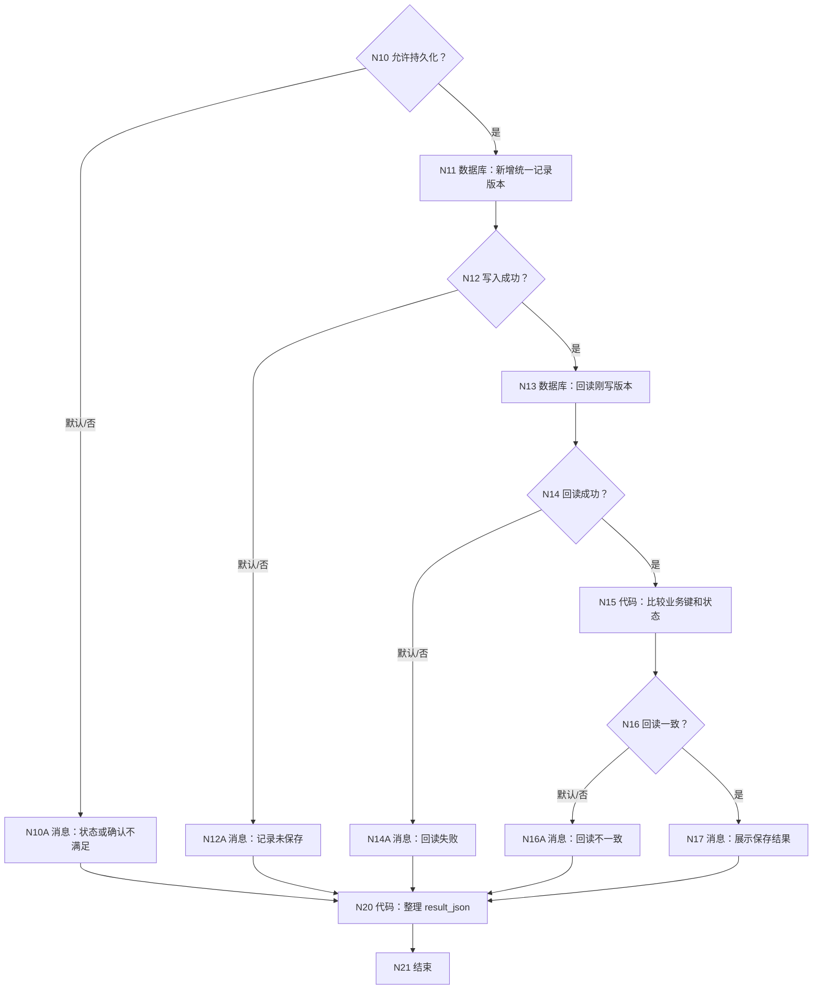
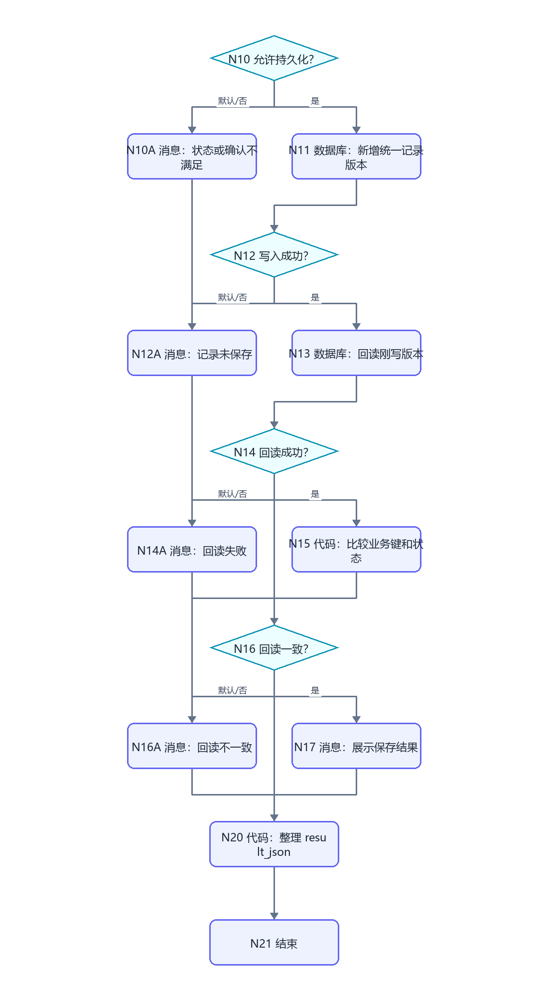

# WF-09 决策分析与七天试错：逐节点搭建指南

<!-- AGENT-CONTRACT
start_inputs: AGENT_USER_INPUT:String
extractor_input_count: 1
result_output: result_json:String
-->

> 本工作流合并旧 WF-10 的即时决策分析和七天试错全部模式，并把近 60 节点收敛为“一次读取、一条模型链、一个公共追加写入、一次回读”。每次持久化都新增 DB-09 版本，不在多条分支里重复更新同一行。

## 1. 支持的动作

| requested_action | 用户示例 | 是否写 DB-09 |
|---|---|---|
| `analyze` | 我在保研和就业之间纠结 | 否；即时返回可逆决策分析 |
| `draft_trial` | 给我做一个七天试错方案 | 是；plan/pending |
| `modify_trial` | 把访谈人数从 3 个改成 2 个 | 是；更高版本 pending |
| `confirm_trial` | 确认启动七天试错 | 是；plan/active |
| `log_day` | 第 2 天，我访谈了一个学长，发现… | 是；daily_log/active |
| `review_day7` | 七天结束，帮我复盘 | 是；day7_review/completed |
| `stop_trial` | 停止这次试错 | 是；analysis/stopped |
| `show_status` | 我的试错到哪一步了 | 否 |
| `needs_input` | “开始吧”但没有 pending | 否 |

用户不提供 trial_id、day_number 或版本；工作流从自然语言与最新状态定位。确认只接受明确“确认/启动/采用 + 七天试错/方案”表达。

## 2. 统一追加版本模型

DB-09 每次写入一行完整的当前事实：

- pending 计划：record_type=plan、trial_status=pending、pending_json 非空；
- active 计划：record_type=plan、trial_status=active、trial_plan_json 非空；
- 每日记录：record_type=daily_log、trial_status=active、day_number 1～7；
- 七日复盘：record_type=day7_review、trial_status=completed；
- 停止：record_type=analysis、trial_status=stopped。

当前状态永远取同一 user_key + trial_id 下 record_version 最大的一行。

## 3. 画布

```mermaid
flowchart TD
    N00["N00 开始"] --> N00A["N00A 代码：解析包装"]
    N00A --> N00B{"N00B 输入有效？"}
    N00B -->|默认/否| N00C["N00C 消息：输入无效"]
    N00B -->|是| N01["N01 数据库：读取最新试错状态"]
    N01 --> N02{"N02 读取成功？"}
    N02 -->|默认/否| N02A["N02A 消息：状态读取失败"]
    N02 -->|是| N03["N03 数据库：读取本次历史"]
    N03 --> N04{"N04 历史读取成功？"}
    N04 -->|默认/否| N04A["N04A 消息：历史读取失败"]
    N04 -->|是| N05["N05 文本处理：拼接唯一模型输入"]
    N05 --> N06["N06 大模型：分析或生成状态变化"]
    N06 --> N07["N07 变量提取器：统一字段"]
    N07 --> N08["N08 代码：动作、确认和版本校验"]
    N08 --> N09{"N09 requested_action"]
    N09 -->|analyze/status| N09A["N09A 消息：展示分析或状态"]
    N09 -->|persist| N10["N10 分支器：允许持久化？"]
    N09 -->|默认| N09B["N09B 消息：请补充决策或动作"]
    N00C --> R["转 N20 公共结果"]
    N02A --> R
    N04A --> R
    N09A --> R
    N09B --> R
```







## 4. N00～N04：入口与状态读取

N00 只有 `AGENT_USER_INPUT:String`。N00A 使用 WF-02 第 5.2 节的包装解析代码。

N01 读取当前最新状态：

```sql
SELECT id, user_key, trial_id, record_type, decision_json, trial_plan_json,
       pending_json, day_number, daily_log_json, review_json,
       trial_status, record_version, create_time
FROM decision_trials
WHERE user_key='{{user_key}}'
ORDER BY record_version DESC, create_time DESC
LIMIT 1;
```

N02 成功空数组允许继续。N03 读取最近 30 个版本，供每日记录和第七天复盘使用：

```sql
SELECT id, user_key, trial_id, record_type, decision_json, trial_plan_json,
       pending_json, day_number, daily_log_json, review_json,
       trial_status, record_version, create_time
FROM decision_trials
WHERE user_key='{{user_key}}'
ORDER BY record_version DESC, create_time DESC
LIMIT 30;
```

## 5. N05～N10：单输入模型和确定性状态机

N05 文本处理拼接 N01/outputList、N03/outputList、N00A/user_input。

N06 系统提示：

```text
你是低风险、可逆的大学决策实验教练。识别 requested_action：analyze、draft_trial、modify_trial、confirm_trial、log_day、review_day7、stop_trial、show_status、needs_input。
analyze 输出 options、criteria、known/unknown、reversibility、smallest_test，不写数据库。
draft/modify 输出一个七天计划：每天目标、最小行动、观察指标、停止条件；只能作为 pending。
confirm 只识别明确启动，不重新生成计划。
log_day 只整理用户明确发生的当天事实，day_number 必须 1～7。
review_day7 必须基于已有 daily logs，给 continue/adjust/stop 建议；证据不足写 gaps。
高风险、违法、医疗或重大财务事项只给寻求专业帮助和降低风险的建议，不推动试错。
只输出 JSON：
{"requested_action":"needs_input","confirmation_explicit":false,"decision_json":"{}","trial_plan_json":"{}","pending_json":"{}","day_number":0,"daily_log_json":"{}","review_json":"{}","display_reply":"","structure_complete":true,"safety_stop":false}
```

用户提示只引用 N05/output。N07 变量提取器固定 input 只引用 N06/output。day_number 为 Integer；confirmation_explicit/structure_complete/safety_stop 为 Boolean，其余 String。

N08 输入 N07、N01/outputList、N03/outputList、N00A/user_key/user_input：

```python
def main(requested_action, confirmation_explicit, decision_json, trial_plan_json,
         pending_json, day_number, daily_log_json, review_json, display_reply,
         structure_complete, safety_stop, latest_rows, history_rows, user_key, user_input):
    actions = ["analyze", "draft_trial", "modify_trial", "confirm_trial", "log_day", "review_day7", "stop_trial", "show_status", "needs_input"]
    latest_items = latest_rows if isinstance(latest_rows, list) else []
    latest = latest_items[0] if latest_items and isinstance(latest_items[0], dict) else {}
    history = history_rows if isinstance(history_rows, list) else []
    latest_status = str(latest.get("trial_status", ""))
    current_trial_id = str(latest.get("trial_id", "")).strip()
    max_version = 0
    latest_pending = {}
    latest_active = {}
    active_logs = 0
    for row in history:
        if not isinstance(row, dict):
            continue
        try:
            max_version = max(max_version, int(row.get("record_version", 0)))
        except Exception:
            pass
        same_trial = not current_trial_id or str(row.get("trial_id", "")) == current_trial_id
        if same_trial and str(row.get("trial_status", "")) == "pending" and str(row.get("pending_json", "{}")) not in ["", "{}"] and not latest_pending:
            latest_pending = row
        if same_trial and str(row.get("trial_status", "")) == "active" and not latest_active:
            latest_active = row
        if same_trial and str(row.get("record_type", "")) == "daily_log" and str(row.get("trial_status", "")) == "active":
            active_logs += 1
    action = str(requested_action).strip()
    if safety_stop is True:
        action = "needs_input"
    text = str(user_input)
    explicit = confirmation_explicit is True and any(word in text for word in ["确认", "启动", "采用"]) and any(word in text for word in ["七天", "试错", "方案"])
    trial_id = current_trial_id or ("trial_" + str(user_key)[3:15])
    if action == "draft_trial" and latest_status in ["completed", "stopped"]:
        trial_id = "trial_" + str(user_key)[3:11] + "_" + str(max_version + 1)
    record_type = "analysis"
    status = str(latest.get("trial_status", "pending")) or "pending"
    decision_out = str(decision_json)
    plan_out = "{}"
    pending_out = "{}"
    day_out = 0
    daily_out = "{}"
    review_out = "{}"
    persist_allowed = True
    if action in ["draft_trial", "modify_trial"]:
        record_type, status = "plan", "pending"
        pending_out = str(pending_json) if str(pending_json).strip() not in ["", "{}"] else str(trial_plan_json)
        persist_allowed = pending_out not in ["", "{}"]
        if action == "modify_trial" and latest_status != "pending":
            persist_allowed = False
    elif action == "confirm_trial":
        record_type, status = "plan", "active"
        plan_out = str(latest_pending.get("pending_json", "{}"))
        persist_allowed = latest_status == "pending" and explicit and plan_out not in ["", "{}"]
    elif action == "log_day":
        record_type, status = "daily_log", "active"
        day_out, daily_out = int(day_number), str(daily_log_json)
        persist_allowed = latest_status == "active" and bool(latest_active) and 1 <= day_out <= 7 and daily_out not in ["", "{}"]
    elif action == "review_day7":
        record_type, status, review_out = "day7_review", "completed", str(review_json)
        persist_allowed = latest_status == "active" and bool(latest_active) and active_logs > 0 and review_out not in ["", "{}"]
    elif action == "stop_trial":
        record_type, status = "analysis", "stopped"
        persist_allowed = latest_status == "active" and bool(latest_active)
    elif action in ["analyze", "show_status", "needs_input"]:
        persist_allowed = False
    valid = structure_complete is True and action in actions and bool(str(display_reply).strip())
    route = "persist" if action in ["draft_trial", "modify_trial", "confirm_trial", "log_day", "review_day7", "stop_trial"] else ("analyze/status" if action in ["analyze", "show_status"] else "needs_input")
    return {
        "model_valid": valid, "requested_action": action, "route": route,
        "persist_allowed": persist_allowed, "trial_id_out": trial_id,
        "record_type_out": record_type, "decision_json_out": decision_out,
        "trial_plan_json_out": plan_out, "pending_json_out": pending_out,
        "day_number_out": day_out, "daily_log_json_out": daily_out,
        "review_json_out": review_out, "trial_status_out": status,
        "record_version_out": max_version + 1, "display_reply": str(display_reply),
        "safety_stop": safety_stop is True
    }
```

输出按返回键声明；persist_allowed/model_valid/safety_stop 为 Boolean，day_number/record_version 为 Integer，其余 String。N09 先检查 model_valid；false 走默认。再按 N08/route 分支。N10 只检查 persist_allowed=true。

## 6. N11～N17：一个公共写入和回读

N11 新增 DB-09，所有动态值都来自唯一上游 N08：

| 字段 | 值 |
|---|---|
| user_key | N00A/user_key |
| trial_id | N08/trial_id_out |
| record_type | N08/record_type_out |
| decision_json | N08/decision_json_out |
| trial_plan_json | N08/trial_plan_json_out |
| pending_json | N08/pending_json_out |
| day_number | N08/day_number_out |
| daily_log_json | N08/daily_log_json_out |
| review_json | N08/review_json_out |
| trial_status | N08/trial_status_out |
| record_version | N08/record_version_out |

N13 回读：

```sql
SELECT id, user_key, trial_id, record_type, decision_json, trial_plan_json,
       pending_json, day_number, daily_log_json, review_json,
       trial_status, record_version, create_time
FROM decision_trials
WHERE user_key='{{user_key}}' AND trial_id='{{trial_id}}'
  AND record_version={{record_version}}
ORDER BY create_time DESC
LIMIT 1;
```

N15 输入 rows、N08/trial_id_out、record_type_out、trial_status_out、record_version_out：

```python
def main(rows, trial_id, record_type, trial_status, record_version):
    items = rows if isinstance(rows, list) else []
    row = items[0] if items and isinstance(items[0], dict) else {}
    try:
        version_ok = int(row.get("record_version", -1)) == int(record_version)
    except Exception:
        version_ok = False
    matches = bool(row) and str(row.get("trial_id", "")) == str(trial_id) and str(row.get("record_type", "")) == str(record_type) and str(row.get("trial_status", "")) == str(trial_status) and version_ok
    return {"readback_matches": matches}
```

N16 以 readback_matches=true 为成功；N17 展示 N08/display_reply。draft/modify 路线固定追加“请检查后回复‘确认启动七天试错’，或直接说明修改项”。

## 7. N20 公共结果

```python
def q(value):
    return '"' + str(value if value is not None else "").replace("\\", "\\\\").replace('"', '\\"').replace("\n", "\\n").replace("\r", "\\r") + '"'


def main(input_valid, read_success, history_success, model_valid, action,
         display_reply, persist_allowed, write_success, readback_success,
         readback_matches, safety_stop):
    status, reply, next_action, error_code = "needs_input", "请说明决策问题或七天试错动作。", "describe_decision_or_trial", "none"
    if input_valid is not True:
        status, reply, next_action, error_code = "validation_failed", "内部输入格式无效。", "retry_same_message", "invalid_envelope"
    elif read_success is not True or history_success is not True:
        status, reply, next_action, error_code = "read_failed", "暂时无法读取试错状态。", "retry_later", "read_failed"
    elif safety_stop is True:
        status, reply, next_action, error_code = "safety_stop", str(display_reply), "seek_professional_help", "safety_stop"
    elif model_valid is not True or action == "needs_input":
        status, reply, next_action = "needs_input", str(display_reply), "clarify_trial_action"
    elif action in ["analyze", "show_status"]:
        status, reply, next_action = "completed", str(display_reply), "draft_trial_or_choose_next_step"
    elif persist_allowed is not True:
        status, reply, next_action, error_code = "needs_input", str(display_reply), "satisfy_trial_precondition", "invalid_state_transition"
    elif write_success is not True or readback_success is not True or readback_matches is not True:
        status, reply, next_action, error_code = "write_failed", "试错记录没有通过写入回读校验。", "retry_later", "trial_write_failed"
    elif action in ["draft_trial", "modify_trial"]:
        status, reply, next_action = "awaiting_confirmation", str(display_reply) + "\n\n请确认启动七天试错，或直接说明修改项。", "confirm_or_modify_trial"
    elif action == "confirm_trial":
        status, reply, next_action = "completed", str(display_reply), "log_trial_day"
    elif action == "log_day":
        status, reply, next_action = "completed", str(display_reply), "continue_trial_or_review"
    elif action in ["review_day7", "stop_trial"]:
        status, reply, next_action = "completed", str(display_reply), "choose_next_decision"
    result = "{" + '"workflow_id":"WF-09",' + '"status":' + q(status) + "," + '"reply":' + q(reply) + "," + '"next_action":' + q(next_action) + "," + '"error_code":' + q(error_code) + "}"
    return {"result_json": result}
```

N20 输出 `result_json:String`；N21 只返回这一项。

## 8. 调试指南

### 8.1 即时分析与七天完整路线

1. “我在保研和就业之间纠结”→analyze，只读，DB-09 不新增。
2. “给我一个七天试错方案”→pending version=1，awaiting_confirmation。
3. “把第 3 天改成访谈两个学长”→新的 pending version=2。
4. “开始吧”→persist_allowed=false，不写 active。
5. “确认启动七天试错”→active version=3。
6. “第 1 天，我查了三份岗位描述……”→daily_log version=4/day=1。
7. 重复同一天可新增事实版本，但 display_reply 应提醒不要把重复内容当两天。
8. “七天结束，帮我复盘”→至少一条 active log 后才允许 completed。

### 8.2 状态、失败和安全

- 无 pending 时确认、无 active 时日志/停止/复盘：N10A，不写。
- day_number=0/8：persist_allowed=false。
- 另一个 user_key 的 pending/active/log 不可见。
- 模型漏字段：N09 默认。
- N11 写入失败、N13 回读失败、N15 不一致分别测试。
- 写入失败重试使用同一自然语言，版本从数据库最新成功记录重新计算。
- 高风险重大财务/医疗/违法选择：safety_stop，N11 不执行。
- show_status 只读，不产生伪日志。

## 9. 发布与验收清单

发布名称 `ULPS_WF09_DECISION_TRIAL`；描述：`提供即时可逆决策分析，并用统一追加版本状态机创建、确认、记录、复盘或停止七天试错。`

- [ ] 只有 `AGENT_USER_INPUT:String`。
- [ ] N07 变量提取器只有一个 input。
- [ ] 所有持久化路线汇入同一个 N11。
- [ ] 用户不提供内部标识、day 或版本。
- [ ] 含糊启动不创建 active。
- [ ] daily log 与 day7 review 都基于同一 trial 历史。
- [ ] SQL 按 user_key 隔离，写后按业务键和版本回读。
- [ ] 每个消息进入 N20；N21 返回 `result_json:String`。
