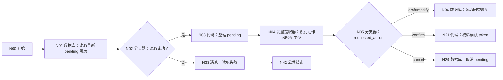
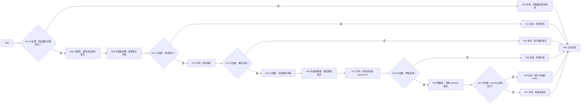
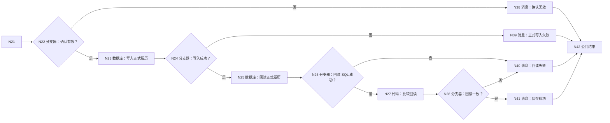
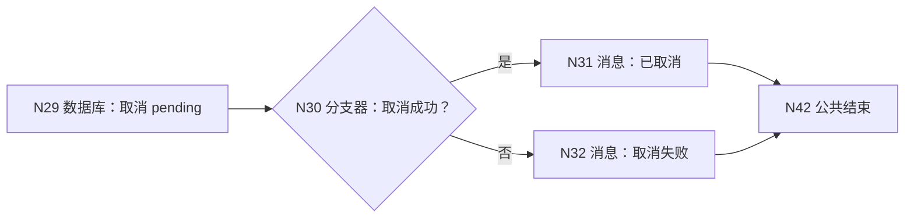

# WF-09 履历条目生成与确认：逐节点搭建指南

> WF-09 必须先生成 pending 履历草稿，用户第二轮明确确认且 token 匹配后才写正式 `resume_entry_json`。任何“帮我编一段不存在的经历”都走安全出口。

## 1. 数据表和开始输入

在 `university` 上传 [DB-08 resume_entries](../database/import-templates/DB-08-resume-entries.xlsx)，保留 `id/uid/create_time`。

N00 输入：

| 变量 | 类型 | 必填 | 调试值 |
|---|---|---:|---|
| `AGENT_USER_INPUT` | String | 是 | 首轮描述真实经历；次轮“确认保存这条履历” |
| `uid` | String | 是 | `test_user_001` |
| `confirmation_token` | String | 否 | 第二轮填写第一轮 token |
| `evidence_location` | String | 否 | 证明材料位置或链接 |
| `request_time` | String | 是 | `2026-07-19 19:00:00` |

## 2. 分段流程图







取消：N29→N30“取消成功？”→N31 成功或 N32 失败。所有消息连接 N42 结束。



## 3. N01～N03：读取 pending 履历

N01 自定义 SQL，输入 `uid=N00/uid`：

```sql
SELECT id, entry_id, entry_type, resume_entry_json, pending_entry_json,
       confirmation_token, quality_status, evidence_location,
       record_status, updated_at
FROM resume_entries
WHERE uid='{{uid}}' AND record_status='pending'
ORDER BY updated_at DESC, create_time DESC
LIMIT 1;
```

N02：`N01/isSuccess == true`；是 → N03，否 → N33。

N03 输入 outputList：

```python
def main(outputList):
    rows = outputList if isinstance(outputList, list) else []
    row = rows[0] if len(rows) > 0 and isinstance(rows[0], dict) else {}
    return {
        "has_pending": len(row) > 0,
        "pending_record_id": int(row.get("id", 0)) if str(row.get("id", "0")).isdigit() else 0,
        "pending_entry_id": str(row.get("entry_id", "")),
        "pending_entry_json": str(row.get("pending_entry_json", "{}")),
        "stored_confirmation_token": str(row.get("confirmation_token", "")),
    }
```

输出 `has_pending:Boolean`、`pending_record_id:Integer`、`pending_entry_id:String`、`pending_entry_json:String`、`stored_confirmation_token:String`。

## 4. N04/N05：识别动作和经历类型

N04 输入 `user_input=N00/AGENT_USER_INPUT`、`has_pending=N03/has_pending`，输出：

| 变量 | 类型 | 描述 |
|---|---|---|
| `requested_action` | String | draft/modify/confirm/cancel |
| `entry_type` | String | 项目、科研、竞赛、实习、社团、学生工作、志愿服务或其他 |
| `action_reason` | String | 判断依据 |

N05 分支：draft→N06、modify→N06、confirm→N21、cancel→N29，默认→N14。

## 5. N06/N07：读取同类正式履历

N06 自定义 SQL，输入 `uid=N00/uid`、`entry_type=N04/entry_type`：

```sql
SELECT entry_id, entry_type, resume_entry_json, quality_status,
       evidence_location, updated_at
FROM resume_entries
WHERE uid='{{uid}}' AND entry_type='{{entry_type}}' AND record_status='confirmed'
ORDER BY updated_at DESC LIMIT 20;
```

N07：`N06/isSuccess == true`；是 → N08，否 → N34。空数组可以继续，仅用于避免重复。

## 6. N08 大模型和 N09 提取器：提取事实

N08 模型 `Spark4.0 Ultra`，关闭对话历史。输入 `user_input=N00/AGENT_USER_INPUT`、`entry_type=N04/entry_type`、`existing_entries=N06/outputList`。

系统提示词：

```text
你是履历事实提取助手。只能提取用户明确提供的事实，禁止补造组织名、角色、数字、奖项、技术和影响。若用户要求伪造，is_fabrication_request=true。事实字段包括背景、目标、本人行动、工具方法、协作对象、结果、量化数据、证据位置和缺失项。
只输出 JSON：
{"is_fabrication_request":false,"facts":{},"missing_fields":[],"followup_question":""}
```

用户提示词：`用户原话：{{user_input}}\n类型：{{entry_type}}\n已有同类履历：{{existing_entries}}`。输出 `output:String`。

N09 输入 `input=N08/output`，输出 `is_fabrication_request:Boolean`、`facts_json:String`、`background:String`、`action:String`、`result:String`、`metrics:Array`、`missing_fields:Array`、`followup_question:String`。

## 7. N10～N14：安全和事实门禁

N10：`N09/is_fabrication_request == true`；是 → N11，否 → N12。

N11 回答：`我不能替你编造不存在的经历、数据或奖项。可以把真实做过的事情、你的具体行动和已有证据告诉我，我会帮你如实改写。`，接 N42。

N12 输入 `background/action/result/metrics/missing_fields/followup_question`：

```python
def main(background, action, result, metrics, missing_fields, followup_question):
    missing = missing_fields if isinstance(missing_fields, list) else []
    errors = []
    if not str(background).strip(): errors.append("背景")
    if not str(action).strip(): errors.append("本人行动")
    if not str(result).strip(): errors.append("结果")
    return {
        "facts_enough": len(errors) == 0,
        "facts_error": "、".join(errors),
        "quality_status": "缺量化" if not isinstance(metrics, list) or len(metrics) == 0 else ("需打磨" if len(missing) > 0 else "可用"),
        "followup_question": str(followup_question),
    }
```

输出 `facts_enough:Boolean`、`facts_error:String`、`quality_status:String`、`followup_question:String`。N13：true → N15，false → N14。N14 输入 `error/followup`，回答 `还缺少：{{error}}。{{followup}}`，连接 N42。

## 8. N15～N18：生成并校验履历草稿

N15 大模型输入 `entry_type=N04/entry_type`、`facts_json=N09/facts_json`、`quality_status=N12/quality_status`。系统提示词：

```text
你是简历写作助手。严格依据 facts_json，使用“情境—任务—行动—结果—证据”结构，突出本人行动；没有量化数据就明确写缺量化，不得编数字。输出中文简历版、详细素材版、证据清单和仍需补充项。
只输出 JSON：
{"entry_type":"","resume_bullet":"","detailed_story":"","evidence":[],"missing_fields":[],"quality_status":"","reply":""}
```

用户提示词：`类型：{{entry_type}}\n事实：{{facts_json}}\n质量标签：{{quality_status}}`。输出 `output:String`。

N16 输入 `input=N15/output`，输出 `resume_entry_json:String`、`resume_bullet:String`、`detailed_story:String`、`evidence:Array`、`missing_fields:Array`、`quality_status:String`、`reply:String`。

N17 输入 `uid=N00/uid`、`request_time=N00/request_time`、`entry_type=N04/entry_type`、`evidence_location=N00/evidence_location` 和 N16 全部：

```python
def main(uid, request_time, entry_type, evidence_location, resume_entry_json, resume_bullet, detailed_story, evidence, missing_fields, quality_status, reply):
    errors = []
    text = str(resume_entry_json).strip()
    if not text.startswith("{") or not text.endswith("}"): errors.append("resume_entry_json 无效")
    if not str(resume_bullet).strip(): errors.append("缺少 resume_bullet")
    if not str(detailed_story).strip(): errors.append("缺少 detailed_story")
    if str(quality_status) not in ["可用", "缺量化", "缺证明", "需打磨"]: errors.append("quality_status 无效")
    token = str(uid) + "-RESUME-" + str(request_time)
    return {
        "draft_valid": len(errors) == 0,
        "draft_error": ";".join(errors),
        "entry_id": str(uid) + "-ENTRY-" + str(request_time),
        "entry_type": str(entry_type),
        "resume_entry_json_empty": "{}",
        "pending_entry_json": text,
        "confirmation_token": token,
        "quality_status": str(quality_status),
        "evidence_location": str(evidence_location),
        "record_status": "pending",
        "updated_at": str(request_time),
        "reply": str(reply),
    }
```

输出 `draft_valid:Boolean`，以及 `draft_error/entry_id/entry_type/resume_entry_json_empty/pending_entry_json/confirmation_token/quality_status/evidence_location/record_status/updated_at/reply:String`。N18：true → N19，false → N35。

## 9. N19/N20：新增 pending 履历

N19 表单新增 `resume_entries`，映射 `entry_id/entry_type/resume_entry_json_empty→resume_entry_json/pending_entry_json/confirmation_token/quality_status/evidence_location/record_status/updated_at`；页面强制 uid 时引用 N00/uid。

N20：`N19/isSuccess == true`；是 → N36，否 → N37。

N36 输入 plan/token/reply，回答：`{{reply}}\n\n草稿：{{pending_entry_json}}\n\n确认保存请明确回复“确认保存这条履历”，并提交 token：{{confirmation_token}}`。N37 说明草稿生成但未保存，不能进入确认。

## 10. N21/N22：确认 token

N21 输入 `requested_action=N04/requested_action`、`has_pending=N03/has_pending`、`input_token=N00/confirmation_token`、`stored_token=N03/stored_confirmation_token`：

```python
def main(requested_action, has_pending, input_token, stored_token):
    valid = requested_action == "confirm" and has_pending is True and str(input_token) != "" and str(input_token) == str(stored_token)
    return {"confirm_valid": valid, "confirm_error": "" if valid else "没有 pending 草稿、动作不明确或 token 不匹配"}
```

输出 `confirm_valid:Boolean`、`confirm_error:String`。N22：true → N23，false → N38。

## 11. N23～N28：写入并回读正式履历

N23 表单更新 `resume_entries`。范围：`id=N03/pending_record_id` AND `uid=N00/uid` AND `confirmation_token=N03/stored_confirmation_token`。更新：

- `resume_entry_json=N03/pending_entry_json`
- `pending_entry_json={}`
- `confirmation_token=空字符串`
- `record_status=confirmed`
- `updated_at=N00/request_time`

N24：`N23/isSuccess == true`；是 → N25，否 → N39。

N25 自定义 SQL，输入 uid、entry_id=N03/pending_entry_id：

```sql
SELECT entry_id, resume_entry_json, record_status, quality_status, updated_at
FROM resume_entries
WHERE uid='{{uid}}' AND entry_id='{{entry_id}}' AND record_status='confirmed'
ORDER BY updated_at DESC LIMIT 1;
```

N26：`N25/isSuccess == true`；是 → N27，否 → N40。

N27 输入 expected=N03/pending_entry_json、outputList=N25/outputList：

```python
def main(expected, outputList):
    rows = outputList if isinstance(outputList, list) else []
    row = rows[0] if len(rows) > 0 and isinstance(rows[0], dict) else {}
    stored = str(row.get("resume_entry_json", ""))
    return {"readback_matches": len(stored.strip()) > 2 and stored.strip() == str(expected).strip(), "stored_entry_json": stored}
```

输出 `readback_matches:Boolean`、`stored_entry_json:String`。N28：true → N41，false → N40。N41 展示 `stored_entry_json` 并明确“已保存并回读确认”。

## 12. 取消和错误消息

N29 表单更新 pending 行：范围 id+uid；更新 `pending_entry_json={}`、`confirmation_token=空`、`record_status=archived`、`updated_at=request_time`。N30 检查 isSuccess；是 → N31“已取消，未写正式履历”，否 → N32。

N33～N40 分别展示对应节点 message/error：读取 pending 失败、读取同类失败、草稿无效、pending 保存失败、确认无效、正式写入失败、回读失败。所有回复都不得声称已保存。

## 13. N42 结束

回答模式“返回设定格式配置的回答”；输出 `output｜输入｜workflow_finished`；回答内容“本轮处理已结束，请以上方消息节点的提示为准。”；思考内容空、流式关闭。所有消息连接 N42。

## 14. 调试指南

1. 真实完整经历：第一轮新增 pending，返回 token，不写正式字段。
2. 缺本人行动：到 N14 追问，不生成草稿。
3. 伪造请求：到 N11，不调用履历生成模型、不写数据库。
4. 错 token：到 N38，pending 保留，正式字段不变。
5. 正确确认：更新正式字段并回读一致后到 N41。
6. 取消：pending 归档，正式履历未新增。
7. 写入/回读失败：到 N39/N40，不说已保存。

## 15. 验收清单

- [ ] 只用 DB-08 模板真实字段。
- [ ] 伪造请求有独立安全出口。
- [ ] pending 和正式字段严格分开，token 由代码校验。
- [ ] 正式写入后回读一致才说成功。
- [ ] 所有代码无 import、输出声明完整；所有分支连接 N42。
