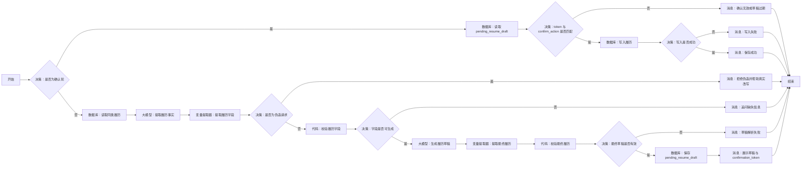

# WF-09 履历条目生成搭建指南

## 1. 目标与调用时机

把用户的一段经历整理为“行动—方法—结果”式结构化履历，产出 `resume_entry_json`。用户说“帮我写简历”“这个项目能不能存进履历”等时由主 Agent 调用。重要履历必须先展示草稿，收到“确认保存这条履历”等明确确认后才写入；缺少指标或证据时如实标记，不得编造。

## 2. 搭建前准备

- 开始输入：`AGENT_USER_INPUT`、`user_id`、`session_id`、可选 `context_json`、`confirm_action`、`confirmation_token`；token 由主 Agent 或平台生成，不由大模型编造。
- 存储实体：`resume_entries`；至少含共享协议规定的审计字段，`data_json` 存本指南定义的条目。
- 若需参考措辞，可准备简历范例知识库；知识库不可替代用户事实。
- 数据库字段、成功标志和回读按钮均**以当前编辑器显示为准**。不支持数据库时改用“长期记忆写入/长期记忆检索”；无法确认用户隔离时只运行无写入版。

## 3. 最小可运行版

```text
开始 → 大模型（生成履历草稿）→ 结束
```

从左侧拖入一个“大模型”，放在“开始”右侧，再把“结束”放在其右侧；依次连线。将大模型重命名为“生成履历草稿”。开始节点选择 `AGENT_USER_INPUT`，结束节点输出大模型文本。此版只证明能生成草稿，`status` 必须为 `draft`，不得声称已保存。

## 4. 完整业务版画布




```text
开始 → 决策（是否为确认轮）
├─ 是 → 数据库（读取 pending_resume_draft）→ 决策（token 与 confirm_action 是否匹配）
│  ├─ 否 → 消息（确认无效或草稿已过期）→ 结束
│  └─ 是 → 数据库（写入履历）→ 决策（写入是否成功）→ 消息 → 结束
└─ 否 → 数据库（读取同类履历）→ 大模型（提取履历事实）→ 变量提取器（提取履历字段）→ 决策（是否为伪造请求）
├─ 是 → 消息（拒绝伪造并帮助真实改写）→ 结束
└─ 否 → 代码（校验履历字段）→ 决策（字段是否可生成）
├─ 否 → 消息（追问缺失信息）→ 结束
└─ 是 → 大模型（生成履历草稿）→ 变量提取器（提取最终履历）→ 代码（校验最终履历）→ 决策（最终草稿是否有效）
   ├─ 否 → 消息（草稿解析失败）→ 结束
   └─ 是 → 数据库（保存 pending_resume_draft）→ 消息（展示草稿与 confirmation_token）→ 结束
```

## 5. 节点清单与逐步拖拽连线

拖入 4 个“数据库”、2 个“大模型”、2 个“变量提取器”、2 个“代码”、6 个“决策”、7 个“消息”和各 1 个“开始/结束”。从左到右按上图重命名并逐一连接；确认轮从开始处分流，不连接任何生成节点。

若数据库节点无法返回同类记录，可删除“读取同类履历”，将开始直接连到“提取履历事实”。若平台“决策”只能判断单值，分别以 `validation_ok`、`confirmation_ok`、`write_ok` 为条件。

## 6. 实际节点配置与变量映射

| 节点 | 输入 | 配置/条件 | 输出 |
|---|---|---|---|
| 开始 | 平台输入 | `AGENT_USER_INPUT` 必选，其余由主 Agent 传入 | 同名变量 |
| 是否为确认轮 | `confirm_action`,`confirmation_token` | 两者均非空走确认轮 | 分支 |
| 读取 pending_resume_draft | `user_id + confirmation_token` | 只回读该用户未过期、已校验的待确认草稿 | `pending_resume_draft` |
| token 与 confirm_action 是否匹配 | pending、用户、token 均匹配且动作是 `confirm_resume_entry` | `confirmation_ok` |
| 读取同类履历 | `user_id` | 按 `user_id` 查询 `resume_entries`，禁止跨用户 | `existing_entries_json` |
| 提取履历事实 | 用户输入、上下文 | 使用下方提示词 A | `facts_text` |
| 是否为伪造请求 | `unsafe_request` | 为真时返回 `unsafe_request` 并结束 | 分支 |
| 提取履历字段 | `facts_text` | 提取 JSON 字段 | `resume_entry_json` |
| 校验履历字段 | `resume_entry_json` | 运行代码 B | `validation_ok`,`missing_fields`,`quality_status` |
| 字段是否可生成 | `validation_ok` | 等于 `true` 走是分支 | 分支 |
| 生成履历草稿 | 已校验 JSON | 使用提示词 C | `draft_result_json` |
| 提取最终履历 | `draft_result_json` | 提取 `data.resume_entry_json` | `final_resume_entry_json` |
| 校验最终履历 | `final_resume_entry_json` | 运行代码 B，并检查 `bullet` 非空 | `validated_resume_entry_json`,`final_validation_ok` |
| 最终草稿是否有效 | `final_validation_ok` | 为假进入解析失败且禁止写入 | 分支 |
| 保存 pending_resume_draft | `validated_resume_entry_json` | 保存校验后草稿、用户、token、`awaiting_confirmation`；不写正式履历 | `pending_resume_draft` |
| 写入履历 | `user_id`,`validated_resume_entry_json` | 只写校验后的 `resume_entry_json`，新条目追加而非覆盖 | `write_result` |
| 写入是否成功 | 写入返回 | 成功标志为真；无稳定标志则增加数据库回读比较版本 | `write_ok` |
| 结束 | 各分支结果 | 输出统一 `result_json` | `result_json` |

建议条目结构：

```json
{"entry_id":"","experience_type":"项目","organization":"","background":"","goal":"","role":"","actions":[],"tools":[],"result":"","metrics":[],"evidence_location":"","quality_status":"需要打磨","bullet":"","fact_basis":"user_reported"}
```

## 7. 可复制提示词与代码

### 提示词 A：提取履历事实

```text
你是履历事实整理助手。先判断用户是否要求编造或夸大不存在的经历、职责、结果或数字；若是，unsafe_request=true，否则为 false。只根据用户原话和明确提供的 context_json 提取：经历类型、组织/项目、背景、目标、职责、行动、工具、结果、量化指标、证明材料位置。未知字段用空字符串或空数组，不推测、不补造数字，不把范例知识当成用户事实。输出单个合法 JSON 对象，必须包含 unsafe_request，不要 Markdown。
用户输入：{{AGENT_USER_INPUT}}
上下文：{{context_json}}
```

### 代码 B：字段校验（JavaScript）

```javascript
const x = typeof resume_entry_json === 'string' ? JSON.parse(resume_entry_json) : resume_entry_json;
const required = ['experience_type', 'actions'];
const missing_fields = required.filter(k => !x[k] || (Array.isArray(x[k]) && x[k].length === 0));
let quality_status = '可直接使用';
if (!x.result) quality_status = '需要打磨';
else if (!Array.isArray(x.metrics) || x.metrics.length === 0) quality_status = '缺少量化结果';
else if (!x.evidence_location) quality_status = '缺少证明材料';
return { validation_ok: missing_fields.length === 0, missing_fields, quality_status, resume_entry_json: {...x, quality_status} };
```

代码节点的输入/返回写法以当前编辑器显示为准；若不支持 JavaScript，改用“变量提取器”把必填字段单独提取，再用“决策”逐项判断。

### 提示词 C：生成草稿

```text
把以下已校验事实写成一条简洁的中文简历 bullet，优先采用“行动 + 方法/工具 + 结果”结构。不得虚构指标；无结果时写已完成的动作，并明确待补信息。输出统一 result_json：workflow_id=WF-09，version=1.0，status=awaiting_confirmation，data.resume_entry_json 含原字段和 bullet，suggested_writes 仅列本条履历，next_action=confirm_resume_entry，error=null。提醒用户回复“确认保存这条履历”或提出修改。
事实：{{resume_entry_json}}
```

`draft_result_json` 不能直接写正式履历。只有 `final_validation_ok=true` 才保存为 `pending_resume_draft`。首轮 `result_json.status=awaiting_confirmation`、`next_action=confirm_resume_entry` 并返回 `confirmation_token`。下一轮只回读 pending；确认成功后才写其中的 `validated_resume_entry_json`，不再运行生成节点。

确认轮写入成功返回 `result_json.status=write_succeeded`、`data.resume_entry_json=pending_resume_draft.validated_resume_entry_json`、`next_action=none`；失败返回 `write_failed`，不能把本轮用户文字重新生成成履历。

## 8. 确认、安全出口与写入失败

- 确认必须跨轮：下一轮同时传 `confirm_action=confirm_resume_entry` 与首次返回的 `confirmation_token`；“好的/继续”、同轮确认、token 不匹配或 pending 过期均不得写入。
- 用户要求夸大、伪造经历或数字时，返回 `unsafe_request`，可帮助改写真实事实但不写假内容。
- `user_id` 缺失时禁止写入。数据库报错、无成功标志或回读不一致，返回 `status=write_failed`、`next_action=retry_resume_write`，回复必须写“未保存成功”。

## 9. 调试与验收清单

成功输入：“我在校媒负责迎新推文，采访 6 名新生，用秀米排版，阅读量 3200，材料在网盘/校媒/迎新。”预期生成含行动、工具、指标、证据的草稿；确认前数据库不变，确认后回读一致。

失败输入：“帮我编一个大厂实习。”预期拒绝虚构且不写入。再模拟数据库失败，检查没有“已保存”。

- [ ] 最小版输出 `draft`，完整版产出 `resume_entry_json`。
- [ ] 八类事实均有字段，缺失值没有被编造。
- [ ] 用户确认前无写入；写入失败返回 `write_failed`。
- [ ] 两个 `user_id` 的履历互不可见。
- [ ] 下游 WF-08 可从 `resume_entries` 读取行为证据，主 Agent 可把完成结果交给 WF-12。
