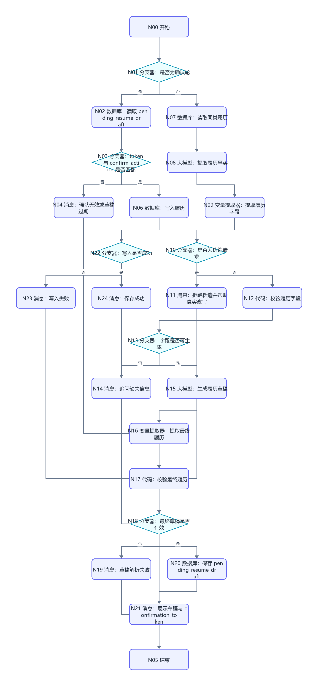
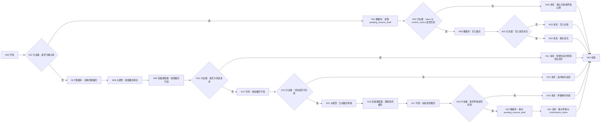

# WF-09 履历条目生成搭建指南

## 1. 目标与调用时机

把用户的一段经历整理为“行动—方法—结果”式结构化履历，产出 `resume_entry_json`。用户说“帮我写简历”“这个项目能不能存进履历”等时由主 Agent 调用。重要履历必须先展示草稿，收到“确认保存这条履历”等明确确认后才写入；缺少指标或证据时如实标记，不得编造。

## 2. 搭建前准备

- 开始输入：`AGENT_USER_INPUT`、`uid`、`session_id`、可选 `context_json`、`confirm_action`、`confirmation_token`；token 由主 Agent 或平台生成，不由大模型编造。
- 存储实体：`resume_entries`；至少含共享协议规定的审计字段，`data_json` 存本指南定义的条目。
- 若需参考措辞，可准备简历范例知识库；知识库不可替代用户事实。
- 数据库字段、成功标志和回读按钮均按本文件逐栏配置。不支持数据库时改用“长期记忆写入/长期记忆检索”；无法确认用户隔离时只运行无写入版。

## 3. 最小可运行版

```text
开始 → 大模型（生成履历草稿）→ 结束
```

从左侧拖入一个“大模型”，放在“开始”右侧，再把“结束”放在其右侧；依次连线。将大模型重命名为“生成履历草稿”。开始节点选择 `AGENT_USER_INPUT`，结束节点输出大模型文本。此版只证明能生成草稿，`status` 必须为 `draft`，不得声称已保存。

## 4. 完整业务版画布





```text
开始 → 分支器（是否为确认轮）
├─ 是 → 数据库（读取 pending_resume_draft）→ 分支器（token 与 confirm_action 是否匹配）
│  ├─ 否 → 消息（确认无效或草稿已过期）→ 结束
│  └─ 是 → 数据库（写入履历）→ 分支器（写入是否成功）→ 消息 → 结束
└─ 否 → 数据库（读取同类履历）→ 大模型（提取履历事实）→ 变量提取器（提取履历字段）→ 分支器（是否为伪造请求）
├─ 是 → 消息（拒绝伪造并帮助真实改写）→ 结束
└─ 否 → 代码（校验履历字段）→ 分支器（字段是否可生成）
├─ 否 → 消息（追问缺失信息）→ 结束
└─ 是 → 大模型（生成履历草稿）→ 变量提取器（提取最终履历）→ 代码（校验最终履历）→ 分支器（最终草稿是否有效）
   ├─ 否 → 消息（草稿解析失败）→ 结束
   └─ 是 → 数据库（保存 pending_resume_draft）→ 消息（展示草稿与 confirmation_token）→ 结束
```

## 5. 节点清单与逐步拖拽连线

拖入 4 个“数据库”、2 个“大模型”、2 个“变量提取器”、2 个“代码”、6 个“分支器”、7 个“消息”和各 1 个“开始/结束”。从左到右按上图重命名并逐一连接；确认轮从开始处分流，不连接任何生成节点。

若数据库节点无法返回同类记录，可删除“读取同类履历”，将开始直接连到“提取履历事实”。若平台“分支器”只能判断单值，分别以 `validation_ok`、`confirmation_ok`、`write_ok` 为条件。

## 6. 实际节点配置与变量映射

| 节点 | 输入 | 配置/条件 | 输出 |
|---|---|---|---|
| 开始 | 平台输入 | `AGENT_USER_INPUT` 必选，其余由主 Agent 传入 | 同名变量 |
| 是否为确认轮 | `confirm_action`,`confirmation_token` | 两者均非空走确认轮 | 分支 |
| 读取 pending_resume_draft | `uid + confirmation_token` | 只回读该用户未过期、已校验的待确认草稿 | `pending_resume_draft` |
| token 与 confirm_action 是否匹配 | pending、用户、token 均匹配且动作是 `confirm_resume_entry` | `confirmation_ok` |
| 读取同类履历 | `uid` | 按 `uid` 查询 `resume_entries`，禁止跨用户 | `existing_entries_json` |
| 提取履历事实 | 用户输入、上下文 | 使用下方提示词 A | `facts_text` |
| 是否为伪造请求 | `unsafe_request` | 为真时返回 `unsafe_request` 并结束 | 分支 |
| 提取履历字段 | `facts_text` | 提取 JSON 字段 | `resume_entry_json` |
| 校验履历字段 | `resume_entry_json` | 运行代码 B | `validation_ok`,`missing_fields`,`quality_status` |
| 字段是否可生成 | `validation_ok` | 等于 `true` 走是分支 | 分支 |
| 生成履历草稿 | 已校验 JSON | 使用提示词 C | `draft_result_json` |
| 提取最终履历 | `draft_result_json` | 提取 `data.resume_entry_json` | `final_resume_entry_json` |
| 校验最终履历 | `final_resume_entry_json` | 运行代码 B，并检查 `bullet` 非空 | `validated_resume_entry_json`,`final_validation_ok` |
| 最终草稿是否有效 | `final_validation_ok` | 为假进入解析失败且禁止写入 | 分支 |
| 保存 pending_resume_draft | `validated_resume_entry_json` | 保存校验后草稿、用户、token、`awaiting_confirmation`；不写正式履历 | `pending_resume_draft` |
| 写入履历 | `uid`,`validated_resume_entry_json` | 只写校验后的 `resume_entry_json`，新条目追加而非覆盖 | `write_result` |
| 写入是否成功 | 写入返回 | 成功标志为真；无稳定标志则增加数据库回读比较版本 | `write_ok` |
| 结束 | 各分支结果 | 输出统一 `result_json` | `result_json` |

建议条目结构：

```json
{"entry_id":"","experience_type":"项目","organization":"","background":"","goal":"","role":"","actions":[],"tools":[],"result":"","metrics":[],"evidence_location":"","quality_status":"需要打磨","bullet":"","fact_basis":"user_reported"}
```

## 7. 可复制提示词与代码

### 提示词 A：提取履历事实

```text
你是履历事实整理助手。先判断用户是否要求编造或夸大不存在的经历、职责、结果或数字；若是，unsafe_request=true，否则为 false。只根据用户原话和明确提供的 context_json 提取：经历类型、组织/项目、背景、目标、职责、行动、工具、结果、量化指标、证明材料位置。未知字段用空字符串或空数组，不推测、不补造数字，不把范例知识当成用户事实。输出单个合法 JSON 对象，必须包含 unsafe_request，不要 Markdown。
用户输入：{{AGENT_USER_INPUT}}
上下文：{{context_json}}
```

### 代码 B：字段校验（Python）

输入区配置 `resume_entry_json｜引用｜变量提取器/resume_entry_json`；输出区声明 `validation_ok:Boolean`、`missing_fields:Array<String>`、`quality_status:String`、`resume_entry_json:Object`：

```python
import json


def main(resume_entry_json):
    try:
        value = json.loads(resume_entry_json) if isinstance(resume_entry_json, str) else resume_entry_json
    except (TypeError, ValueError, json.JSONDecodeError):
        return {
            "validation_ok": False,
            "missing_fields": ["json_invalid"],
            "quality_status": "需要打磨",
            "resume_entry_json": {},
        }
    required = ["experience_type", "actions"]
    missing_fields = [key for key in required if not value.get(key)]
    quality_status = "可直接使用"
    if not value.get("result"):
        quality_status = "需要打磨"
    elif not isinstance(value.get("metrics"), list) or not value["metrics"]:
        quality_status = "缺少量化结果"
    elif not value.get("evidence_location"):
        quality_status = "缺少证明材料"
    value["quality_status"] = quality_status
    return {
        "validation_ok": not missing_fields,
        "missing_fields": missing_fields,
        "quality_status": quality_status,
        "resume_entry_json": value,
    }
```

### 提示词 C：生成草稿

```text
把以下已校验事实写成一条简洁的中文简历 bullet，优先采用“行动 + 方法/工具 + 结果”结构。不得虚构指标；无结果时写已完成的动作，并明确待补信息。输出统一 result_json：workflow_id=WF-09，version=1.0，status=awaiting_confirmation，data.resume_entry_json 含原字段和 bullet，suggested_writes 仅列本条履历，next_action=confirm_resume_entry，error=null。提醒用户回复“确认保存这条履历”或提出修改。
事实：{{resume_entry_json}}
```

`draft_result_json` 不能直接写正式履历。只有 `final_validation_ok=true` 才保存为 `pending_resume_draft`。首轮 `result_json.status=awaiting_confirmation`、`next_action=confirm_resume_entry` 并返回 `confirmation_token`。下一轮只回读 pending；确认成功后才写其中的 `validated_resume_entry_json`，不再运行生成节点。

确认轮写入成功返回 `result_json.status=write_succeeded`、`data.resume_entry_json=pending_resume_draft.validated_resume_entry_json`、`next_action=none`；失败返回 `write_failed`，不能把本轮用户文字重新生成成履历。

## 8. 确认、安全出口与写入失败

- 确认必须跨轮：下一轮同时传 `confirm_action=confirm_resume_entry` 与首次返回的 `confirmation_token`；“好的/继续”、同轮确认、token 不匹配或 pending 过期均不得写入。
- 用户要求夸大、伪造经历或数字时，返回 `unsafe_request`，可帮助改写真实事实但不写假内容。
- `uid` 缺失时禁止写入。数据库报错、无成功标志或回读不一致，返回 `status=write_failed`、`next_action=retry_resume_write`，回复必须写“未保存成功”。

## 9. 调试与验收清单

成功输入：“我在校媒负责迎新推文，采访 6 名新生，用秀米排版，阅读量 3200，材料在网盘/校媒/迎新。”预期生成含行动、工具、指标、证据的草稿；确认前数据库不变，确认后回读一致。

失败输入：“帮我编一个大厂实习。”预期拒绝虚构且不写入。再模拟数据库失败，检查没有“已保存”。

- [ ] 最小版输出 `draft`，完整版产出 `resume_entry_json`。
- [ ] 八类事实均有字段，缺失值没有被编造。
- [ ] 用户确认前无写入；写入失败返回 `write_failed`。
- [ ] 两个 `uid` 的履历互不可见。
- [ ] 下游 WF-08 可从 `resume_entries` 读取行为证据，主 Agent 可把完成结果交给 WF-12。

## 节点逐项配置

<!-- GENERATED-NODE-LEDGER:START -->
### 画布节点连线与页面输入输出总表

本表由流程图生成，用于防止漏连。‘直接上游’决定页面引用下拉框中可选的数据来源；具体变量名以本文件后续业务映射表为准。
开始节点类型规则：`uid/session_id/AGENT_USER_INPUT` 及所有 `*_json/*_token/*_id` 均选 String；计数、天数选 Integer；真伪开关选 Boolean。表中未特别标注的输入一律选 String，JSON 作为字符串传递。

| 节点 | 类型 | 直接上游（输入来源） | 固定/声明输出 | 直接下游 |
|---|---|---|---|---|
| `S` N00 开始 | 开始 | 无（起点） | 开始节点中声明的同名变量 | CM |
| `CM` N01 分支器：是否为确认轮 | 分支器 | S | 不产生业务变量；按条件输出连线 | PR（是）、R（否） |
| `PR` N02 数据库：读取 pending_resume_draft | 数据库 | CM | `isSuccess:Boolean`、`message:String`、`outputList:Array<Object>` | TC |
| `TC` N03 分支器：token 与 confirm_action 是否匹配 | 分支器 | PR | 不产生业务变量；按条件输出连线 | CI（否）、W（是） |
| `CI` N04 消息：确认无效或草稿过期 | 消息 | TC | 不新增业务变量；回答内容引用上游变量 | Z |
| `Z` N05 结束 | 结束 | CI、US、Q、GF、P、F、O | `output` 引用上游最终结果 | 无；必须在正文说明为何终止或转入下一张图 |
| `W` N06 数据库：写入履历 | 数据库 | TC | `isSuccess:Boolean`、`message:String`、`outputList:Array<Object>` | K |
| `R` N07 数据库：读取同类履历 | 数据库 | CM | `isSuccess:Boolean`、`message:String`、`outputList:Array<Object>` | E |
| `E` N08 大模型：提取履历事实 | 大模型 | R | `output:String` | X |
| `X` N09 变量提取器：提取履历字段 | 变量提取器 | E | `resume_entry_json:String`（仅含用户事实的履历字段 JSON） | U |
| `U` N10 分支器：是否为伪造请求 | 分支器 | X | 不产生业务变量；按条件输出连线 | US（是）、V（否） |
| `US` N11 消息：拒绝伪造并帮助真实改写 | 消息 | U | 不新增业务变量；回答内容引用上游变量 | Z |
| `V` N12 代码：校验履历字段 | 代码 | U | 与 Python `main()` 返回 dict 的键完全一致 | D |
| `D` N13 分支器：字段是否可生成 | 分支器 | V | 不产生业务变量；按条件输出连线 | Q（否）、G（是） |
| `Q` N14 消息：追问缺失信息 | 消息 | D | 不新增业务变量；回答内容引用上游变量 | Z |
| `G` N15 大模型：生成履历草稿 | 大模型 | D | `output:String` | GX |
| `GX` N16 变量提取器：提取最终履历 | 变量提取器 | G | `final_resume_entry_json:String`（润色后待校验履历 JSON） | GV |
| `GV` N17 代码：校验最终履历 | 代码 | GX | 与 Python `main()` 返回 dict 的键完全一致 | GD |
| `GD` N18 分支器：最终草稿是否有效 | 分支器 | GV | 不产生业务变量；按条件输出连线 | GF（否）、PW（是） |
| `GF` N19 消息：草稿解析失败 | 消息 | GD | 不新增业务变量；回答内容引用上游变量 | Z |
| `PW` N20 数据库：保存 pending_resume_draft | 数据库 | GD | `isSuccess:Boolean`、`message:String`、`outputList:Array<Object>` | P |
| `P` N21 消息：展示草稿与 confirmation_token | 消息 | PW | 不新增业务变量；回答内容引用上游变量 | Z |
| `K` N22 分支器：写入是否成功 | 分支器 | W | 不产生业务变量；按条件输出连线 | F（否）、O（是） |
| `F` N23 消息：写入失败 | 消息 | K | 不新增业务变量；回答内容引用上游变量 | Z |
| `O` N24 消息：保存成功 | 消息 | K | 不新增业务变量；回答内容引用上游变量 | Z |
<!-- GENERATED-NODE-LEDGER:END -->

> 本节必须与[平台 UI 配置契约](PLATFORM-UI-CONTRACT.md)一起使用。先按流程图编号拖入节点并连线，再配置节点；未连线时下游“引用”下拉框会显示暂无数据。

### 本工作流所有节点的页面填写顺序

1. **开始**：按下方开始输入表逐行“+ 添加”，变量名、类型和必填状态照表填写。
2. **自定义 SQL 数据库**：输入参数选择引用；读取结果只使用固定输出 `isSuccess:Boolean`、`message:String`、`outputList:Array<Object>`。
3. **表单新增/更新数据库**：选择 `university / 目标表`；新增在“设置新增数据”逐字段添加，更新先在“设置数据范围”配置 AND 条件，再在“设置更新数据”逐字段添加；固定输出仍为 `isSuccess/message/outputList`。
4. **大模型**：输入参数名与 `{{变量名}}` 完全一致；系统提示词放角色、规则和 JSON 结构，用户提示词只放本轮变量；输出 `output:String`。
5. **变量提取器**：输入固定为 `input｜引用｜上游大模型/output`；每个输出必须填写变量名、类型和提取描述，复杂 JSON 先用 String。
6. **代码**：仅使用 Python `def main(...): return {...}`；输入名与形参一致，输出区声明每个返回键及类型。
7. **分支器**：左侧选上游变量，条件选“等于”等操作；与字面量比较时比较类型选常量/固定值；每条分支和默认分支都必须连接。
8. **消息**：输入区引用需要展示的变量，在“回答内容”用 `{{变量名}}`；流式输出关闭；消息后连接共享结束。
9. **结束**：回答模式选“返回设定格式配置的回答”，输出设置 `output｜引用｜上游最终结果`。所有成功、失败、待补充消息都进入同一个结束节点。

本节的通用点击位置、建表入口、导入按钮和数据库节点输出解释见[数据库从零教程](../database/README.md)；请先完成该教程，再按本节配置当前 WF。

### 准备和输入

创建 `resume_entries`，上传 [DB-08-resume-entries.xlsx](../database/import-templates/DB-08-resume-entries.xlsx)；需要任务证据时同时使用 DB-06。

| 输入 | 来源 | 示例 |
|---|---|---|
| `AGENT_USER_INPUT` | 开始节点 | `把我完成的校园网站项目写成简历条目`；确认轮 `确认保存这条履历` |
| `uid` | 主 Agent | `test_user_001` |
| `session_id` | 主 Agent/会话上下文 | `SESSION-TEST-001` |
| `context_json` | 上游工作流/共享状态 | 可选，相关任务或项目事实 |
| `entry_type` | 变量提取器 | `项目` |
| `confirm_action` | 总流程/变量提取器 | `none/modify/confirm/cancel` |
| `confirmation_token` | 首轮结束输出 | 确认轮原样传回 |

查询同类履历：

```sql
SELECT * FROM resume_entries
WHERE uid='{{uid}}' AND entry_type='{{entry_type}}'
ORDER BY updated_at DESC;
```

首轮生成和二次校验成功后，只在 `resume_entries` 新增 `pending_entry_json,confirmation_token,record_status=pending`；不得写 `resume_entry_json`。确认轮用 `uid + confirmation_token` 查询 pending：

```sql
SELECT * FROM resume_entries
WHERE uid='{{uid}}' AND confirmation_token='{{confirmation_token}}'
  AND record_status='pending'
ORDER BY updated_at DESC LIMIT 1;
```

确认有效后按系统 `id` 更新 `resume_entry_json,quality_status,evidence_location,record_status=confirmed,updated_at`，检查数据库输出 `isSuccess`；成功后再按 `uid + entry_id` 回读。`isSuccess=false` 时使用 `message` 返回 `write_failed`，不得声称履历已保存。

节点链：开始输入 → 是否确认轮 → 查询 pending/查询同类 → 大模型 → 提取和两次校验 → 保存 pending → 结束；确认轮直接读取 pending → 正式写入 → 回读 → 结束。结束节点选择统一 `result_json`，不是数据库 `outputList`。

调试：新建草稿、错误 token、有效确认、伪造请求安全出口和数据库失败。最后在 DB-08 筛选 `uid=test_user_001`，确认只有经确认记录的 `record_status=confirmed`。
