# WF-10 决策分析与七天试错：逐节点搭建指南

> 本工作流有五种操作：即时分析、创建七天试错、确认启动、每日记录、第七天复盘，另有停止和安全出口。每个模式单独成图，避免旧版总图交叉。七天试错是低风险实验，不得替代医疗、法律或财务专业意见。

## 1. 数据表与开始输入

在 `university` 上传 [DB-09 decision_trials](../database/import-templates/DB-09-decision-trials.xlsx)，保留 `id/uid/create_time`。

N00 开始输入：

| 变量 | 类型 | 必填 | 调试值 |
|---|---|---:|---|
| `AGENT_USER_INPUT` | String | 是 | `我该选实验室项目还是实习？` |
| `uid` | String | 是 | `test_user_001` |
| `trial_id` | String | 否 | 每日记录/复盘/停止时填写 |
| `confirmation_token` | String | 否 | 确认启动时填写 |
| `request_time` | String | 是 | `2026-07-19 20:00:00` |

## 2. 入口路由

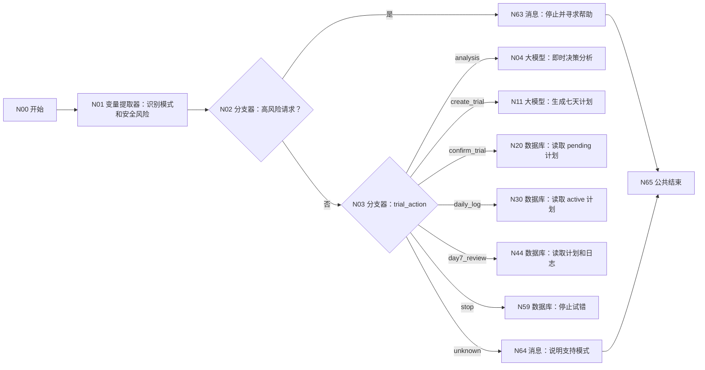

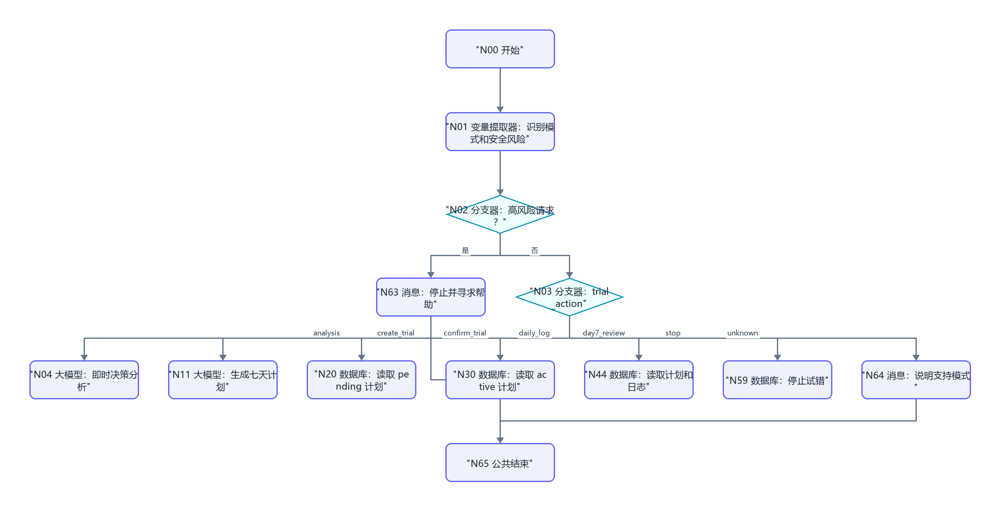

N01 输入 `user_input=N00/AGENT_USER_INPUT`、`trial_id=N00/trial_id`，输出：

| 变量 | 类型 | 描述 |
|---|---|---|
| `trial_action` | String | analysis/create_trial/confirm_trial/daily_log/day7_review/stop/unknown |
| `safety_risk` | Boolean | 自伤、伤人、违法、极端健康风险或要求替代专业诊疗时为 true |
| `decision_topic` | String | 决策主题 |
| `day_number` | Integer | 每日记录的第几天；无法判断为 0 |
| `action_reason` | String | 分类依据 |

N02 判断 `safety_risk == true`；N03 为 trial_action 添加七条固定值分支。

## 3. 即时分析 N04～N10

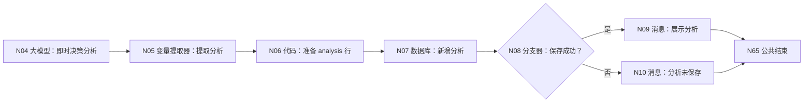

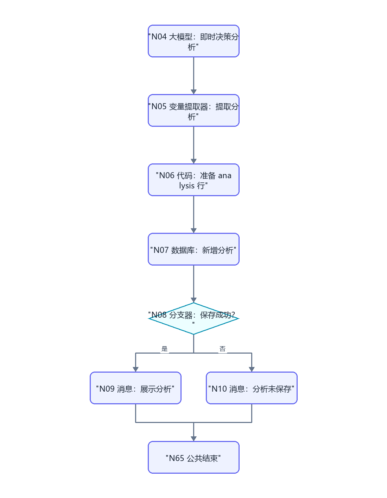

N04 模型 `Spark4.0 Ultra`，关闭历史。输入 `user_input=N00/AGENT_USER_INPUT`、`topic=N01/decision_topic`。系统提示词：

```text
你是低风险大学决策教练。用目标、选项、约束、可逆性、最坏情况、机会成本、信息缺口和下一步小实验分析，不替用户决定，不给成功概率。只输出 JSON：
{"topic":"","options":[],"constraints":[],"tradeoffs":[],"reversibility":"","worst_case":"","missing_information":[],"next_small_step":"","reply":""}
```

N05 输出 `decision_json:String`、`reply:String`。N06 输入 uid/request_time/decision_json/reply：

```python
def main(uid, request_time, decision_json, reply):
    return {
        "trial_id": str(uid) + "-DECISION-" + str(request_time), "record_type": "analysis",
        "decision_json": str(decision_json), "trial_plan_json": "{}", "pending_json": "{}",
        "confirmation_token": "", "day_number": 0, "daily_log_json": "{}", "review_json": "{}",
        "trial_status": "completed", "updated_at": str(request_time), "reply": str(reply)
    }
```

输出 `day_number:Integer`，以及 `trial_id/record_type/decision_json/trial_plan_json/pending_json/confirmation_token/daily_log_json/review_json/trial_status/updated_at/reply:String`。N07 表单新增 DB-09，逐项映射 N06 所有表字段；页面强制 uid 时引用 N00/uid。N08 判断 isSuccess。N09 展示 reply；N10 展示 decision_json 并说明未保存及 N07/message。

## 4. 创建七天试错 N11～N19

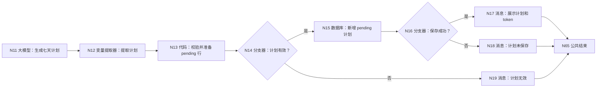

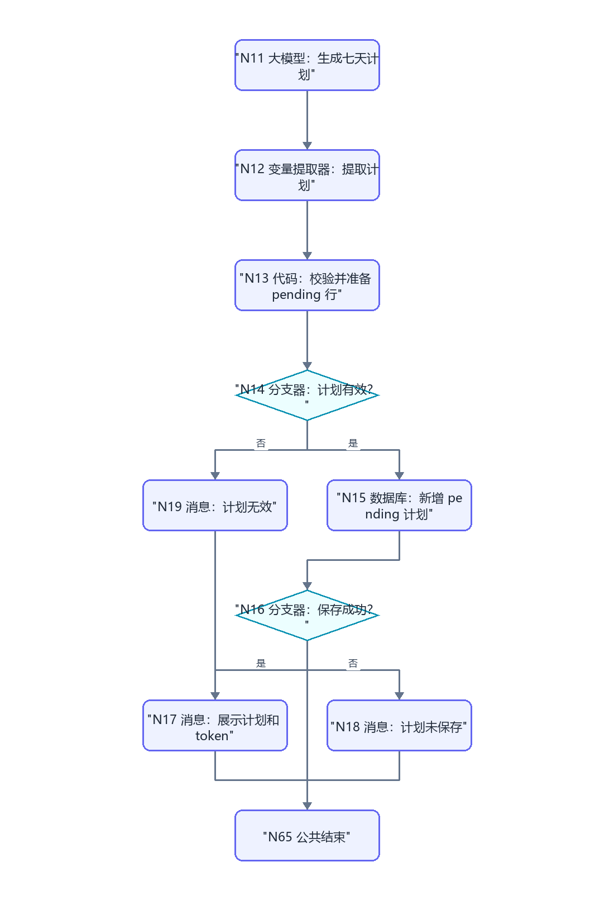

N11 输入 user_input/topic。系统提示词要求：每天 10～60 分钟、只收集验证决策所需证据、包含退出条件、安全边界和第七天复盘标准；只输出 `{"trial_plan":{},"reply":""}`。

N12 输出 `trial_plan_json:String`、`days:Array`、`success_evidence:Array`、`stop_conditions:Array`、`reply:String`。

N13 输入 uid/request_time 和 N12 输出：

```python
def main(uid, request_time, trial_plan_json, days, success_evidence, stop_conditions, reply):
    errors = []
    if not str(trial_plan_json).strip().startswith("{"): errors.append("计划 JSON 无效")
    if not isinstance(days, list) or len(days) != 7: errors.append("必须恰好 7 天")
    if not isinstance(success_evidence, list) or len(success_evidence) == 0: errors.append("缺少验证证据")
    if not isinstance(stop_conditions, list) or len(stop_conditions) == 0: errors.append("缺少停止条件")
    token = str(uid) + "-TRIAL-" + str(request_time)
    return {
        "plan_valid": len(errors) == 0, "plan_error": ";".join(errors),
        "trial_id": str(uid) + "-TRIAL-" + str(request_time), "record_type": "plan",
        "decision_json": "{}", "trial_plan_json": "{}", "pending_json": str(trial_plan_json),
        "confirmation_token": token, "day_number": 0, "daily_log_json": "{}", "review_json": "{}",
        "trial_status": "pending", "updated_at": str(request_time), "reply": str(reply)
    }
```

输出 `plan_valid:Boolean`、`day_number:Integer`，以及 `plan_error/trial_id/record_type/decision_json/trial_plan_json/pending_json/confirmation_token/daily_log_json/review_json/trial_status/updated_at/reply:String`。N14 判断 plan_valid。N15 表单新增 DB-09 全字段。N16 判断 isSuccess。N17 展示 pending_json、trial_id、token，要求明确回复“确认启动七天试错”；N18/N19 分别展示数据库 message/plan_error。

## 5. 确认启动 N20～N29

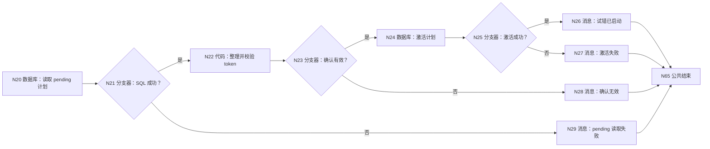

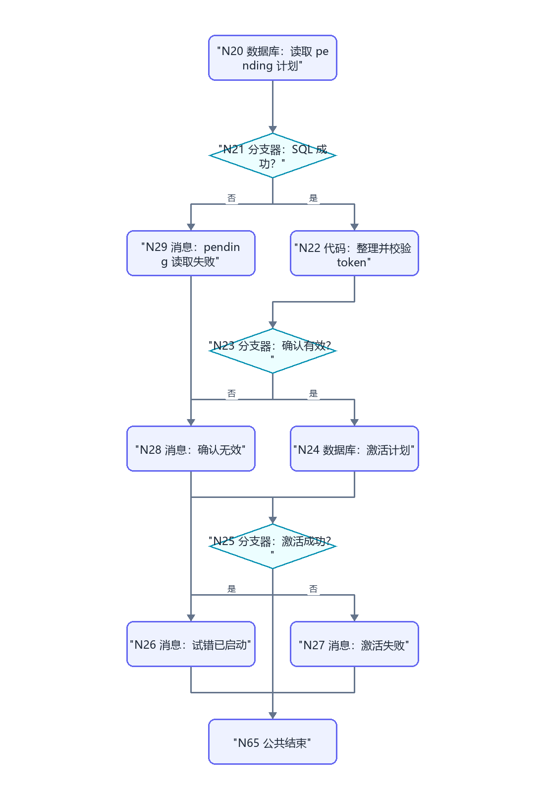

N20 自定义 SQL，输入 uid 和 trial_id：

```sql
SELECT id, trial_id, pending_json, confirmation_token, trial_status
FROM decision_trials
WHERE uid='{{uid}}' AND trial_id='{{trial_id}}' AND record_type='plan' AND trial_status='pending'
ORDER BY updated_at DESC LIMIT 1;
```

N21 判断 isSuccess。N22 输入 outputList、input_token=N00/confirmation_token：

```python
def main(outputList, input_token):
    rows = outputList if isinstance(outputList, list) else []
    row = rows[0] if len(rows) > 0 and isinstance(rows[0], dict) else {}
    stored = str(row.get("confirmation_token", ""))
    valid = len(row) > 0 and str(input_token) != "" and str(input_token) == stored
    return {
        "confirm_valid": valid, "confirm_error": "" if valid else "pending 不存在或 token 不匹配",
        "record_id": int(row.get("id", 0)) if str(row.get("id", "0")).isdigit() else 0,
        "trial_plan_json": str(row.get("pending_json", "{}"))
    }
```

输出 confirm_valid:Boolean、confirm_error:String、record_id:Integer、trial_plan_json:String。N23 判断 confirm_valid。N24 表单更新 DB-09，范围 `id=N22/record_id AND uid=N00/uid`；更新 `trial_plan_json=N22/trial_plan_json`、`pending_json={}`、`confirmation_token=空`、`trial_status=active`、`updated_at=N00/request_time`。N25 判断 isSuccess；N26 显示“已启动”和 trial_id；N27/N28/N29 显示对应错误。

## 6. 每日记录 N30～N43

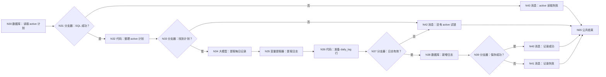

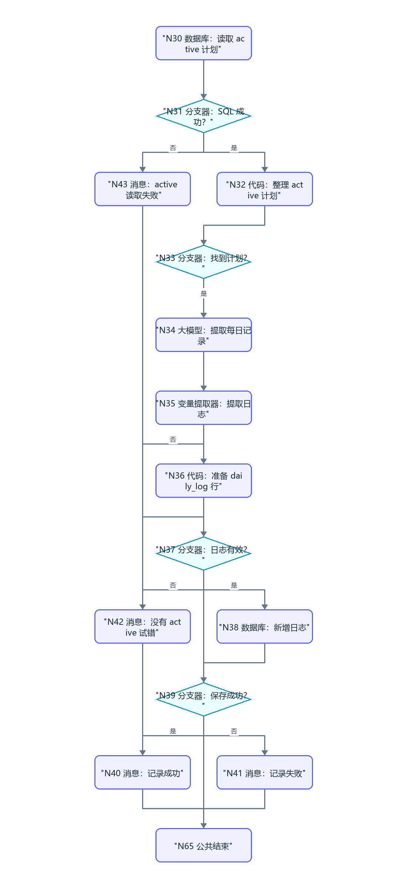

N30 选择自定义 SQL，输入 `uid=N00/uid`、`trial_id=N00/trial_id`：

```sql
SELECT id, trial_id, trial_plan_json, trial_status, updated_at
FROM decision_trials
WHERE uid='{{uid}}' AND trial_id='{{trial_id}}'
  AND record_type='plan' AND trial_status='active'
ORDER BY updated_at DESC LIMIT 1;
```

N31 判断 `N30/isSuccess == true`。N32 输入 `outputList=N30/outputList`：

```python
def main(outputList):
    rows = outputList if isinstance(outputList, list) else []
    row = rows[0] if len(rows) > 0 and isinstance(rows[0], dict) else {}
    plan_text = str(row.get("trial_plan_json", ""))
    return {"has_active": len(row) > 0 and len(plan_text.strip()) > 2, "trial_plan_json": plan_text if plan_text else "{}"}
```

输出 `has_active:Boolean`、`trial_plan_json:String`。N33 判断 `has_active == true`。

N34 输入 user_input、day_number=N01/day_number、trial_plan_json。系统提示词只提取“实际做了什么、时长、证据、感受、阻碍、是否触发停止条件”，不得把计划写成已完成。N35 输出 `daily_log_json:String`、`day_number:Integer`、`reply:String`。

N36：

```python
def main(uid, trial_id, request_time, day_number, daily_log_json, reply):
    try: day = int(day_number)
    except: day = 0
    valid_day = 1 <= day <= 7
    return {
        "log_valid": valid_day, "log_error": "" if valid_day else "day_number 必须为 1～7",
        "trial_id": str(trial_id), "record_type": "daily_log", "decision_json": "{}", "trial_plan_json": "{}",
        "pending_json": "{}", "confirmation_token": "", "day_number": day,
        "daily_log_json": str(daily_log_json), "review_json": "{}", "trial_status": "active",
        "updated_at": str(request_time), "reply": str(reply)
    }
```

N36 输出 `log_valid:Boolean`、`day_number:Integer`，以及 `log_error/trial_id/record_type/decision_json/trial_plan_json/pending_json/confirmation_token/daily_log_json/review_json/trial_status/updated_at/reply:String`。N37 判断 `N36/log_valid == true`；false → N42（消息中显示 N36/log_error），true → N38。N38 表单新增 DB-09 全字段，N39 判断 `N38/isSuccess == true`，N40/N41 分别展示成功或 N38/message。

## 7. 第七天复盘 N44～N58

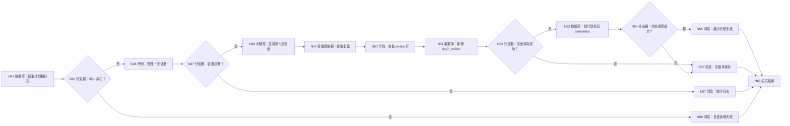

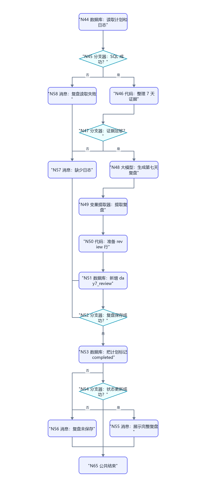

N44 自定义 SQL，输入 uid、trial_id：

```sql
SELECT id, trial_id, record_type, trial_plan_json, day_number,
       daily_log_json, trial_status, updated_at
FROM decision_trials
WHERE uid='{{uid}}' AND trial_id='{{trial_id}}'
  AND record_type IN ('plan','daily_log')
ORDER BY day_number ASC, updated_at ASC;
```

N45 判断 `N44/isSuccess == true`。

N46 输入 `outputList=N44/outputList`：

```python
def main(outputList):
    rows = outputList if isinstance(outputList, list) else []
    plan_json = "{}"
    logs = []
    for row in rows:
        if isinstance(row, dict) and row.get("record_type") == "plan":
            plan_json = str(row.get("trial_plan_json", "{}"))
        if isinstance(row, dict) and row.get("record_type") == "daily_log" and len(str(row.get("daily_log_json", "")).strip()) > 2:
            logs.append(row)
    return {
        "plan_json": plan_json,
        "daily_logs": logs,
        "log_count": len(logs),
        "review_ready": len(logs) >= 3 and len(plan_json.strip()) > 2,
    }
```

输出 `plan_json:String`、`daily_logs:Array<Object>`、`log_count:Integer`、`review_ready:Boolean`。N47 判断 `review_ready == true`。

N48 要求依据真实日志比较预期与实际、有效证据、反例、成本、是否继续/调整/停止，输出 `{"review":{},"recommendation":"continue|adjust|stop","reply":""}`。N49 输出 `review_json:String`、`recommendation:String`、`reply:String`。

N50 输入 `uid=N00/uid`、`trial_id=N00/trial_id`、`request_time=N00/request_time`、`review_json=N49/review_json`、`reply=N49/reply`：

```python
def main(uid, trial_id, request_time, review_json, reply):
    return {
        "trial_id": str(trial_id), "record_type": "day7_review",
        "decision_json": "{}", "trial_plan_json": "{}", "pending_json": "{}",
        "confirmation_token": "", "day_number": 7, "daily_log_json": "{}",
        "review_json": str(review_json), "trial_status": "completed",
        "updated_at": str(request_time), "reply": str(reply)
    }
```

输出区声明 `day_number:Integer`，以及 `trial_id/record_type/decision_json/trial_plan_json/pending_json/confirmation_token/daily_log_json/review_json/trial_status/updated_at/reply:String`。N51 选择表单新增 DB-09，逐字段映射 N50 的 `trial_id/record_type/decision_json/trial_plan_json/pending_json/confirmation_token/day_number/daily_log_json/review_json/trial_status/updated_at`；页面强制 uid 时引用 N00/uid。N52 判断 `N51/isSuccess == true`。

N53 表单更新 DB-09：范围 uid+trial_id+record_type 固定 `plan`；更新 trial_status=`completed`、updated_at=request_time。N54 判断 isSuccess。N55 展示 reply+review_json，并说明若要改主规划需进入 WF-06。

## 8. 停止、安全、结束

停止路径使用 N59 数据库：表单更新 DB-09，范围 uid+trial_id+record_type=plan；更新 trial_status=stopped、updated_at=request_time。N60 判断 isSuccess；成功到 N61“试错已停止，已有日志保留”，失败到 N62 并显示 message。

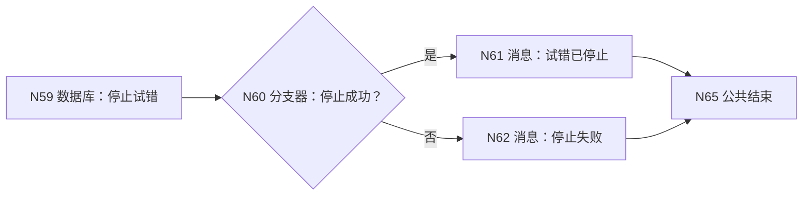

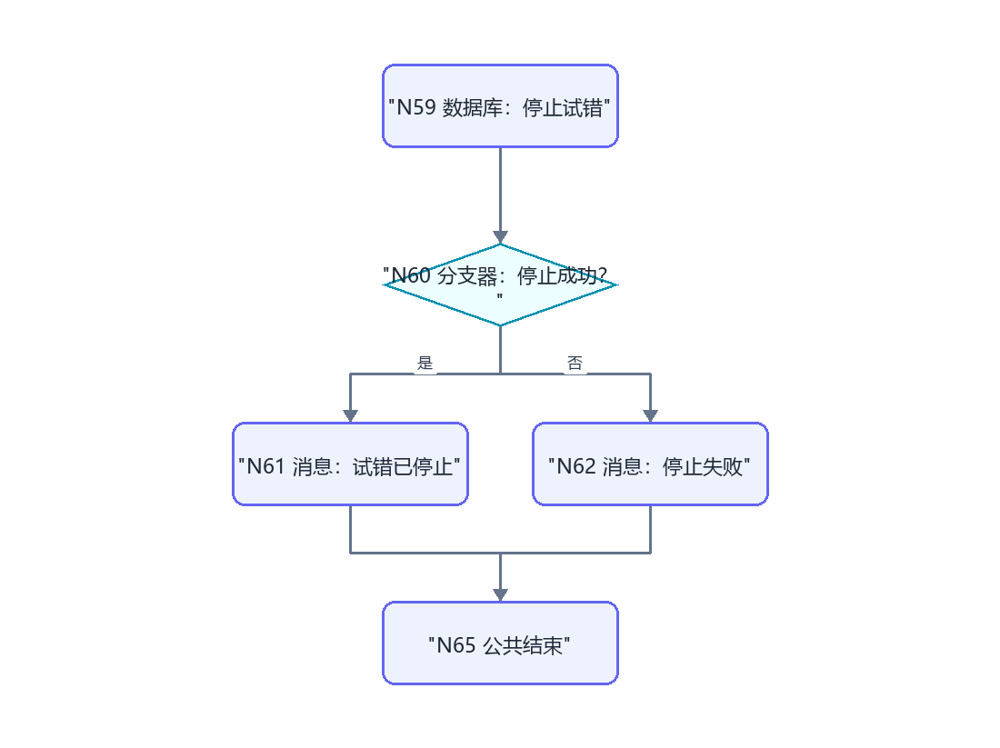

N63 安全消息：`这个请求可能涉及人身安全、严重健康或违法风险。我不能把它当作普通七天试错。请立即停止相关行动，并联系可信任的人或当地专业/紧急支持。`

N64：说明支持“即时分析、创建试错、确认启动、每日记录、第七天复盘、停止试错”，并要求 trial_id。

所有消息连接 N65。N65 配置 `output｜输入｜workflow_finished`，回答内容“本轮处理已结束，请以上方消息节点的提示为准。”，流式关闭。

## 9. 调试指南

1. analysis：应新增 record_type=analysis，不进入确认。
2. create_trial：必须 7 天、含证据和停止条件，新增 pending，返回 token。
3. 错 token：不能激活；正确 token 后 plan 行 active。
4. daily_log：无 active 计划到 N42；day_number 超范围不写入。
5. day7_review：不足 3 条日志到 N57；足够后新增 review 并把 plan 改 completed。
6. stop：只把计划状态改 stopped，不删除日志。
7. safety：高风险输入直接 N63，不调用普通决策模型。

## 10. 验收清单

- [ ] 五种模式和 stop/unknown/safety 均有独立终点。
- [ ] pending 计划只有 token 确认后才 active。
- [ ] 日志只记录事实，不把计划当完成。
- [ ] 复盘保存后同时关闭 active 计划。
- [ ] 所有数据库新增填满 DB-09 必填字段。
- [ ] 所有代码无 import，输出区声明完整，所有消息连接 N65。
