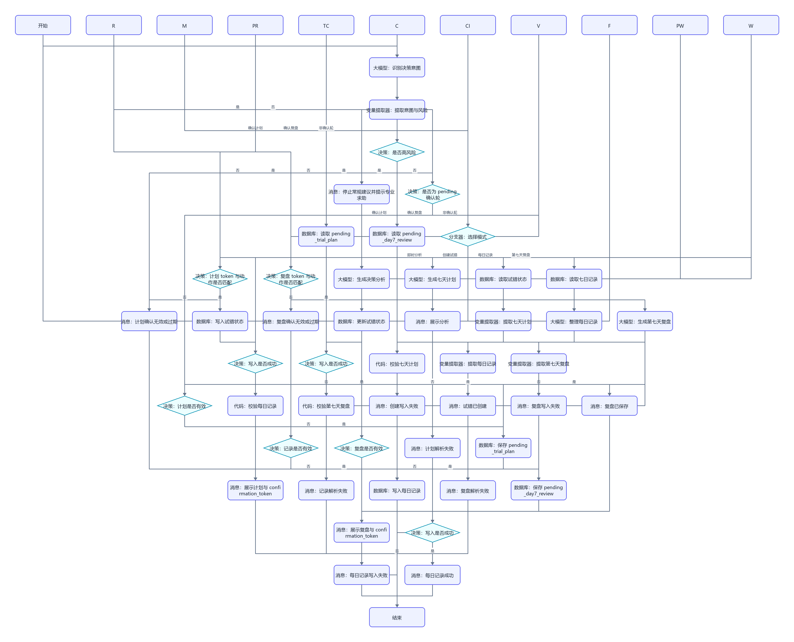
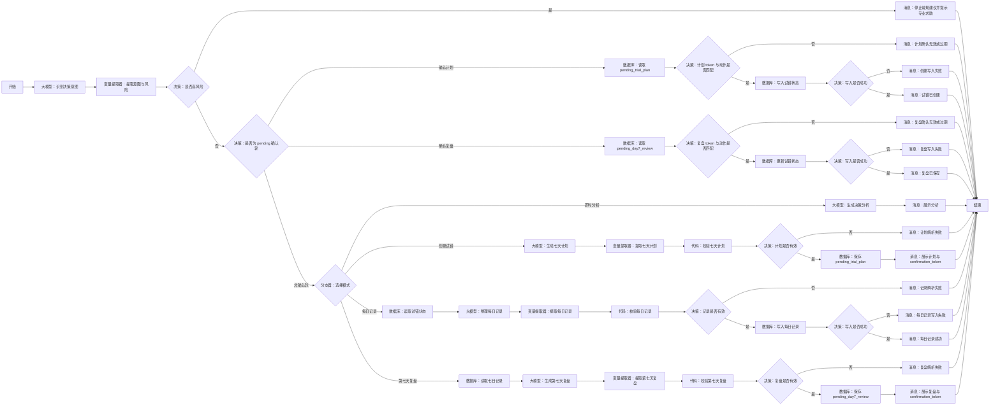

# WF-10 决策分析与七天试错搭建指南

## 1. 目标与准备

对即时选择做机会成本分析，或创建、记录、复盘七天试错，产出 `decision_trial_json`。输入为 `AGENT_USER_INPUT`、`uid`、`session_id`、可选 `context_json`、`confirm_action`、`confirmation_token`；存储实体为 `decision_trials`。token 由主 Agent 或平台生成，不由大模型编造。七天试错用于获得行为证据，不承诺七天完成大型成果。

## 2. 最小可运行版

```text
开始 → 大模型（生成决策或试错草稿）→ 结束
```

拖入“大模型”并重命名，连接开始和结束。提示词使用下方提示词 A；结束输出模型文本。此版不读取历史、不保存，状态为 `draft`。

## 3. 完整业务版画布、节点清单与逐步连线





```text
开始 → 大模型（识别决策意图）→ 变量提取器（提取意图与风险）→ 决策（是否高风险）
├─ 是 → 消息（停止常规建议并提示专业求助）→ 结束
└─ 否 → 决策（是否为 pending 确认轮）
   ├─ 确认计划 → 数据库（读取 pending_trial_plan）→ 决策（token 与动作是否匹配）
   │  ├─ 否 → 消息（计划确认无效或已过期）→ 结束
   │  └─ 是 → 数据库（写入试错状态）→ 决策（写入是否成功）→ 消息 → 结束
   ├─ 确认复盘 → 数据库（读取 pending_day7_review）→ 决策（token 与动作是否匹配）
   │  ├─ 否 → 消息（复盘确认无效或已过期）→ 结束
   │  └─ 是 → 数据库（更新试错状态）→ 决策（写入是否成功）→ 消息 → 结束
   └─ 非确认轮 → 分支器（选择模式）
├─ 即时分析 → 大模型（生成决策分析）→ 消息（展示分析）→ 结束
├─ 创建试错 → 大模型（生成七天计划）→ 变量提取器（提取七天计划）→ 代码（校验七天计划）→ 决策（计划是否有效）→ 数据库（保存 pending_trial_plan）→ 消息（展示 token）→ 结束
├─ 每日记录 → 数据库（读取试错状态）→ 大模型（整理每日记录）→ 变量提取器（提取每日记录）→ 代码（校验每日记录）→ 决策（记录是否有效）→ 数据库（写入每日记录）→ 决策（写入是否成功）→ 消息 → 结束
└─ 第七天复盘 → 数据库（读取七日记录）→ 大模型（生成第七天复盘）→ 变量提取器（提取第七天复盘）→ 代码（校验第七天复盘）→ 决策（复盘是否有效）→ 数据库（保存 pending_day7_review）→ 消息（展示 token）→ 结束
```

拖入 5 个“大模型”、4 个“变量提取器”、3 个“代码”、1 个“分支器”、9 个“数据库”、10 个“决策”、15 个“消息”和各 1 个“开始/结束”。按图从左到右放置、重命名、连线。两个确认轮从前置决策分流，不重新运行计划或复盘生成节点。

## 4. 实际配置与变量映射

| 节点 | 关键配置 | 输出 |
|---|---|---|
| 识别决策意图 | 提示词 A，只输出 JSON | `intent_json` |
| 提取意图与风险 | 提取 `mode`,`trial_id`,`day`,`high_risk`,`risk_reason` | 同名变量 |
| 是否高风险 | `high_risk=true` 时进入专业求助安全出口 | 分支 |
| 是否为 pending 确认轮 | 按 `confirm_action` 路由确认计划、确认复盘或新请求 | 分支 |
| 读取 pending_trial_plan | `uid + confirmation_token` | `pending_trial_plan` |
| 计划 token 与动作是否匹配 | 动作为 `confirm_trial_plan` 且用户/token/pending 匹配 | `confirmation_ok` |
| 读取 pending_day7_review | `uid + confirmation_token` | `pending_day7_review` |
| 复盘 token 与动作是否匹配 | 动作为 `confirm_day7_review` 且用户/token/pending 匹配 | `confirmation_ok` |
| 选择模式 | `mode` 分为 `decision_analysis/create_trial/daily_log/day7_review` | 分支 |
| 生成决策分析 | 提示词 B | `decision_analysis_json` |
| 生成七天计划 | 提示词 C | `trial_plan_json` |
| 提取/校验七天计划 | 检查假设、投入上限、最小行动和 7 日安排 | `plan_valid`,`validated_trial_plan_json` |
| 保存 pending_trial_plan | 只保存 `validated_trial_plan_json`、用户、token 和 `awaiting_confirmation` | `pending_trial_plan` |
| 保存 pending_day7_review | 只保存 `validated_review_json`、用户、token 和 `awaiting_confirmation` | `pending_day7_review` |
| 读取试错状态 | `uid + trial_id` | `trial_state_json` |
| 整理每日记录 | 提取精力、兴趣、完成度、困难、说明 | `daily_log_json` |
| 提取/校验每日记录 | 检查 `trial_id`、日期 1～7 和量表范围 | `log_valid`,`validated_daily_log_json` |
| 生成/提取/校验第七天复盘 | 检查证据、理由和决定枚举 | `review_valid`,`validated_review_json` |
| 写入节点 | 保留 `record_version`；不得覆盖其他用户 | `write_result` |
| 写入是否成功 | 检查成功标志；否则回读版本 | `write_ok` |

核心结构：

```json
{"mode":"create_trial","decision_question":"","analysis":{},"trial":{"trial_id":"","hypothesis":"","investment_cap":{"time_minutes_per_day":30,"money":0},"daily_minimum_action":"","status":"planned","daily_logs":[],"day7_review":{"evidence":[],"decision":"continue","reason":"","next_adjustment":""}}}
```

## 5. 可复制完整提示词

### 提示词 A：意图识别

```text
识别用户要做的模式，只输出合法 JSON：{"mode":"decision_analysis|create_trial|daily_log|day7_review","trial_id":"","day":null,"high_risk":false,"risk_reason":""}。若请求涉及自伤、严重身心症状、违法操作或可能造成重大人身/财务损害的具体执行，high_risk=true 并简述原因，不提供执行步骤。其余按最接近模式分类，缺失字段留空。
用户输入：{{AGENT_USER_INPUT}}
```

### 提示词 B：即时决策分析

```text
你是决策辅助教练，不替用户决定。围绕问题输出 JSON，必须包含 options，以及每个选项的 benefits、risks、time_cost、economic_cost、opportunity_cost、reversibility、worst_case、exit_conditions；再给 assumptions、missing_information、suggested_small_test。不得输出伪精确成功率。政策及时效信息提示通过官方渠道复核。
问题：{{AGENT_USER_INPUT}}
上下文：{{context_json}}
```

### 提示词 C：七天试错计划

```text
为用户生成七天低成本试错计划，只输出合法 JSON。包含 hypothesis、investment_cap（每日时间和总金钱上限）、daily_minimum_action、day1_to_day7、daily_metrics（energy 1-5、interest 1-5、completion 0-100、difficulty）、stop_conditions、day7_questions。每天最小行动应可在投入上限内完成；目标是收集证据，不是完成大型成果。status=planned。未知条件列入 missing_information，不虚构。
用户目标：{{AGENT_USER_INPUT}}
```

每日整理提示词：

```text
仅从用户原话提取本日记录：trial_id、day、action_done、energy、interest、completion、difficulty、note。未知为 null。中断不是失败，可记录 rest 或 skipped_with_reason。输出合法 JSON，不作道德评价。
```

第七天复盘提示词：

```text
根据七日记录区分事实与推断，汇总完成情况、精力/兴趣趋势、主要困难和反证。给出 continue、adjust、stop 三者之一作为建议，并说明依据、局限和下一步；决定权属于用户。无足够记录时返回 insufficient_evidence，不假装完成第七天复盘。
```

三个“代码”节点分别解析对应 JSON：计划必须含 `hypothesis`、`investment_cap`、`daily_minimum_action` 且 `day1_to_day7` 恰为 7 项；每日记录必须含 `trial_id`，`day` 为 1～7，量表在提示词范围；复盘的 `decision` 只能为 `continue/adjust/stop` 且必须有 `reason`。解析异常或字段不合格返回对应 `*_valid=false`，进入“计划/记录/复盘解析失败”消息并结束，绝不连接写入节点。代码语法以当前编辑器为准。

## 6. 确认、安全出口与失败处理

创建计划首轮只保存 `pending_trial_plan`，返回 `status=awaiting_confirmation`、`next_action=confirm_trial_plan` 和 `confirmation_token`；第七天复盘首轮只保存 `pending_day7_review`，返回 `next_action=confirm_day7_review` 和 token。下一轮必须携带对应 `confirm_action` 与 token，回读同一用户 pending 后写正式库，且不重新生成。token 不匹配、pending 过期或普通“好的”均结束且不写入。

两个确认轮成功均返回 `result_json.status=write_succeeded`，`data.decision_trial_json` 直接取对应 pending 中的已校验 JSON，`next_action=none`；失败返回 `write_failed`。确认轮禁止把用户确认文字送入计划或复盘大模型。

即时分析不必写入。创建试错和最终结论属于正式记录，必须按上述跨轮 pending 状态机确认。触发投入上限或停止条件时暂停计划，提示用户选择调整或停止。涉及医疗、心理、法律、财务高风险事项只提供一般信息并提示专业求助。写入失败统一返回 `write_failed`、`next_action=retry_trial_write`，不得声称已创建或已记录。

## 7. 调试与验收清单

成功用例：“我在考研和就业间犹豫，想先用七天体验数据分析，每天最多 30 分钟。”预期进入 `create_trial`，计划含假设、投入上限、每日最小行动；未确认不写入。第七天仅有 3 条记录时应标记证据不足。

失败用例：缺 `uid` 后要求保存，预期只返回草稿；模拟写入失败，预期回复明确“未保存”。

- [ ] 四种模式路由正确，产出 `decision_trial_json`。
- [ ] 即时分析包含八个决策维度，不替用户拍板。
- [ ] 试错包含假设、投入上限、最小行动、每日指标和退出条件。
- [ ] 创建与最终结论经过确认，失败不报成功。
- [ ] 完成试错可把行为证据交给 WF-08，结果交给 WF-12。

## 数据库与输入输出配置教程

本节的通用点击位置、建表入口、导入按钮和数据库节点输出解释见[数据库从零教程](../database/README.md)；请先完成该教程，再按本节配置当前 WF。

创建 `decision_trials` 并上传 [DB-09-decision-trials.xlsx](../database/import-templates/DB-09-decision-trials.xlsx)。

| 输入 | 来源 | 示例 |
|---|---|---|
| `AGENT_USER_INPUT` | 开始节点 | `我在纠结考研还是就业`、`创建七天试错`、`记录第2天`、`确认试错计划` |
| `uid` | 主 Agent | `test_user_001` |
| `trial_id` | 创建结果/用户输入 | 例如 `TRIAL-001` |
| `day_number` | 变量提取 | 1～7 |
| `confirmation_token` | pending 结束输出 | 确认轮使用 |

读取完整试错：

```sql
SELECT * FROM decision_trials
WHERE uid='{{uid}}' AND trial_id='{{trial_id}}'
ORDER BY day_number ASC, create_time ASC;
```

创建计划和第七天复盘都先保存到 `pending_json`，`record_type` 分别使用 `plan`、`day7_review`，并保存 token；下一轮按 `uid + trial_id + confirmation_token` 读取后才写 `trial_plan_json` 或 `review_json`。每日记录新增 `record_type=daily_log,day_number,daily_log_json`。

| 节点 | 输入 | 输出 |
|---|---|---|
| 意图与风险提取 | 用户输入 | `mode,high_risk,trial_id,day_number` |
| 数据库读取 | `uid,trial_id` | `isSuccess,message,outputList` |
| 模型/校验 | 状态和用户输入 | 各类 validated JSON |
| pending/正式写入 | uid、业务键、JSON | `isSuccess` |
| 结束 | `result_json` | `output` |

调试即时分析（可不写库）、创建 pending、错误 token、确认计划、记录第 2 天、第七天 pending/确认以及 high_risk 安全出口。写入失败不得输出“已创建/已保存”。
