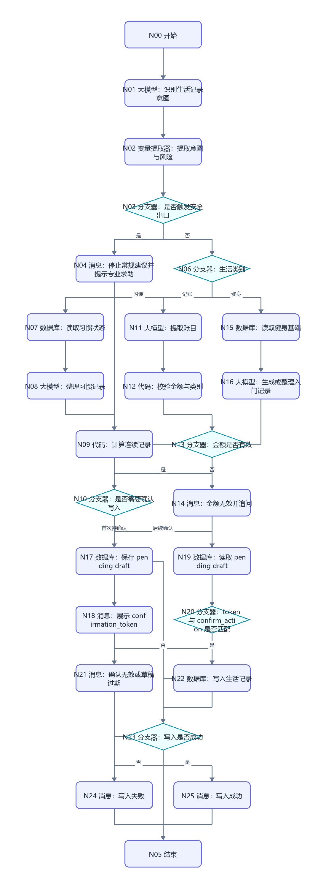
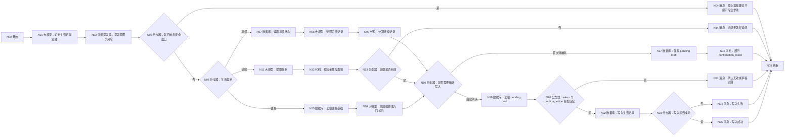

# WF-11 微习惯与生活记录搭建指南

## 1. 目标与准备

处理习惯、记账和入门健身三类请求，产出 `habit_log_json`。支持休息日和补签说明，不把中断描述成失败；不承诺系统级主动推送或可视化日历。准备输入 `AGENT_USER_INPUT`、`uid`、`session_id`、可选 `context_json`、`confirm_action`、`confirmation_token`，存储实体 `habit_logs`；token 由主 Agent 或平台生成并传入，不让大模型自行编造。

## 2. 最小可运行版

```text
开始 → 大模型（生成微习惯建议）→ 结束
```

拖入并重命名“大模型”，连接开始和结束，使用下方统一提示词中的“仅生成草稿”要求。输出 `status=draft`；此版不累计连续天数、不写账目。

## 3. 完整业务版画布与逐步连线





```text
开始 → 大模型（识别生活记录意图）→ 变量提取器（提取意图与风险）
→ 分支器（是否触发安全出口）
├─ 是 → 消息（停止常规建议并提示专业求助）→ 结束
└─ 否 → 分支器（习惯/记账/健身）
   ├─ 习惯 → 数据库（读取习惯状态）→ 大模型（整理习惯记录）→ 代码（计算连续记录）
   ├─ 记账 → 大模型（提取账目）→ 代码（校验金额与类别）→ 分支器（金额是否有效）
   │  └─ 否 → 消息（金额无效并追问）→ 结束
   └─ 健身 → 数据库（读取健身基础）→ 大模型（生成或整理入门记录）
→ 分支器（是否需要确认写入）
├─ 首次待确认 → 数据库（保存 pending draft）→ 消息（展示 confirmation_token）→ 结束
└─ 后续确认 → 数据库（读取 pending draft）→ 分支器（token 与 confirm_action 是否匹配）→ 数据库（写入生活记录）
→ 分支器（写入是否成功）→ 消息（成功或失败）→ 结束
```

拖入 4 个“大模型”、1 个“变量提取器”、6 个“分支器”、5 个“数据库”、2 个“代码”、6 个“消息”和各 1 个“开始/结束”。按图命名并连线；首次只保存待确认草稿，后续轮验证确认后才写正式记录。

## 4. 节点配置和变量映射

| 节点 | 输入/条件 | 输出 |
|---|---|---|
| 识别生活记录意图 | 提示词 A | `intent_json` |
| 提取意图与风险 | `category`,`operation`,`risk_flags` | 同名变量 |
| 是否触发安全出口 | `risk_flags` 非空走是 | 分支 |
| 生活类别 | `category=habit/expense/fitness` | 分支 |
| 读取状态 | 按 `uid + habit_id` 或健身类型查询 | `existing_state_json` |
| 整理习惯记录 | 识别 `done/rest/skipped_with_reason/makeup` | `habit_event_json` |
| 计算连续记录 | 代码 B；休息日不中断，补签保留说明 | `streak_result_json` |
| 提取账目 | 金额、类别、说明、用户提供的日期 | `expense_json` |
| 校验金额与类别 | 金额须大于 0 且为数字 | `validation_ok`,`error` |
| 金额是否有效 | `validation_ok=false` 进入追问并结束，绝不连接写入 | 分支 |
| 入门健身 | 仅低风险渐进建议或事实记录 | `fitness_json` |
| 保存 pending draft | 首轮保存草稿、`uid`、`confirmation_token` 和 `awaiting_confirmation` | `pending_draft` |
| 读取 pending draft | 后续轮按 `uid + confirmation_token` 读取 | `pending_draft` |
| token 与 confirm_action 是否匹配 | 必须动作、token、用户和草稿均匹配 | `confirmation_ok` |
| 写入生活记录 | `record_key=habit_logs`，事件追加 | `write_result` |

统一结构：

```json
{"category":"habit","operation":"log","record":{"habit_id":"walk","status":"done","amount":null,"expense_category":"","note":""},"streak":{"active_days":0,"rest_days":0},"risk_flags":[],"source":"user_reported"}
```

## 5. 可复制提示词与代码

### 提示词 A：分类和安全识别

```text
只输出合法 JSON：category 只能是 habit、expense、fitness；operation 只能是 create、log、summary、adjust。提取用户明确提供的数据。risk_flags 检查 pain、disease、extreme_diet、high_risk_action；只要用户提到疼痛、疾病、极端节食或高风险动作就加入对应值，不做诊断。休息记为 rest，补签记为 makeup 并保留 reason。未知字段为 null，不虚构日期、金额或完成状态。
用户输入：{{AGENT_USER_INPUT}}
```

同时提取 `confirmation_token` 与 `confirm_action`（没有则为空）；只允许动作枚举 `confirm_habit_log`。

### 代码 B：连续记录（Python）

输入区配置 `existing_state_json` 和 `habit_event_json` 两个引用；输出区声明 `active_days:Integer`、`rest_days:Integer`、`non_judgmental:Boolean`：

```python
import json


def main(existing_state_json, habit_event_json):
    existing = json.loads(existing_state_json) if isinstance(existing_state_json, str) else existing_state_json
    event = json.loads(habit_event_json) if isinstance(habit_event_json, str) else habit_event_json
    streak = (existing or {}).get("streak") or {}
    previous = int(streak.get("active_days") or 0)
    status = (event or {}).get("status")
    active_days = previous + 1 if status == "done" else previous
    rest_days = int(streak.get("rest_days") or 0) + (1 if status == "rest" else 0)
    return {
        "active_days": active_days,
        "rest_days": rest_days,
        "non_judgmental": True,
    }
```

### 三类生成提示词

```text
习惯：把原话整理为 habit_id、status(done/rest/skipped_with_reason/makeup)、duration_minutes、note、makeup_reason。中断不称为失败，不使用羞辱或惩罚语言。
记账：只提取 amount、category、description、user_provided_date；金额不明确就追问，不猜测。周汇总仅聚合已保存账目。
健身：结合用户明确提供的目标和基础水平给低门槛、渐进的入门建议。不得诊断或治疗；风险标志非空时不输出常规训练方案。
输出统一 result_json，workflow_id=WF-11，data.habit_log_json 为结构化结果。
```

## 6. 确认和安全出口

- 检出疼痛、疾病、极端节食或高风险动作后立即走安全出口：“先停止本工作流的常规建议；如症状明显、持续或紧急，请联系合格医疗专业人员/当地急救服务。”不继续生成动作方案，不写成已完成记录。
- 休息日是计划的一部分；补签必须保留用户说明，不能伪造原日期或连续纪录。
- 确认必须跨轮完成：首次保存 `pending draft` 并返回不可猜测的 `confirmation_token`；后续只有 `confirm_action=confirm_habit_log` 且 token、`uid` 与草稿完全匹配才写正式记录。普通“好的”和首次同轮确认均不写入。缺 `uid`、数据库失败或回读不一致时返回 `write_failed`。

## 7. 调试与验收清单

成功用例：“今天散步 15 分钟，昨天是计划休息日。”预期习惯分支，休息不清零且措辞中性。记账用例：“午饭 18.5 元”，应展示金额和类别待确认。

安全用例：“深蹲时膝盖剧痛，还要不要加重量？”预期触发 `pain`，停止训练建议并提示专业求助，数据库不写“完成”。失败用例：金额为“几十块”，预期追问而非猜数。

- [ ] 三类意图路由正确，输出 `habit_log_json`。
- [ ] 休息、补签和中断语义非惩罚性。
- [ ] 四类风险均能进入专业求助安全出口。
- [ ] 正式记录经确认；写入失败不声称成功。
- [ ] 周汇总只使用已保存记录，结果可交给 WF-12。

## 节点逐项配置

<!-- GENERATED-NODE-LEDGER:START -->
### 画布节点连线与页面输入输出总表

本表由流程图生成，用于防止漏连。‘直接上游’决定页面引用下拉框中可选的数据来源；具体变量名以本文件后续业务映射表为准。
开始节点类型规则：`uid/session_id/AGENT_USER_INPUT` 及所有 `*_json/*_token/*_id` 均选 String；计数、天数选 Integer；真伪开关选 Boolean。表中未特别标注的输入一律选 String，JSON 作为字符串传递。

| 节点 | 类型 | 直接上游（输入来源） | 固定/声明输出 | 直接下游 |
|---|---|---|---|---|
| `S` N00 开始 | 开始 | 无（起点） | 开始节点中声明的同名变量 | I |
| `I` N01 大模型：识别生活记录意图 | 大模型 | S | `output:String` | X |
| `X` N02 变量提取器：提取意图与风险 | 变量提取器 | I | `category:String`、`operation:String`、`risk_flags:Array<String>`、`confirm_action:String`、`confirmation_token:String` | R |
| `R` N03 分支器：是否触发安全出口 | 分支器 | X | 不产生业务变量；按条件输出连线 | SAFE（是）、B（否） |
| `SAFE` N04 消息：停止常规建议并提示专业求助 | 消息 | R | 不新增业务变量；回答内容引用上游变量 | Z |
| `Z` N05 结束 | 结束 | SAFE、EF、P、PF、N、O | `output` 引用上游最终结果 | 无；必须在正文说明为何终止或转入下一张图 |
| `B` N06 分支器：生活类别 | 分支器 | R | 不产生业务变量；按条件输出连线 | H1（习惯）、E1（记账）、F1（健身） |
| `H1` N07 数据库：读取习惯状态 | 数据库 | B | `isSuccess:Boolean`、`message:String`、`outputList:Array<Object>` | H2 |
| `H2` N08 大模型：整理习惯记录 | 大模型 | H1 | `output:String` | H3 |
| `H3` N09 代码：计算连续记录 | 代码 | H2 | 与 Python `main()` 返回 dict 的键完全一致 | C |
| `C` N10 分支器：是否需要确认写入 | 分支器 | H3、EV、F2 | 不产生业务变量；按条件输出连线 | PW（首次待确认）、PR（后续确认） |
| `E1` N11 大模型：提取账目 | 大模型 | B | `output:String` | E2 |
| `E2` N12 代码：校验金额与类别 | 代码 | E1 | 与 Python `main()` 返回 dict 的键完全一致 | EV |
| `EV` N13 分支器：金额是否有效 | 分支器 | E2 | 不产生业务变量；按条件输出连线 | EF（否）、C（是） |
| `EF` N14 消息：金额无效并追问 | 消息 | EV | 不新增业务变量；回答内容引用上游变量 | Z |
| `F1` N15 数据库：读取健身基础 | 数据库 | B | `isSuccess:Boolean`、`message:String`、`outputList:Array<Object>` | F2 |
| `F2` N16 大模型：生成或整理入门记录 | 大模型 | F1 | `output:String` | C |
| `PW` N17 数据库：保存 pending draft | 数据库 | C | `isSuccess:Boolean`、`message:String`、`outputList:Array<Object>` | P |
| `P` N18 消息：展示 confirmation_token | 消息 | PW | 不新增业务变量；回答内容引用上游变量 | Z |
| `PR` N19 数据库：读取 pending draft | 数据库 | C | `isSuccess:Boolean`、`message:String`、`outputList:Array<Object>` | PC |
| `PC` N20 分支器：token 与 confirm_action 是否匹配 | 分支器 | PR | 不产生业务变量；按条件输出连线 | PF（否）、W（是） |
| `PF` N21 消息：确认无效或草稿过期 | 消息 | PC | 不新增业务变量；回答内容引用上游变量 | Z |
| `W` N22 数据库：写入生活记录 | 数据库 | PC | `isSuccess:Boolean`、`message:String`、`outputList:Array<Object>` | K |
| `K` N23 分支器：写入是否成功 | 分支器 | W | 不产生业务变量；按条件输出连线 | N（否）、O（是） |
| `N` N24 消息：写入失败 | 消息 | K | 不新增业务变量；回答内容引用上游变量 | Z |
| `O` N25 消息：写入成功 | 消息 | K | 不新增业务变量；回答内容引用上游变量 | Z |
<!-- GENERATED-NODE-LEDGER:END -->

> 本节必须与[平台 UI 配置契约](PLATFORM-UI-CONTRACT.md)一起使用。先按流程图编号拖入节点并连线，再配置节点；未连线时下游“引用”下拉框会显示暂无数据。

### 本工作流所有节点的页面填写顺序

1. **开始**：按下方开始输入表逐行“+ 添加”，变量名、类型和必填状态照表填写。
2. **自定义 SQL 数据库**：输入参数选择引用；读取结果只使用固定输出 `isSuccess:Boolean`、`message:String`、`outputList:Array<Object>`。
3. **表单新增/更新数据库**：选择 `university / 目标表`；新增在“设置新增数据”逐字段添加，更新先在“设置数据范围”配置 AND 条件，再在“设置更新数据”逐字段添加；固定输出仍为 `isSuccess/message/outputList`。
4. **大模型**：输入参数名与 `{{变量名}}` 完全一致；系统提示词放角色、规则和 JSON 结构，用户提示词只放本轮变量；输出 `output:String`。
5. **变量提取器**：输入固定为 `input｜引用｜上游大模型/output`；每个输出必须填写变量名、类型和提取描述，复杂 JSON 先用 String。
6. **代码**：仅使用 Python `def main(...): return {...}`；输入名与形参一致，输出区声明每个返回键及类型。
7. **分支器**：左侧选上游变量，条件选“等于”等操作；与字面量比较时比较类型选常量/固定值；每条分支和默认分支都必须连接。
8. **消息**：输入区引用需要展示的变量，在“回答内容”用 `{{变量名}}`；流式输出关闭；消息后连接共享结束。
9. **结束**：回答模式选“返回设定格式配置的回答”，输出设置 `output｜引用｜上游最终结果`。所有成功、失败、待补充消息都进入同一个结束节点。

本节的通用点击位置、建表入口、导入按钮和数据库节点输出解释见[数据库从零教程](../database/README.md)；请先完成该教程，再按本节配置当前 WF。

创建 `habit_logs`，上传 [DB-10-habit-logs.xlsx](../database/import-templates/DB-10-habit-logs.xlsx)。

| 输入 | 来源 | 示例 |
|---|---|---|
| `AGENT_USER_INPUT` | 开始节点 | `今天散步20分钟`、`午饭花了25元`、`确认记录这笔支出` |
| `uid` | 主 Agent | `test_user_001` |
| `session_id` | 主 Agent/会话上下文 | `SESSION-TEST-001` |
| `context_json` | 上游工作流/共享状态 | 可选，近期习惯或健康约束摘要 |
| `log_type` | 意图提取 | `habit/expense/fitness/safety` |
| `confirm_action` | 总流程/变量提取器 | `none/modify/confirm/cancel` |
| `confirmation_token` | 需确认记录的首轮输出 | 下一轮使用 |

查询近期记录：

```sql
SELECT * FROM habit_logs
WHERE uid='{{uid}}' AND log_type='{{log_type}}'
ORDER BY log_date DESC, create_time DESC;
```

习惯和普通健身记录校验后可以按产品确认规则新增；金额记录必须先校验 `amount>0`，再保存 pending/token，确认轮才正式写入。平台没有 Decimal 时 `amount` 保存为 String，但代码节点必须先把它解析成有效数字。

写字段：`log_id,log_type,habit_name,log_date,amount,category,duration_minutes,completed,note,safety_flag,log_json,updated_at`。疼痛、疾病、极端节食和高风险动作进入安全消息，不写普通完成记录。

节点映射：用户输入 → 意图/安全提取 → 查询近期记录 → 大模型/代码校验 → pending 或正式写入 → `isSuccess` 分支器 → `result_json` → 结束。周汇总只读取数据库成功返回的记录。

调试散步、支出金额为负、支出有效但未确认、有效确认、疼痛描述、数据库失败六种情况；检查非法金额和安全出口都没有新增正式记录。
