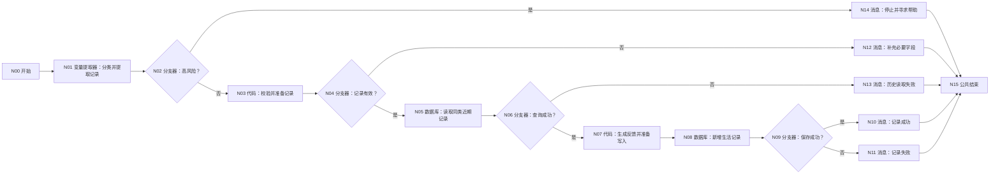

# WF-11 微习惯与生活记录：逐节点搭建指南

> WF-11 记录真实发生的习惯、支出和运动，不生成不存在的完成记录。高风险健康/安全输入直接停止，不默认把敏感求助内容写进数据库。

## 1. 数据表和输入

在 `university` 上传 [DB-10 habit_logs](../database/import-templates/DB-10-habit-logs.xlsx)，保留 `id/uid/create_time`。

N00 开始：

| 变量 | 类型 | 必填 | 调试值 |
|---|---|---:|---|
| `AGENT_USER_INPUT` | String | 是 | `今天背了20分钟单词` |
| `uid` | String | 是 | `test_user_001` |
| `request_time` | String | 是 | `2026-07-19 21:00:00` |

## 2. 完整流程图



N10～N14 全部连接 N15 结束。

## 3. N01 变量提取器：分类和提取

模型 `Spark4.0 Ultra`。输入 `user_input=N00/AGENT_USER_INPUT`。输出：

| 变量 | 类型 | 描述 |
|---|---|---|
| `log_type` | String | habit、expense、fitness、unknown 之一 |
| `habit_name` | String | 习惯名称 |
| `amount` | String | 支出金额，只保留用户原话中的数值 |
| `category` | String | 支出或活动类别 |
| `duration_minutes` | Integer | 用户明确提供的分钟数；未提供为 0 |
| `completed` | Boolean | 用户明确说已完成才为 true；计划做/想做为 false |
| `note` | String | 用户原始补充说明 |
| `safety_risk` | Boolean | 自伤、伤人、严重健康症状、极端节食/过度运动或违法风险时 true |
| `missing_fields` | Array | 当前类型缺少的必要字段 |

N02 引用 `safety_risk == true`。是 → N14，否 → N03。

## 4. N03/N04：校验并准备基础记录

N03 输入 uid/request_time 和 N01 全部输出：

```python
def main(uid, request_time, log_type, habit_name, amount, category, duration_minutes, completed, note, missing_fields):
    allowed = ["habit", "expense", "fitness"]
    errors = []
    try: minutes = int(duration_minutes)
    except: minutes = 0
    if str(log_type) not in allowed: errors.append("无法识别记录类型")
    if str(log_type) == "habit" and not str(habit_name).strip(): errors.append("缺少习惯名称")
    if str(log_type) == "expense" and not str(amount).strip(): errors.append("缺少支出金额")
    if str(log_type) == "fitness" and minutes <= 0: errors.append("缺少有效运动分钟数")
    completed_text = "true" if completed is True else "false"
    return {
        "record_valid": len(errors) == 0,
        "record_error": ";".join(errors),
        "log_id": str(uid) + "-LOG-" + str(request_time),
        "log_type": str(log_type),
        "habit_name": str(habit_name),
        "log_date": str(request_time),
        "amount": str(amount),
        "category": str(category),
        "duration_minutes": minutes,
        "completed": completed_text,
        "note": str(note),
        "safety_flag": "none",
        "log_json": "{}",
        "updated_at": str(request_time),
    }
```

输出区声明 `record_valid:Boolean`、`duration_minutes:Integer`，以及 `record_error/log_id/log_type/habit_name/log_date/amount/category/completed/note/safety_flag/log_json/updated_at:String`。N04：`record_valid == true`；是 → N05，否 → N12。

## 5. N05/N06：读取同类近期记录

N05 自定义 SQL，输入 `uid=N00/uid`、`log_type=N03/log_type`：

```sql
SELECT log_id, log_type, habit_name, log_date, amount, category,
       duration_minutes, completed, note, updated_at
FROM habit_logs
WHERE uid='{{uid}}' AND log_type='{{log_type}}'
ORDER BY log_date DESC, create_time DESC
LIMIT 20;
```

N06：`N05/isSuccess == true`；是 → N07，否 → N13。空数组是第一次记录，仍走“是”。

## 6. N07 代码：生成反馈并准备写入

输入 `outputList=N05/outputList` 以及 N03 的所有数据库字段：

```python
def main(outputList, log_id, log_type, habit_name, log_date, amount, category, duration_minutes, completed, note, safety_flag, log_json, updated_at):
    rows = outputList if isinstance(outputList, list) else []
    recent_completed = 0
    for row in rows:
        if isinstance(row, dict) and str(row.get("completed", "false")).lower() == "true":
            recent_completed += 1
    if str(log_type) == "habit":
        feedback = "已记录习惯：" + str(habit_name) + "。最近同类记录中完成 " + str(recent_completed) + " 次。"
    elif str(log_type) == "expense":
        feedback = "已记录支出：" + str(amount) + "，类别：" + str(category) + "。"
    else:
        feedback = "已记录运动：" + str(duration_minutes) + " 分钟，类别：" + str(category) + "。"
    return {
        "log_id": str(log_id), "log_type": str(log_type), "habit_name": str(habit_name),
        "log_date": str(log_date), "amount": str(amount), "category": str(category),
        "duration_minutes": int(duration_minutes), "completed": str(completed), "note": str(note),
        "safety_flag": str(safety_flag), "log_json": str(log_json), "updated_at": str(updated_at),
        "feedback": feedback
    }
```

输出区逐行声明全部返回键；duration_minutes Integer，其余 String。

> 这里写“最近同类完成次数”，不写“连续打卡天数”。当前代码环境不能 import 日期库，不能可靠处理跨月连续日期，文档不应假装算出了 streak。

## 7. N08/N09：新增记录并判断结果

N08 表单处理数据 → `university/habit_logs` → 新增数据。逐字段映射 N07 的 `log_id/log_type/habit_name/log_date/amount/category/duration_minutes/completed/note/safety_flag/log_json/updated_at`；页面强制 uid 时引用 N00/uid。

N09：`N08/isSuccess == true`；是 → N10，否 → N11。

## 8. 消息和结束

| 节点 | 配置 |
|---|---|
| N10 | 输入 `feedback=N07/feedback`，回答 `{{feedback}}` |
| N11 | 输入 `message=N08/message`，回答 `记录内容已整理，但没有保存：{{message}}` |
| N12 | 输入 `error=N03/record_error`，回答 `还不能保存这条记录：{{error}}。请补充后重试。` |
| N13 | 输入 `message=N05/message`，回答 `无法读取同类历史记录，本轮暂不写入，避免重复或状态不一致。错误：{{message}}` |
| N14 | 回答 `这个输入可能涉及严重健康或人身安全风险。我不会把它当作普通打卡保存。请停止相关行为，并尽快联系可信任的人和当地专业/紧急支持。` |

所有消息关闭流式输出并连接 N15。N15：回答模式“返回设定格式配置的回答”；输出 `output｜输入｜workflow_finished`；回答内容“本轮处理已结束，请以上方消息节点的提示为准。”。

## 9. 调试指南

1. 习惯完成：`今天背了20分钟单词`，应写 habit、completed=true、duration=20。
2. 只是计划：`明天想背单词`，completed=false；不能说已完成。
3. 支出：金额保留为 String，不自行换算币种。
4. 运动：缺分钟数到 N12，不写库。
5. 高风险节食/过度运动：到 N14，不写数据库。
6. 查询失败：临时改错 N05 表名，到 N13。
7. 新增失败：临时清空 log_id，到 N11。

## 10. 验收清单

- [ ] 只记录用户明确发生的事实，不把计划当完成。
- [ ] 高风险输入不写普通生活记录。
- [ ] DB-10 必填字段完整，amount 使用 String。
- [ ] 不伪造连续天数，只展示可证明的近期次数。
- [ ] 所有代码无 import，所有分支连接 N15。
