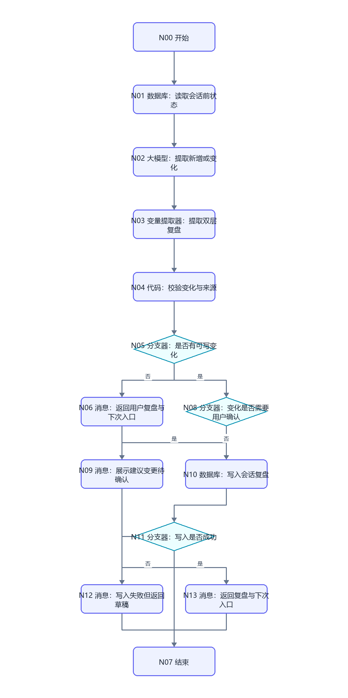
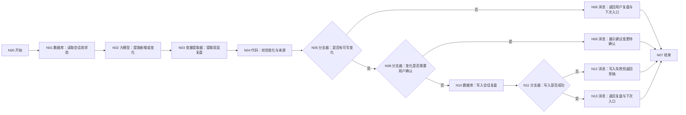

# WF-12 会话结束复盘搭建指南

## 1. 目标与调用时机

用户表达结束或当前任务完成时，生成用户复盘和 Agent 复盘，只保存新增或变化字段，产出 `session_recap_json` 和下次入口。普通闲聊不得直接当作事实，无限增长的画像长文不得写入。

## 2. 搭建前准备

- 输入：`AGENT_USER_INPUT`、`uid`、`session_id`、`context_json`；其中 `context_json` 应含本会话已确认结果、写入结果和会话前状态摘要，而非无限完整对话。
- 读取实体：必要的 `user_profile`、`main_plan`、`semester_tasks`；写入实体：`session_recaps`，必要时仅更新对应实体的变化字段。
- 所有数据库操作按本文件逐栏配置；不支持局部更新时，复盘只写入 `session_recaps`，由后续工作流按建议变更再次确认。

## 3. 最小可运行版

```text
开始 → 大模型（生成会话复盘草稿）→ 结束
```

拖入“大模型”，放在开始与结束之间并连线，使用提示词 A。结束输出 `result_json`。此版 `status=draft`，只生成复盘，不声称状态已持久化。

## 4. 完整业务版画布与逐步连线





```text
开始 → 数据库（读取会话前状态）→ 大模型（提取新增或变化）
→ 变量提取器（提取双层复盘）→ 代码（校验变化与来源）
→ 分支器（是否有可写变化）
├─ 否 → 消息（返回用户复盘与下次入口）→ 结束
└─ 是 → 分支器（变化是否需要用户确认）
   ├─ 是 → 消息（展示建议变更待确认）→ 结束
   └─ 否 → 数据库（写入会话复盘）→ 分支器（写入是否成功）
      ├─ 否 → 消息（写入失败但返回草稿）→ 结束
      └─ 是 → 消息（返回复盘与下次入口）→ 结束
```

拖入 1 个“大模型”、1 个“变量提取器”、1 个“代码”、3 个“分支器”、2 个“数据库”、4 个“消息”和各 1 个“开始/结束”，按图命名连接。若无稳定写入标志，再拖入一个“数据库”重命名为“回读会话复盘”，按 `uid + session_id` 比较版本。

## 5. 实际节点配置与变量映射

| 节点 | 配置 | 输出 |
|---|---|---|
| 读取会话前状态 | 按 `uid` 读取必要摘要，禁止跨用户 | `before_state_json` |
| 提取新增或变化 | 提示词 A，对比 before 与已确认结果 | `recap_text` |
| 提取双层复盘 | 提取 `user_recap`,`agent_recap`,`state_changes`,`next_entry` | `session_recap_json` |
| 校验变化与来源 | 代码 B，过滤闲聊、推断和未成功写入事项 | `validated_recap_json`,`has_changes`,`needs_confirmation` |
| 是否有可写变化 | `has_changes=true` 走是 | 分支 |
| 变化是否需要用户确认 | 涉及画像、主规划、重要履历、覆盖/删除则为真 | 分支 |
| 写入会话复盘 | `record_key=session_recaps`，按会话保存压缩记录 | `write_result` |
| 写入是否成功 | 成功标志或回读一致 | `write_ok` |
| 结束 | 统一包装 | `result_json` |

结构：

```json
{"user_recap":{"topics":[],"decisions":[],"next_three_actions":[],"open_questions":[],"next_entry":""},"agent_recap":{"new_facts":[],"preference_changes":[],"route_changes":[],"task_status_changes":[],"inferences_to_verify":[],"recommended_opening":""},"state_changes":[]}
```

每个 `state_changes` 建议为：

```json
{"entity":"semester_tasks","field":"task_status","old_value":"todo","new_value":"done","source":"WF-07 write_succeeded","source_type":"confirmed_fact","confirmed":true,"requires_confirmation":false}
```

## 6. 可复制提示词与代码

### 提示词 A：生成双层复盘

```text
你是会话状态压缩器。对比“会话前状态”和“本会话已确认结果”，只提取新增或变化，不复写未变化画像，不把普通闲聊当事实，不把 Agent 推断当用户事实，不把 write_failed 的内容当成已保存。

输出单个合法 JSON：
1) user_recap：topics、decisions、next_three_actions（最多3项且可执行）、open_questions、next_entry；
2) agent_recap：new_facts、preference_changes、route_changes、task_status_changes、inferences_to_verify、recommended_opening；其中 new_facts 每项必须是含 value、source、source_type、confirmed 的对象，不能只给字符串；
3) state_changes：每项含 entity、field、old_value、new_value、source、source_type、confirmed、requires_confirmation。source_type 只能为 confirmed_fact、user_reported、agent_inference、casual_chat。

来源不足的内容放进 inferences_to_verify，不进 new_facts。画像、主规划、重要履历、覆盖或删除一律 requires_confirmation=true。若没有变化，state_changes=[]。不得承诺未成功的写入。
会话前状态：{{before_state_json}}
本会话上下文：{{context_json}}
用户结束语：{{AGENT_USER_INPUT}}
```

### 代码 B：变化校验（Python）

输入区配置 `session_recap_json｜引用｜变量提取器/session_recap_json`；输出区声明 `validated_recap_json:Object`、`has_changes:Boolean`、`needs_confirmation:Boolean`：

```python
import json


def main(session_recap_json):
    recap = json.loads(session_recap_json) if isinstance(session_recap_json, str) else session_recap_json
    recap = recap or {}

    def allowed(item):
        source = str(item.get("source") or "")
        source_type = item.get("source_type")
        return (
            item.get("entity")
            and item.get("field")
            and source
            and item.get("old_value") != item.get("new_value")
            and "write_failed" not in source
            and "write failed" not in source
            and source_type not in {"casual_chat", "agent_inference"}
            and (source_type == "confirmed_fact" or (source_type == "user_reported" and item.get("confirmed") is True))
        )

    changes = [item for item in recap.get("state_changes", []) if isinstance(item, dict) and allowed(item)]
    agent = recap.get("agent_recap") or {}
    agent["new_facts"] = [
        item for item in agent.get("new_facts", [])
        if isinstance(item, dict)
        and item.get("source_type") not in {"casual_chat", "agent_inference"}
        and "write_failed" not in str(item.get("source") or "")
        and (item.get("source_type") == "confirmed_fact" or (item.get("source_type") == "user_reported" and item.get("confirmed") is True))
    ]
    recap["agent_recap"] = agent
    recap["state_changes"] = changes
    return {
        "validated_recap_json": recap,
        "has_changes": bool(changes),
        "needs_confirmation": any(item.get("requires_confirmation") is True and item.get("confirmed") is not True for item in changes),
    }
```

## 7. 确认、安全出口与写入失败

- 会话复盘本身可作为压缩日志保存；若其中建议修改画像、主规划、重要履历或执行覆盖/删除，必须先让用户确认，或路由回对应工作流完成确认，WF-12 不越权更新。
- 用户要求删除记录时返回 `next_action=confirm_delete`，不在复盘中暗中删除。
- 缺 `uid` 时仍可返回用户复盘，但不读取或写入长期状态。
- 写入失败返回 `status=write_failed`、`next_action=retry_session_recap_write`；可展示复盘草稿，但明确“本次续接状态未保存成功”。

## 8. 调试与验收清单

成功用例：上下文含“WF-07 将任务 A 成功写为 done，用户决定下周整理项目证据”。预期任务变化带成功来源，三件事不超过 3 项，下次入口明确。

失败用例：上下文含闲聊“我最近觉得自己可能更适合科研”和一次 `write_failed` 的主规划切换。预期前者进入 `inferences_to_verify`，后者不成为已保存事实。模拟数据库失败，回复不得说续接状态已保存。

- [ ] 同时生成用户复盘与 Agent 复盘，产出 `session_recap_json`。
- [ ] 只包含新增或变化字段，未变化画像不重复增长。
- [ ] 普通闲聊、未验证推断、写入失败不进入事实变化。
- [ ] 关键变化经过用户确认；写入失败不声称成功。
- [ ] `next_entry` 和 `recommended_opening` 足以支持下一次会话继续。
- [ ] 两个 `uid` 回读互不可见。

## 节点逐项配置

<!-- GENERATED-NODE-LEDGER:START -->
### 画布节点连线与页面输入输出总表

本表由流程图生成，用于防止漏连。‘直接上游’决定页面引用下拉框中可选的数据来源；具体变量名以本文件后续业务映射表为准。
开始节点类型规则：`uid/session_id/AGENT_USER_INPUT` 及所有 `*_json/*_token/*_id` 均选 String；计数、天数选 Integer；真伪开关选 Boolean。表中未特别标注的输入一律选 String，JSON 作为字符串传递。

| 节点 | 类型 | 直接上游（输入来源） | 固定/声明输出 | 直接下游 |
|---|---|---|---|---|
| `S` N00 开始 | 开始 | 无（起点） | 开始节点中声明的同名变量 | R |
| `R` N01 数据库：读取会话前状态 | 数据库 | S | `isSuccess:Boolean`、`message:String`、`outputList:Array<Object>` | E |
| `E` N02 大模型：提取新增或变化 | 大模型 | R | `output:String` | X |
| `X` N03 变量提取器：提取双层复盘 | 变量提取器 | E | `user_recap:String`、`agent_recap:String`、`state_changes:String`、`next_entry:String`、`session_recap_json:String` | V |
| `V` N04 代码：校验变化与来源 | 代码 | X | 与 Python `main()` 返回 dict 的键完全一致 | H |
| `H` N05 分支器：是否有可写变化 | 分支器 | V | 不产生业务变量；按条件输出连线 | N（否）、C（是） |
| `N` N06 消息：返回用户复盘与下次入口 | 消息 | H | 不新增业务变量；回答内容引用上游变量 | Z |
| `Z` N07 结束 | 结束 | N、P、F、O | `output` 引用上游最终结果 | 无；必须在正文说明为何终止或转入下一张图 |
| `C` N08 分支器：变化是否需要用户确认 | 分支器 | H | 不产生业务变量；按条件输出连线 | P（是）、W（否） |
| `P` N09 消息：展示建议变更待确认 | 消息 | C | 不新增业务变量；回答内容引用上游变量 | Z |
| `W` N10 数据库：写入会话复盘 | 数据库 | C | `isSuccess:Boolean`、`message:String`、`outputList:Array<Object>` | K |
| `K` N11 分支器：写入是否成功 | 分支器 | W | 不产生业务变量；按条件输出连线 | F（否）、O（是） |
| `F` N12 消息：写入失败但返回草稿 | 消息 | K | 不新增业务变量；回答内容引用上游变量 | Z |
| `O` N13 消息：返回复盘与下次入口 | 消息 | K | 不新增业务变量；回答内容引用上游变量 | Z |
<!-- GENERATED-NODE-LEDGER:END -->

> 本节必须与[平台 UI 配置契约](PLATFORM-UI-CONTRACT.md)一起使用。先按流程图编号拖入节点并连线，再配置节点；未连线时下游“引用”下拉框会显示暂无数据。

### 本工作流所有节点的页面填写顺序

1. **开始**：按下方开始输入表逐行“+ 添加”，变量名、类型和必填状态照表填写。
2. **自定义 SQL 数据库**：输入参数选择引用；读取结果只使用固定输出 `isSuccess:Boolean`、`message:String`、`outputList:Array<Object>`。
3. **表单新增/更新数据库**：选择 `university / 目标表`；新增在“设置新增数据”逐字段添加，更新先在“设置数据范围”配置 AND 条件，再在“设置更新数据”逐字段添加；固定输出仍为 `isSuccess/message/outputList`。
4. **大模型**：输入参数名与 `{{变量名}}` 完全一致；系统提示词放角色、规则和 JSON 结构，用户提示词只放本轮变量；输出 `output:String`。
5. **变量提取器**：输入固定为 `input｜引用｜上游大模型/output`；每个输出必须填写变量名、类型和提取描述，复杂 JSON 先用 String。
6. **代码**：仅使用 Python `def main(...): return {...}`；输入名与形参一致，输出区声明每个返回键及类型。
7. **分支器**：左侧选上游变量，条件选“等于”等操作；与字面量比较时比较类型选常量/固定值；每条分支和默认分支都必须连接。
8. **消息**：输入区引用需要展示的变量，在“回答内容”用 `{{变量名}}`；流式输出关闭；消息后连接共享结束。
9. **结束**：回答模式选“返回设定格式配置的回答”，输出设置 `output｜引用｜上游最终结果`。所有成功、失败、待补充消息都进入同一个结束节点。

本节的通用点击位置、建表入口、导入按钮和数据库节点输出解释见[数据库从零教程](../database/README.md)；请先完成该教程，再按本节配置当前 WF。

创建 `session_recaps`，上传 [DB-11-session-recaps.xlsx](../database/import-templates/DB-11-session-recaps.xlsx)。

| 输入 | 来源 | 示例 |
|---|---|---|
| `AGENT_USER_INPUT` | 开始节点 | `先到这里，总结一下` |
| `uid` | 主 Agent | `test_user_001` |
| `session_id` | 主 Agent/会话上下文 | `SESSION-TEST-001` |
| `context_json` | 总流程汇总状态 | 本会话已确认结果、写入结果、会话前摘要 |
| `workflow_result_json` | 刚完成的业务 WF | 统一结果包装 |

读取最近复盘：

```sql
SELECT * FROM session_recaps
WHERE uid='{{uid}}'
ORDER BY create_time DESC LIMIT 1;
```

`outputList=[]` 表示首次复盘，可使用空历史继续。过滤代码只保留成功写入的新事实和状态变化；普通闲聊、Agent 推断、`write_failed` 项不得写入。

保存节点选择 `session_recaps` 表单新增，字段为 `session_id,user_recap_json,agent_recap_json,new_facts_json,state_changes_json,open_questions_json,next_entry,recap_version,updated_at`。写入后按 `uid + session_id` 回读验证。

| 节点 | 输入 | 输出 |
|---|---|---|
| 读取最近复盘 | uid | `isSuccess,message,outputList` |
| 变化过滤 | 当前业务结果、最近复盘 | 允许保存的增量 |
| 复盘大模型 | 过滤结果、未决事项 | 用户/Agent recap JSON |
| 保存/回读 | uid、session_id、校验 JSON | `isSuccess,outputList` |
| 结束 | `result_json` | `output` |

调试正常结束、首次空历史、上游 `write_failed`、纯闲聊、数据库失败、下一次会话读取最近复盘。只有回读成功才能说“复盘已保存”。
