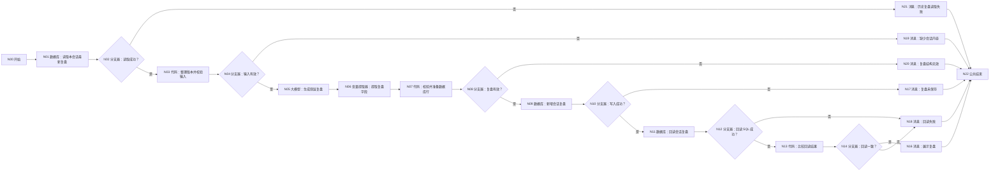
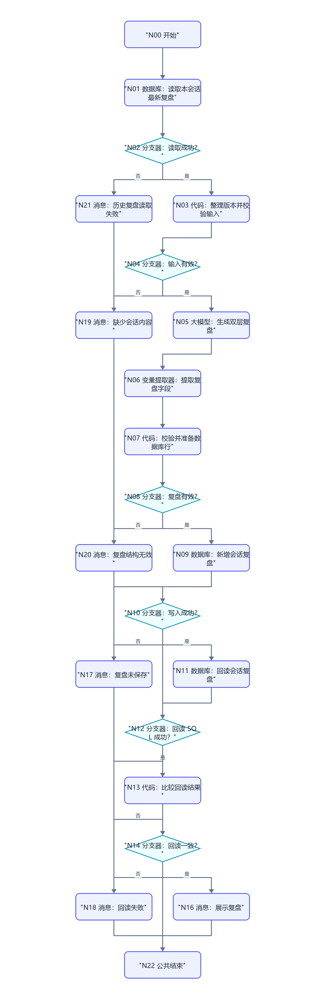

# WF-12 会话结束复盘：逐节点搭建指南

> WF-12 在一段会话结束时生成两份复盘：给用户看的 `user_recap_json`，以及供主 Agent 下次续接的 `agent_recap_json`。它只能记录用户明确事实和已经成功发生的写入，不能把草稿或失败操作写成状态变化。

## 1. 数据表和开始输入

在 `university` 上传 [DB-11 session_recaps](../database/import-templates/DB-11-session-recaps.xlsx)，保留 `id/uid/create_time`。

N00 开始：

| 变量 | 类型 | 必填 | 调试值 |
|---|---|---:|---|
| `AGENT_USER_INPUT` | String | 是 | `结束并复盘本次会话` |
| `uid` | String | 是 | `test_user_001` |
| `session_id` | String | 是 | `SESSION-TEST-001` |
| `conversation_text` | String | 是 | 本次会话完整文本或主 Agent 整理的逐轮记录 |
| `successful_writes_json` | String | 是 | 本次真正成功并回读确认的写入；没有则 `{}` |
| `request_time` | String | 是 | `2026-07-19 22:00:00` |

`conversation_text` 不是平台自动出现的变量，必须由调用 WF-12 的主 Agent 传入；手工调试时直接粘贴测试对话。

## 2. 完整连线图





所有消息连接 N22 结束。

## 3. N01/N02：读取本会话最新复盘

N01 自定义 SQL，输入 `uid=N00/uid`、`session_id=N00/session_id`：

```sql
SELECT session_id, user_recap_json, agent_recap_json, new_facts_json,
       state_changes_json, open_questions_json, next_entry,
       recap_version, updated_at
FROM session_recaps
WHERE uid='{{uid}}' AND session_id='{{session_id}}'
ORDER BY recap_version DESC, updated_at DESC
LIMIT 1;
```

N02：`N01/isSuccess == true`；是 → N03，否 → N21。空数组表示第一次生成该会话复盘，不是失败。

## 4. N03/N04：整理版本并校验输入

N03 输入 `outputList=N01/outputList`、`uid=N00/uid`、`session_id=N00/session_id`、`conversation_text=N00/conversation_text`、`successful_writes_json=N00/successful_writes_json`：

```python
def main(outputList, uid, session_id, conversation_text, successful_writes_json):
    rows = outputList if isinstance(outputList, list) else []
    row = rows[0] if len(rows) > 0 and isinstance(rows[0], dict) else {}
    try:
        old_version = int(row.get("recap_version", 0))
    except:
        old_version = 0
    text = str(conversation_text).strip()
    valid = len(str(uid).strip()) > 0 and len(str(session_id).strip()) > 0 and len(text) >= 20
    return {
        "input_valid": valid,
        "input_error": "" if valid else "缺少 uid、session_id，或 conversation_text 少于 20 个字符",
        "conversation_text": text,
        "successful_writes_json": str(successful_writes_json) if successful_writes_json else "{}",
        "previous_recap_json": str(row.get("agent_recap_json", "{}")),
        "next_recap_version": old_version + 1,
    }
```

输出 `input_valid:Boolean`、`input_error:String`、`conversation_text:String`、`successful_writes_json:String`、`previous_recap_json:String`、`next_recap_version:Integer`。N04：true → N05，false → N19。

## 5. N05 大模型：生成双层复盘

模型 `Spark4.0 Ultra`，关闭对话历史。这里不要勾选平台“对话历史”，因为完整会话已经通过 `conversation_text` 明确传入，避免混入别的会话。

输入：`conversation_text=N03/conversation_text`、`successful_writes_json=N03/successful_writes_json`、`previous_recap_json=N03/previous_recap_json`。

系统提示词：

```text
你是大学人生规划模拟器的会话复盘助手。
生成两层复盘：
1. user_recap：给用户看，包含本次目标、已完成、尚未完成、关键取舍、下一步，不暴露内部推断。
2. agent_recap：供下次续接，包含用户明确事实、已确认偏好、真正成功的状态变化、未决问题、下一入口和禁止误记事项。

硬规则：
- new_facts 只能来自用户明确陈述，不得把模型推断当事实。
- state_changes 只能来自 successful_writes_json；草稿、pending、失败写入和消息展示都不是已完成状态变化。
- open_questions 保留尚未解决的问题，不替用户作答。
- 不保存敏感原话全文，只保存完成续接所需摘要。
- 只输出 JSON：
{"user_recap":{},"agent_recap":{},"new_facts":[],"state_changes":[],"open_questions":[],"next_entry":"","reply":""}
```

用户提示词：

```text
本次会话：{{conversation_text}}
已确认成功写入：{{successful_writes_json}}
本会话已有复盘：{{previous_recap_json}}
请按规则生成新版本复盘。
```

输出 `output:String`。

## 6. N06 变量提取器：提取复盘字段

输入 `input=N05/output`。输出：

| 变量 | 类型 | 描述 |
|---|---|---|
| `user_recap_json` | String | 完整 user_recap JSON 字符串 |
| `agent_recap_json` | String | 完整 agent_recap JSON 字符串 |
| `new_facts` | Array | 用户明确新增事实数组 |
| `new_facts_json` | String | new_facts 序列化 JSON 字符串 |
| `state_changes` | Array | 仅成功写入状态变化数组 |
| `state_changes_json` | String | state_changes 序列化 JSON 字符串 |
| `open_questions` | Array | 未决问题数组 |
| `open_questions_json` | String | open_questions 序列化 JSON 字符串 |
| `next_entry` | String | 下次建议进入的工作流或问题 |
| `reply` | String | 给用户的复盘开场和下一步 |

## 7. N07/N08：校验并准备数据库行

N07 输入 uid/session_id/request_time=N00，对话和 successful_writes=N03，version=N03/next_recap_version，其他引用 N06：

```python
def main(uid, session_id, request_time, conversation_text, successful_writes_json, next_recap_version, user_recap_json, agent_recap_json, new_facts, new_facts_json, state_changes, state_changes_json, open_questions, open_questions_json, next_entry, reply):
    errors = []
    user_text = str(user_recap_json).strip()
    agent_text = str(agent_recap_json).strip()
    if not user_text.startswith("{") or not user_text.endswith("}"): errors.append("user_recap_json 无效")
    if not agent_text.startswith("{") or not agent_text.endswith("}"): errors.append("agent_recap_json 无效")
    if not isinstance(new_facts, list): errors.append("new_facts 不是数组")
    if not isinstance(state_changes, list): errors.append("state_changes 不是数组")
    if not isinstance(open_questions, list): errors.append("open_questions 不是数组")
    if not str(next_entry).strip(): errors.append("缺少 next_entry")
    writes_text = str(successful_writes_json).strip()
    if writes_text in ["", "{}", "[]"] and isinstance(state_changes, list) and len(state_changes) > 0:
        errors.append("没有成功写入却生成了 state_changes")
    try: version_value = int(next_recap_version)
    except: version_value = 1
    return {
        "recap_valid": len(errors) == 0,
        "recap_error": ";".join(errors),
        "session_id": str(session_id),
        "user_recap_json": user_text,
        "agent_recap_json": agent_text,
        "new_facts_json": str(new_facts_json),
        "state_changes_json": str(state_changes_json),
        "open_questions_json": str(open_questions_json),
        "next_entry": str(next_entry),
        "recap_version": version_value,
        "updated_at": str(request_time),
        "reply": str(reply),
    }
```

输出区声明 `recap_valid:Boolean`、`recap_version:Integer`，以及 `recap_error/session_id/user_recap_json/agent_recap_json/new_facts_json/state_changes_json/open_questions_json/next_entry/updated_at/reply:String`。N08：`recap_valid == true`；是 → N09，否 → N20。

## 8. N09/N10：新增复盘

N09 表单处理数据 → `university/session_recaps` → 新增数据。逐项映射 N07 的 `session_id/user_recap_json/agent_recap_json/new_facts_json/state_changes_json/open_questions_json/next_entry/recap_version/updated_at`；页面强制 uid 时引用 N00/uid。

N10：`N09/isSuccess == true`；是 → N11，否 → N17。

## 9. N11～N16：回读确认

N11 自定义 SQL，输入 uid、session_id、recap_version=N07/recap_version：

```sql
SELECT user_recap_json, agent_recap_json, new_facts_json,
       state_changes_json, open_questions_json, next_entry,
       recap_version, updated_at
FROM session_recaps
WHERE uid='{{uid}}' AND session_id='{{session_id}}'
  AND recap_version={{recap_version}}
ORDER BY updated_at DESC LIMIT 1;
```

Integer `recap_version` 在 SQL 中不要加单引号。N12：`N11/isSuccess == true`；是 → N13，否 → N18。

N13 输入 expected_user=N07/user_recap_json、expected_agent=N07/agent_recap_json、outputList=N11/outputList：

```python
def main(expected_user, expected_agent, outputList):
    rows = outputList if isinstance(outputList, list) else []
    row = rows[0] if len(rows) > 0 and isinstance(rows[0], dict) else {}
    stored_user = str(row.get("user_recap_json", ""))
    stored_agent = str(row.get("agent_recap_json", ""))
    same = len(stored_user.strip()) > 2 and stored_user.strip() == str(expected_user).strip() and stored_agent.strip() == str(expected_agent).strip()
    return {"readback_matches": same, "stored_user_recap_json": stored_user, "stored_agent_recap_json": stored_agent}
```

输出 `readback_matches:Boolean`、`stored_user_recap_json:String`、`stored_agent_recap_json:String`。N14：true → N16，false → N18。

N16 输入 `reply=N07/reply`、`recap=N13/stored_user_recap_json`、`next_entry=N07/next_entry`，回答：

```text
{{reply}}

本次会话复盘：
{{recap}}

下次建议入口：{{next_entry}}
```

## 10. 错误消息和 N22 结束

| 节点 | 回答内容 |
|---|---|
| N17 | 引用 N09/message：复盘已生成但没有保存，不声称已记录 |
| N18 | 引用 N11/message：写入后无法回读一致，不能确认保存 |
| N19 | 引用 N03/input_error：缺少必要会话内容 |
| N20 | 引用 N07/recap_error：模型复盘结构或事实边界无效，未保存 |
| N21 | 引用 N01/message：历史复盘读取失败，本轮停止 |

所有消息关闭流式输出并连接 N22。N22：回答模式“返回设定格式配置的回答”；输出 `output｜输入｜workflow_finished`；回答内容“本轮处理已结束，请以上方消息节点的提示为准。”。

## 11. 调试指南

1. 正常会话：DB-11 新增 version=1，回读后展示 user_recap。
2. 同 session 再生成：version 应递增，不覆盖旧记录。
3. 空 successful_writes：state_changes 必须为空；否则 N07 拦截。
4. 草稿未确认：只能出现在 open_questions/next_entry，不能进入 state_changes。
5. conversation_text 太短：到 N19，不调用模型。
6. 写入失败/回读不一致：到 N17/N18，不说已保存。

## 12. 验收清单

- [ ] 开始节点明确传入 conversation_text 和 successful_writes_json。
- [ ] 用户复盘与 Agent 续接复盘分开。
- [ ] new_facts 只来自明确陈述，state_changes 只来自成功写入。
- [ ] 版本递增、写入后回读一致才展示保存成功。
- [ ] 所有代码无 import，输出声明完整；所有分支连接 N22。
