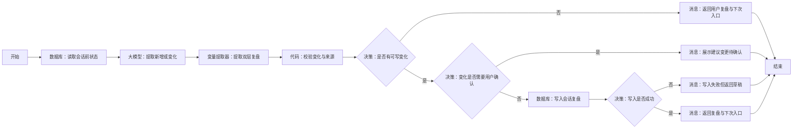

# WF-12 会话结束复盘搭建指南

## 1. 目标与调用时机

用户表达结束或当前任务完成时，生成用户复盘和 Agent 复盘，只保存新增或变化字段，产出 `session_recap_json` 和下次入口。普通闲聊不得直接当作事实，无限增长的画像长文不得写入。

## 2. 搭建前准备

- 输入：`AGENT_USER_INPUT`、`uid`、`session_id`、`context_json`；其中 `context_json` 应含本会话已确认结果、写入结果和会话前状态摘要，而非无限完整对话。
- 读取实体：必要的 `user_profile`、`main_plan`、`semester_tasks`；写入实体：`session_recaps`，必要时仅更新对应实体的变化字段。
- 所有数据库操作以当前编辑器显示为准；不支持局部更新时，复盘只写入 `session_recaps`，由后续工作流按建议变更再次确认。

## 3. 最小可运行版

```text
开始 → 大模型（生成会话复盘草稿）→ 结束
```

拖入“大模型”，放在开始与结束之间并连线，使用提示词 A。结束输出 `result_json`。此版 `status=draft`，只生成复盘，不声称状态已持久化。

## 4. 完整业务版画布与逐步连线




```text
开始 → 数据库（读取会话前状态）→ 大模型（提取新增或变化）
→ 变量提取器（提取双层复盘）→ 代码（校验变化与来源）
→ 决策（是否有可写变化）
├─ 否 → 消息（返回用户复盘与下次入口）→ 结束
└─ 是 → 决策（变化是否需要用户确认）
   ├─ 是 → 消息（展示建议变更待确认）→ 结束
   └─ 否 → 数据库（写入会话复盘）→ 决策（写入是否成功）
      ├─ 否 → 消息（写入失败但返回草稿）→ 结束
      └─ 是 → 消息（返回复盘与下次入口）→ 结束
```

拖入 1 个“大模型”、1 个“变量提取器”、1 个“代码”、3 个“决策”、2 个“数据库”、4 个“消息”和各 1 个“开始/结束”，按图命名连接。若无稳定写入标志，再拖入一个“数据库”重命名为“回读会话复盘”，按 `uid + session_id` 比较版本。

## 5. 实际节点配置与变量映射

| 节点 | 配置 | 输出 |
|---|---|---|
| 读取会话前状态 | 按 `uid` 读取必要摘要，禁止跨用户 | `before_state_json` |
| 提取新增或变化 | 提示词 A，对比 before 与已确认结果 | `recap_text` |
| 提取双层复盘 | 提取 `user_recap`,`agent_recap`,`state_changes`,`next_entry` | `session_recap_json` |
| 校验变化与来源 | 代码 B，过滤闲聊、推断和未成功写入事项 | `validated_recap_json`,`has_changes`,`needs_confirmation` |
| 是否有可写变化 | `has_changes=true` 走是 | 分支 |
| 变化是否需要用户确认 | 涉及画像、主规划、重要履历、覆盖/删除则为真 | 分支 |
| 写入会话复盘 | `record_key=session_recaps`，按会话保存压缩记录 | `write_result` |
| 写入是否成功 | 成功标志或回读一致 | `write_ok` |
| 结束 | 统一包装 | `result_json` |

结构：

```json
{"user_recap":{"topics":[],"decisions":[],"next_three_actions":[],"open_questions":[],"next_entry":""},"agent_recap":{"new_facts":[],"preference_changes":[],"route_changes":[],"task_status_changes":[],"inferences_to_verify":[],"recommended_opening":""},"state_changes":[]}
```

每个 `state_changes` 建议为：

```json
{"entity":"semester_tasks","field":"task_status","old_value":"todo","new_value":"done","source":"WF-07 write_succeeded","source_type":"confirmed_fact","confirmed":true,"requires_confirmation":false}
```

## 6. 可复制提示词与代码

### 提示词 A：生成双层复盘

```text
你是会话状态压缩器。对比“会话前状态”和“本会话已确认结果”，只提取新增或变化，不复写未变化画像，不把普通闲聊当事实，不把 Agent 推断当用户事实，不把 write_failed 的内容当成已保存。

输出单个合法 JSON：
1) user_recap：topics、decisions、next_three_actions（最多3项且可执行）、open_questions、next_entry；
2) agent_recap：new_facts、preference_changes、route_changes、task_status_changes、inferences_to_verify、recommended_opening；其中 new_facts 每项必须是含 value、source、source_type、confirmed 的对象，不能只给字符串；
3) state_changes：每项含 entity、field、old_value、new_value、source、source_type、confirmed、requires_confirmation。source_type 只能为 confirmed_fact、user_reported、agent_inference、casual_chat。

来源不足的内容放进 inferences_to_verify，不进 new_facts。画像、主规划、重要履历、覆盖或删除一律 requires_confirmation=true。若没有变化，state_changes=[]。不得承诺未成功的写入。
会话前状态：{{before_state_json}}
本会话上下文：{{context_json}}
用户结束语：{{AGENT_USER_INPUT}}
```

### 代码 B：变化校验（JavaScript）

```javascript
const r = typeof session_recap_json === 'string' ? JSON.parse(session_recap_json) : session_recap_json;
const allowed = (r.state_changes || []).filter(x =>
  x && x.entity && x.field && x.source &&
  x.old_value !== x.new_value &&
  !String(x.source).includes('write_failed') &&
  !String(x.source).includes('write failed') &&
  x.source_type !== 'casual_chat' &&
  x.source_type !== 'agent_inference' &&
  (x.source_type === 'confirmed_fact' || (x.source_type === 'user_reported' && x.confirmed === true))
);
const agent = r.agent_recap || {};
agent.new_facts = (agent.new_facts || []).filter(x =>
  x && typeof x === 'object' &&
  x.source_type !== 'casual_chat' && x.source_type !== 'agent_inference' &&
  !String(x.source || '').includes('write_failed') &&
  (x.source_type === 'confirmed_fact' || (x.source_type === 'user_reported' && x.confirmed === true))
);
const needs_confirmation = allowed.some(x => x.requires_confirmation === true && x.confirmed !== true);
return { validated_recap_json: {...r, agent_recap: agent, state_changes: allowed}, has_changes: allowed.length > 0, needs_confirmation };
```

若代码节点不支持 JavaScript，用“变量提取器”提取每项 `source/confirmed/requires_confirmation`，再用“决策”过滤；无法可靠过滤时只保存复盘草稿，不更新其他实体。

## 7. 确认、安全出口与写入失败

- 会话复盘本身可作为压缩日志保存；若其中建议修改画像、主规划、重要履历或执行覆盖/删除，必须先让用户确认，或路由回对应工作流完成确认，WF-12 不越权更新。
- 用户要求删除记录时返回 `next_action=confirm_delete`，不在复盘中暗中删除。
- 缺 `uid` 时仍可返回用户复盘，但不读取或写入长期状态。
- 写入失败返回 `status=write_failed`、`next_action=retry_session_recap_write`；可展示复盘草稿，但明确“本次续接状态未保存成功”。

## 8. 调试与验收清单

成功用例：上下文含“WF-07 将任务 A 成功写为 done，用户决定下周整理项目证据”。预期任务变化带成功来源，三件事不超过 3 项，下次入口明确。

失败用例：上下文含闲聊“我最近觉得自己可能更适合科研”和一次 `write_failed` 的主规划切换。预期前者进入 `inferences_to_verify`，后者不成为已保存事实。模拟数据库失败，回复不得说续接状态已保存。

- [ ] 同时生成用户复盘与 Agent 复盘，产出 `session_recap_json`。
- [ ] 只包含新增或变化字段，未变化画像不重复增长。
- [ ] 普通闲聊、未验证推断、写入失败不进入事实变化。
- [ ] 关键变化经过用户确认；写入失败不声称成功。
- [ ] `next_entry` 和 `recommended_opening` 足以支持下一次会话继续。
- [ ] 两个 `uid` 回读互不可见。

## 数据库与输入输出配置教程

本节的通用点击位置、建表入口、导入按钮和数据库节点输出解释见[数据库从零教程](../database/README.md)；请先完成该教程，再按本节配置当前 WF。

创建 `session_recaps`，上传 [DB-11-session-recaps.xlsx](../database/import-templates/DB-11-session-recaps.xlsx)。

| 输入 | 来源 | 示例 |
|---|---|---|
| `AGENT_USER_INPUT` | 开始节点 | `先到这里，总结一下` |
| `uid` | 主 Agent | `test_user_001` |
| `session_id` | 主 Agent/会话上下文 | `SESSION-TEST-001` |
| `workflow_result_json` | 刚完成的业务 WF | 统一结果包装 |

读取最近复盘：

```sql
SELECT * FROM session_recaps
WHERE uid='{{uid}}'
ORDER BY create_time DESC LIMIT 1;
```

`outputList=[]` 表示首次复盘，可使用空历史继续。过滤代码只保留成功写入的新事实和状态变化；普通闲聊、Agent 推断、`write_failed` 项不得写入。

保存节点选择 `session_recaps` 表单新增，字段为 `session_id,user_recap_json,agent_recap_json,new_facts_json,state_changes_json,open_questions_json,next_entry,recap_version,updated_at`。写入后按 `uid + session_id` 回读验证。

| 节点 | 输入 | 输出 |
|---|---|---|
| 读取最近复盘 | uid | `isSuccess,message,outputList` |
| 变化过滤 | 当前业务结果、最近复盘 | 允许保存的增量 |
| 复盘大模型 | 过滤结果、未决事项 | 用户/Agent recap JSON |
| 保存/回读 | uid、session_id、校验 JSON | `isSuccess,outputList` |
| 结束 | `result_json` | `output` |

调试正常结束、首次空历史、上游 `write_failed`、纯闲聊、数据库失败、下一次会话读取最近复盘。只有回读成功才能说“复盘已保存”。
