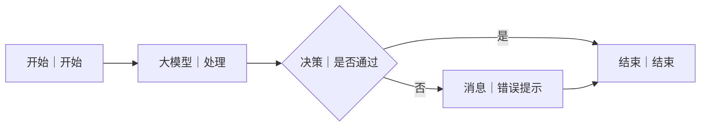

# WF-XX 工作流名称搭建指南（复制模板）

> UI 字段、按钮和数据库动作名称无法确认时写明“以当前编辑器显示为准”，紧接一个不依赖该能力的降级搭法。节点名称只能从：开始、结束、大模型、代码、问答节点、工作流、插件、MCP、RPA、知识库、知识库 Pro、长期记忆写入、长期记忆检索、数据库、决策、分支器、迭代、Agent 智能决策、变量存储器、变量提取器、文本处理节点、消息 中选择。

## 1. 目标与调用时机

说明本流程唯一职责、由主 Agent 在什么意图下调用，以及明确不负责什么。

## 2. 搭建前准备

- 输入：列出 `AGENT_USER_INPUT`、`user_id`、`session_id` 和上游 JSON。
- 数据：表/逻辑键、字段、用户隔离条件。
- 知识：知识库内容、来源与更新时间要求。
- 输出：核心产物变量及其 JSON 示例。

## 3. 最小可运行版

```text
开始 → 大模型（具体画布名）→ 结束
```

逐步写：从哪个分类拖入什么实际节点、放在哪里、怎样连线、怎样重命名、开始输入和结束输出选什么。说明最小版未包含的确认、持久化和校验能力。

## 4. 完整业务版画布

```text
开始 → … → 结束
```

分支必须逐条画出。画布括号内可写自定义节点名，但节点清单的“类型”必须是已确认节点名称。

### 分支图（用于统一渲染）

使用精确 Mermaid `flowchart LR`：节点标签写“实际节点类型｜画布名称”，每条分支边写正文中的条件；图下引用预留图片。




## 5. 节点清单与逐步搭建

| 序号 | 画布名称 | 类型 | 用途 |
|---:|---|---|---|

使用操作式语言逐节点描述拖拽、位置、重命名和连线。

## 6. 节点配置与变量映射

| 节点 | 输入来源 | 配置/条件 | 输出 |
|---|---|---|---|

完整列出每条边的数据来源，不能只说“映射相应变量”。

## 7. 可直接复制的完整提示词或代码

提示词必须包含角色、输入、任务、禁止项、JSON 模式、缺失信息和异常处理；代码必须给完整函数/脚本，并说明平台入口签名以当前编辑器为准时的降级方案。

## 8. 调试

至少提供一个成功输入和一个缺失/失败输入；逐节点列观察变量、预期分支、预期结束 JSON，并验证不同 `user_id` 数据隔离。

## 9. 常见错误与修复

列出 JSON 解析、变量未映射、走错分支、知识缺失、写入失败和平台能力差异的画布内修复。

## 10. 验收清单

- [ ] 节点名称合规，连线可复现。
- [ ] 输入、输出、提示词和变量映射完整。
- [ ] 关键写入先确认，失败不声称成功。
- [ ] 成功与失败用例通过。
- [ ] 输出符合 `SHARED-CONTRACTS.md`。

## 11. 上下游衔接

写清主 Agent 调用参数、上游消费变量、下游产物、共享存储键；嵌套能力未确认时默认由主 Agent 调用独立发布工作流，若编辑器支持再用“工作流”节点。
