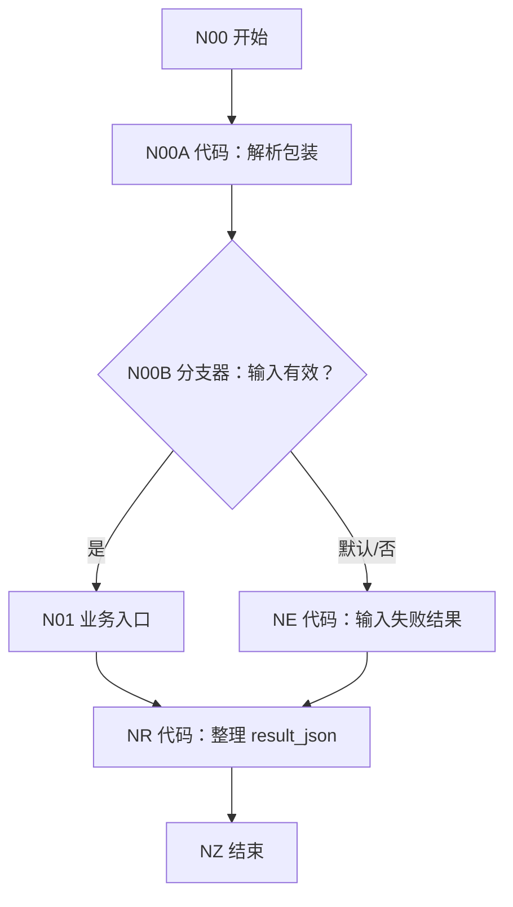

# WF-XX 业务工作流逐节点搭建模板

复制本模板时保留章节顺序，并把所有 `WF-XX/NXX` 改成实际编号。业务工作流最终发布为 MCP Server，只由 MAIN-00 调用。

<!-- AGENT-CONTRACT
start_inputs: AGENT_USER_INPUT:String
extractor_input_count: 1
result_output: result_json:String
-->

## 1. 目标、调用时机和边界

- 用户在什么自然语言目标下进入。
- 读取哪些已保存状态。
- 生成什么、写什么、不允许改什么。
- 哪些状态必须停止 MAIN 连续调用。

## 2. 搭建前准备

- 数据库 `university / 具体表名`。
- 必需字段和最新导入模板链接。
- 知识库或前置工作流状态。
- 当前画布从旧版迁移时要保留、删除和新增哪些节点。

## 3. 单参数和结果契约

开始节点只有：

```text
AGENT_USER_INPUT:String
```

MAIN 内部传值：

```json
{"user_key":"uk_32位小写十六进制","user_input":"用户本轮原话"}
```

结束节点只返回：

```text
result_json:String
```

## 4. 完整画布



Mermaid 后紧跟渲染 PNG：

```text

```

每个分支器至少两条路线；每个终态都到公共结果和结束。

## 5. 节点清单

| 编号 | 节点类型 | 名称 | 直接上游 | 直接下游 |
|---|---|---|---|---|
| N00 | 开始 | 单参数入口 | 无 | N00A |
| N00A | 代码 | 解析包装 | N00 | N00B |
| N00B | 分支器 | 输入有效 | N00A | N01/NE |
| N01 | 业务节点 | 实际业务 | N00B | NR |
| NE | 代码 | 失败字段 | N00B | NR |
| NR | 代码 | 结果 JSON | 所有终态 | NZ |
| NZ | 结束 | 返回 MCP 结果 | NR | 无 |

## 6. 每个节点逐项配置

每个节点单独一个三级标题，必须包含：

1. 页面模式或模型。
2. 每一项输入名、类型和引用路径。
3. 可直接复制的提示词、Python 或 SQL。
4. 每一项输出名、类型和描述。
5. 分支条件、常量和默认出口。
6. 异常开关、重试和失败去向。

代码节点格式：

```python
def main(input):
    value = str(input).strip() if input is not None else ""
    return {"output": value, "valid": len(value) > 0}
```

页面输出表：

| 参数名 | 类型 | 描述 |
|---|---|---|
| `output` | String | 规范化值 |
| `valid` | Boolean | 是否有效 |

变量提取器永远只写：

```text
input｜引用｜唯一上游/output
```

多来源先使用文本处理节点拼成一个 String。

数据库读取固定顺序：

```text
数据库自定义 SQL（WHERE user_key）
→ 分支器检查 isSuccess
→ 代码整理 outputList
→ 分支器检查 has_record
```

## 7. 大模型提示词要求

系统提示词必须写清：

- 角色和单轮目标；
- 可用事实来源；
- 不得伪造内容；
- 不生成 user_key、版本或数据库键；
- 明确输出字段、枚举和值域；
- 只输出规定结构。

用户提示词必须列出每个显式输入标签。关闭子工作流对话历史。

## 8. 结果整理

所有终态先提供：

```text
workflow_id
status
reply
next_action
error_code
```

公共代码节点安全转义并生成：

```json
{"workflow_id":"WF-XX","status":"completed","reply":"...","next_action":"none","error_code":"none"}
```

结束节点引用 `result_json:String`，不返回 `workflow_finished`。

## 9. 调试指南

### 9.1 前置准备

- 如何用 MAIN 或手工单参数包装调试。
- 前置表应有哪些记录。
- 如何清理/隔离测试用户。

### 9.2 正常多轮测试

每轮写出：

- 用户在 MAIN 中说什么。
- 手工调试时唯一参数的完整包装字符串。
- 预期节点路线。
- 关键中间输出。
- 数据库新增/更新/回读结果。
- 返回 status 和下一步。

### 9.3 另一条路和失败测试

至少覆盖：

- 首次无记录和已有记录。
- 每个分支器的命中和默认路线。
- SQL 执行失败与成功空数组。
- 模型漏字段/枚举错误。
- 模糊确认。
- 写入失败。
- 回读不一致。
- 安全出口。
- 临时改错后的恢复值。

## 10. MCP 发布和 MAIN 接入

- MCP 名称。
- 工具描述。
- 唯一参数检查。
- 发布步骤。
- MAIN 工具选择和端到端自然语言用例。

## 11. 故障定位表

| 症状 | 检查节点 | 正确状态 | 恢复动作 |
|---|---|---|---|
| 示例 | NXX | 明确值 | 精确恢复配置 |

## 12. 验收清单

- [ ] 开始只有 `AGENT_USER_INPUT:String`。
- [ ] 数据库前解析并验证 user_key。
- [ ] 所有 SQL 按 user_key。
- [ ] 每个变量提取器只有一个 input。
- [ ] 代码无 import，形参和输出声明一致。
- [ ] 每个分支器有默认出口并实测。
- [ ] 用户不复制 token、时间或业务 ID。
- [ ] 写入后检查 isSuccess 并回读。
- [ ] 失败回复不声称成功。
- [ ] 所有终态进入公共结果和结束。
- [ ] 结束返回紧凑 result_json。
- [ ] 子工作流无嵌套工具调用。
